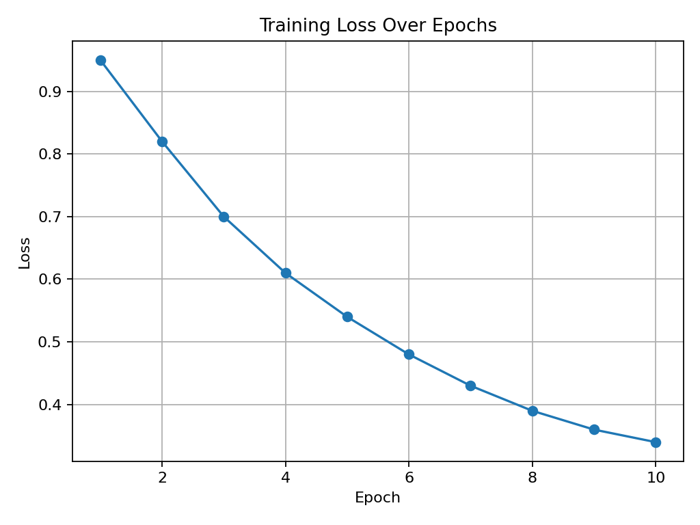
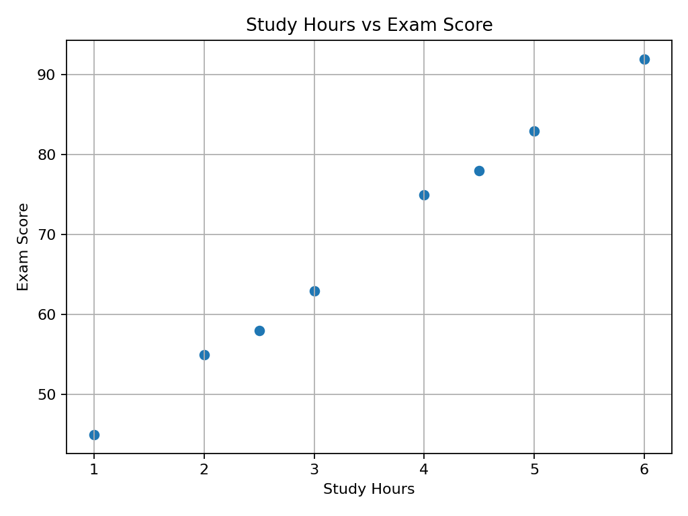
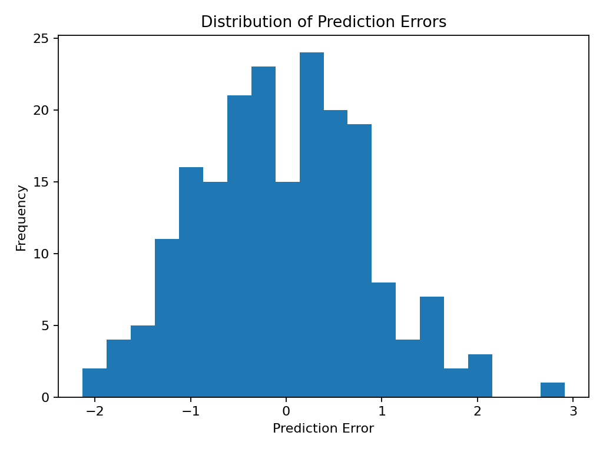
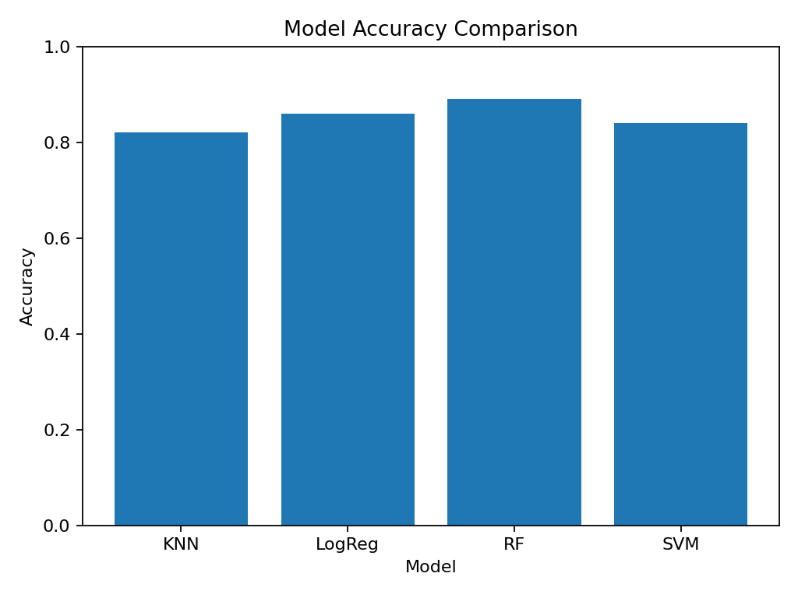

# 02 — Matplotlib and Basic Data Visualization for Machine Learning

## Why This Lesson Exists

After NumPy and Pandas, I can store numerical data and inspect tabular data. But numbers inside tables are not always enough. Sometimes a dataset has a pattern that is difficult to notice from raw rows and columns. A trend, an outlier, a class imbalance, a strange distribution, or a relationship between two variables can become much easier to understand when I visualize it.

This is where **Matplotlib** becomes important.

Matplotlib is one of the main Python libraries for creating visualizations. It is flexible, widely used, and many other visualization libraries are built on top of it. In Machine Learning, visualization is not decoration. It is part of understanding data, debugging models, explaining results, and communicating findings.

This lesson is about learning how to use basic plots with a Machine Learning mindset. I do not want to create charts just because they look nice. I want each chart to answer a question.

In simple words:

```text
Visualization helps me see what numbers alone may hide.
```

---

## 1. The Big Idea

A table gives me values. A plot gives me shape.

For example, a list of training losses may look like this:

```python
losses = [0.95, 0.82, 0.70, 0.61, 0.54, 0.48, 0.43, 0.39, 0.36, 0.34]
```

I can read these values one by one, but a line plot immediately shows whether the loss is going down.

```text
loss values -> line plot -> learning trend
```

This is important in Machine Learning because I often need to answer questions like:

```text
Is the model improving?
Are there outliers?
Are classes imbalanced?
Are two variables related?
Are prediction errors centered around zero?
Which model performs better?
```

Each question needs a different kind of plot.

---

## 2. Importing Matplotlib

The standard way to import Matplotlib's plotting interface is:

```python
import matplotlib.pyplot as plt
```

The alias `plt` is a convention. It is used almost everywhere, so I will use it too.

A very small plot looks like this:

```python
import matplotlib.pyplot as plt

x = [1, 2, 3, 4]
y = [2, 4, 6, 8]

plt.plot(x, y)
plt.show()
```

This creates a line plot.

At first, the code looks simple, but the idea is powerful. I give Matplotlib x-values and y-values, and it draws the relationship between them.

---

## 3. Figure, Axes, and Plot

Matplotlib has many concepts, but at the beginning I need three words:

```text
Figure -> the whole canvas
Axes   -> the actual plotting area
Plot   -> the visual marks drawn on the axes
```

A simple mental model:

```text
Figure is the paper.
Axes is the coordinate system on the paper.
Plot is the line, points, bars, or shapes drawn inside.
```

Many beginner examples use `plt.plot()` directly. That is okay at first. Later, for more control, Matplotlib also has an object-oriented style using `fig, ax`.

Beginner style:

```python
plt.plot(x, y)
plt.show()
```

Object-oriented style:

```python
fig, ax = plt.subplots()
ax.plot(x, y)
plt.show()
```

Both can work. For this repository, I will start simple and slowly move toward cleaner object-oriented plotting.

---

## 4. Line Plot: Seeing Change Over Time or Steps

A line plot is useful when the x-axis has an order. This could be time, epochs, iterations, dates, or sequence positions.

For example, in model training, loss often changes over epochs.

```python
import matplotlib.pyplot as plt

epochs = [1, 2, 3, 4, 5]
losses = [0.95, 0.80, 0.68, 0.59, 0.52]

plt.plot(epochs, losses, marker="o")
plt.title("Training Loss Over Epochs")
plt.xlabel("Epoch")
plt.ylabel("Loss")
plt.grid(True)
plt.show()
```

This plot answers the question:

```text
Is the loss decreasing as training continues?
```

If the loss decreases, the model may be learning. If the loss stays flat, the model may not be improving. If the loss increases, something may be wrong, such as a learning rate problem or a data issue.

Example image:



---

## 5. The Math Behind a Training Curve

A training curve usually shows a metric value at each training step.

If the loss at epoch $t$ is written as $L_t$, then a loss curve is a sequence:

$$
L_1, L_2, L_3, \dots, L_T
$$

When I plot this sequence, I am not changing the math. I am making the pattern visible.

For example:

```text
epoch 1 -> loss 0.95
epoch 2 -> loss 0.80
epoch 3 -> loss 0.68
```

A line plot helps me see the direction of learning.

This is one of the most important uses of visualization in Machine Learning: not just showing final results, but watching how the result changes.

---

## 6. Scatter Plot: Seeing Relationships

A scatter plot is useful when I want to see the relationship between two numerical variables.

Example:

```python
import matplotlib.pyplot as plt

study_hours = [1, 2, 2.5, 3, 4, 4.5, 5, 6]
exam_scores = [45, 55, 58, 63, 75, 78, 83, 92]

plt.scatter(study_hours, exam_scores)
plt.title("Study Hours vs Exam Score")
plt.xlabel("Study Hours")
plt.ylabel("Exam Score")
plt.grid(True)
plt.show()
```

This plot answers the question:

```text
Do higher study hours tend to be connected with higher exam scores?
```

If points generally move upward from left to right, there may be a positive relationship.

Example image:



---

## 7. Scatter Plots and Features

In Machine Learning, scatter plots help me inspect possible relationships between features and targets.

For example:

```text
house size vs house price
study hours vs exam score
temperature vs energy consumption
signal frequency vs signal energy
```

A scatter plot does not prove causation. It only helps me see patterns.

This distinction matters.

If I see that study hours and exam score are related, I cannot automatically claim that study hours are the only cause of exam performance. There may be other variables: sleep, prior knowledge, teaching quality, exam difficulty, or motivation.

Visualization helps me ask better questions. It does not replace careful reasoning.

---

## 8. Histogram: Seeing Distributions

A histogram shows the distribution of one numerical variable.

For example, suppose I have prediction errors:

```python
import numpy as np
import matplotlib.pyplot as plt

rng = np.random.default_rng(seed=42)
errors = rng.normal(loc=0, scale=1, size=200)

plt.hist(errors, bins=20)
plt.title("Distribution of Prediction Errors")
plt.xlabel("Prediction Error")
plt.ylabel("Frequency")
plt.show()
```

This plot answers the question:

```text
How are the errors distributed?
```

Example image:



A histogram can show whether values are centered, spread out, skewed, or affected by outliers.

---

## 9. Why Distribution Matters in ML

Many ML decisions depend on distributions.

Examples:

```text
feature distribution
target distribution
prediction error distribution
class distribution
residual distribution
```

If a feature has extreme outliers, some models may be affected. If errors are not centered around zero, the model may be biased. If a target is highly imbalanced, accuracy may become misleading.

A histogram helps me see the shape of values.

Mathematically, a dataset of errors can be written as:

$$
e_i = y_i - \hat{y}_i
$$

The histogram shows how the values of $e_i$ are distributed.

---

## 10. Bar Chart: Comparing Categories

A bar chart is useful when I want to compare categories.

For example, suppose I compare model accuracies:

```python
import matplotlib.pyplot as plt

models = ["KNN", "LogReg", "RF", "SVM"]
accuracies = [0.82, 0.86, 0.89, 0.84]

plt.bar(models, accuracies)
plt.title("Model Accuracy Comparison")
plt.xlabel("Model")
plt.ylabel("Accuracy")
plt.ylim(0, 1)
plt.show()
```

This plot answers the question:

```text
Which model performed better according to accuracy?
```

Example image:



Bar charts are useful for model comparison, class counts, category frequencies, and grouped summaries.

---

## 11. Choosing the Right Chart

A plot should match the question.

```text
Line plot    -> how something changes over order, time, epochs, or iterations
Scatter plot -> relationship between two numerical variables
Histogram    -> distribution of one numerical variable
Bar chart    -> comparison between categories
Box plot     -> spread, median, and outliers
Heatmap      -> matrix-like values, such as correlations
```

A bad chart can confuse the reader. A good chart makes the question easier to answer.

Before making a plot, I should ask:

```text
What question am I trying to answer?
What variables do I need?
What chart type fits this question?
What should the reader notice?
```

This habit is more important than memorizing plotting syntax.

---

## 12. Labels, Titles, and Readability

A plot without labels is hard to understand.

A good plot should usually include:

```text
title
x-axis label
y-axis label
clear scale
legend if needed
```

Bad plot:

```python
plt.plot(epochs, losses)
plt.show()
```

Better plot:

```python
plt.plot(epochs, losses)
plt.title("Training Loss Over Epochs")
plt.xlabel("Epoch")
plt.ylabel("Loss")
plt.grid(True)
plt.show()
```

The second plot explains itself better.

In data science and ML, communication matters. A plot is not only for me. It may also be read by a teammate, teacher, recruiter, or future version of myself.

---

## 13. Saving Figures

Sometimes I want to save a plot as an image.

```python
plt.plot(epochs, losses)
plt.title("Training Loss Over Epochs")
plt.xlabel("Epoch")
plt.ylabel("Loss")
plt.savefig("training_loss.png", dpi=150)
plt.show()
```

The function `savefig()` saves the plot to a file.

This is useful for GitHub repositories, reports, READMEs, presentations, and experiment documentation.

A good habit is to save figures into a folder such as:

```text
assets/images/
```

or:

```text
outputs/figures/
```

In this repository, lesson images can go into `assets/images`, and generated experiment outputs can go into `outputs/figures`.

---

## 14. Visualization and Exploratory Data Analysis

Exploratory Data Analysis, or EDA, is the process of understanding data before modeling.

Visualization is one part of EDA.

During EDA, I may ask:

```text
How many rows and columns are there?
Are there missing values?
What is the target distribution?
Are there outliers?
Which features look related to the target?
Are numerical features on very different scales?
Are categories balanced?
```

Pandas helps answer some of these with tables. Matplotlib helps answer them visually.

This is why Pandas and Matplotlib are often used together.

---

## 15. Pandas and Matplotlib Together

Pandas can create plots using Matplotlib behind the scenes.

Example:

```python
import pandas as pd
import matplotlib.pyplot as plt

df = pd.DataFrame({
    "model": ["KNN", "LogReg", "RF"],
    "accuracy": [0.82, 0.86, 0.89]
})

df.plot(x="model", y="accuracy", kind="bar")
plt.title("Model Accuracy")
plt.ylabel("Accuracy")
plt.ylim(0, 1)
plt.show()
```

This can be convenient for quick exploration.

However, I still want to understand Matplotlib itself because it gives more control over the final plot.

---

## 16. A Small ML-Style Visualization Workflow

Imagine I have a small experiment table:

```python
import pandas as pd

results = pd.DataFrame({
    "model": ["KNN", "LogReg", "RF", "SVM"],
    "accuracy": [0.82, 0.86, 0.89, 0.84],
    "training_time": [0.2, 0.5, 1.4, 0.8]
})
```

I can ask:

```text
Which model has the highest accuracy?
Which model is fastest?
Is there a tradeoff between accuracy and training time?
```

Bar chart for accuracy:

```python
plt.bar(results["model"], results["accuracy"])
plt.ylim(0, 1)
plt.title("Model Accuracy Comparison")
plt.xlabel("Model")
plt.ylabel("Accuracy")
plt.show()
```

Scatter plot for accuracy vs training time:

```python
plt.scatter(results["training_time"], results["accuracy"])
plt.title("Accuracy vs Training Time")
plt.xlabel("Training Time")
plt.ylabel("Accuracy")
plt.grid(True)
plt.show()
```

Now I am not only looking at numbers. I am asking questions about model behavior.

---

## 17. Common Mistakes

One common mistake is making charts without a question. A plot should not exist only because I can create it. It should answer something.

Another mistake is forgetting labels. If the x-axis and y-axis are not labeled, the reader may not understand the plot.

A third mistake is using the wrong chart type. For example, using a line plot for unordered categories can be misleading because a line suggests continuity or order.

A fourth mistake is trusting plots without checking data quality. A beautiful plot can still be based on wrong, missing, or biased data.

A fifth mistake is overloading one chart with too much information. If a plot is too crowded, it may be better to make a simpler chart.

---

## 18. What I Learned From This Lesson

Matplotlib helps me turn data into visual understanding. It is useful for trends, relationships, distributions, category comparisons, model results, and error analysis.

The most important ideas from this lesson are:

```text
line plot
scatter plot
histogram
bar chart
figure
axes
labels
titles
saving figures
EDA
choosing the right chart
```

A good visualization is not just an image. It is an answer to a question.

---

## Mini Exercise

Create a file called `08-matplotlib-visualization-example.py` inside the `code` folder.

The script should:

```text
1. Create a small model results DataFrame.
2. Plot model accuracy as a bar chart.
3. Plot training loss over epochs as a line plot.
4. Plot prediction errors as a histogram.
5. Save all figures into outputs/figures.
```

Run it:

```powershell
python code\08-matplotlib-visualization-example.py
```

Then check whether the images were created.

---

## Further Reading and Resources

### Official Documentation

- [Matplotlib Official Website](https://matplotlib.org/)
- [Matplotlib Quick Start Guide](https://matplotlib.org/stable/users/explain/quick_start.html)
- [Matplotlib Tutorials](https://matplotlib.org/stable/tutorials/index.html)
- [Pyplot Tutorial](https://matplotlib.org/stable/tutorials/pyplot.html)

### Books and Longer Reading

- [Python Data Science Handbook: Visualization with Matplotlib](https://jakevdp.github.io/PythonDataScienceHandbook/04.00-introduction-to-matplotlib.html)
- [Python for Data Analysis, 3rd Edition by Wes McKinney](https://wesmckinney.com/book/)
- [Fundamentals of Data Visualization by Claus O. Wilke](https://clauswilke.com/dataviz/)

### Practice

- [Kaggle Learn: Data Visualization](https://www.kaggle.com/learn/data-visualization)
- [Matplotlib Examples Gallery](https://matplotlib.org/stable/gallery/index.html)
- [W3Schools Matplotlib Tutorial](https://www.w3schools.com/python/matplotlib_intro.asp)

### What to Study Next

The next step is **the Machine Learning mental map**. After Python, NumPy, Pandas, and basic visualization, I am ready to ask the first true ML question: what does it mean for a machine to learn from data?
