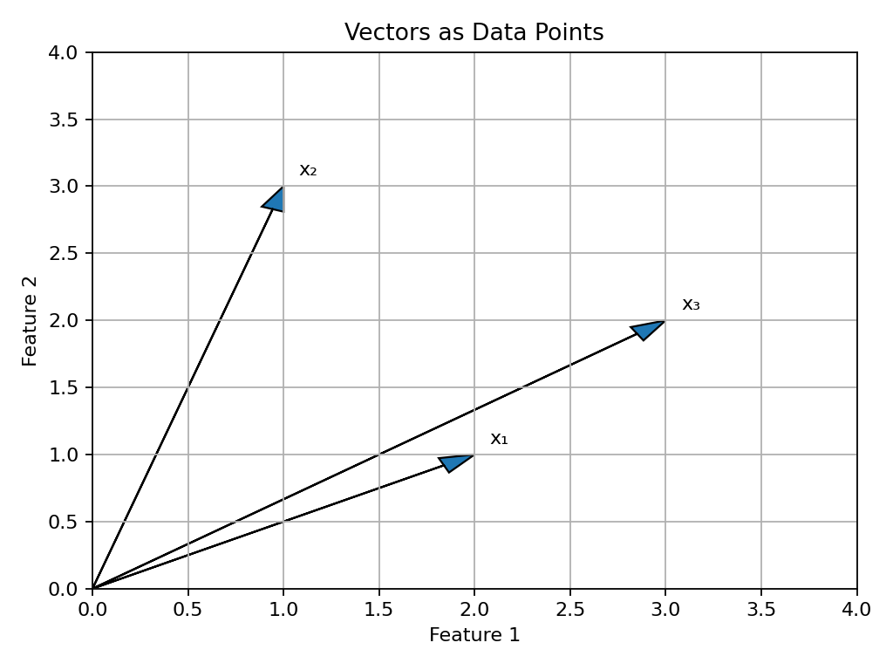
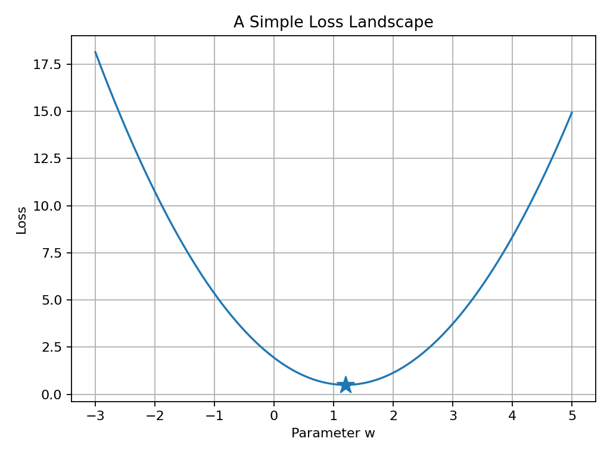
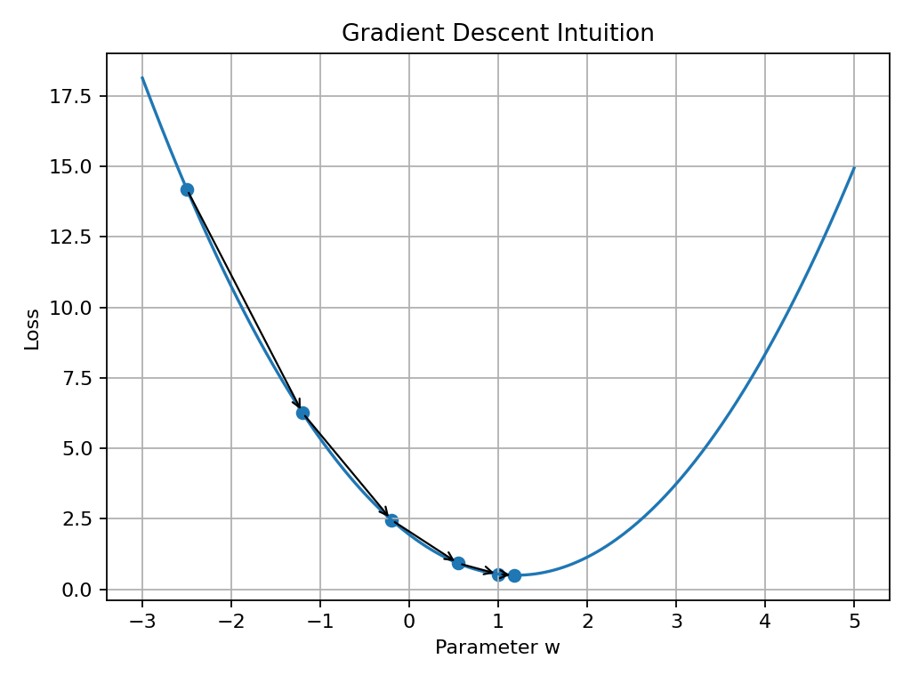

# 00 — Why Math for Machine Learning?

## Why This Lesson Exists

Before going deeper into Machine Learning algorithms, I need to create a separate math section. We already started Python, NumPy, Pandas, visualization, and the first ML culture lessons. But Machine Learning is not only code. Under the code, there is always mathematical structure.

This does not mean I need to become a pure mathematician before learning ML. It means I need to understand the math that appears again and again inside models, losses, metrics, optimization, probability, and evaluation.

Math for Machine Learning is not a wall. It is a language. When I see a formula, I do not want to panic. I want to ask what the formula is trying to say, which part is data, which part is the model, which part is the error, and how I can write it in Python.

---

## 1. The Role of Math in Machine Learning

Machine Learning is about learning patterns from data. But to describe this clearly, we need mathematical objects.

A dataset can be written as:

$$
\mathcal{D} = \{(x_i, y_i)\}_{i=1}^{n}
$$

This means I have $n$ examples. Each example has an input $x_i$ and a target $y_i$.

A model can be written as:

$$
\hat{y} = f_\theta(x)
$$

This means the model takes input $x$ and produces a prediction $\hat{y}$. The symbol $\theta$ represents the model parameters.

A loss function can be written as:

$$
\mathcal{L}(y, \hat{y})
$$

This measures how wrong the prediction is.

Training can be written as:

$$
\theta^* = \arg\min_{\theta} \mathcal{L}(\theta)
$$

This means: find the parameters that make the loss as small as possible.

```text
data -> model -> prediction -> loss -> optimization
```

---

## 2. The Math Areas I Need Most

For Machine Learning, the most important mathematical areas are:

```text
linear algebra
calculus
probability
statistics
optimization
```

Linear algebra helps me understand vectors, matrices, dot products, transformations, PCA, embeddings, and neural network layers. Calculus helps me understand derivatives, gradients, gradient descent, backpropagation, and how models improve. Probability helps me understand uncertainty, classification probabilities, Naive Bayes, generative models, and likelihood. Statistics helps me understand data summaries, distributions, sampling, evaluation, confidence, bias, variance, and generalization. Optimization helps me understand how models search for better parameters.

I do not need to learn all of these at once. But I need to build them gradually and connect every idea to ML.

---

## 3. Linear Algebra: Data as Vectors and Matrices

In Machine Learning, a single data point is often represented as a vector.

For example, a house can be represented by features:

```text
size
number of rooms
distance to center
```

As a vector:

$$
x = [x_1, x_2, x_3]
$$

A dataset with many examples becomes a matrix:

$$
X \in \mathbb{R}^{n \times d}
$$

where:

```text
n -> number of samples
d -> number of features
```

This is the same mental model we used in NumPy and Pandas:

```text
rows    -> samples
columns -> features
```

Visual intuition:



A vector is not just a list of numbers. In ML, it is a representation of an object.

---

## 4. Dot Product: The First Important Operation

The dot product combines two vectors into one number.

If:

$$
x = [x_1, x_2, \dots, x_d]
$$

and

$$
w = [w_1, w_2, \dots, w_d]
$$

then:

$$
w^T x = w_1x_1 + w_2x_2 + \dots + w_dx_d
$$

In Python:

```python
import numpy as np

x = np.array([2, 3, 4])
w = np.array([0.5, 1.0, -0.2])

result = np.dot(w, x)

print(result)
```

The dot product appears in linear regression, logistic regression, neural networks, attention mechanisms, and embeddings.

A simple linear model is:

$$
\hat{y} = w^T x + b
$$

This is one of the most important formulas in supervised learning.

---

## 5. Calculus: Understanding Change

Calculus helps me understand how one quantity changes when another quantity changes.

In Machine Learning, I often care about how the loss changes when a parameter changes.

Suppose the loss depends on one parameter $w$:

$$
\mathcal{L}(w)
$$

The derivative tells me the slope:

$$
\frac{d\mathcal{L}}{dw}
$$

If the slope is positive, increasing $w$ increases the loss. If the slope is negative, increasing $w$ decreases the loss. If the slope is zero, I may be near a minimum or maximum.

This matters because training is often about moving parameters in a direction that reduces loss.

---

## 6. Loss as a Landscape

A loss function can be imagined as a landscape. The model parameters are positions on the landscape. The loss is the height.



This image is very simplified because real models can have thousands, millions, or billions of parameters. But the intuition is useful.

```text
high loss -> bad parameters
low loss  -> better parameters
```

Training is the process of searching for lower loss.

---

## 7. Gradient Descent Intuition

Gradient descent is an optimization method.

The update rule is:

$$
w_{new} = w_{old} - \alpha \frac{d\mathcal{L}}{dw}
$$

where:

```text
w_old -> current parameter
w_new -> updated parameter
alpha -> learning rate
dL/dw -> derivative of loss with respect to w
```

Visual intuition:



In simple words:

```text
look at the slope
move in the opposite direction
repeat
```

This idea becomes extremely important in neural networks and backpropagation.

---

## 8. Probability: Thinking Under Uncertainty

Machine Learning often deals with uncertainty. A classifier may not only predict a class. It may predict probabilities.

The notation:

$$
P(y \mid x)
$$

means:

```text
probability of y given x
```

In classification, a model may estimate:

$$
P(y = c \mid x)
$$

for each class $c$.

Then the predicted class is:

$$
\hat{y} = \arg\max_c P(y=c \mid x)
$$

In simple words:

```text
choose the class with the highest predicted probability
```

Probability helps me understand logistic regression, Naive Bayes, cross-entropy, uncertainty, and generative models.

---

## 9. Statistics: Understanding Data

Statistics helps me summarize and reason about data.

Mean:

$$
\bar{x} = \frac{1}{n}\sum_{i=1}^{n}x_i
$$

Variance:

$$
\mathrm{Var}(x) = \frac{1}{n}\sum_{i=1}^{n}(x_i - \bar{x})^2
$$

Standard deviation:

$$
\sigma = \sqrt{\mathrm{Var}(x)}
$$

In Python:

```python
import numpy as np

values = np.array([10, 20, 30, 40, 50])

print(np.mean(values))
print(np.var(values))
print(np.std(values))
```

These are used in real preprocessing, especially feature scaling.

Standardization is:

$$
z = \frac{x - \mu}{\sigma}
$$

This formula appeared in the NumPy and KNN lessons.

---

## 10. Optimization: The Search for Better Parameters

Optimization is the process of finding values that minimize or maximize something.

In Machine Learning, I usually minimize loss:

$$
\theta^* = \arg\min_{\theta} \mathcal{L}(\theta)
$$

This notation means:

```text
find the parameter values that make the model least wrong
```

Different algorithms optimize in different ways. Linear regression can sometimes be solved with a closed-form solution. Neural networks usually use gradient-based optimization. Some models, like KNN, do not optimize parameters in the same way at all.

This is why math helps: it lets me understand the difference between algorithms.

---

## 11. Connecting Math to Code

The most important skill is not only reading formulas. It is translating formulas into code.

Example: Mean Squared Error.

Formula:

$$
\mathrm{MSE} = \frac{1}{n}\sum_{i=1}^{n}(y_i - \hat{y}_i)^2
$$

Code:

```python
import numpy as np

y_true = np.array([3, 5, 2, 7])
y_pred = np.array([2.5, 5.5, 2, 8])

errors = y_true - y_pred
mse = np.mean(errors ** 2)

print(mse)
```

Translation:

```text
y_i - y_hat_i       -> errors
square the errors   -> errors ** 2
average them        -> np.mean(...)
```

This is the style I want for this math section:

```text
intuition -> formula -> code
```

---

## 12. What Math Should Feel Like in This Repository

Math should not feel like decoration. If I include a formula, it must explain something. If I include code, it must connect to the formula. If I include a diagram, it must make the idea easier to see.

The goal is not to make the repository look advanced. The goal is to make difficult ideas understandable.

Good math learning means I can answer:

```text
What does this symbol mean?
Why does this formula exist?
What problem does it solve?
How can I test it with numbers?
How does it appear in ML code?
```

---

## 13. Common Mistakes

One common mistake is trying to memorize formulas without understanding the idea.

Another mistake is avoiding formulas completely. This may feel comfortable at first, but later topics become confusing without mathematical language.

A third mistake is studying math separately from Machine Learning. I do not want to learn linear algebra as random theory. I want to connect vectors and matrices to datasets, models, and transformations.

A fourth mistake is thinking that math understanding must be perfect before coding. It does not. I can learn math and code together.

---

## 14. What I Learned From This Lesson

Math for Machine Learning is a toolkit.

Linear algebra helps me represent data and models. Calculus helps me understand change and learning. Probability helps me reason under uncertainty. Statistics helps me understand data and evaluation. Optimization helps me understand training.

The key is connection:

```text
math idea -> ML meaning -> Python implementation
```

This is how I want to study math in this repository.

---

## Mini Exercise

Create a file called `00-math-translation-practice.py` inside the `code` folder.

Write code for:

```text
1. dot product
2. mean
3. variance
4. standardization
5. mean squared error
```

Then write one sentence for each formula explaining what it means in Machine Learning.

---

## Further Reading and Resources

### Books

- [Mathematics for Machine Learning by Deisenroth, Faisal, and Ong](https://mml-book.github.io/)
- [The Matrix Calculus You Need For Deep Learning](https://explained.ai/matrix-calculus/)
- [An Introduction to Statistical Learning](https://www.statlearning.com/)
- [The Elements of Statistical Learning](https://hastie.su.domains/ElemStatLearn/)

### Linear Algebra

- [3Blue1Brown: Essence of Linear Algebra](https://www.3blue1brown.com/topics/linear-algebra)
- [Khan Academy: Linear Algebra](https://www.khanacademy.org/math/linear-algebra)
- [MIT OpenCourseWare: Linear Algebra](https://ocw.mit.edu/courses/18-06-linear-algebra-spring-2010/)

### Calculus and Optimization

- [3Blue1Brown: Essence of Calculus](https://www.3blue1brown.com/topics/calculus)
- [Khan Academy: Differential Calculus](https://www.khanacademy.org/math/differential-calculus)
- [Google Machine Learning Crash Course: Gradient Descent](https://developers.google.com/machine-learning/crash-course/linear-regression/gradient-descent)

### Probability and Statistics

- [Khan Academy: Probability and Statistics](https://www.khanacademy.org/math/statistics-probability)
- [Seeing Theory: Visual Introduction to Probability and Statistics](https://seeing-theory.brown.edu/)
- [StatQuest with Josh Starmer](https://www.youtube.com/@statquest)

### What to Study Next

The next math lesson should be:

```text
01 — Vectors, Matrices, and Dot Products for Machine Learning
```

That lesson will go deeper into linear algebra because vectors and matrices are the basic language of datasets, models, embeddings, and neural networks.

---

## Final Reflection

I created this math section because Machine Learning without math can become button-clicking.

I do not want that.

I want to understand what the model is doing, why the formula exists, how the code implements it, and how the idea connects to real data.

Math is not separate from ML. Math is the grammar of ML.
