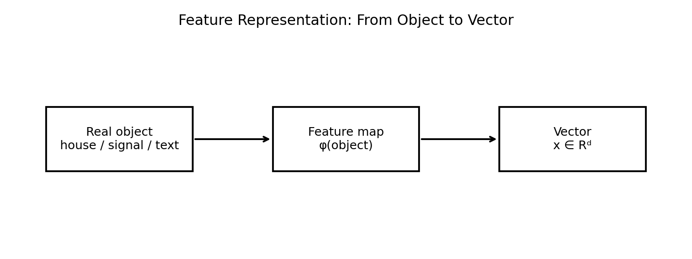
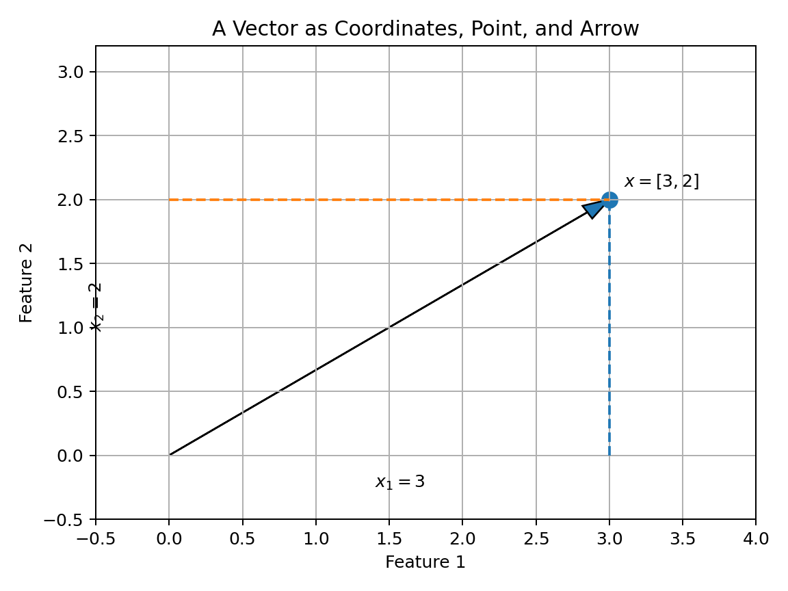
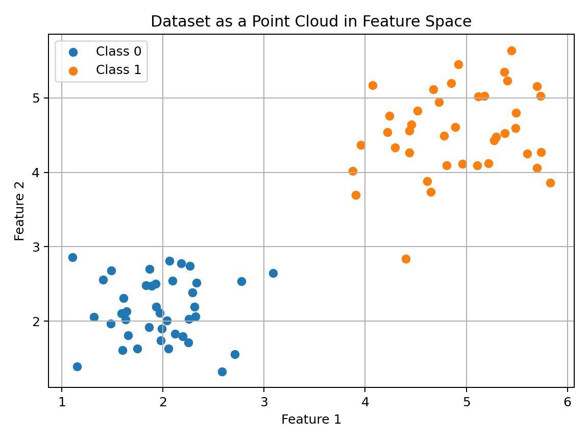
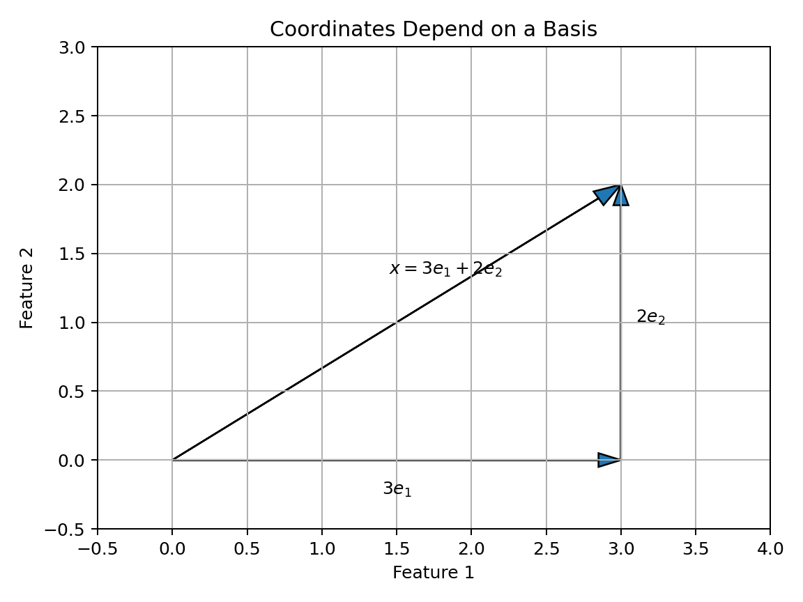
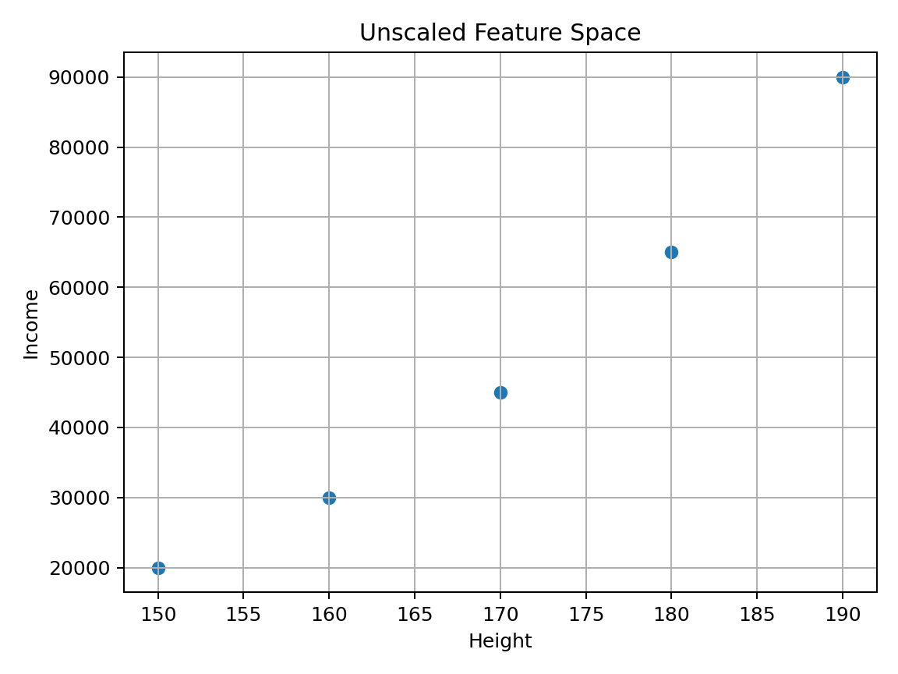
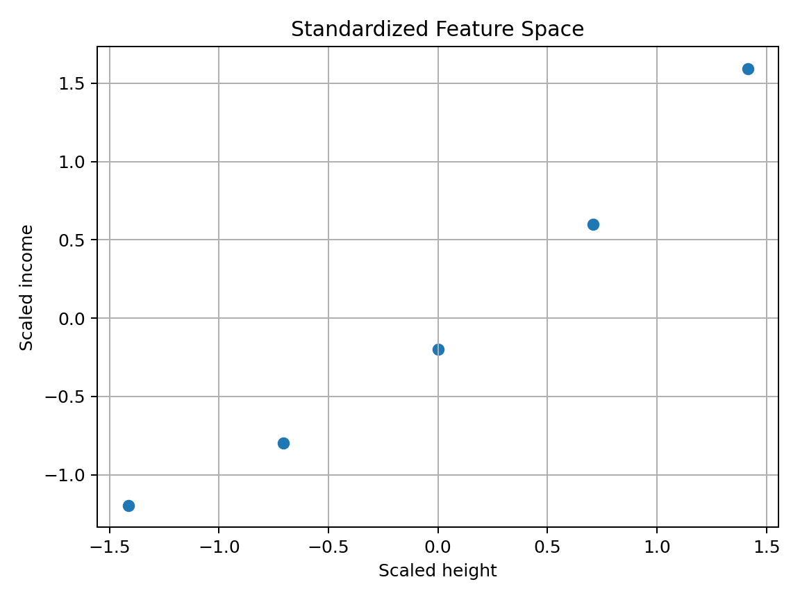
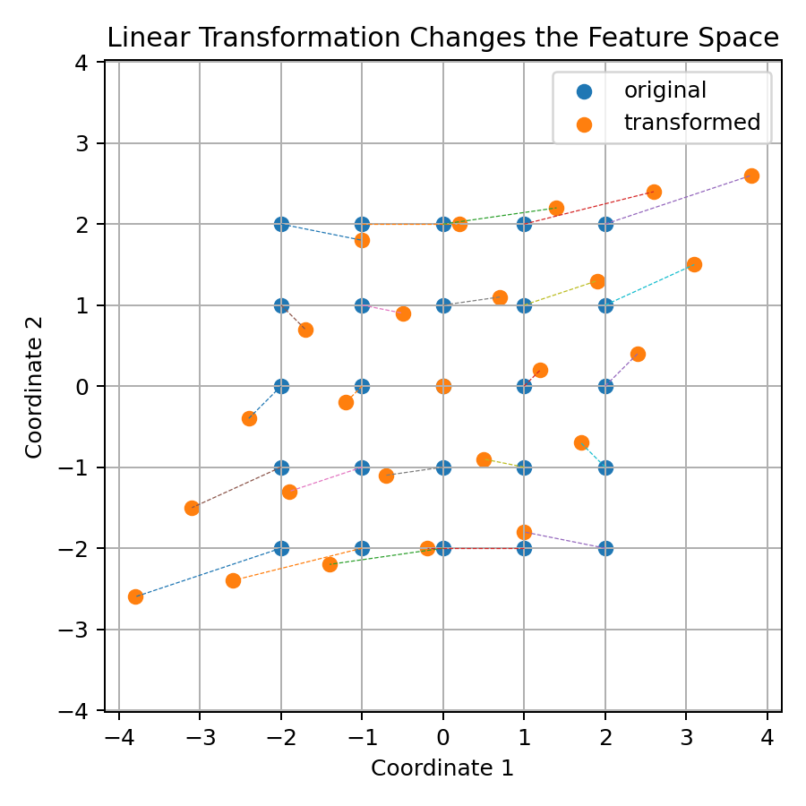
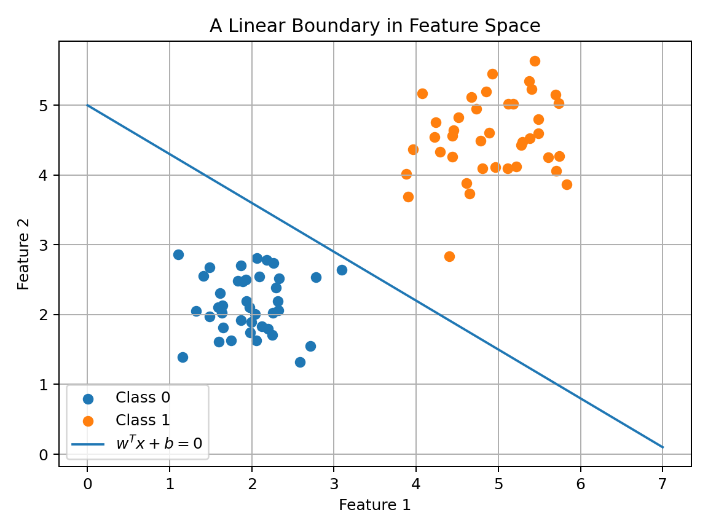

# 01 — Vectors and Feature Spaces for Machine Learning

## Why This Lesson Exists

This is the first serious mathematical lesson in the **Math for Machine Learning** section.

In Machine Learning, a vector can represent a real-world object.

A vector can represent:

```text
a house
a student
a seismic signal
a sentence
an image
a user
a product
a document
a hidden state inside a neural network
```

So a vector is not only an arrow in the plane. It is a **representation**.

That is the central idea of this lesson.

I want to understand vectors deeply enough that later topics feel natural:

```text
KNN               -> distance between vectors
Linear Regression -> dot products with vectors
Logistic Regression -> linear scores from vectors
SVM               -> separating vectors with hyperplanes
PCA               -> directions of maximum variance
Neural networks   -> learned transformations of vectors
Embeddings        -> objects represented as dense vectors
RAG               -> retrieval by vector similarity
```

So this lesson is not a review of basic linear algebra. It is the beginning of the geometry of Machine Learning.

---

## 1. The First ML Transformation: Object to Vector

A real-world object is not automatically usable by a model. A model does not directly see a house, a sentence, or a seismic waveform. It sees numbers.

So the first conceptual step is representation.

We can describe this with a feature map:

$$
\phi : \mathcal{O} \to \mathbb{R}^d
$$

where:

```text
O       -> space of real-world objects
R^d     -> d-dimensional vector space
phi     -> feature map / representation function
```

If the object is a house, then:

$$
\phi(\text{house}) = [120, 3, 5]
$$

could mean:

```text
120 -> size in square meters
3   -> number of rooms
5   -> distance to city center
```

Visual idea:



This is one of the deepest ideas in ML:

> The model learns from the representation, not from the raw reality itself.

So if the representation is poor, the model may fail even if the algorithm is good.

---

## 2. Formal Definition of a Vector

A vector in $d$-dimensional real space is an ordered tuple of real numbers:

$$
x = (x_1, x_2, \dots, x_d)
$$

and we write:

$$
x \in \mathbb{R}^d
$$

The number $d$ is the dimension of the vector.

In ML language:

```text
x      -> one data point / one sample / one input
x_j    -> j-th coordinate / j-th feature of x
d      -> number of features
```

For example:

$$
x = [170, 65, 21]
$$

may represent:

```text
height = 170
weight = 65
age = 21
```

Then:

$$
x \in \mathbb{R}^3
$$

because the vector has three coordinates.

---

## 3. Vector Space Structure

A vector space is not just a set of vectors. It is a set where two operations make sense:

```text
vector addition
scalar multiplication
```

For vectors $u, v \in \mathbb{R}^d$ and scalar $\alpha \in \mathbb{R}$:

$$
u + v \in \mathbb{R}^d
$$

and

$$
\alpha u \in \mathbb{R}^d
$$

This closure is essential. It means I can combine data representations and still remain inside the same space.

For example:

$$
u = [1,2,3]
$$

$$
v = [4,5,6]
$$

Then:

$$
u+v = [5,7,9]
$$

and:

$$
2u = [2,4,6]
$$

In Python:

```python
import numpy as np

u = np.array([1, 2, 3])
v = np.array([4, 5, 6])

print(u + v)
print(2 * u)
```

This looks basic, but it is the algebraic foundation behind linear models, PCA, embeddings, neural layers, and optimization.

---

## 4. Vector as Point, Arrow, and Representation

A vector has several interpretations.

### 4.1 Vector as coordinates

The vector:

$$
x = [3,2]
$$

means the first coordinate is 3 and the second coordinate is 2.

### 4.2 Vector as a point

It can be seen as a point in the plane.

### 4.3 Vector as an arrow

It can also be seen as an arrow from the origin to that point.



### 4.4 Vector as representation

In ML, the most important interpretation is:

```text
x represents an object using numerical features
```

The same mathematical vector can be interpreted differently depending on the feature meaning.

For example:

$$
x = [3,2]
$$

could mean:

```text
3 rooms, 2 bathrooms
```

or:

```text
3 hours studied, 2 missed classes
```

or:

```text
frequency feature = 3, amplitude feature = 2
```

The vector has no ML meaning unless the coordinates have meaning.

---

## 5. Feature Space

A feature space is the space where feature vectors live.

If each sample has $d$ features, the feature space is:

$$
\mathbb{R}^d
$$

A dataset becomes a set of points inside this space.



This is why geometry matters.

If points from the same class cluster together, then distance-based methods like KNN may work well. If a linear boundary separates classes, then linear classifiers may work well. If data lies near a lower-dimensional structure, then dimensionality reduction may help.

The shape of data in feature space influences which algorithms work.

---

## 6. Sample Index and Feature Index

In ML notation, we often write:

$$
x_i = [x_{i1}, x_{i2}, \dots, x_{id}]
$$

Here:

```text
i -> sample index
j -> feature index
x_i -> the i-th sample
x_ij -> the j-th feature of the i-th sample
```

For example, suppose:

$$
x_4 = [170, 65, 21]
$$

Then:

```text
x_41 = 170
x_42 = 65
x_43 = 21
```

This notation becomes important when writing loss functions.

For example, the prediction for sample $i$ may be:

$$
\hat{y}_i = f_\theta(x_i)
$$

and the total loss may be:

$$
\mathcal{L}(\theta) = \frac{1}{n}\sum_{i=1}^{n}\ell(y_i, \hat{y}_i)
$$

This says: compute the loss for every sample, then average.

---

## 7. Dataset Matrix

If there are $n$ samples and each sample has $d$ features, the dataset is represented as a matrix:

$$
X =
\begin{bmatrix}
x_{11} & x_{12} & \dots & x_{1d} \\
x_{21} & x_{22} & \dots & x_{2d} \\
\vdots & \vdots & \ddots & \vdots \\
x_{n1} & x_{n2} & \dots & x_{nd}
\end{bmatrix}
$$

So:

$$
X \in \mathbb{R}^{n \times d}
$$

The standard ML convention is:

```text
rows    -> samples
columns -> features
```

In NumPy:

```python
import numpy as np

X = np.array([
    [120, 3, 5],
    [80, 2, 10],
    [200, 5, 2],
    [150, 4, 7]
])

print(X.shape)
```

Output:

```text
(4, 3)
```

This means:

```text
4 samples
3 features
```

---

## 8. Target Vector and Supervised Dataset

In supervised learning, each sample has a target.

The target vector is:

$$
y =
\begin{bmatrix}
y_1 \\
y_2 \\
\vdots \\
y_n
\end{bmatrix}
$$

A supervised dataset is:

$$
\mathcal{D} = \{(x_i, y_i)\}_{i=1}^{n}
$$

This means:

```text
sample x_i has target y_i
```

A model tries to learn:

$$
f_\theta(x_i) \approx y_i
$$

or:

$$
\hat{y}_i = f_\theta(x_i)
$$

This notation is the core of supervised learning.

---

## 9. Basis and Coordinates

Coordinates depend on a basis.

In $\mathbb{R}^2$, the standard basis is:

$$
e_1 = [1,0]
$$

$$
e_2 = [0,1]
$$

A vector:

$$
x = [3,2]
$$

can be written as:

$$
x = 3e_1 + 2e_2
$$



This matters in ML because feature engineering is like choosing a coordinate system.

For example, I can represent a house using:

```text
size, rooms, distance
```

or using transformed features:

```text
log(size), rooms / size, distance category
```

Both are coordinate systems for representing the same object.

A better coordinate system can make the ML problem easier.

---

## 10. Linear Combination

A linear combination is a weighted sum of vectors.

If $v_1, v_2, \dots, v_k$ are vectors, then:

$$
z = \alpha_1v_1 + \alpha_2v_2 + \dots + \alpha_kv_k
$$

where $\alpha_1, \alpha_2, \dots, \alpha_k$ are scalars.

Visual example:


Linear combinations are everywhere in ML.

A linear model computes:

$$
\hat{y} = w_1x_1 + w_2x_2 + \dots + w_dx_d + b
$$

A neural network layer computes:

$$
h = Wx + b
$$

PCA finds directions that are linear combinations of original features.

So linear combination is not an isolated algebra topic. It is one of the main operations of learning systems.

---

## 11. Span and Representation Power

The span of vectors is the set of all their linear combinations.

If:

$$
S = \{v_1, v_2, \dots, v_k\}
$$

then:

$$
\mathrm{span}(S) = \left\{\sum_{j=1}^{k}\alpha_jv_j : \alpha_j \in \mathbb{R}\right\}
$$

In ML terms, span can be connected to representation power.

If my feature vectors live in a very limited subspace, a model may have limited directions to use. If my features are redundant, some dimensions may not add new information. If features are expressive, the model may separate or predict better.

This is why rank, linear dependence, and dimensionality reduction later become important.

---

## 12. Norms: Measuring Vector Size

A norm measures the size of a vector.

The Euclidean norm is:

$$
\|x\|_2 = \sqrt{x_1^2 + x_2^2 + \dots + x_d^2}
$$

In compact form:

$$
\|x\|_2 = \sqrt{\sum_{j=1}^{d}x_j^2}
$$

In NumPy:

```python
import numpy as np

x = np.array([3, 4])

print(np.linalg.norm(x))
```

Output:

```text
5.0
```

Norms appear in:

```text
distance metrics
regularization
gradient clipping
cosine similarity
optimization
margin-based classifiers
```

We will study norms deeply in a separate lesson, but this first introduction is necessary.

---

## 13. Distance Between Vectors

Distance between two vectors can be defined using a norm.

Euclidean distance:

$$
d(a,b) = \|a-b\|_2
$$

Expanded:

$$
d(a,b) = \sqrt{\sum_{j=1}^{d}(a_j-b_j)^2}
$$

In Python:

```python
a = np.array([1, 2])
b = np.array([4, 6])

distance = np.linalg.norm(a - b)

print(distance)
```

Output:

```text
5.0
```

This is the heart of KNN.

KNN assumes:

```text
nearby vectors are similar
```

But this assumption is only meaningful if the vector representation is meaningful.

---

## 14. Feature Scaling Changes Geometry

Feature scaling is not only a technical preprocessing step. It changes the geometry of the feature space.

Suppose I have two features:

```text
height: 150 to 190
income: 20000 to 90000
```

Euclidean distance will be dominated by income because income has a much larger numerical scale.

Unscaled feature space:



After standardization:



Standardization is:

$$
z = \frac{x-\mu}{\sigma}
$$

where:

```text
mu -> mean
sigma -> standard deviation
```

In code:

```python
X_scaled = (X - X.mean(axis=0)) / X.std(axis=0)
```

For distance-based algorithms, scaling can completely change the model behavior.

---

## 15. Linear Transformations of Feature Space

A matrix can transform vectors.

If:

$$
A \in \mathbb{R}^{m \times d}
$$

and:

$$
x \in \mathbb{R}^d
$$

then:

$$
z = Ax
$$

where:

$$
z \in \mathbb{R}^m
$$

This maps a vector from one space to another.

Visual idea:



In ML, transformations are everywhere:

```text
PCA transforms data into principal component coordinates
standardization transforms feature coordinates
a neural network layer transforms activations
embedding models transform text into vector space
```

A linear layer in a neural network is exactly:

$$
h = Wx + b
$$

This is a linear transformation plus translation.

---

## 16. Hyperplanes and Linear Boundaries

A hyperplane in $\mathbb{R}^d$ can be written as:

$$
w^T x + b = 0
$$

In 2D, this is a line. In 3D, it is a plane. In higher dimensions, it is a hyperplane.

A binary linear classifier can use:

$$
\hat{y} =
\begin{cases}
1, & w^T x + b \geq 0 \\
0, & w^T x + b < 0
\end{cases}
$$

Visual example:



This formula will return in logistic regression and SVMs.

So vector spaces are not just where data lives. They are where decision boundaries are built.

---

## 17. High-Dimensional Spaces

In olympiad geometry, intuition often comes from 2D or 3D diagrams. In ML, the dimension may be much larger.

Examples:

```text
tabular dataset: 10 to 500 features
image flattened vector: thousands of pixels
text TF-IDF vector: tens of thousands of dimensions
BERT embedding: 768 dimensions
LLM hidden state: thousands of dimensions
```

A vector may be:

$$
x \in \mathbb{R}^{768}
$$

I cannot draw this space, but I can still compute:

```text
dot products
norms
distances
projections
linear transformations
similarities
```

This is why algebraic thinking is stronger than visual intuition in advanced ML.

High-dimensional geometry also behaves differently. Distances may concentrate, nearest neighbors may become less meaningful, and data can become sparse. This is part of the curse of dimensionality.

---

## 18. Feature Vector vs Embedding

A feature vector is a vector representation of an object.

An embedding is also a vector representation, but usually learned by a model.

Manual feature vector:

```text
house -> [size, rooms, distance]
```

Learned embedding:

```text
sentence -> [0.12, -0.44, 0.91, ..., 0.03]
```

Manual features often have interpretable coordinates. Embedding coordinates may not have simple human meanings, but geometric relationships can still be meaningful.

This is the bridge from classical ML to LLMs and RAG.

In RAG, documents and queries become vectors. Retrieval means finding vectors close to the query vector.

---

## 19. Similarity as Geometry

Machine Learning often turns semantic similarity into geometric similarity.

Examples:

```text
similar houses should have close feature vectors
similar images should have close embeddings
similar sentences should have close text embeddings
similar users should have close user vectors
```

This is a profound idea.

A good representation makes useful similarity measurable.

Common similarity and distance tools include:

```text
Euclidean distance
Manhattan distance
cosine similarity
dot product similarity
```

Cosine similarity is:

$$
\cos(\theta) = \frac{a \cdot b}{\|a\|\|b\|}
$$

We will study this more deeply in the norms, distances, and similarity lesson.

---

## 20. Vector Thinking Across Algorithms

### KNN

KNN predicts using nearby vectors.

### Linear Regression

Linear regression computes:

$$
\hat{y} = w^T x + b
$$

### Logistic Regression

Logistic regression computes a score:

$$
z = w^T x + b
$$

then converts it into a probability.

### SVM

SVM searches for a hyperplane with maximum margin.

### PCA

PCA finds directions in vector space with maximum variance.

### Neural Networks

A neural network layer computes:

$$
h = Wx + b
$$

then applies a nonlinear function.

### RAG and LLMs

Text is embedded into vector space, and retrieval becomes nearest-neighbor search.

So vector thinking is not a beginner-only topic. It is the foundation of the whole course.

---

## 21. Code Translation

```python
import numpy as np

x = np.array([120, 3, 5])

X = np.array([
    [120, 3, 5],
    [80, 2, 10],
    [200, 5, 2],
    [150, 4, 7],
], dtype=float)

w = np.array([1000, 15000, -3000])
b = 50000

prediction = np.dot(w, x) + b

norm_x = np.linalg.norm(x)
distance = np.linalg.norm(X[0] - X[1])

X_scaled = (X - X.mean(axis=0)) / X.std(axis=0)
```

This small code block contains many important ideas:

```text
x -> one sample vector
X -> dataset matrix
w -> weight vector
np.dot(w, x) + b -> linear model
np.linalg.norm(x) -> vector length
np.linalg.norm(X[0] - X[1]) -> distance
standardization -> geometry-changing preprocessing
```

This is how I want to study math: every formula should eventually become executable.

---

## 22. Common Notation

```text
x          -> one input vector
x_i        -> input vector of sample i
x_ij       -> feature j of sample i
X          -> feature matrix
y          -> target vector
y_i        -> target of sample i
d          -> number of features
n          -> number of samples
w          -> weight vector
b          -> bias
theta      -> model parameters
y_hat      -> prediction
phi        -> feature map / representation function
R^d        -> d-dimensional real vector space
```

Fluency in notation is a superpower in Machine Learning.

---

## 23. Common Mistakes

One common mistake is thinking a vector is just a list. In ML, a vector is a representation.

Another mistake is ignoring coordinate meaning. If coordinates are meaningless, the geometry may be meaningless.

A third mistake is ignoring feature scaling. Distance and dot product behavior can change dramatically when scales differ.

A fourth mistake is confusing row vectors, column vectors, and 1D arrays in code. Mathematically these are distinct; NumPy sometimes hides the distinction.

A fifth mistake is trusting 2D intuition too much in high-dimensional settings.

---

## 24. What I Learned From This Lesson

A vector in ML is a representation of an object.

A feature space is the mathematical space where these representations live.

A dataset is a matrix of vectors.

A model acts on vectors using distances, dot products, transformations, projections, and nonlinear functions.

The central sentence of this lesson is:

```text
Machine Learning turns objects into vectors, then learns geometry in vector space.
```

---

## Mini Exercise

Create a file called `01-vectors-feature-spaces.py` inside the `code` folder.

Write code that:

```text
1. creates one feature vector x
2. creates a dataset matrix X
3. prints the shape of x and X
4. computes a dot product w^T x
5. computes the Euclidean norm of x
6. computes the distance between two samples
7. standardizes a small dataset
```

Then explain:

```text
What does each coordinate mean?
What does each row mean?
What does each column mean?
Why does scaling change geometry?
How is this connected to KNN?
How is this connected to linear regression?
```

---

## Further Reading and Resources

### Books

- [Mathematics for Machine Learning by Deisenroth, Faisal, and Ong](https://mml-book.github.io/)
- [Linear Algebra and Learning from Data by Gilbert Strang](https://math.mit.edu/~gs/learningfromdata/)
- [Introduction to Linear Algebra by Gilbert Strang](https://math.mit.edu/~gs/linearalgebra/)
- [Pattern Recognition and Machine Learning by Christopher Bishop](https://link.springer.com/book/9780387310732)

### Visual Learning

- [3Blue1Brown: Essence of Linear Algebra](https://www.3blue1brown.com/topics/linear-algebra)
- [Khan Academy: Vectors and Spaces](https://www.khanacademy.org/math/linear-algebra/vectors-and-spaces)
- [MIT OpenCourseWare: Linear Algebra](https://ocw.mit.edu/courses/18-06-linear-algebra-spring-2010/)

### ML Connections

- [Scikit-learn: Nearest Neighbors](https://scikit-learn.org/stable/modules/neighbors.html)
- [Scikit-learn: Linear Models](https://scikit-learn.org/stable/modules/linear_model.html)
- [Google Machine Learning Crash Course: Numerical Data](https://developers.google.com/machine-learning/crash-course/numerical-data)

### What to Study Next

The next math lesson should be:

```text
02 — Matrices and Datasets for Machine Learning
```

That lesson will go deeper into matrix notation, matrix multiplication, row vectors, column vectors, transposes, design matrices, and why almost every ML library cares about shape.

---

## Final Reflection

For someone with strong math background, vectors may look easy at first.

But the Machine Learning meaning of vectors is deep.

A vector is not only an element of $\mathbb{R}^d$. In ML, a vector is a numerical representation of reality.

So the first serious math question in Machine Learning is not only:

```text
What is a vector?
```

It is also:

```text
What does this vector represent?
```

That question connects mathematics to intelligence.
