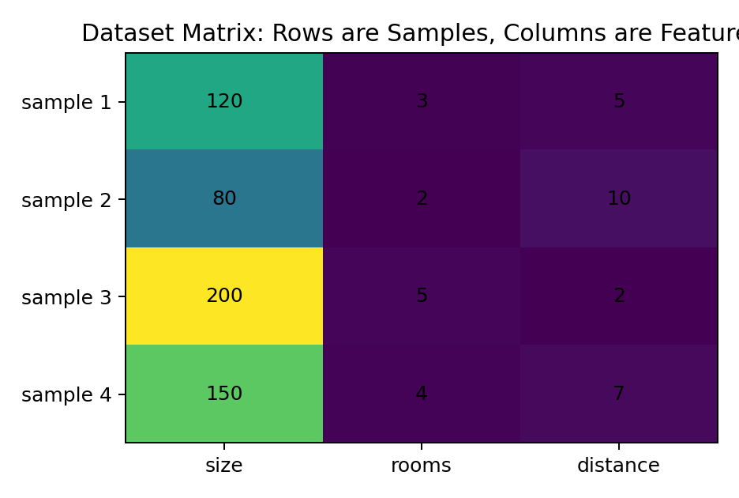
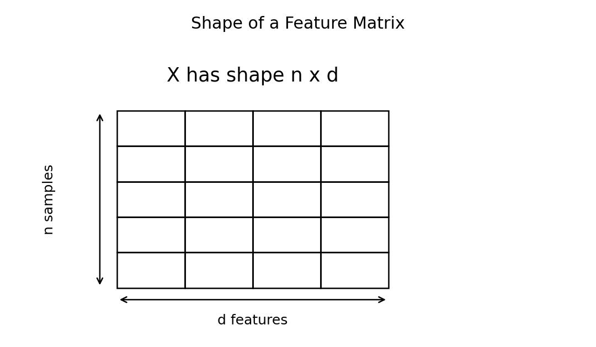
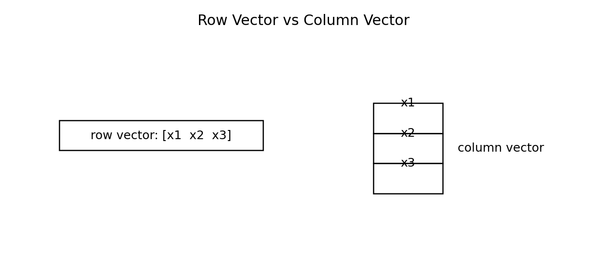
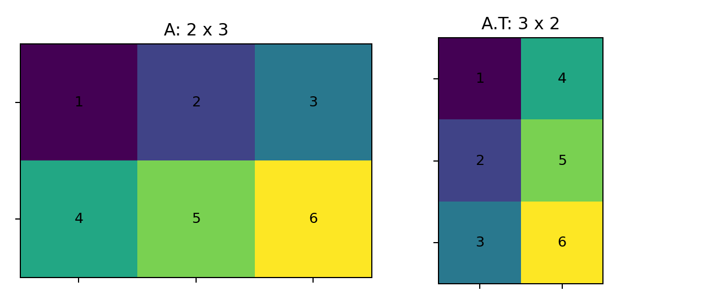
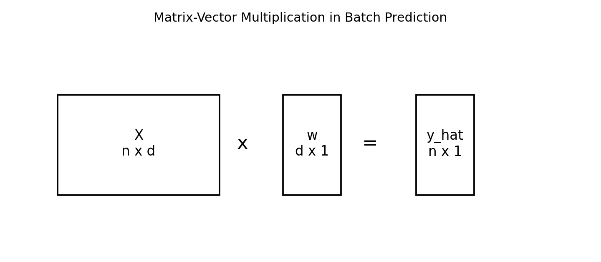
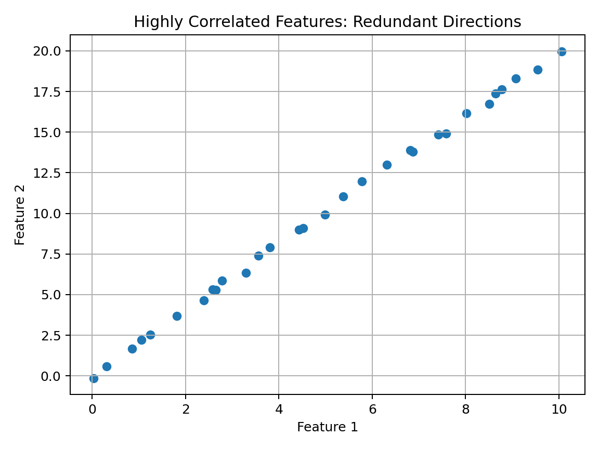
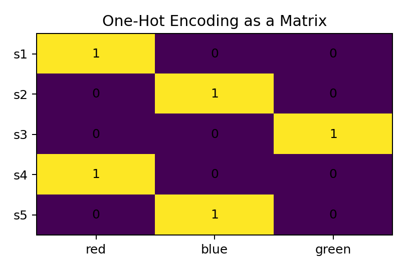

# 02 — Matrices and Datasets for Machine Learning

## Why This Lesson Exists

The previous math lesson was about vectors and feature spaces. A vector can represent one object. But Machine Learning almost never works with only one object. It works with datasets: many samples, many features, many targets, many predictions, many errors.

This is why matrices are unavoidable.

A matrix is not only a rectangular block of numbers. In Machine Learning, a matrix is often the mathematical form of an entire dataset.

This lesson is written deeply because matrices are one of the strongest bridges between pure mathematics and applied Machine Learning. If I understand matrices well, many later topics become cleaner:

```text
linear regression
logistic regression
least squares
normal equation
PCA
covariance matrices
neural network layers
batch training
embeddings
attention
computer vision tensors
```

The key idea of this lesson is:

> A dataset is a matrix, and many ML operations are matrix operations.

---

## 1. From One Vector to Many Vectors

A single sample can be written as a vector:

$$
x_i = [x_{i1}, x_{i2}, \dots, x_{id}]
$$

where:

```text
i -> sample index
j -> feature index
d -> number of features
```

A dataset contains many samples:

$$
x_1, x_2, \dots, x_n
$$

To store them together, I stack them into a matrix:

$$
X =
\begin{bmatrix}
x_1^T \\
x_2^T \\
\vdots \\
x_n^T
\end{bmatrix}
$$

Equivalently:

$$
X =
\begin{bmatrix}
x_{11} & x_{12} & \dots & x_{1d} \\
x_{21} & x_{22} & \dots & x_{2d} \\
\vdots & \vdots & \ddots & \vdots \\
x_{n1} & x_{n2} & \dots & x_{nd}
\end{bmatrix}
$$

So:

$$
X \in \mathbb{R}^{n \times d}
$$

where:

```text
n -> number of samples
d -> number of features
```

The standard supervised ML convention is:

```text
rows    -> samples
columns -> features
```

Visual intuition:



---

## 2. Why Shape Matters So Much

Shape is not a small coding detail. Shape is mathematical meaning.

If:

$$
X \in \mathbb{R}^{n \times d}
$$

then each row is one sample and each column is one feature.

Visual shape:



For example:

```python
import numpy as np

X = np.array([
    [120, 3, 5],
    [80, 2, 10],
    [200, 5, 2],
    [150, 4, 7]
])

print(X.shape)
```

Output:

```text
(4, 3)
```

This means:

```text
4 samples
3 features
```

If I accidentally transpose it, I get a different mathematical object. The model may then treat features as samples and samples as features. That is not just a coding bug; it is a meaning bug.

---

## 3. Matrix Entries and Notation

The entry in row $i$ and column $j$ is written as:

$$
x_{ij}
$$

This means:

```text
feature j of sample i
```

If the dataset is:

$$
X =
\begin{bmatrix}
120 & 3 & 5 \\
80 & 2 & 10 \\
200 & 5 & 2
\end{bmatrix}
$$

then:

```text
x_11 = 120
x_12 = 3
x_13 = 5
x_21 = 80
x_32 = 5
```

This notation appears in many formulas. For example, the mean of feature $j$ is:

$$
\mu_j = \frac{1}{n}\sum_{i=1}^{n}x_{ij}
$$

This means:

```text
fix column j
average over all rows
```

That is exactly what `axis=0` does in NumPy.

---

## 4. Rows as Samples

A row represents one sample.

For example:

$$
x_i^T =
\begin{bmatrix}
x_{i1} & x_{i2} & \dots & x_{id}
\end{bmatrix}
$$

In ML libraries, one row usually corresponds to one observation.

```python
sample = X[0]
```

This selects the first row.

Rows are important because models usually produce one output per row.

If:

$$
X \in \mathbb{R}^{n \times d}
$$

then a model often produces:

$$
\hat{y} \in \mathbb{R}^{n}
$$

one prediction for each row.

---

## 5. Columns as Features

A column represents one feature across all samples.

Column $j$ is:

$$
X_{:j} =
\begin{bmatrix}
x_{1j} \\
x_{2j} \\
\vdots \\
x_{nj}
\end{bmatrix}
$$

In NumPy:

```python
feature_j = X[:, j]
```

Columns are important because many preprocessing operations are feature-wise:

```text
mean of each feature
standard deviation of each feature
min-max scaling
missing value imputation
feature selection
correlation analysis
```

For example:

```python
feature_means = X.mean(axis=0)
```

Mathematically:

$$
\mu =
\begin{bmatrix}
\mu_1 & \mu_2 & \dots & \mu_d
\end{bmatrix}
$$

where:

$$
\mu_j = \frac{1}{n}\sum_{i=1}^{n}x_{ij}
$$

---

## 6. Row Vectors and Column Vectors

In pure mathematics, row vectors and column vectors are different objects.

A row vector:

$$
x^T =
\begin{bmatrix}
x_1 & x_2 & \dots & x_d
\end{bmatrix}
$$

has shape:

$$
1 \times d
$$

A column vector:

$$
x =
\begin{bmatrix}
x_1 \\
x_2 \\
\vdots \\
x_d
\end{bmatrix}
$$

has shape:

$$
d \times 1
$$

Visual intuition:



In NumPy, a 1D array has shape:

```text
(d,)
```

This is neither exactly a row vector nor exactly a column vector.

```python
x = np.array([1, 2, 3])
print(x.shape)
```

Output:

```text
(3,)
```

Column vector:

```python
x_col = x.reshape(-1, 1)
```

Row vector:

```python
x_row = x.reshape(1, -1)
```

This distinction becomes important in matrix multiplication.

---

## 7. Transpose

The transpose flips rows and columns.

If:

$$
A =
\begin{bmatrix}
1 & 2 & 3 \\
4 & 5 & 6
\end{bmatrix}
$$

then:

$$
A^T =
\begin{bmatrix}
1 & 4 \\
2 & 5 \\
3 & 6
\end{bmatrix}
$$

Visual intuition:



If:

$$
A \in \mathbb{R}^{m \times n}
$$

then:

$$
A^T \in \mathbb{R}^{n \times m}
$$

In NumPy:

```python
A = np.array([
    [1, 2, 3],
    [4, 5, 6]
])

print(A.T)
```

Transpose is crucial in linear regression, covariance matrices, PCA, and neural networks.

---

## 8. Matrix-Vector Multiplication

Suppose:

$$
X \in \mathbb{R}^{n \times d}
$$

and:

$$
w \in \mathbb{R}^{d}
$$

Then:

$$
Xw \in \mathbb{R}^{n}
$$

This means one score or prediction per sample.

Visual shape logic:



Expanded:

$$
Xw =
\begin{bmatrix}
x_1^T w \\
x_2^T w \\
\vdots \\
x_n^T w
\end{bmatrix}
$$

So each row is dotted with the weight vector.

This is batch prediction.

Instead of computing one prediction at a time:

$$
\hat{y}_i = w^T x_i + b
$$

we compute all predictions at once:

$$
\hat{y} = Xw + b\mathbf{1}
$$

where $\mathbf{1}$ is a vector of ones.

---

## 9. Linear Model in Matrix Form

For one sample:

$$
\hat{y}_i = w^T x_i + b
$$

For all samples:

$$
\hat{y} = Xw + b\mathbf{1}
$$

where:

```text
X -> feature matrix
w -> weight vector
b -> bias
1 -> vector of ones
y_hat -> prediction vector
```

In Python:

```python
import numpy as np

X = np.array([
    [120, 3, 5],
    [80, 2, 10],
    [200, 5, 2]
], dtype=float)

w = np.array([1000, 15000, -3000])
b = 50000

y_pred = X @ w + b

print(y_pred)
```

The `@` operator performs matrix multiplication.

This formula is the beginning of linear regression.

---

## 10. Why Matrix Form Is Powerful

Matrix form removes unnecessary loops.

Loop version:

```python
predictions = []

for sample in X:
    prediction = np.dot(sample, w) + b
    predictions.append(prediction)
```

Matrix version:

```python
predictions = X @ w + b
```

Both represent the same idea, but matrix form is:

```text
shorter
clearer
closer to the math
faster in numerical libraries
easier to generalize
```

This is why ML code often tries to be vectorized.

---

## 11. Design Matrix

In regression, the feature matrix is often called the **design matrix**.

If the model includes a bias term, one common trick is to add a column of ones to $X$.

Original:

$$
\hat{y} = Xw + b
$$

Augmented version:

$$
\hat{y} = \tilde{X}\tilde{w}
$$

where:

$$
\tilde{X} =
\begin{bmatrix}
1 & x_{11} & x_{12} & \dots & x_{1d} \\
1 & x_{21} & x_{22} & \dots & x_{2d} \\
\vdots & \vdots & \vdots & \ddots & \vdots \\
1 & x_{n1} & x_{n2} & \dots & x_{nd}
\end{bmatrix}
$$

and:

$$
\tilde{w} =
\begin{bmatrix}
b \\
w_1 \\
w_2 \\
\vdots \\
w_d
\end{bmatrix}
$$

In Python:

```python
ones = np.ones((X.shape[0], 1))
X_augmented = np.hstack([ones, X])
```

This idea appears in least squares and the normal equation.

---

## 12. Matrix Multiplication Shape Rule

Matrix multiplication is valid when inner dimensions match.

If:

$$
A \in \mathbb{R}^{m \times n}
$$

and:

$$
B \in \mathbb{R}^{n \times p}
$$

then:

$$
AB \in \mathbb{R}^{m \times p}
$$

Shape rule:

```text
(m x n) @ (n x p) = (m x p)
```

For ML:

```text
X shape: n x d
w shape: d x 1
Xw shape: n x 1
```

Shape errors are meaningful. They usually tell me that my mathematical objects do not align.

---

## 13. Broadcasting and Bias

In:

$$
\hat{y} = Xw + b
$$

the term $Xw$ is a vector of length $n$, but $b$ is a scalar.

NumPy allows:

```python
y_pred = X @ w + b
```

because it broadcasts $b$ to every prediction.

Mathematically:

$$
\hat{y} = Xw + b\mathbf{1}
$$

Broadcasting is convenient, but I should understand what it means mathematically.

---

## 14. Matrix Rank

The rank of a matrix measures how many independent directions its columns or rows contain.

If a feature matrix has redundant columns, then some features are linear combinations of others.

Example:

```text
feature 2 = 2 * feature 1
```

Then the second feature does not add a new independent direction.

Visual intuition:



Rank matters in linear regression because redundant features can make parameter estimation unstable.

In the normal equation:

$$
w = (X^T X)^{-1}X^T y
$$

the inverse exists only under certain conditions. If $X^T X$ is singular, the inverse does not exist.

This is one reason regularization becomes important later.

---

## 15. Linear Dependence and Multicollinearity

Columns of $X$ are linearly dependent if one column can be written as a linear combination of others.

In ML, this is related to multicollinearity.

If features are highly correlated, the model may still predict well, but the learned coefficients can become unstable or hard to interpret.

For example:

```text
size in square meters
size in square feet
```

These are almost the same information in different units.

A linear model may not know how to distribute importance between them.

This is not just algebra. It affects interpretability and stability.

---

## 16. Covariance Matrix Preview

A covariance matrix describes how features vary together.

If $X$ is centered, a common sample covariance matrix is:

$$
\Sigma = \frac{1}{n-1}X^T X
$$

where:

```text
X is centered
columns are features
Sigma is d x d
```

The entry $\Sigma_{ij}$ tells how feature $i$ and feature $j$ vary together.

This becomes central in PCA.

PCA asks:

```text
Which directions in feature space have the most variance?
```

That question is answered using covariance matrices and eigenvectors.

---

## 17. One-Hot Encoding as a Matrix

Not all data starts numerical. Categorical variables often need to be encoded.

Suppose a color feature has three categories:

```text
red
blue
green
```

One-hot encoding creates columns:

```text
is_red
is_blue
is_green
```

Visual example:



A category becomes a vector:

```text
red   -> [1, 0, 0]
blue  -> [0, 1, 0]
green -> [0, 0, 1]
```

Data preparation often means transforming raw information into matrix form.

---

## 18. Batches in Machine Learning

A batch is a subset of rows from the dataset.

If:

$$
X \in \mathbb{R}^{n \times d}
$$

then a batch might be:

$$
X_{\text{batch}} \in \mathbb{R}^{m \times d}
$$

where:

```text
m -> batch size
```

In deep learning, training often uses mini-batches.

The same matrix logic applies:

$$
\hat{y}_{\text{batch}} = X_{\text{batch}}w + b
$$

So batch training is also matrix computation.

---

## 19. From Matrices to Tensors

A matrix is a 2D array. A tensor generalizes this to more dimensions.

Examples:

```text
vector -> 1D
matrix -> 2D
image -> 3D: height x width x channels
batch of images -> 4D: batch x height x width x channels
video batch -> 5D
```

In classical ML, the main object is often:

$$
X \in \mathbb{R}^{n \times d}
$$

In deep learning, inputs often have higher-dimensional shapes.

The same principle remains:

```text
shape carries meaning
```

---

## 20. Common Shape Mistakes

### Mistake 1: Transposed dataset

Expected:

```text
X shape = n x d
```

Accidental:

```text
X shape = d x n
```

### Mistake 2: Wrong weight shape

If:

```text
X shape = n x d
```

then `w` should usually have shape:

```text
d
```

or:

```text
d x 1
```

### Mistake 3: Mixing row and column vectors

In NumPy:

```python
x.shape == (d,)
```

is not the same as:

```python
x.reshape(1, d)
```

or:

```python
x.reshape(d, 1)
```

### Mistake 4: Broadcasting accidentally

Broadcasting can silently produce a result with an unexpected shape.

This is why I should print shapes often while learning.

---

## 21. Code Translation

```python
import numpy as np

X = np.array([
    [120, 3, 5],
    [80, 2, 10],
    [200, 5, 2],
    [150, 4, 7],
], dtype=float)

y = np.array([180000, 120000, 300000, 240000])

w = np.array([1000, 15000, -3000])
b = 50000

y_pred = X @ w + b

errors = y - y_pred
mse = np.mean(errors ** 2)

ones = np.ones((X.shape[0], 1))
X_augmented = np.hstack([ones, X])

print(X.shape)
print(y_pred)
print(mse)
print(X_augmented)
```

This code includes:

```text
feature matrix
target vector
matrix-vector multiplication
prediction vector
error vector
MSE
augmented design matrix
```

This is the matrix skeleton of supervised learning.

---

## 22. What I Learned From This Lesson

A matrix is the natural mathematical form of a dataset.

Rows are samples. Columns are features.

Matrix multiplication lets models make predictions for all samples at once.

Transpose, shape, rank, augmentation, covariance, and batches are not abstract details. They are central to how ML algorithms work.

The central idea is:

```text
Machine Learning becomes clearer when I see datasets as matrices and models as matrix operations.
```

---

## Mini Exercise

Create a file called `02-matrices-and-datasets.py` inside the `code` folder.

Write code that:

```text
1. creates a feature matrix X
2. creates a target vector y
3. prints shapes
4. computes y_pred = Xw + b
5. computes MSE
6. creates an augmented matrix with a column of ones
7. computes feature means
8. centers X
9. computes a covariance-like matrix X_centered.T @ X_centered
```

Then answer:

```text
Why are rows samples?
Why are columns features?
Why does X @ w produce one prediction per row?
What does transpose do?
Why does rank matter?
```

---

## Further Reading and Resources

### Books

- [Mathematics for Machine Learning by Deisenroth, Faisal, and Ong](https://mml-book.github.io/)
- [Linear Algebra and Learning from Data by Gilbert Strang](https://math.mit.edu/~gs/learningfromdata/)
- [Introduction to Linear Algebra by Gilbert Strang](https://math.mit.edu/~gs/linearalgebra/)
- [The Elements of Statistical Learning](https://hastie.su.domains/ElemStatLearn/)

### Visual and Conceptual Learning

- [3Blue1Brown: Matrix Multiplication](https://www.3blue1brown.com/lessons/matrix-multiplication)
- [3Blue1Brown: Linear Transformations](https://www.3blue1brown.com/lessons/linear-transformations)
- [MIT OpenCourseWare: Linear Algebra](https://ocw.mit.edu/courses/18-06-linear-algebra-spring-2010/)

### ML Connections

- [Scikit-learn: Linear Models](https://scikit-learn.org/stable/modules/linear_model.html)
- [Scikit-learn: Preprocessing Data](https://scikit-learn.org/stable/modules/preprocessing.html)
- [NumPy: Matrix Multiplication](https://numpy.org/doc/stable/reference/generated/numpy.matmul.html)

### What to Study Next

The next math lesson should be:

```text
03 — Dot Products and Linear Models
```

That lesson will go deeply into $w^T x$, projections, weighted sums, linear scores, bias terms, and why linear models are the foundation of regression, logistic regression, SVMs, and neural networks.

---

## Final Reflection

Matrices are where individual samples become a dataset.

Once data becomes a matrix, learning can become algebra.

That is why matrix thinking is so powerful.

It lets me move from:

```text
one prediction at a time
```

to:

```text
a whole dataset processed at once
```

This is not only computationally efficient. It is conceptually beautiful.
