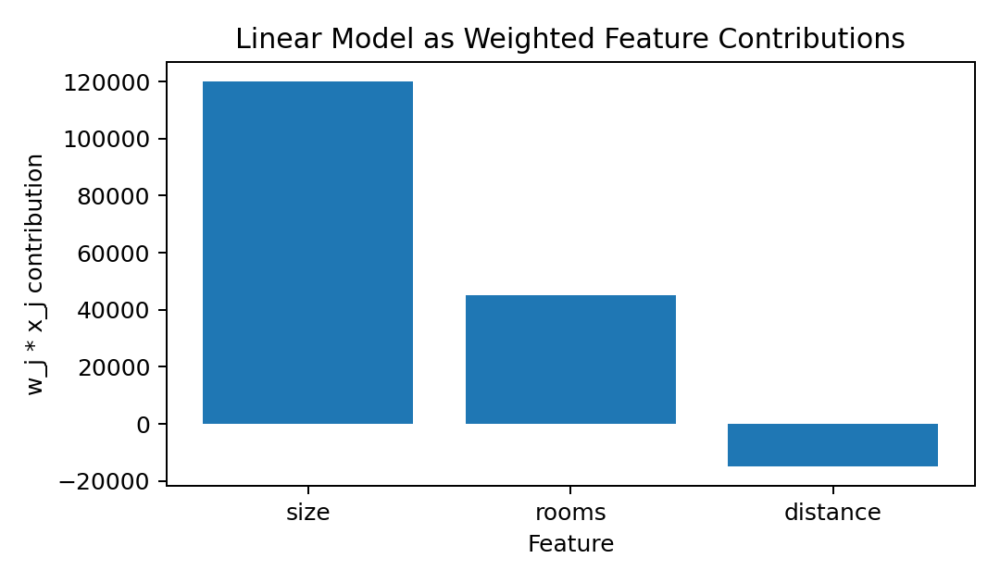
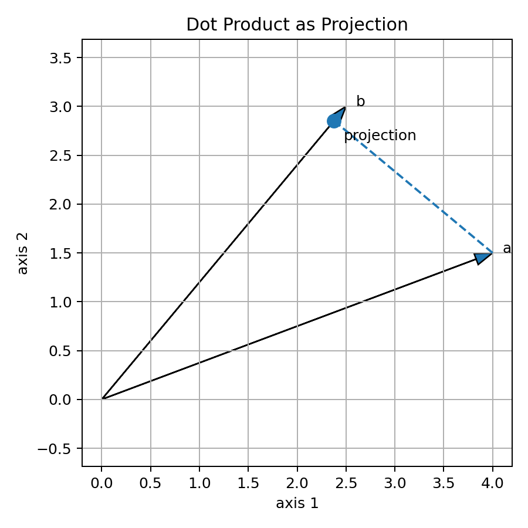
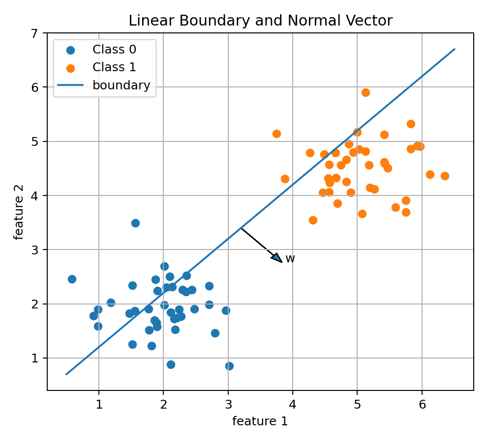
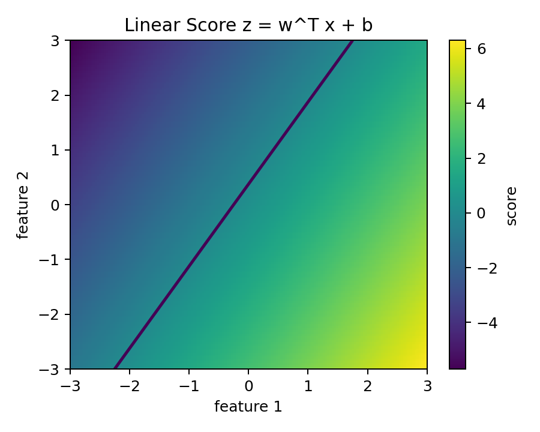
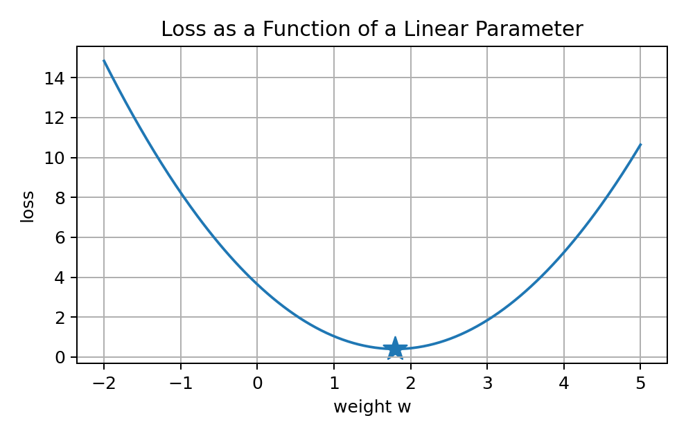

# 03 — Dot Products and Linear Models for Machine Learning

## Why This Lesson Exists

The previous two lessons gave us the language of vectors and matrices. Now we can study the operation that connects them to actual prediction:

```text
dot product
```

The dot product looks small:

$$
w^T x = w_1x_1 + w_2x_2 + \dots + w_dx_d
$$

but it appears almost everywhere in Machine Learning:

```text
linear regression
logistic regression
support vector machines
neural network layers
attention mechanisms
embedding similarity
ranking systems
recommendation systems
RAG retrieval
```

The main idea of this lesson is:

> A dot product turns a feature vector into a score.

A linear model is then built from that score:

$$
\hat{y} = w^T x + b
$$

This is one of the core formulas of supervised learning.

---

## 1. Feature Vector and Weight Vector

A data point is represented as a feature vector:

$$
x = [x_1, x_2, \dots, x_d]
$$

A linear model has a weight vector:

$$
w = [w_1, w_2, \dots, w_d]
$$

The feature vector describes the sample. The weight vector describes how the model values each feature.

Example:

$$
x = [120, 3, 5]
$$

could mean:

```text
size = 120
rooms = 3
distance_to_center = 5
```

A weight vector:

$$
w = [1000, 15000, -3000]
$$

could mean:

```text
each extra square meter adds 1000
each extra room adds 15000
each extra km from center subtracts 3000
```

Then:

$$
w^Tx = 1000(120) + 15000(3) - 3000(5)
$$

The model can add a bias:

$$
\hat{y} = w^Tx + b
$$

The weights encode the model's learned belief about the features.

---

## 2. Dot Product Definition

For two vectors:

$$
a = [a_1, a_2, \dots, a_d]
$$

and:

$$
b = [b_1, b_2, \dots, b_d]
$$

the dot product is:

$$
a \cdot b = \sum_{j=1}^{d}a_jb_j
$$

Expanded:

$$
a \cdot b = a_1b_1 + a_2b_2 + \dots + a_db_d
$$

If $a$ and $b$ are column vectors, we write:

$$
a^Tb
$$

In Python:

```python
import numpy as np

a = np.array([2, 3, 4])
b = np.array([5, 1, -2])

dot = np.dot(a, b)

print(dot)
```

Manual calculation:

$$
2(5) + 3(1) + 4(-2) = 10 + 3 - 8 = 5
$$

---

## 3. Dot Product as Weighted Sum

In ML, the most direct interpretation is:

```text
dot product = weighted sum of features
```

For:

$$
w^Tx = \sum_{j=1}^{d}w_jx_j
$$

each feature contributes:

$$
w_jx_j
$$

to the final score.

Visual example:



This is why linear models are interpretable. If features are standardized and not strongly collinear, the weight can tell us how strongly the model uses that feature.

---

## 4. Dot Product as Projection

The dot product also has a geometric interpretation:

$$
a^Tb = \|a\|\|b\|\cos(\theta)
$$

where $\theta$ is the angle between the vectors.

Visual intuition:



This means the dot product measures alignment.

If two vectors point in a similar direction, the dot product is positive and large.

If they are perpendicular:

$$
a^Tb = 0
$$

If they point in opposite directions, the dot product is negative.

In ML, $w^Tx$ measures how much the input vector $x$ aligns with the model's weight direction $w$.

---

## 5. Orthogonality

Two vectors are orthogonal if:

$$
a^Tb = 0
$$

Orthogonality appears in:

```text
PCA
projections
least squares
basis vectors
embedding similarity
residual geometry
```

Example:

$$
a = [1,0]
$$

$$
b = [0,1]
$$

Then:

$$
a^Tb = 0
$$

So they are perpendicular.

Later, in least squares, the residual vector becomes orthogonal to the column space of the design matrix. That is one of the most beautiful geometric facts behind linear regression.

---

## 6. The Linear Model Formula

A linear model predicts using:

$$
\hat{y} = w^Tx + b
$$

Expanded:

$$
\hat{y} = w_1x_1 + w_2x_2 + \dots + w_dx_d + b
$$

where:

```text
x      -> feature vector
w      -> weight vector
b      -> bias / intercept
y_hat  -> prediction
```

For one sample:

```python
import numpy as np

x = np.array([120, 3, 5])
w = np.array([1000, 15000, -3000])
b = 50000

y_hat = np.dot(w, x) + b

print(y_hat)
```

This code implements the formula directly.

---

## 7. What the Bias Term Does

The bias term shifts the model.

Without bias:

$$
\hat{y} = w^Tx
$$

With bias:

$$
\hat{y} = w^Tx + b
$$

In one dimension:

$$
\hat{y} = wx + b
$$

Here $w$ controls the slope and $b$ controls the intercept.

Without $b$, the line must pass through the origin. That is often too restrictive.

In higher dimensions, $b$ shifts the hyperplane away from the origin.

---

## 8. Linear Regression as a Dot Product Model

In linear regression, the target is continuous:

```text
price
temperature
energy consumption
production rate
signal amplitude
```

For sample $i$:

$$
\hat{y}_i = w^Tx_i + b
$$

The residual is:

$$
e_i = y_i - \hat{y}_i
$$

A common loss is MSE:

$$
\mathrm{MSE} = \frac{1}{n}\sum_{i=1}^{n}(y_i-\hat{y}_i)^2
$$

Visual intuition:


Linear regression chooses weights and bias so these residuals become small.

---

## 9. Batch Prediction with Matrices

For one sample:

$$
\hat{y}_i = w^Tx_i + b
$$

For all samples:

$$
\hat{y} = Xw + b\mathbf{1}
$$

where:

```text
X -> feature matrix with shape n x d
w -> weight vector with shape d
b -> scalar bias
1 -> vector of ones
y_hat -> prediction vector with shape n
```

In NumPy:

```python
y_pred = X @ w + b
```

This performs prediction for all rows at once.

Expanded:

$$
Xw =
\begin{bmatrix}
x_1^Tw \\
x_2^Tw \\
\vdots \\
x_n^Tw
\end{bmatrix}
$$

Each row of $X$ is dotted with the same weight vector.

---

## 10. Linear Score for Classification

For classification, a linear model often first computes a score:

$$
z = w^Tx + b
$$

This score is not necessarily a probability. It is a real number.

For binary classification, the sign can define a decision:

$$
\hat{y} =
\begin{cases}
1, & z \geq 0 \\
0, & z < 0
\end{cases}
$$

The boundary occurs when:

$$
w^Tx+b=0
$$

This is a line in 2D, a plane in 3D, and a hyperplane in higher dimensions.



The vector $w$ is normal to the decision boundary.

This is essential for logistic regression and support vector machines.

---

## 11. Linear Score as a Field

The score:

$$
z = w^Tx+b
$$

assigns a number to every point in feature space.



The contour $z=0$ is the decision boundary.

One side has positive score. The other side has negative score.

In logistic regression, this score is passed through the sigmoid function:

$$
\sigma(z) = \frac{1}{1+e^{-z}}
$$

This converts the linear score into a probability.

---

## 12. Why Linear Does Not Mean Weak

Linear models are simple, but not weak.

They are useful because:

```text
they are interpretable
they are fast
they are stable baselines
they work well with good features
they are mathematically analyzable
they are building blocks of neural networks
```

A neural network layer starts with:

$$
h = Wx+b
$$

Then a nonlinear activation is applied.

So deep learning also depends on linear transformations.

---

## 13. Linear in Features, Not Always Linear in Raw Input

A linear model is linear in the features it receives.

If I use:

$$
\phi(x) = [x, x^2, x^3]
$$

then:

$$
\hat{y} = w_1x + w_2x^2 + w_3x^3 + b
$$

This model is linear in $\phi(x)$ but nonlinear in the original variable $x$.

This is a subtle and powerful idea:

> Feature transformations can make linear models more expressive.

---

## 14. Geometry of Linear Boundaries

The set of points satisfying:

$$
w^Tx+b=0
$$

is a hyperplane.

The signed distance to this hyperplane is proportional to:

$$
\frac{w^Tx+b}{\|w\|}
$$

This expression appears in margin-based classifiers like SVM.

So $w^Tx+b$ is not just a score. It has geometric meaning: it tells which side of a boundary a point lies on and how far it is from that boundary.

---

## 15. Learning the Weights

At first, the weights are unknown.

For regression with MSE:

$$
\mathcal{L}(w,b)
=
\frac{1}{n}
\sum_{i=1}^{n}
(y_i - (w^Tx_i+b))^2
$$

The learning problem is:

$$
(w^*,b^*)
=
\arg\min_{w,b}\mathcal{L}(w,b)
$$

Visual intuition for one parameter:



This prepares us for optimization and gradient descent.

---

## 16. Gradient Preview

For one-dimensional linear regression:

$$
\hat{y}_i = wx_i+b
$$

MSE loss:

$$
\mathcal{L}(w,b)
=
\frac{1}{n}
\sum_{i=1}^{n}
(y_i-(wx_i+b))^2
$$

The derivative with respect to $w$ is:

$$
\frac{\partial \mathcal{L}}{\partial w}
=
-\frac{2}{n}
\sum_{i=1}^{n}
x_i(y_i-\hat{y}_i)
$$

The derivative with respect to $b$ is:

$$
\frac{\partial \mathcal{L}}{\partial b}
=
-\frac{2}{n}
\sum_{i=1}^{n}
(y_i-\hat{y}_i)
$$

This shows that the gradient depends on:

```text
features
errors
average over samples
```

Later, gradient descent updates the weight:

$$
w_{\text{new}}
=
w_{\text{old}}
-
\alpha
\frac{\partial \mathcal{L}}{\partial w}
$$

---

## 17. Dot Products in Neural Networks

A single neuron computes:

$$
z = w^Tx+b
$$

Then it applies an activation:

$$
h = g(z)
$$

A layer computes many dot products:

$$
h = Wx+b
$$

So the dot product is the atomic operation of neural networks.

Understanding it deeply makes neural networks less mysterious.

---

## 18. Dot Products in Embeddings and Retrieval

In embeddings, vectors represent objects:

```text
sentences
documents
images
users
products
signals
```

Similarity can be measured using dot product or cosine similarity:

$$
\cos(\theta)
=
\frac{a^Tb}{\|a\|\|b\|}
$$

In RAG, a query vector is compared with document vectors. A simplified scoring rule is:

$$
\mathrm{score}(q,d)=q^Td
$$

So dot products are also central to modern retrieval and LLM systems.

---

## 19. Code from Scratch: One Sample

```python
import numpy as np

def linear_predict_one(x, w, b):
    return np.dot(w, x) + b

x = np.array([120, 3, 5])
w = np.array([1000, 15000, -3000])
b = 50000

prediction = linear_predict_one(x, w, b)

print(prediction)
```

This implements:

$$
\hat{y}=w^Tx+b
$$

---

## 20. Code from Scratch: Batch Prediction

```python
def linear_predict_batch(X, w, b):
    return X @ w + b
```

This implements:

$$
\hat{y}=Xw+b\mathbf{1}
$$

---

## 21. Code from Scratch: MSE

```python
def mse(y_true, y_pred):
    errors = y_true - y_pred
    return np.mean(errors ** 2)
```

This implements:

$$
\mathrm{MSE}
=
\frac{1}{n}
\sum_{i=1}^{n}
(y_i-\hat{y}_i)^2
$$

Now we have:

```text
prediction
residuals
loss
```

The missing piece is learning the best weights, which comes in Linear Regression.

---

## 22. Common Mistakes

### Mistake 1: Thinking dot product is elementwise multiplication

A dot product multiplies corresponding entries and then sums.

### Mistake 2: Ignoring feature scale

If one feature has much larger values, the term $w_jx_j$ can dominate.

### Mistake 3: Forgetting the bias

Without $b$, the model may be forced through the origin.

### Mistake 4: Confusing linear in features with linear in raw input

A model can be linear in transformed features and nonlinear in the original input.

### Mistake 5: Not checking shape

For $Xw$:

```text
X shape = n x d
w shape = d
```

The feature dimensions must match.

---

## 23. What I Learned From This Lesson

The dot product can be understood as:

```text
weighted sum
projection
alignment
linear score
feature contribution
```

A linear model uses:

$$
\hat{y}=w^Tx+b
$$

For a full dataset:

$$
\hat{y}=Xw+b\mathbf{1}
$$

This formula supports linear regression, logistic regression, SVMs, neural networks, and similarity systems.

---

## Mini Exercise

Create a file called `03-dot-products-and-linear-models.py` inside the `code` folder.

Write code that:

```text
1. creates one feature vector x
2. creates a weight vector w and bias b
3. computes w^T x + b manually
4. computes it using np.dot
5. creates a matrix X with several samples
6. computes batch predictions X @ w + b
7. computes residuals y - y_pred
8. computes MSE
9. changes one weight and observes how predictions change
```

Then answer:

```text
What does each weight mean?
What does the bias do?
Why does X @ w produce many predictions?
How is a dot product a weighted sum?
How is a dot product a projection?
Why is w normal to a linear decision boundary?
```

---

## Further Reading and Resources

### Books

- [Mathematics for Machine Learning by Deisenroth, Faisal, and Ong](https://mml-book.github.io/)
- [Linear Algebra and Learning from Data by Gilbert Strang](https://math.mit.edu/~gs/learningfromdata/)
- [An Introduction to Statistical Learning](https://www.statlearning.com/)
- [Pattern Recognition and Machine Learning by Christopher Bishop](https://link.springer.com/book/9780387310732)

### Visual Learning

- [3Blue1Brown: Dot Products and Duality](https://www.3blue1brown.com/lessons/dot-products)
- [3Blue1Brown: Essence of Linear Algebra](https://www.3blue1brown.com/topics/linear-algebra)

### ML Connections

- [Scikit-learn: Linear Models](https://scikit-learn.org/stable/modules/linear_model.html)
- [Google Machine Learning Crash Course: Linear Regression](https://developers.google.com/machine-learning/crash-course/linear-regression)
- [NumPy dot documentation](https://numpy.org/doc/stable/reference/generated/numpy.dot.html)

### What to Study Next

The next math lesson should be:

```text
04 — Norms, Distances, and Similarity
```

That lesson will connect vectors to KNN, cosine similarity, embeddings, nearest-neighbor retrieval, regularization, and high-dimensional geometry.

---

## Final Reflection

The dot product is small enough to write in one line, but deep enough to support most of Machine Learning.

It is algebra, geometry, and modeling at the same time.

When I write:

```python
y_pred = X @ w + b
```

I am not just running code.

I am applying a geometric model to an entire dataset.
