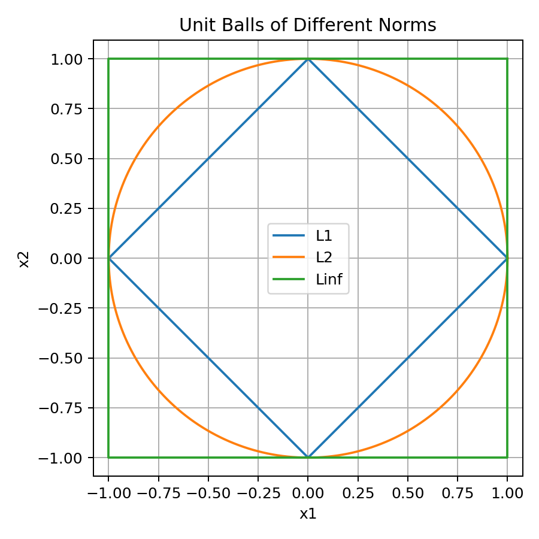
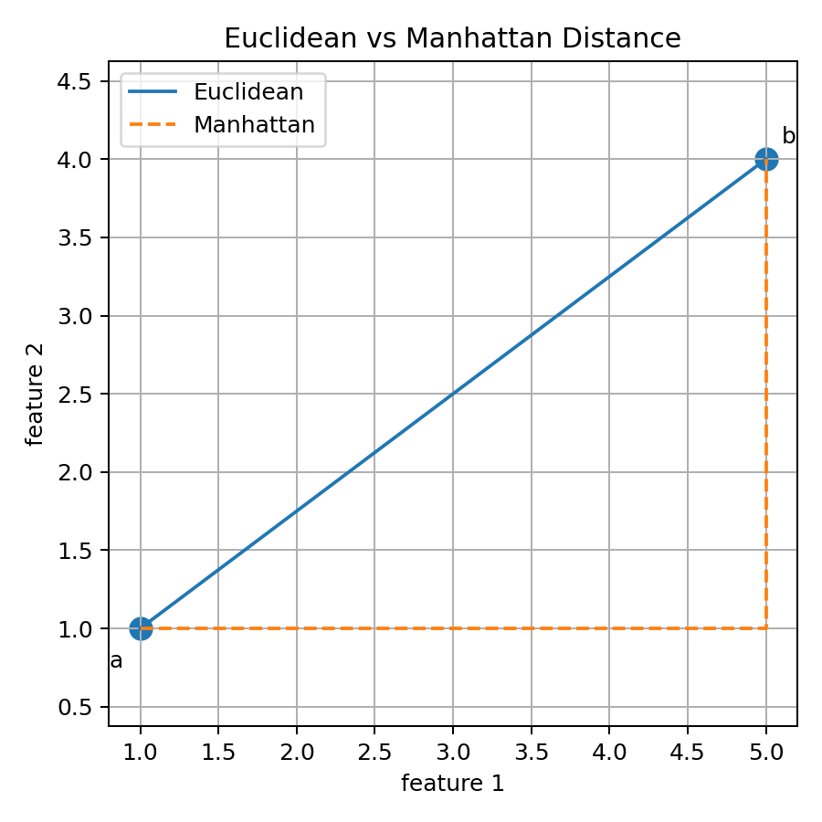
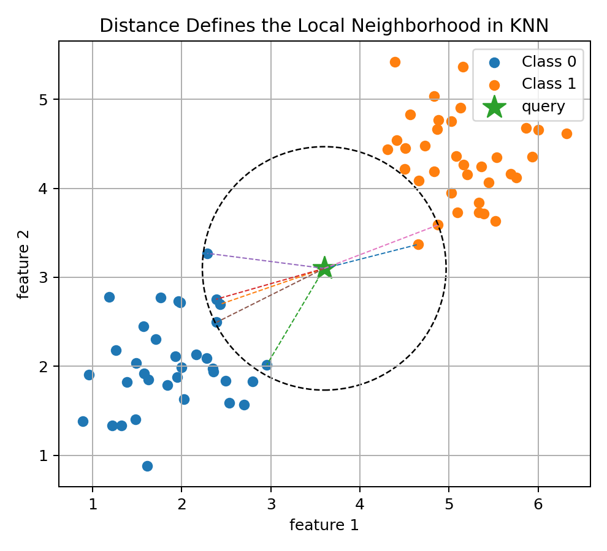
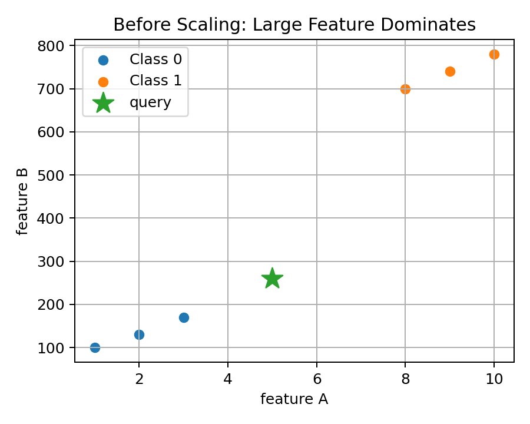
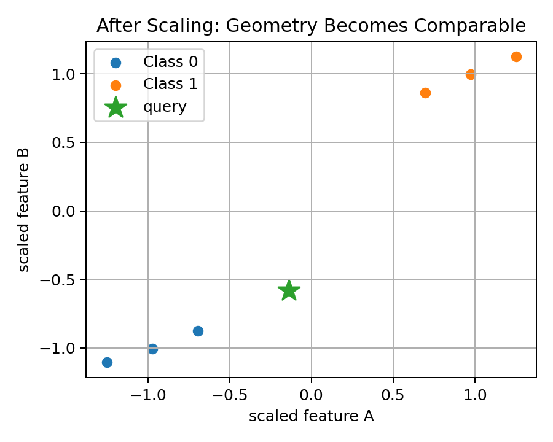
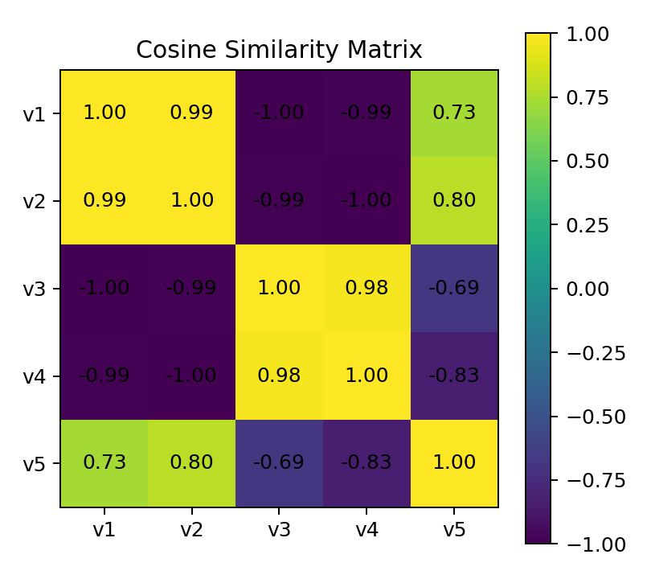
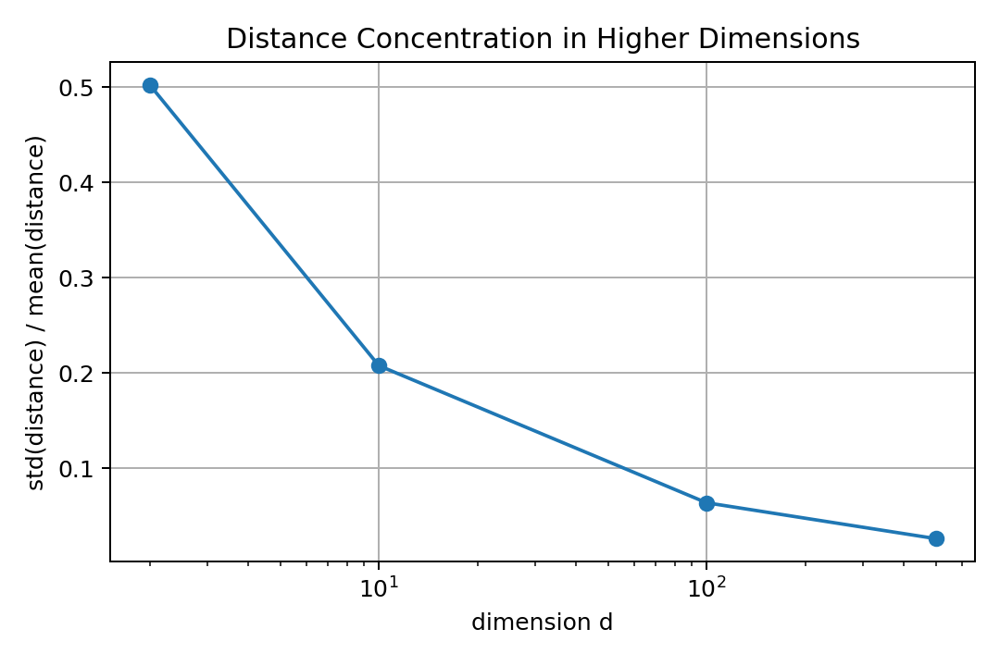

# 04 — Norms, Distances, and Similarity for Machine Learning

## Why This Lesson Exists

In the previous lessons, I learned that Machine Learning turns real-world objects into vectors and datasets into matrices. But once objects become vectors, one of the most important questions becomes:

```text
How do I compare two vectors?
```

This question appears everywhere.

In KNN, I ask:

```text
Which training examples are closest to this new point?
```

In clustering, I ask:

```text
Which points are similar enough to belong together?
```

In embeddings and RAG, I ask:

```text
Which document vector is most similar to the query vector?
```

In regularization, I ask:

```text
How large are the model weights?
```

In optimization, I ask:

```text
How large is the gradient?
```

All of these questions use the same mathematical family of ideas:

```text
norms
distances
similarities
```

This lesson is deep because these concepts look simple at first, but they control the geometry of Machine Learning.

The central idea is:

> Once data becomes vectors, learning depends on the geometry we impose on the vector space.

A different norm, distance, or similarity function can change what “large,” “close,” or “similar” means.

---

## 1. Size, Distance, and Similarity Are Different Ideas

Before formulas, I need to separate three concepts.

### Size

Size asks:

```text
How large is this one vector?
```

This is measured by a **norm**.

Example:

$$
\|x\|
$$

### Distance

Distance asks:

```text
How far apart are these two vectors?
```

This is measured by a **distance function**.

Example:

$$
d(a,b)
$$

### Similarity

Similarity asks:

```text
How alike are these two vectors?
```

This is measured by a **similarity function**.

Example:

$$
\mathrm{sim}(a,b)
$$

These ideas are related, but they are not identical.

Euclidean distance cares about absolute position and scale. Cosine similarity cares mostly about direction. Dot product similarity cares about both direction and magnitude.

That difference becomes very important for KNN, embeddings, vector databases, and retrieval systems.

---

## 2. What Is a Norm?

A norm is a function that measures the size of a vector.

Formally, a norm is a function:

$$
\|\cdot\| : V \to \mathbb{R}
$$

that assigns a nonnegative number to each vector and satisfies three axioms.

For vectors $x,y$ and scalar $\alpha$:

### Axiom 1: Non-negativity

$$
\|x\| \geq 0
$$

and:

$$
\|x\| = 0 \iff x = 0
$$

Only the zero vector has zero length.

### Axiom 2: Absolute homogeneity

$$
\|\alpha x\| = |\alpha|\|x\|
$$

Scaling a vector scales its length by the absolute value of the scalar.

### Axiom 3: Triangle inequality

$$
\|x+y\| \leq \|x\| + \|y\|
$$

The direct path is no longer than going through an intermediate point.

These axioms are not decorative. They guarantee that the norm behaves like a meaningful size function.

---

## 3. The Euclidean Norm: $L_2$

The most familiar norm is the Euclidean norm:

$$
\|x\|_2 = \sqrt{x_1^2 + x_2^2 + \dots + x_d^2}
$$

Compactly:

$$
\|x\|_2 = \sqrt{\sum_{j=1}^{d}x_j^2}
$$

For:

$$
x = [3,4]
$$

we get:

$$
\|x\|_2 = \sqrt{3^2+4^2}=5
$$

In Python:

```python
import numpy as np

x = np.array([3, 4])

print(np.linalg.norm(x, ord=2))
```

The $L_2$ norm is the usual straight-line length from geometry.

In ML, it appears in:

```text
Euclidean distance
Ridge regularization
gradient magnitudes
least squares
PCA
MSE geometry
```

---

## 4. The Manhattan Norm: $L_1$

The $L_1$ norm is:

$$
\|x\|_1 = \sum_{j=1}^{d}|x_j|
$$

For:

$$
x = [3,4]
$$

we get:

$$
\|x\|_1 = |3|+|4|=7
$$

In Python:

```python
x = np.array([3, 4])

print(np.linalg.norm(x, ord=1))
```

The $L_1$ norm is sometimes called Manhattan norm because it resembles walking through city blocks instead of moving diagonally.

In ML, $L_1$ appears in:

```text
Manhattan distance
Lasso regularization
sparsity
feature selection
robust alternatives
```

A key ML idea:

> $L_1$ regularization often encourages sparse solutions.

Sparse means many coefficients become exactly zero.

---

## 5. The Infinity Norm: $L_\infty$

The infinity norm is:

$$
\|x\|_\infty = \max_j |x_j|
$$

For:

$$
x = [3,-7,2]
$$

we get:

$$
\|x\|_\infty = 7
$$

In Python:

```python
x = np.array([3, -7, 2])

print(np.linalg.norm(x, ord=np.inf))
```

This norm asks:

```text
What is the largest absolute coordinate?
```

It appears in worst-case analysis, optimization constraints, gradient clipping ideas, and adversarial robustness.

---

## 6. Unit Balls and Geometry of Norms

A unit ball is the set of vectors with norm at most 1.

For a norm $\|\cdot\|$, the unit ball is:

$$
B = \{x : \|x\| \leq 1\}
$$

Different norms create different geometries.



In 2D:

```text
L1 unit ball      -> diamond
L2 unit ball      -> circle
L∞ unit ball      -> square
```

This matters deeply in ML.

Regularization with different norms leads to different behavior.

```text
L1 geometry encourages sparse coefficients
L2 geometry shrinks coefficients smoothly
```

This is why Ridge and Lasso behave differently.

---

## 7. Distance from a Norm

A distance can be created from a norm:

$$
d(a,b) = \|a-b\|
$$

This means:

```text
distance between a and b = size of their difference vector
```

Using $L_2$ gives Euclidean distance.

Using $L_1$ gives Manhattan distance.

Using $L_\infty$ gives Chebyshev distance.

So the choice of norm changes the meaning of distance.

---

## 8. Euclidean Distance

Euclidean distance is:

$$
d_2(a,b)=\|a-b\|_2
$$

Expanded:

$$
d_2(a,b)
=
\sqrt{
\sum_{j=1}^{d}
(a_j-b_j)^2
}
$$

For:

$$
a=[1,2]
$$

and:

$$
b=[4,6]
$$

we get:

$$
d_2(a,b)
=
\sqrt{(1-4)^2+(2-6)^2}
=
\sqrt{9+16}
=
5
$$

In Python:

```python
a = np.array([1, 2])
b = np.array([4, 6])

distance = np.linalg.norm(a - b, ord=2)
```

This is the default geometric intuition behind KNN.

---

## 9. Manhattan Distance

Manhattan distance is:

$$
d_1(a,b)=\|a-b\|_1
$$

Expanded:

$$
d_1(a,b)
=
\sum_{j=1}^{d}|a_j-b_j|
$$

For:

$$
a=[1,2]
$$

and:

$$
b=[4,6]
$$

we get:

$$
d_1(a,b)=|1-4|+|2-6|=3+4=7
$$

Visual comparison:



Euclidean distance measures the straight-line path.

Manhattan distance measures axis-aligned movement.

---

## 10. Minkowski Distance

Euclidean and Manhattan distances are special cases of Minkowski distance.

For $p \geq 1$:

$$
d_p(a,b)
=
\left(
\sum_{j=1}^{d}|a_j-b_j|^p
\right)^{1/p}
$$

Special cases:

```text
p = 1 -> Manhattan distance
p = 2 -> Euclidean distance
p -> infinity -> L∞ / Chebyshev distance
```

This is important because distance choice is not just implementation detail. It is a modeling decision.

---

## 11. Distance in KNN

KNN depends directly on distance.

For a query point $x$, KNN finds the set of $k$ nearest neighbors:

$$
N_k(x)
$$

Then classification predicts:

$$
\hat{y}
=
\arg\max_c
\sum_{i \in N_k(x)}
\mathbf{1}(y_i=c)
$$

The distance function defines the neighborhood.



If I change the distance, I may change the neighbors.

If I change the neighbors, I may change the prediction.

So distance is part of the model.

---

## 12. Feature Scaling Changes Distance

Distance-based methods are sensitive to scale.

Suppose I have two features:

```text
feature A: values around 1 to 10
feature B: values around 100 to 1000
```

Then Euclidean distance may be dominated by feature B.

Before scaling:



After scaling:



Standardization is:

$$
z = \frac{x-\mu}{\sigma}
$$

where:

```text
mu -> mean
sigma -> standard deviation
```

In NumPy:

```python
X_scaled = (X - X.mean(axis=0)) / X.std(axis=0)
```

Important principle:

> Scaling is a geometric transformation of feature space.

It changes distances, neighborhoods, and sometimes predictions.

---

## 13. Similarity vs Distance

Distance and similarity are related but not identical.

Distance:

```text
smaller means closer
```

Similarity:

```text
larger means more similar
```

A simple conversion can be:

$$
\mathrm{sim}(a,b)=\frac{1}{1+d(a,b)}
$$

but this is not always the best choice.

For embeddings, cosine similarity is often more meaningful than Euclidean distance because direction can matter more than magnitude.

---

## 14. Cosine Similarity

Cosine similarity measures the cosine of the angle between two vectors:

$$
\cos(\theta)
=
\frac{a^Tb}{\|a\|_2\|b\|_2}
$$

Visual intuition:


Values:

```text
1    -> same direction
0    -> orthogonal directions
-1   -> opposite directions
```

Cosine similarity ignores overall magnitude and focuses on direction.

This is very useful for text embeddings. Two documents may have different lengths but similar meaning. Cosine similarity can still detect that their vectors point in similar directions.

---

## 15. Dot Product Similarity

Dot product similarity is:

$$
\mathrm{sim}(a,b)=a^Tb
$$

Unlike cosine similarity, it is affected by vector magnitude.

If vectors are normalized to unit length:

$$
\|a\|_2=1
$$

and:

$$
\|b\|_2=1
$$

then:

$$
a^Tb=\cos(\theta)
$$

So for normalized embeddings, dot product and cosine similarity become equivalent.

This is important in vector databases and retrieval systems.

---

## 16. Similarity Matrix

If I have many vectors:

$$
v_1,v_2,\dots,v_n
$$

I can compute pairwise similarities.

A similarity matrix $S$ has entries:

$$
S_{ij} = \mathrm{sim}(v_i,v_j)
$$

Visual example:



Similarity matrices appear in:

```text
clustering
retrieval
attention
recommendation systems
graph construction
kernel methods
```

In attention mechanisms, token-token similarity controls how information flows between tokens.

---

## 17. High-Dimensional Distance Problems

In high-dimensional spaces, distance can behave strangely.

One important phenomenon is distance concentration.

As dimension increases, distances between random points can become more similar relative to their mean.

Visual intuition:



This matters for nearest-neighbor methods.

If all points are almost equally far away, then the idea of “nearest” becomes weaker.

This is part of the curse of dimensionality.

High-dimensional ML often needs:

```text
good representations
dimensionality reduction
regularization
metric learning
normalization
large amounts of data
```

---

## 18. Norms in Regularization

Norms are not only for measuring data vectors. They also measure model parameters.

For a weight vector $w$, Ridge regression penalizes:

$$
\|w\|_2^2
$$

Lasso penalizes:

$$
\|w\|_1
$$

This changes learning.

Ridge tends to shrink weights smoothly.

Lasso can push some weights exactly to zero.

This means norms shape the hypothesis space of the model.

So the choice of norm affects not only the geometry of data, but also the geometry of learning.

---

## 19. Norms in Optimization

Gradients are vectors.

The gradient norm:

$$
\|\nabla_\theta \mathcal{L}(\theta)\|
$$

measures how large the update direction is.

In deep learning, gradient norms matter because gradients can explode or vanish.

Gradient clipping uses a norm threshold:

```text
if gradient norm is too large, rescale it
```

So norms appear even inside optimization algorithms.

---

## 20. Code: Norms and Distances from Scratch

```python
import numpy as np

def l1_norm(x):
    return np.sum(np.abs(x))

def l2_norm(x):
    return np.sqrt(np.sum(x ** 2))

def linf_norm(x):
    return np.max(np.abs(x))

def euclidean_distance(a, b):
    return l2_norm(a - b)

def manhattan_distance(a, b):
    return l1_norm(a - b)
```

These functions implement the mathematical definitions directly.

---

## 21. Code: Cosine Similarity

```python
def cosine_similarity(a, b):
    numerator = np.dot(a, b)
    denominator = np.linalg.norm(a) * np.linalg.norm(b)
    return numerator / denominator
```

Important edge case:

```text
cosine similarity is undefined if one vector is zero
```

because division by zero occurs.

A robust implementation should handle zero vectors.

---

## 22. Code: Pairwise Distance Matrix

For a dataset:

$$
X \in \mathbb{R}^{n \times d}
$$

a pairwise distance matrix $D$ has entries:

$$
D_{ij}=d(x_i,x_j)
$$

Naive Python:

```python
def pairwise_euclidean_distances(X):
    n = X.shape[0]
    D = np.zeros((n, n))

    for i in range(n):
        for j in range(n):
            D[i, j] = np.linalg.norm(X[i] - X[j])

    return D
```

This is simple and clear. Later, I can vectorize it for efficiency.

---

## 23. Code: Nearest Neighbor Search

```python
def nearest_neighbor(X_train, query):
    distances = np.linalg.norm(X_train - query, axis=1)
    index = np.argmin(distances)
    return index, distances[index]
```

This is the core of KNN.

It says:

```text
compute distance from query to every training point
choose the smallest distance
```

KNN simply generalizes this to the nearest $k$ points.

---

## 24. Common Mistakes

### Mistake 1: Thinking all distances behave the same

Euclidean, Manhattan, cosine, and dot product similarity can produce different rankings.

### Mistake 2: Forgetting scaling

Distance-based methods can fail if features have very different scales.

### Mistake 3: Using cosine similarity with zero vectors

Cosine similarity divides by vector norms. A zero vector has no direction.

### Mistake 4: Treating high-dimensional distance like 2D distance

High-dimensional geometry can behave very differently.

### Mistake 5: Confusing distance and similarity

Distance is minimized. Similarity is maximized.

### Mistake 6: Ignoring the modeling assumption

Distance-based models assume that geometric closeness corresponds to semantic or label similarity.

This is not automatically true.

---

## 25. What I Learned From This Lesson

Norms measure vector size.

Distances measure how far vectors are.

Similarities measure how alike vectors are.

These concepts control the geometry of ML systems.

They appear in:

```text
KNN
clustering
regularization
PCA
embeddings
RAG
optimization
neural networks
```

The central lesson is:

```text
Choosing a distance or similarity function is choosing a geometry for the learning problem.
```

---

## Mini Exercise

Create a file called `04-norms-distances-similarity.py` inside the `code` folder.

Write code that:

```text
1. implements L1, L2, and L∞ norms
2. implements Euclidean and Manhattan distance
3. implements cosine similarity
4. computes pairwise distance matrix for a small dataset
5. finds nearest neighbor of a query point
6. compares nearest neighbor before and after scaling
7. computes a cosine similarity matrix
```

Then answer:

```text
Why does KNN need a distance function?
Why can scaling change nearest neighbors?
When is cosine similarity better than Euclidean distance?
Why is the zero vector problematic for cosine similarity?
How do L1 and L2 regularization connect to norms?
```

---

## Further Reading and Resources

### Books

- [Mathematics for Machine Learning by Deisenroth, Faisal, and Ong](https://mml-book.github.io/)
- [Linear Algebra and Learning from Data by Gilbert Strang](https://math.mit.edu/~gs/learningfromdata/)
- [The Elements of Statistical Learning](https://hastie.su.domains/ElemStatLearn/)
- [Pattern Recognition and Machine Learning by Christopher Bishop](https://link.springer.com/book/9780387310732)

### Visual and Conceptual Learning

- [3Blue1Brown: Dot Products and Duality](https://www.3blue1brown.com/lessons/dot-products)
- [3Blue1Brown: Essence of Linear Algebra](https://www.3blue1brown.com/topics/linear-algebra)
- [Seeing Theory](https://seeing-theory.brown.edu/)

### ML Connections

- [Scikit-learn: Nearest Neighbors](https://scikit-learn.org/stable/modules/neighbors.html)
- [Scikit-learn: Preprocessing Data](https://scikit-learn.org/stable/modules/preprocessing.html)
- [Scikit-learn: Pairwise Metrics](https://scikit-learn.org/stable/modules/metrics.html)
- [NumPy: Linear Algebra Norm](https://numpy.org/doc/stable/reference/generated/numpy.linalg.norm.html)

### What to Study Next

The next math lesson should be:

```text
05 — Functions, Slopes, and Derivatives
```

That lesson will prepare us for gradients, optimization, gradient descent, and later backpropagation.

---

## Final Reflection

Norms, distances, and similarities define the geometry of Machine Learning.

They decide what it means for a vector to be large, what it means for two points to be close, and what it means for two objects to be similar.

That is not a small detail.

It is one of the foundations of learning from vector representations.
