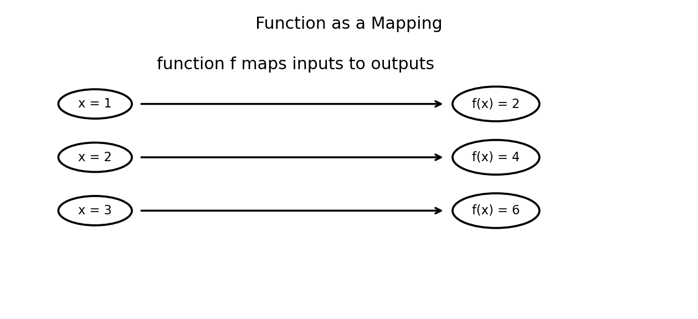
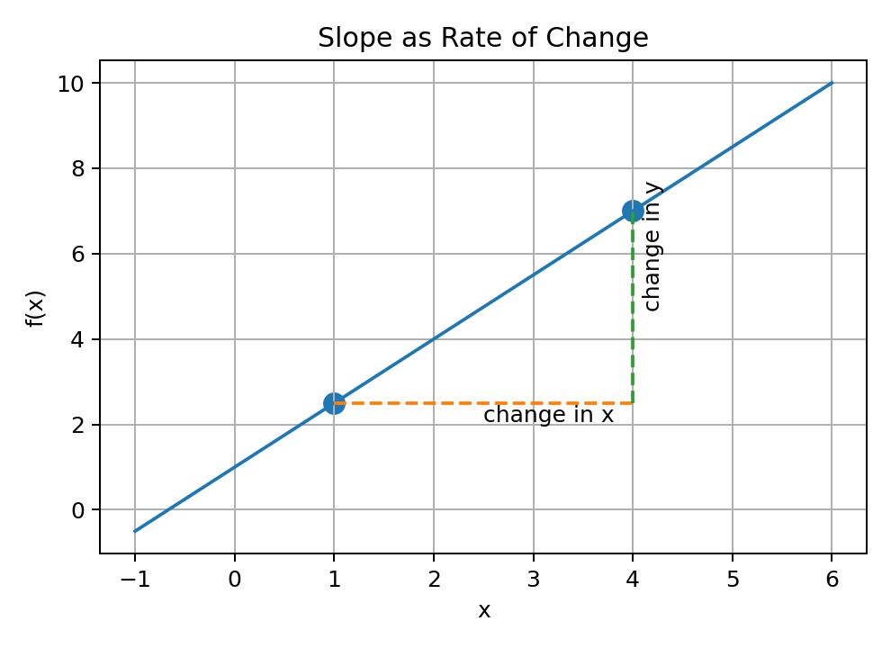
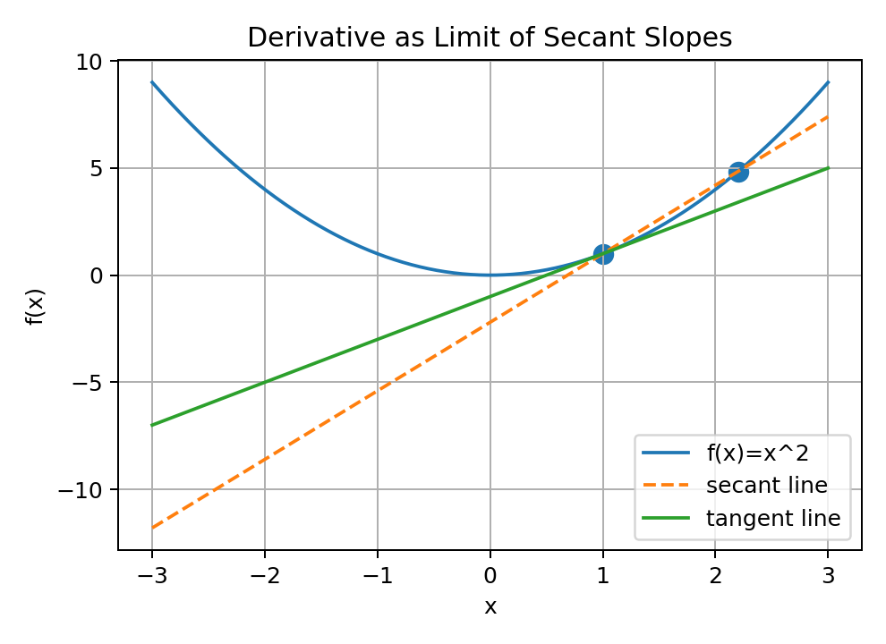
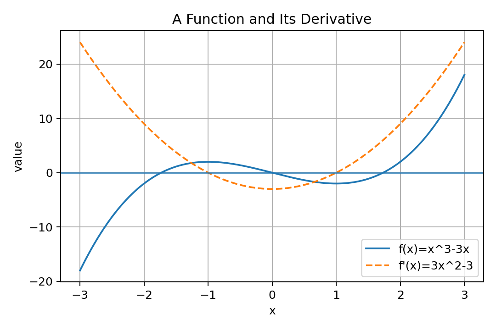
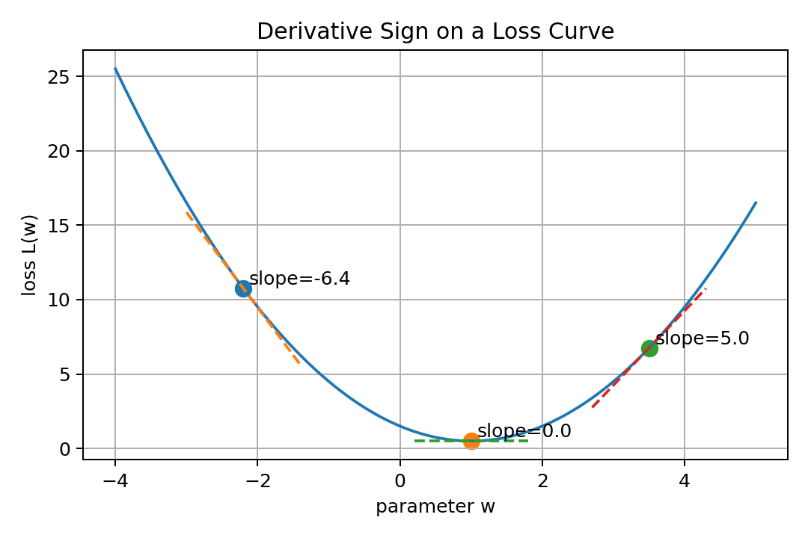
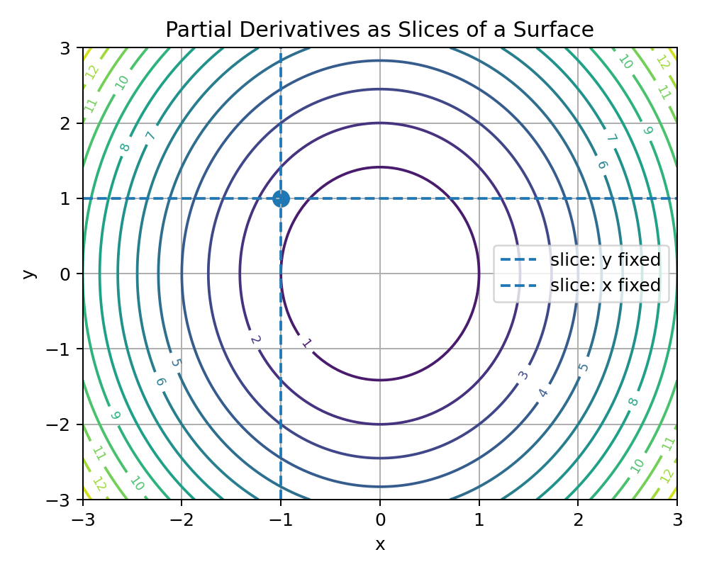
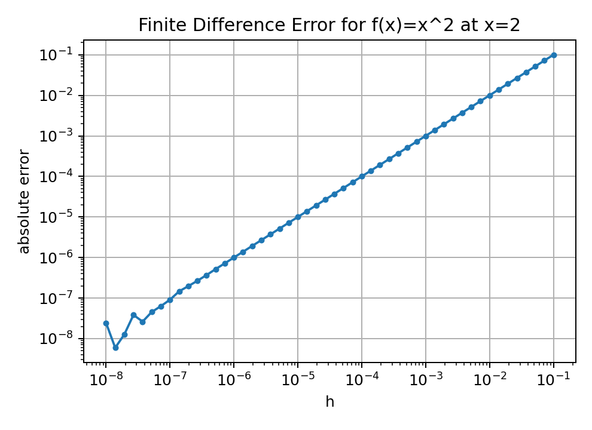

# 05 — Functions, Slopes, and Derivatives for Machine Learning

## Why This Lesson Exists

Machine Learning is full of functions.

A model is a function:

$$
\hat{y}=f_\theta(x)
$$

A loss is a function:

$$
\mathcal{L}(\theta)
$$

An activation is a function:

$$
h=g(z)
$$

A probability model is a function:

$$
P(y \mid x)
$$

An optimizer tries to improve a function by changing its input.

So before learning gradients and gradient descent deeply, I need to understand functions, slopes, and derivatives.

This lesson is not only calculus review. It is about learning how calculus becomes the language of training.

The central idea is:

> A derivative tells how a function changes when its input changes.

In Machine Learning, that usually means:

```text
How does the loss change when a model parameter changes?
```

That question is the beginning of learning.

---

## 1. What Is a Function?

A function maps inputs to outputs.

Formally, a function can be written as:

$$
f : A \to B
$$

This means:

```text
f takes an element from set A
and returns an element in set B
```

Example:

$$
f(x)=2x
$$

If:

$$
x=3
$$

then:

$$
f(3)=6
$$

Visual intuition:



In Machine Learning, functions appear everywhere:

```text
model function
loss function
activation function
metric function
probability function
kernel function
similarity function
```

The most important one is the model:

$$
f_\theta(x)
$$

Here $x$ is the input and $\theta$ represents parameters.

---

## 2. Function in Machine Learning

A supervised model tries to learn a function from data.

Given a dataset:

$$
\mathcal{D}=\{(x_i,y_i)\}_{i=1}^{n}
$$

we want a function:

$$
f_\theta
$$

such that:

$$
f_\theta(x_i)\approx y_i
$$

The prediction is:

$$
\hat{y}_i=f_\theta(x_i)
$$

A simple linear model is:

$$
f_{w,b}(x)=w^Tx+b
$$

A neural network is also a function, but usually more complex:

$$
f_\theta(x)=W_2g(W_1x+b_1)+b_2
$$

The notation looks different, but the idea is the same:

```text
input -> function -> output
```

Training means choosing parameters so the function behaves well on data.

---

## 3. Slope as Rate of Change

For a line:

$$
f(x)=mx+b
$$

the slope is:

$$
m
$$

The slope measures how much $f(x)$ changes when $x$ changes.

For two points:

$$
(x_1,f(x_1))
$$

and:

$$
(x_2,f(x_2))
$$

the average rate of change is:

$$
\frac{f(x_2)-f(x_1)}{x_2-x_1}
$$

Visual intuition:



In simple words:

```text
slope = change in output / change in input
```

In ML language:

```text
slope tells sensitivity
```

If a small change in input creates a large change in output, the function is sensitive.

---

## 4. Secant Slope

For a nonlinear function, slope may change from point to point.

The slope between two points is called a secant slope.

For a function $f$, point $x$, and step $h$:

$$
\frac{f(x+h)-f(x)}{h}
$$

This is the average rate of change from $x$ to $x+h$.

For example, let:

$$
f(x)=x^2
$$

At $x=2$ and $h=1$:

$$
\frac{f(3)-f(2)}{1}
=
\frac{9-4}{1}
=
5
$$

But this is average change over an interval, not instantaneous change at one point.

---

## 5. Derivative as Limit of Secant Slopes

The derivative is the instantaneous rate of change.

It is defined as:

$$
f'(x)
=
\lim_{h\to 0}
\frac{f(x+h)-f(x)}{h}
$$

This means:

```text
take the slope between x and x+h
make h smaller and smaller
observe the limiting slope
```

Visual intuition:



The derivative is the slope of the tangent line.

For:

$$
f(x)=x^2
$$

we compute:

$$
f'(x)=2x
$$

So at:

$$
x=2
$$

the derivative is:

$$
f'(2)=4
$$

This means near $x=2$, a tiny increase in $x$ increases $f(x)$ at approximately 4 times that change.

---

## 6. Derivative Notations

Derivatives can be written in several ways.

If:

$$
y=f(x)
$$

then the derivative can be written as:

$$
f'(x)
$$

or:

$$
\frac{dy}{dx}
$$

or:

$$
\frac{df}{dx}
$$

They all express rate of change.

In ML, I often see derivatives of loss with respect to parameters:

$$
\frac{d\mathcal{L}}{dw}
$$

This means:

```text
how loss changes when weight w changes
```

Later, for many parameters, this becomes a gradient:

$$
\nabla_\theta \mathcal{L}
$$

---

## 7. Derivative as Local Linear Approximation

A derivative does more than give a slope. It gives a local linear approximation.

For small $h$:

$$
f(x+h)\approx f(x)+f'(x)h
$$

This is a first-order approximation.

It says:

```text
new value ≈ old value + slope × small change
```

Example:

$$
f(x)=x^2
$$

At $x=2$:

$$
f(2)=4
$$

and:

$$
f'(2)=4
$$

For $h=0.1$:

$$
f(2.1)\approx 4+4(0.1)=4.4
$$

Actual:

$$
2.1^2=4.41
$$

The approximation is close because $h$ is small.

This idea becomes crucial in gradient descent.

Gradient descent uses local slope information to decide how to move parameters.

---

## 8. Positive, Negative, and Zero Derivatives

The sign of the derivative tells direction.

If:

$$
f'(x)>0
$$

then the function is increasing at that point.

If:

$$
f'(x)<0
$$

then the function is decreasing at that point.

If:

$$
f'(x)=0
$$

then the tangent is flat.

Visual intuition:



In optimization, flat points are important because minima and maxima often occur where derivative is zero.

But derivative zero does not always mean minimum.

It can also mean maximum or saddle-like behavior in higher dimensions.

---

## 9. Derivatives and Loss Curves

In Machine Learning, I usually want to minimize a loss function.

Suppose loss depends on one parameter:

$$
\mathcal{L}(w)
$$

The derivative:

$$
\frac{d\mathcal{L}}{dw}
$$

tells how the loss changes if $w$ changes.

Visual intuition:



If the derivative is negative, increasing $w$ decreases the loss.

If the derivative is positive, increasing $w$ increases the loss.

Gradient descent moves opposite the derivative:

$$
w_{\text{new}}
=
w_{\text{old}}
-
\alpha
\frac{d\mathcal{L}}{dw}
$$

where $\alpha$ is the learning rate.

This is the seed of model training.

---

## 10. Differentiability

A function is differentiable at a point if it has a well-defined derivative there.

Geometrically, this means the function has a well-defined tangent line at that point.

Some functions are not differentiable at sharp corners.

Example:

$$
f(x)=|x|
$$

At $x=0$, the left slope is:

$$
-1
$$

and the right slope is:

$$
1
$$

Because these are different, the derivative at zero does not exist.

In ML, this matters because ReLU is:

$$
\mathrm{ReLU}(x)=\max(0,x)
$$

It has a corner at $x=0$.

Still, neural networks use ReLU successfully because optimization can use subgradients or define a practical derivative convention at zero.

---

## 11. Common Derivatives

Some derivatives appear constantly.

### Power rule

$$
\frac{d}{dx}x^n = nx^{n-1}
$$

### Constant rule

$$
\frac{d}{dx}c=0
$$

### Sum rule

$$
\frac{d}{dx}(f(x)+g(x))=f'(x)+g'(x)
$$

### Product rule

$$
\frac{d}{dx}(f(x)g(x))=f'(x)g(x)+f(x)g'(x)
$$

### Chain rule

$$
\frac{d}{dx}f(g(x))=f'(g(x))g'(x)
$$

The chain rule is one of the most important rules in all of deep learning.

Backpropagation is basically the chain rule applied efficiently through a computational graph.

---

## 12. Chain Rule Intuition

Suppose:

$$
z=g(x)
$$

and:

$$
y=f(z)
$$

Then:

$$
y=f(g(x))
$$

The chain rule says:

$$
\frac{dy}{dx}
=
\frac{dy}{dz}
\frac{dz}{dx}
$$

In words:

```text
change in y with respect to x
=
change in y with respect to z
times
change in z with respect to x
```

In neural networks, each layer transforms the previous layer.

The final loss depends on all earlier parameters through a chain of functions.

That is why chain rule is the mathematical engine of backpropagation.

---

## 13. Partial Derivatives

Many ML functions depend on more than one variable.

For example:

$$
f(x,y)=x^2+y^2
$$

The partial derivative with respect to $x$ treats $y$ as constant:

$$
\frac{\partial f}{\partial x}=2x
$$

The partial derivative with respect to $y$ treats $x$ as constant:

$$
\frac{\partial f}{\partial y}=2y
$$

Visual intuition:



Partial derivatives are essential because models have many parameters.

A loss function may depend on thousands or millions of weights.

Each partial derivative asks:

```text
how does the loss change if this one parameter changes?
```

---

## 14. Derivatives of Linear Models

For a one-dimensional linear model:

$$
\hat{y}=wx+b
$$

The derivative with respect to $w$ is:

$$
\frac{\partial \hat{y}}{\partial w}=x
$$

The derivative with respect to $b$ is:

$$
\frac{\partial \hat{y}}{\partial b}=1
$$

This is intuitive.

If $x$ is large, changing $w$ affects the prediction more.

Changing $b$ always shifts the prediction by the same amount.

This is why features with huge scales can create large gradients.

---

## 15. Derivative of MSE for One Sample

For one sample:

$$
\ell(w,b)=(y-\hat{y})^2
$$

where:

$$
\hat{y}=wx+b
$$

Let:

$$
e=y-\hat{y}
$$

Then:

$$
\ell=e^2
$$

Using the chain rule:

$$
\frac{\partial \ell}{\partial w}
=
2e
\frac{\partial e}{\partial w}
$$

Since:

$$
e=y-(wx+b)
$$

we get:

$$
\frac{\partial e}{\partial w}=-x
$$

Therefore:

$$
\frac{\partial \ell}{\partial w}
=
-2x(y-\hat{y})
$$

Similarly:

$$
\frac{\partial \ell}{\partial b}
=
-2(y-\hat{y})
$$

This is one of the first real bridges from calculus to learning.

The derivative depends on:

```text
the input feature x
the prediction error y - y_hat
```

---

## 16. Derivative of MSE for Many Samples

For many samples:

$$
\mathcal{L}(w,b)
=
\frac{1}{n}
\sum_{i=1}^{n}
(y_i-(wx_i+b))^2
$$

The derivative with respect to $w$ is:

$$
\frac{\partial \mathcal{L}}{\partial w}
=
-\frac{2}{n}
\sum_{i=1}^{n}
x_i(y_i-\hat{y}_i)
$$

The derivative with respect to $b$ is:

$$
\frac{\partial \mathcal{L}}{\partial b}
=
-\frac{2}{n}
\sum_{i=1}^{n}
(y_i-\hat{y}_i)
$$

These formulas are exactly what gradient descent uses for linear regression.

Later, we will implement this from scratch.

---

## 17. Numerical Derivatives

A derivative can be approximated numerically using finite differences:

$$
f'(x)\approx \frac{f(x+h)-f(x)}{h}
$$

for small $h$.

Example:

```python
def numerical_derivative(f, x, h=1e-5):
    return (f(x + h) - f(x)) / h
```

For:

$$
f(x)=x^2
$$

at $x=2$, the derivative should be:

$$
4
$$

Visual idea:



Numerical derivatives are useful for gradient checking.

But they can be slow and numerically unstable for very small $h$.

---

## 18. Symbolic, Numerical, and Automatic Differentiation

There are three ways to think about derivatives in computation.

### Symbolic differentiation

This manipulates formulas.

Example:

$$
\frac{d}{dx}x^2=2x
$$

### Numerical differentiation

This approximates derivatives using small changes.

Example:

$$
f'(x)\approx \frac{f(x+h)-f(x)}{h}
$$

### Automatic differentiation

This is used by frameworks like PyTorch and TensorFlow.

It computes exact derivatives of implemented operations using the chain rule.

In deep learning, automatic differentiation is essential.

It lets us define a forward computation and automatically compute gradients for training.

---

## 19. Why Derivatives Matter in ML

Derivatives answer the training question:

```text
If I slightly change this parameter, what happens to the loss?
```

If the loss increases, the parameter should move the other way.

If the loss decreases, the parameter is moving in a useful direction.

This is why gradient descent uses:

$$
\theta_{\text{new}}
=
\theta_{\text{old}}
-
\alpha
\nabla_\theta \mathcal{L}(\theta)
$$

This lesson focused on one-dimensional derivatives and partial derivatives.

The next lesson will combine all partial derivatives into a gradient vector.

---

## 20. Code: Derivative from Formula and Finite Difference

```python
import numpy as np

def f(x):
    return x ** 2

def exact_derivative(x):
    return 2 * x

def numerical_derivative(f, x, h=1e-5):
    return (f(x + h) - f(x)) / h

x = 2.0

print(exact_derivative(x))
print(numerical_derivative(f, x))
```

Both should be close to:

```text
4
```

---

## 21. Code: MSE Derivatives for Simple Linear Regression

```python
import numpy as np

x = np.array([1, 2, 3, 4], dtype=float)
y = np.array([3, 5, 7, 9], dtype=float)

w = 0.5
b = 0.0

y_hat = w * x + b
errors = y - y_hat

dL_dw = -(2 / len(x)) * np.sum(x * errors)
dL_db = -(2 / len(x)) * np.sum(errors)

print(dL_dw)
print(dL_db)
```

This is calculus becoming code.

---

## 22. Common Mistakes

### Mistake 1: Thinking derivative is only a formula

A derivative is a local rate of change.

### Mistake 2: Forgetting the chain rule

Most ML losses are compositions of functions.

### Mistake 3: Confusing derivative sign

If derivative is positive, increasing the variable increases the function. To minimize, move opposite the derivative.

### Mistake 4: Ignoring feature scale

Large feature values can create large derivatives.

### Mistake 5: Thinking derivative zero always means minimum

Derivative zero can mean minimum, maximum, or saddle-like behavior.

### Mistake 6: Trusting numerical derivatives blindly

Finite differences depend on the choice of $h$ and can suffer from numerical precision issues.

---

## 23. What I Learned From This Lesson

A function maps inputs to outputs.

A slope measures rate of change.

A derivative is the instantaneous rate of change.

A partial derivative measures change with respect to one variable while holding others fixed.

In ML, derivatives tell how loss changes when parameters change.

This is the bridge from model prediction to model training.

The central idea is:

```text
Derivatives tell the model how to improve.
```

---

## Mini Exercise

Create a file called `05-functions-slopes-derivatives.py` inside the `code` folder.

Write code that:

```text
1. defines f(x)=x^2
2. computes exact derivative f'(x)=2x
3. computes numerical derivative using finite difference
4. compares exact and numerical derivative at several points
5. defines a simple linear model y_hat = wx + b
6. computes MSE
7. computes dL/dw and dL/db
8. performs one manual gradient descent update
```

Then answer:

```text
What does a derivative measure?
Why is derivative useful for minimizing loss?
Why does chain rule matter in ML?
What do dL/dw and dL/db mean?
Why can feature scale affect gradients?
```

---

## Further Reading and Resources

### Books

- [Mathematics for Machine Learning by Deisenroth, Faisal, and Ong](https://mml-book.github.io/)
- [Calculus by Gilbert Strang](https://ocw.mit.edu/resources/res-18-001-calculus-online-textbook-spring-2005/)
- [Deep Learning Book by Goodfellow, Bengio, and Courville](https://www.deeplearningbook.org/)
- [Pattern Recognition and Machine Learning by Christopher Bishop](https://link.springer.com/book/9780387310732)

### Visual Learning

- [3Blue1Brown: Essence of Calculus](https://www.3blue1brown.com/topics/calculus)
- [Khan Academy: Derivatives](https://www.khanacademy.org/math/differential-calculus)
- [Seeing Theory](https://seeing-theory.brown.edu/)

### ML Connections

- [Google Machine Learning Crash Course: Gradient Descent](https://developers.google.com/machine-learning/crash-course/linear-regression/gradient-descent)
- [PyTorch Autograd Tutorial](https://pytorch.org/tutorials/beginner/basics/autogradqs_tutorial.html)
- [TensorFlow Automatic Differentiation](https://www.tensorflow.org/guide/autodiff)

### What to Study Next

The next math lesson should be:

```text
06 — Gradients and Gradient Descent
```

That lesson will extend derivatives to many parameters and show how models actually learn by moving through loss landscapes.

---

## Final Reflection

Derivatives are not just a calculus topic.

They are the mathematical signal of learning.

A derivative tells the model:

```text
this parameter affects the loss in this direction
```

Gradient descent turns that signal into action.

That is why understanding derivatives deeply makes Machine Learning feel less like magic and more like mathematics.
