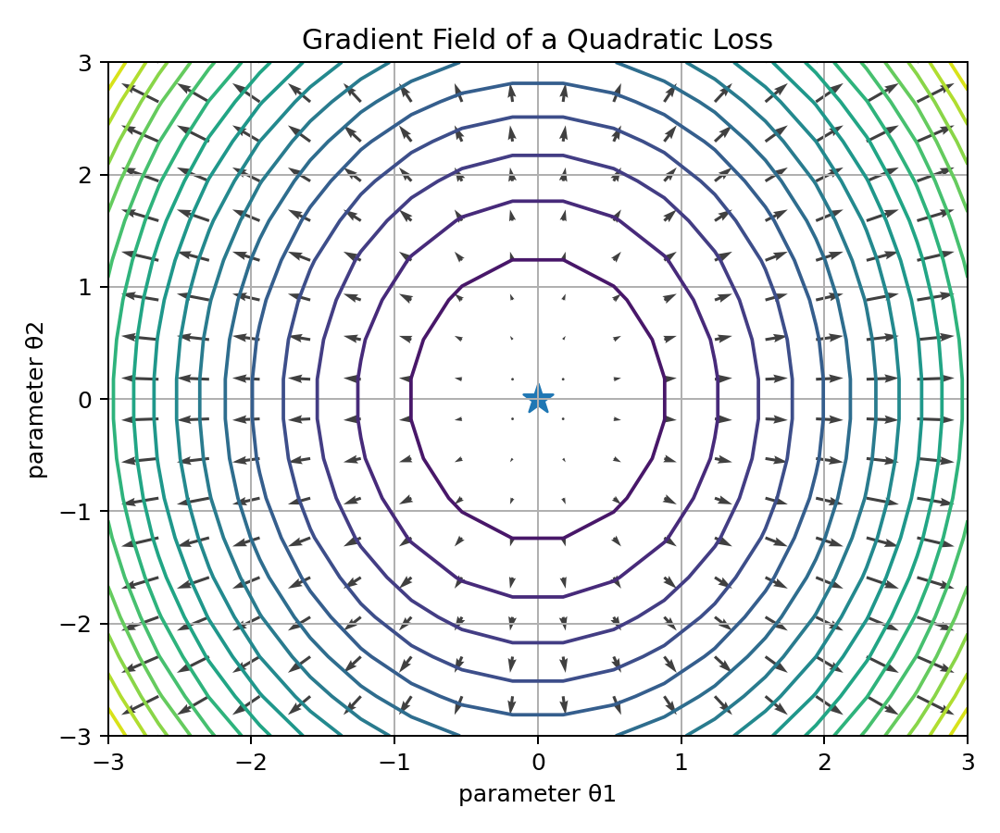
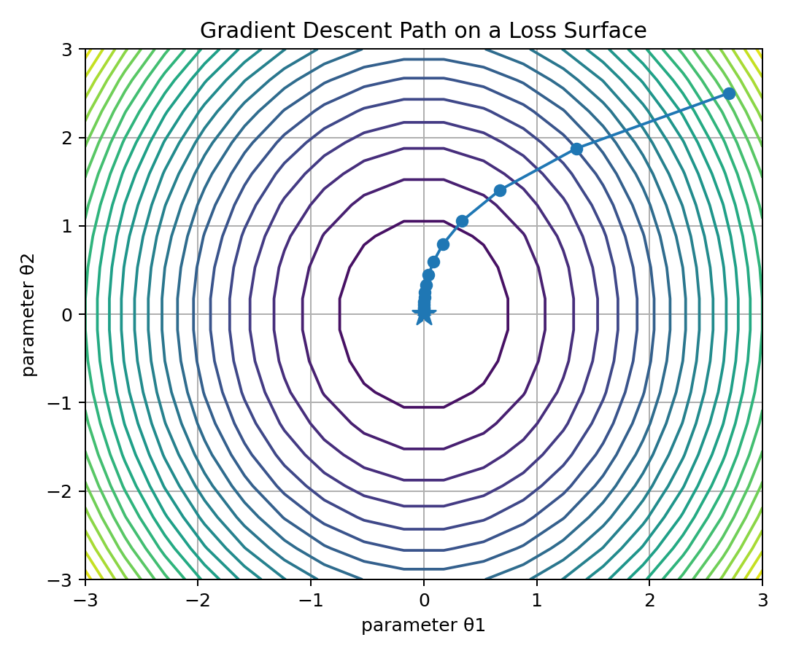
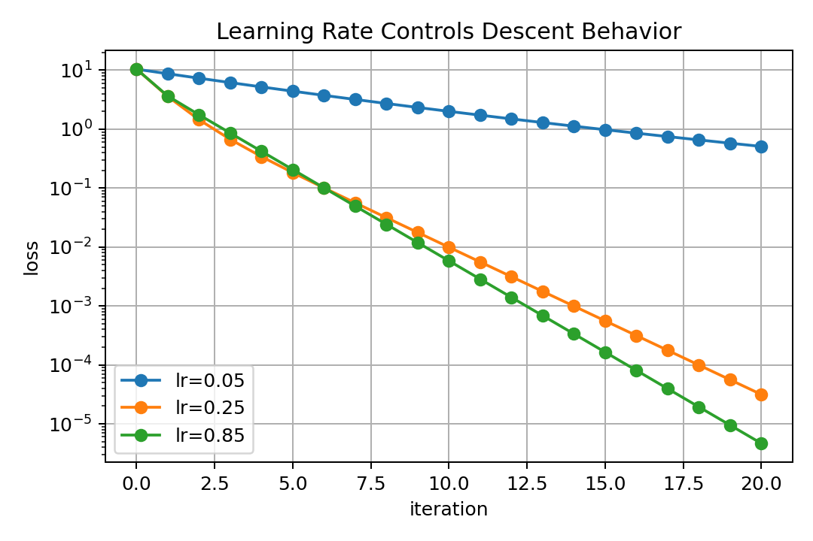
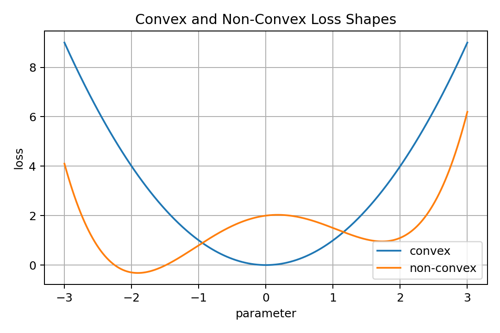
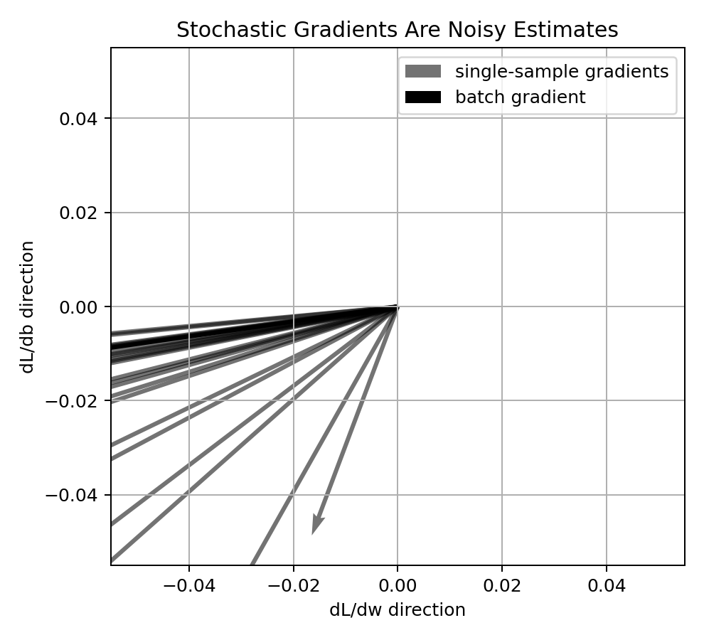
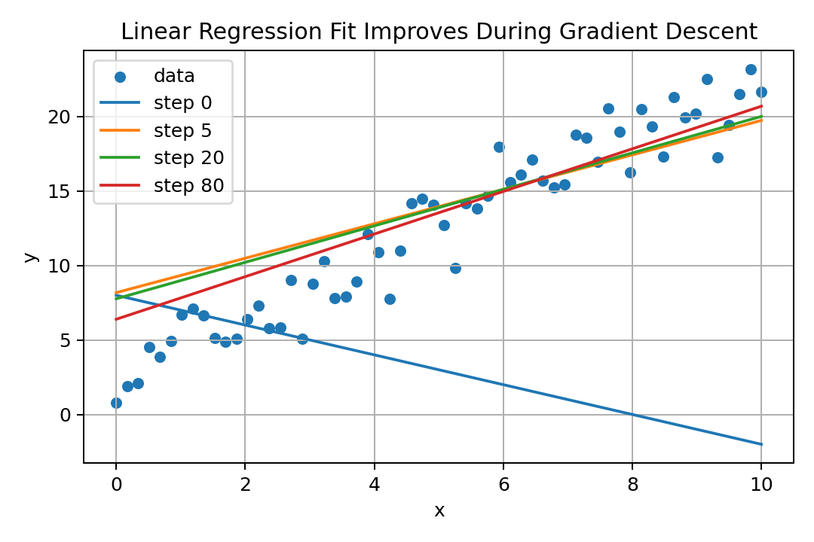
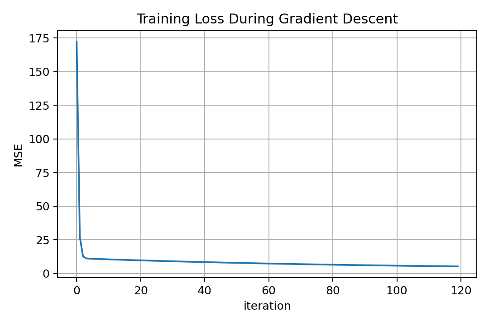

# 06 — Gradients and Gradient Descent for Machine Learning

## Why This Lesson Exists

The previous lesson introduced derivatives. A derivative tells how a function changes when one input changes.

But Machine Learning models usually have many parameters:

```text
weights
biases
embedding values
neural network layer parameters
```

A model may have ten parameters, thousands of parameters, or billions of parameters.

So the question becomes:

```text
How does the loss change with respect to all parameters at once?
```

The answer is the **gradient**.

The gradient is the object that tells a model how to improve.

Gradient descent is the algorithmic idea that uses the gradient to reduce loss.

The central idea of this lesson is:

> The gradient points in the direction of steepest increase, so gradient descent moves in the opposite direction to reduce loss.

This is one of the most important ideas in Machine Learning.

---

## 1. From Derivative to Gradient

For a one-variable function:

$$
f(x)
$$

the derivative is:

$$
\frac{df}{dx}
$$

It tells how $f$ changes when $x$ changes.

For a multi-variable function:

$$
f(\theta_1,\theta_2,\dots,\theta_d)
$$

we need one partial derivative for each variable:

$$
\frac{\partial f}{\partial \theta_1},
\frac{\partial f}{\partial \theta_2},
\dots,
\frac{\partial f}{\partial \theta_d}
$$

The gradient collects all these partial derivatives into a vector:

$$
\nabla_\theta f
=
\begin{bmatrix}
\frac{\partial f}{\partial \theta_1} \\
\frac{\partial f}{\partial \theta_2} \\
\vdots \\
\frac{\partial f}{\partial \theta_d}
\end{bmatrix}
$$

In Machine Learning, the function is usually the loss:

$$
\mathcal{L}(\theta)
$$

So the gradient is:

$$
\nabla_\theta \mathcal{L}(\theta)
$$

This means:

```text
how the loss changes with respect to every parameter
```

---

## 2. What the Gradient Means Geometrically

The gradient is a vector.

At a point in parameter space, it points in the direction where the function increases fastest.

For a loss function:

$$
\mathcal{L}(\theta_1,\theta_2)
$$

the gradient is:

$$
\nabla \mathcal{L}
=
\begin{bmatrix}
\frac{\partial \mathcal{L}}{\partial \theta_1} \\
\frac{\partial \mathcal{L}}{\partial \theta_2}
\end{bmatrix}
$$

Visual intuition:



In the picture, each arrow is a gradient vector.

The arrows point uphill.

If I want to minimize the loss, I should move downhill, which means moving opposite the gradient.

---

## 3. Directional Derivative and Steepest Increase

A directional derivative asks:

```text
How fast does the function change if I move in a particular direction?
```

For a unit direction vector $u$, the directional derivative is:

$$
D_u f(\theta)=\nabla f(\theta)^T u
$$

Using the dot product:

$$
\nabla f(\theta)^T u
=
\|\nabla f(\theta)\|\|u\|\cos(\alpha)
$$

Since $u$ is a unit vector:

$$
D_u f(\theta)=\|\nabla f(\theta)\|\cos(\alpha)
$$

This is maximized when:

$$
u
=
\frac{\nabla f(\theta)}{\|\nabla f(\theta)\|}
$$

So the gradient points in the direction of steepest increase.

The direction of steepest decrease is:

$$
-\nabla f(\theta)
$$

This is the mathematical reason behind gradient descent.

---

## 4. Gradient Descent Update Rule

Gradient descent updates parameters using:

$$
\theta_{\text{new}}
=
\theta_{\text{old}}
-
\alpha
\nabla_\theta \mathcal{L}(\theta_{\text{old}})
$$

where:

```text
theta_old -> current parameters
theta_new -> updated parameters
alpha     -> learning rate
gradient  -> direction of steepest increase of loss
minus sign -> move opposite the gradient
```

The minus sign is essential.

Gradient points uphill.

Gradient descent moves downhill.

Visual intuition:



This is the simplest mathematical story of learning:

```text
predict
measure error
compute gradient
move parameters
repeat
```

---

## 5. Learning Rate

The learning rate $\alpha$ controls step size.

If $\alpha$ is too small:

```text
learning is stable but slow
```

If $\alpha$ is too large:

```text
updates may overshoot
loss may oscillate
training may diverge
```

Visual intuition:



The learning rate is one of the most important hyperparameters in optimization.

It does not decide the direction. The gradient decides direction.

It decides how far to move in that direction.

---

## 6. Loss Landscape

A loss function over parameters can be imagined as a landscape.

For a model with two parameters:

$$
\mathcal{L}(\theta_1,\theta_2)
$$

I can draw contours.

For real models, the parameter space may have thousands or millions of dimensions.

I cannot draw that directly, but the idea remains:

```text
parameters are positions
loss is height
training is movement toward lower height
```

In simple convex problems, there may be one global minimum.

In deep learning, the landscape is usually non-convex and much more complicated.



---

## 7. Convex vs Non-Convex Optimization

A function is convex if the line segment between any two points on the graph lies above the function.

Intuitively:

```text
convex loss -> bowl-like shape
non-convex loss -> multiple valleys, hills, saddle regions
```

Linear regression with MSE is convex in the parameters.

Many neural network losses are non-convex.

Convex problems are easier to analyze because local minima are global minima.

Non-convex problems can have:

```text
local minima
saddle points
flat regions
sharp regions
plateaus
```

Still, gradient-based methods work surprisingly well in deep learning.

---

## 8. Gradient Descent for Linear Regression

Consider simple linear regression:

$$
\hat{y}_i = wx_i+b
$$

The MSE loss is:

$$
\mathcal{L}(w,b)
=
\frac{1}{n}
\sum_{i=1}^{n}
(y_i-\hat{y}_i)^2
$$

Substitute the prediction:

$$
\mathcal{L}(w,b)
=
\frac{1}{n}
\sum_{i=1}^{n}
(y_i-(wx_i+b))^2
$$

The gradients are:

$$
\frac{\partial \mathcal{L}}{\partial w}
=
-\frac{2}{n}
\sum_{i=1}^{n}
x_i(y_i-\hat{y}_i)
$$

and:

$$
\frac{\partial \mathcal{L}}{\partial b}
=
-\frac{2}{n}
\sum_{i=1}^{n}
(y_i-\hat{y}_i)
$$

The updates are:

$$
w_{\text{new}}
=
w_{\text{old}}
-
\alpha
\frac{\partial \mathcal{L}}{\partial w}
$$

$$
b_{\text{new}}
=
b_{\text{old}}
-
\alpha
\frac{\partial \mathcal{L}}{\partial b}
$$

This is linear regression training from scratch.

---

## 9. Vectorized Gradient for Linear Regression

For multiple features:

$$
\hat{y}=Xw+b\mathbf{1}
$$

where:

```text
X -> n x d feature matrix
w -> d-dimensional weight vector
b -> scalar bias
```

The MSE loss is:

$$
\mathcal{L}(w,b)
=
\frac{1}{n}
\|y-(Xw+b\mathbf{1})\|_2^2
$$

Let:

$$
e=y-\hat{y}
$$

Then:

$$
\nabla_w \mathcal{L}
=
-\frac{2}{n}X^Te
$$

and:

$$
\frac{\partial \mathcal{L}}{\partial b}
=
-\frac{2}{n}\sum_{i=1}^{n}e_i
$$

This is the matrix form of the same gradient.

The shape logic is important:

```text
X      -> n x d
e      -> n
X.T    -> d x n
X.T e  -> d
```

So the gradient with respect to $w$ has the same shape as $w$.

That is exactly what we need for the update.

---

## 10. Batch Gradient Descent

Batch gradient descent computes the gradient using the entire training dataset.

For each update, it uses all $n$ samples:

$$
\nabla \mathcal{L}
=
\frac{1}{n}
\sum_{i=1}^{n}
\nabla \ell_i
$$

Advantages:

```text
stable gradient estimate
smooth loss decrease
good for small or medium datasets
```

Disadvantages:

```text
can be slow for huge datasets
one update requires all data
```

---

## 11. Stochastic Gradient Descent

Stochastic Gradient Descent, or SGD, uses one sample at a time.

Instead of the full gradient:

$$
\nabla \mathcal{L}
$$

it uses an estimate from one example:

$$
\nabla \ell_i
$$

This estimate is noisy.

Visual intuition:



The noisy updates can make the loss jump around, but they can also help escape some flat or difficult regions.

SGD is important because it scales to large datasets.

---

## 12. Mini-Batch Gradient Descent

Mini-batch gradient descent uses a small batch of samples.

For a mini-batch $B$:

$$
\nabla \mathcal{L}_B
=
\frac{1}{|B|}
\sum_{i \in B}
\nabla \ell_i
$$

This is a compromise between batch GD and SGD.

It is the standard method in deep learning.

Mini-batches are useful because they:

```text
estimate gradients efficiently
use vectorized computation
fit well on GPUs
add useful noise
scale to large datasets
```

When people say “SGD” in deep learning, they often mean mini-batch SGD.

---

## 13. Training Linear Regression with Gradient Descent

Gradient descent gradually improves the line.



At the beginning, the line may be bad.

After several updates, it moves closer to the data.

The loss decreases:



This is the first real example of learning as parameter movement.

---

## 14. Why Scaling Matters for Gradient Descent

Feature scaling affects gradients.

For linear regression:

$$
\nabla_w \mathcal{L}
=
-\frac{2}{n}X^Te
$$

If one feature has very large values, its column in $X$ can dominate the gradient.

That can cause:

```text
unstable updates
slow convergence
zig-zag paths
learning rate sensitivity
```

Standardization often helps:

$$
z=\frac{x-\mu}{\sigma}
$$

This makes features comparable in scale.

Scaling is not only important for KNN. It is also important for gradient-based optimization.

---

## 15. Stopping Criteria

Gradient descent cannot run forever.

Common stopping criteria:

```text
maximum number of iterations
loss stops improving
gradient norm becomes very small
validation loss starts getting worse
parameter updates become tiny
```

A common mathematical condition is:

$$
\|\nabla_\theta \mathcal{L}(\theta)\| < \epsilon
$$

This means the gradient is small.

But in deep learning, a small gradient does not always mean perfect solution. It can also indicate flat regions or vanishing gradients.

---

## 16. Gradient Norm

The gradient norm measures the size of the gradient vector:

$$
\|\nabla_\theta \mathcal{L}\|_2
$$

Large gradient norm:

```text
parameters may change strongly
```

Small gradient norm:

```text
parameters may change weakly
```

In deep learning, gradient norm is used to diagnose:

```text
exploding gradients
vanishing gradients
training instability
```

Gradient clipping controls very large gradients by rescaling them.

---

## 17. Momentum Preview

Basic gradient descent uses only the current gradient.

Momentum also uses past update direction.

A simple momentum idea:

$$
v_t=\beta v_{t-1}+(1-\beta)\nabla_\theta \mathcal{L}(\theta_t)
$$

Then:

$$
\theta_{t+1}=\theta_t-\alpha v_t
$$

Momentum can help smooth noisy updates and speed movement through consistent directions.

This idea will appear again in optimizers like SGD with momentum and Adam.

---

## 18. Adam Preview

Adam is a popular optimizer in deep learning.

It adapts learning rates using estimates of first and second moments of gradients.

At a high level, Adam tracks:

```text
average gradient direction
average squared gradient magnitude
```

Adam is widely used because it often works well with less manual tuning than plain SGD.

But Adam is not magic. Understanding basic gradient descent first is necessary.

---

## 19. Common Mistakes

### Mistake 1: Moving with the gradient instead of against it

The gradient points uphill. For minimization, move in the negative gradient direction.

### Mistake 2: Learning rate too large

Too large a learning rate can make training diverge.

### Mistake 3: Learning rate too small

Too small a learning rate can make training painfully slow.

### Mistake 4: Ignoring feature scaling

Poor scaling can make optimization unstable or slow.

### Mistake 5: Thinking lower training loss always means better model

Training loss can decrease while validation performance gets worse.

This is overfitting.

### Mistake 6: Forgetting that SGD gradients are noisy

Mini-batch loss may fluctuate. That does not always mean training is failing.

---

## 20. Code: Gradient Descent for Linear Regression

```python
import numpy as np

x = np.array([1, 2, 3, 4], dtype=float)
y = np.array([3, 5, 7, 9], dtype=float)

w = 0.0
b = 0.0
learning_rate = 0.01

for step in range(1000):
    y_hat = w * x + b
    errors = y - y_hat

    dL_dw = -(2 / len(x)) * np.sum(x * errors)
    dL_db = -(2 / len(x)) * np.sum(errors)

    w = w - learning_rate * dL_dw
    b = b - learning_rate * dL_db

print(w, b)
```

The expected relationship is approximately:

$$
y=2x+1
$$

So after training, $w$ should move near 2 and $b$ near 1.

---

## 21. Code: Vectorized Multi-Feature Gradient

```python
def predict(X, w, b):
    return X @ w + b

def mse(y_true, y_pred):
    return np.mean((y_true - y_pred) ** 2)

def gradients(X, y, w, b):
    n = X.shape[0]
    y_pred = predict(X, w, b)
    errors = y - y_pred

    dL_dw = -(2 / n) * (X.T @ errors)
    dL_db = -(2 / n) * np.sum(errors)

    return dL_dw, dL_db
```

This function is the vectorized version of the gradient formulas.

---

## 22. What I Learned From This Lesson

A derivative generalizes to a gradient when there are many parameters.

The gradient points in the direction of steepest increase.

Gradient descent moves in the negative gradient direction.

The learning rate controls step size.

Batch, stochastic, and mini-batch gradient descent differ in how much data they use to estimate the gradient.

The central idea is:

```text
Learning is parameter movement guided by gradients.
```

---

## Mini Exercise

Create a file called `06-gradients-and-gradient-descent.py` inside the `code` folder.

Write code that:

```text
1. creates a small linear regression dataset
2. initializes w and b
3. computes predictions
4. computes MSE
5. computes dL/dw and dL/db
6. updates w and b
7. repeats for many iterations
8. prints loss every 100 steps
9. compares different learning rates
10. implements vectorized gradient descent for multiple features
```

Then answer:

```text
Why does gradient descent subtract the gradient?
What happens if learning rate is too large?
What happens if learning rate is too small?
Why does feature scaling help gradient descent?
What is the difference between batch GD, SGD, and mini-batch GD?
```

---

## Further Reading and Resources

### Books

- [Mathematics for Machine Learning by Deisenroth, Faisal, and Ong](https://mml-book.github.io/)
- [Deep Learning Book by Goodfellow, Bengio, and Courville](https://www.deeplearningbook.org/)
- [Linear Algebra and Learning from Data by Gilbert Strang](https://math.mit.edu/~gs/learningfromdata/)
- [An Introduction to Statistical Learning](https://www.statlearning.com/)

### Visual Learning

- [3Blue1Brown: Gradient Descent](https://www.3blue1brown.com/lessons/gradient-descent)
- [3Blue1Brown: Backpropagation](https://www.3blue1brown.com/topics/neural-networks)
- [StatQuest: Gradient Descent](https://www.youtube.com/@statquest)

### ML Connections

- [Google Machine Learning Crash Course: Gradient Descent](https://developers.google.com/machine-learning/crash-course/linear-regression/gradient-descent)
- [PyTorch Autograd Tutorial](https://pytorch.org/tutorials/beginner/basics/autogradqs_tutorial.html)
- [Scikit-learn SGDRegressor](https://scikit-learn.org/stable/modules/generated/sklearn.linear_model.SGDRegressor.html)

### What to Study Next

The next math lesson should be:

```text
07 — Probability for Machine Learning
```

That lesson will prepare us for Logistic Regression, Naive Bayes, probabilistic thinking, MLE, cross-entropy, and uncertainty.

---

## Final Reflection

Gradient descent is one of the simplest and most powerful ideas in Machine Learning.

It says:

```text
look at how the loss changes
move parameters in the direction that reduces it
repeat
```

This is not magic.

It is calculus turned into an algorithm.
