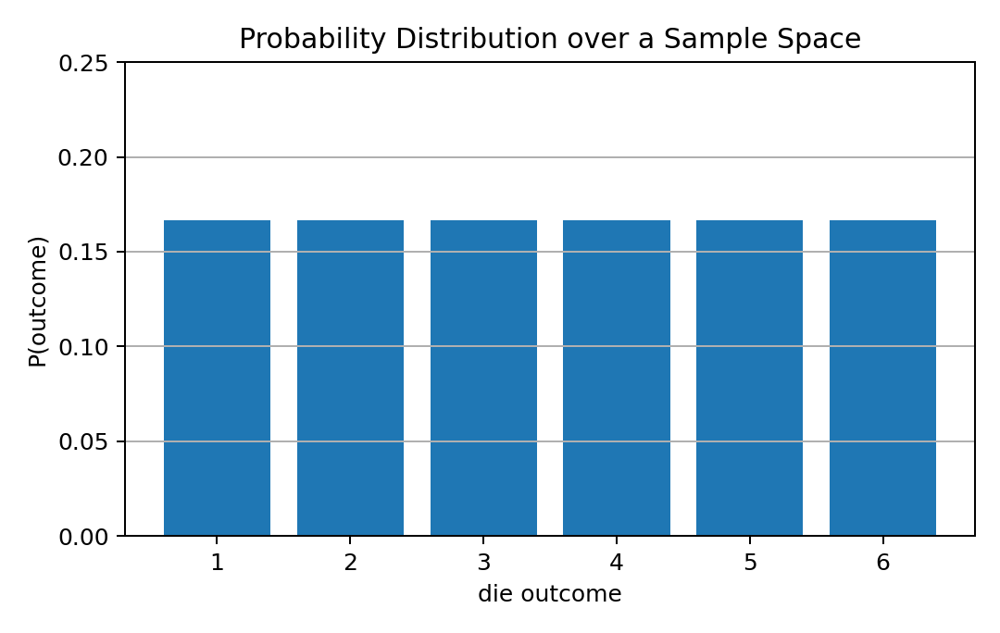
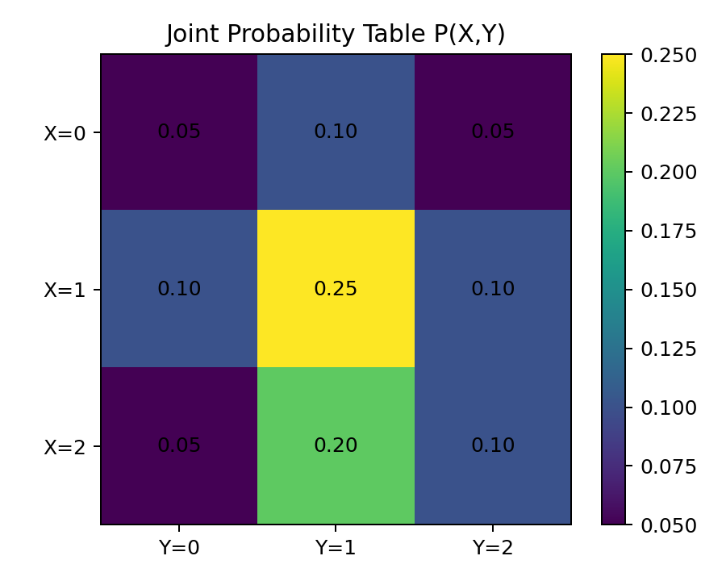
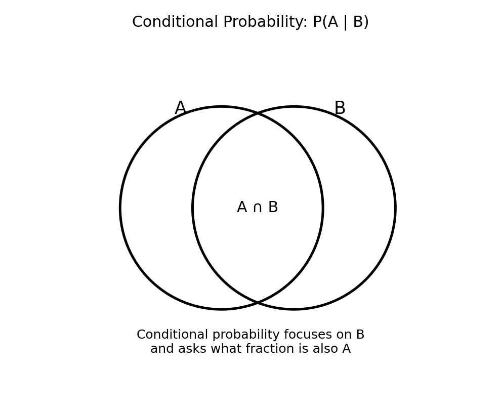
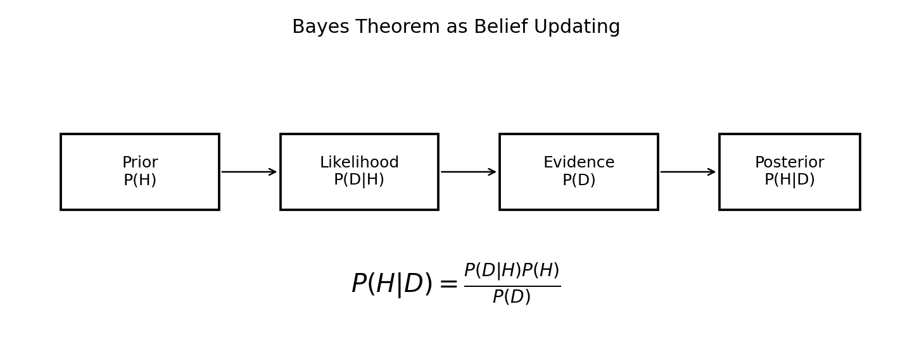
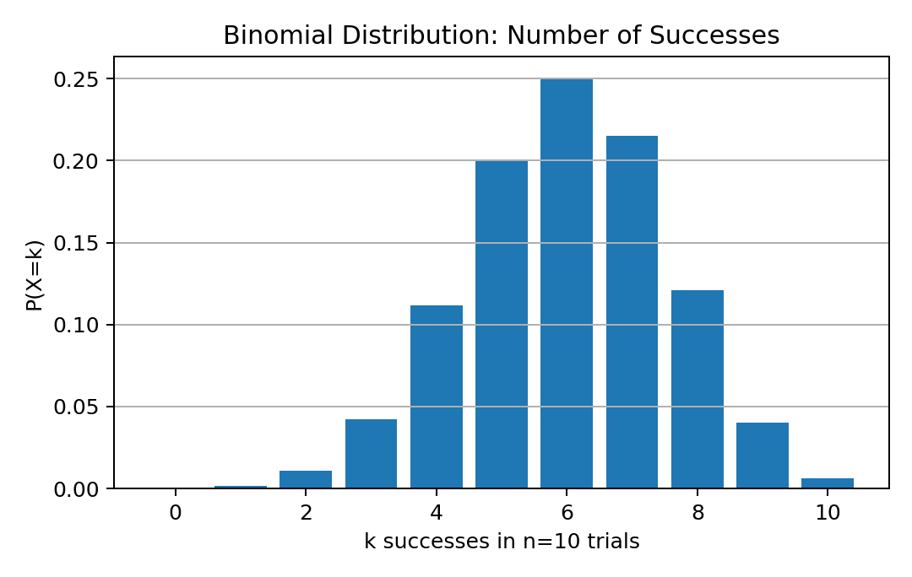
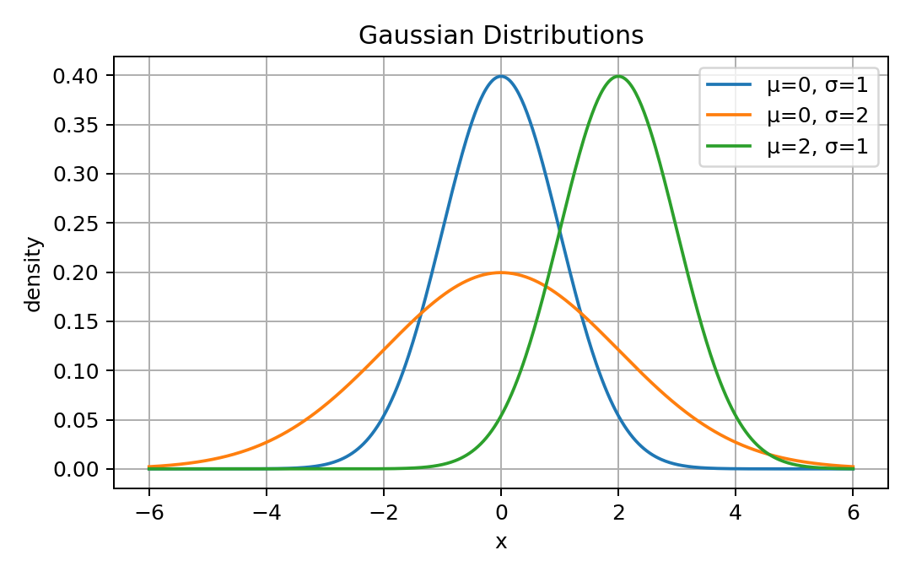
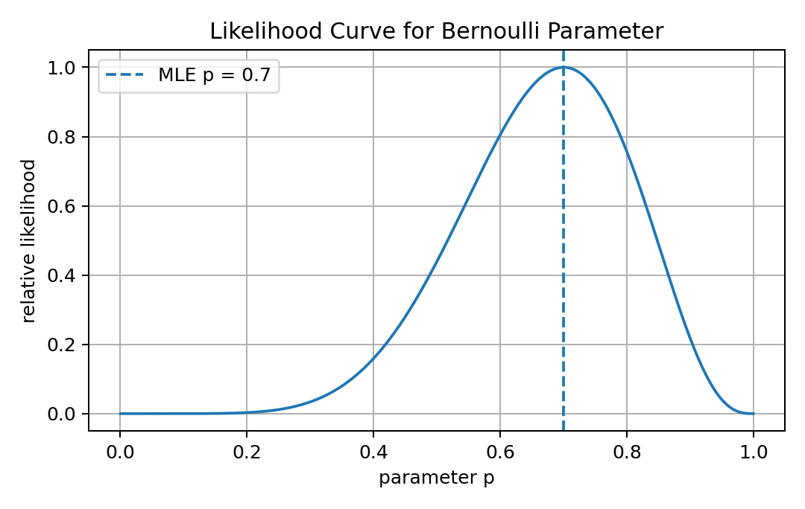
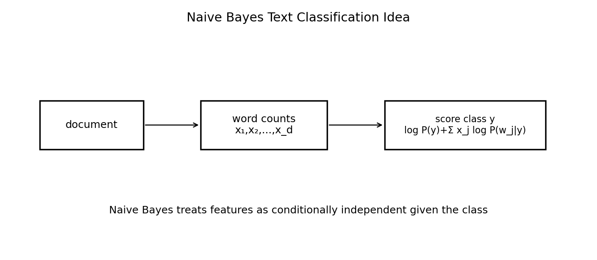
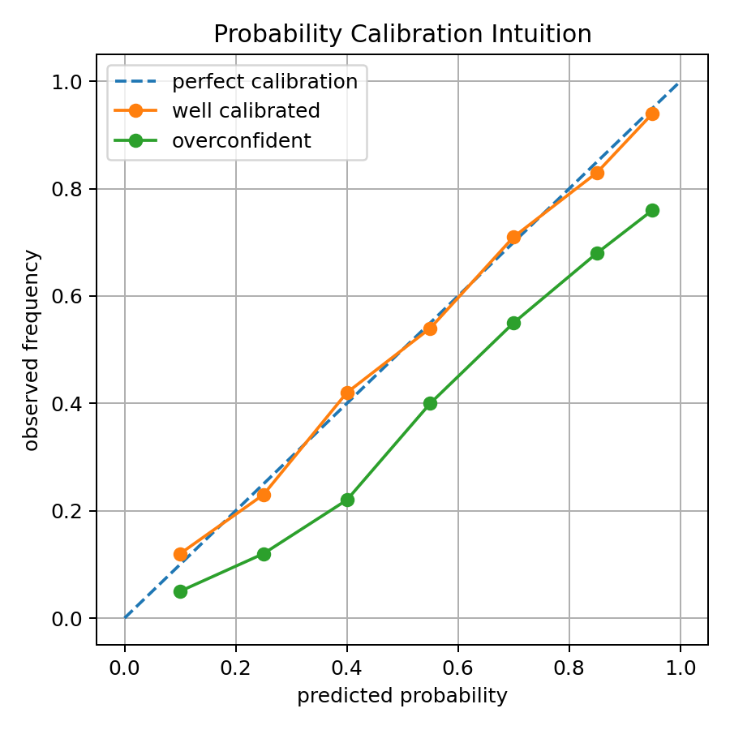

# 07 — Probability for Machine Learning

## Why This Lesson Exists

Machine Learning is not only about finding patterns. It is also about reasoning under uncertainty.

A model rarely knows something with absolute certainty. Instead, it often says:

```text
this class is more likely than that class
this prediction has uncertainty
this document is probably relevant
this word is likely to appear next
this patient may belong to a risk group
this image is probably a cat
```

That language is probability.

Probability is the mathematical framework for uncertainty.

In Machine Learning, probability appears in:

```text
classification probabilities
Naive Bayes
logistic regression
cross-entropy
maximum likelihood estimation
Bayesian thinking
generative models
language models
uncertainty estimation
calibration
```

This lesson is intentionally deep because probability is not just another math topic. It is one of the main languages of modern AI.

The central idea is:

> Probability lets Machine Learning move from hard decisions to uncertain beliefs.

A deterministic model gives an answer.

A probabilistic model gives a belief about possible answers.

---

## 1. Sample Space

A sample space is the set of all possible outcomes of an experiment.

It is usually denoted by:

$$
\Omega
$$

Example: rolling a die.

$$
\Omega = \{1,2,3,4,5,6\}
$$

Each possible outcome is an element of the sample space.

In Machine Learning, the sample space depends on the problem.

For binary classification:

$$
\Omega = \{0,1\}
$$

For image classification with 1000 classes:

$$
\Omega = \{1,2,\dots,1000\}
$$

For language modeling, the next token may come from a vocabulary:

$$
\Omega = \{1,2,\dots,V\}
$$

where $V$ is vocabulary size.

Visual intuition:



Probability assigns numbers to outcomes or events in this space.

---

## 2. Events

An event is a subset of the sample space.

If:

$$
\Omega = \{1,2,3,4,5,6\}
$$

then the event “roll an even number” is:

$$
A = \{2,4,6\}
$$

The event “roll a number greater than 4” is:

$$
B = \{5,6\}
$$

Probability assigns a number to events:

$$
P(A)
$$

For a fair die:

$$
P(A)=\frac{3}{6}=\frac{1}{2}
$$

In ML, an event can be:

```text
the email is spam
the image class is cat
the next token is "energy"
the model prediction is correct
the residual is larger than a threshold
```

Probability gives a formal way to discuss these events.

---

## 3. Probability Axioms

Probability must satisfy three axioms.

### Axiom 1: Non-negativity

For any event $A$:

$$
P(A)\geq 0
$$

Probability cannot be negative.

### Axiom 2: Normalization

The probability of the entire sample space is:

$$
P(\Omega)=1
$$

Something in the sample space must happen.

### Axiom 3: Additivity

If two events $A$ and $B$ are disjoint, meaning:

$$
A\cap B=\emptyset
$$

then:

$$
P(A\cup B)=P(A)+P(B)
$$

These axioms seem simple, but they support everything else: conditional probability, Bayes theorem, expectation, likelihood, and probabilistic modeling.

---

## 4. Probability Distribution

A probability distribution assigns probabilities to possible outcomes.

For a discrete random variable $X$, the probability mass function is:

$$
p(x)=P(X=x)
$$

It must satisfy:

$$
p(x)\geq 0
$$

and:

$$
\sum_x p(x)=1
$$

Example: fair die.

$$
P(X=k)=\frac{1}{6}
$$

for:

$$
k\in\{1,2,3,4,5,6\}
$$

In ML classification, a model may output a distribution over classes:

$$
P(y=1\mid x)=0.8
$$

$$
P(y=0\mid x)=0.2
$$

This is not just a class label. It is a belief distribution.

---

## 5. Random Variables

A random variable maps outcomes to numbers.

Formally:

$$
X:\Omega\to\mathbb{R}
$$

Example: coin toss.

Let:

```text
Heads -> 1
Tails -> 0
```

Then $X$ is a random variable.

In ML, random variables can represent:

```text
input X
target Y
prediction Ŷ
noise ε
model parameter Θ
next token T
class label Y
```

The notation can be confusing because $X$ often means both a random variable and a feature matrix, depending on context.

A useful distinction:

```text
X uppercase -> random variable or dataset matrix depending on context
x lowercase -> one observed value / one input vector
```

In probability theory, $X$ is random before observation. Once observed, it takes a value $x$.

---

## 6. Discrete vs Continuous Random Variables

A discrete random variable has countable outcomes.

Examples:

```text
class label
coin toss
number of clicks
number of defects
word index
```

A continuous random variable takes values in a continuum.

Examples:

```text
height
temperature
time
sensor reading
seismic amplitude
model residual
```

For discrete variables, we use probabilities:

$$
P(X=x)
$$

For continuous variables, exact point probabilities are usually zero:

$$
P(X=x)=0
$$

Instead, we use a probability density function:

$$
p(x)
$$

and probabilities over intervals:

$$
P(a\leq X\leq b)=\int_a^b p(x)\,dx
$$

This distinction matters when studying Gaussian distributions, likelihoods, and regression noise.

---

## 7. Probability Mass Function, Density Function, and CDF

For discrete variables, the probability mass function is:

$$
p(x)=P(X=x)
$$

For continuous variables, the probability density function is:

$$
p(x)
$$

but $p(x)$ is not itself a probability. Probability comes from integrating density over an interval.

The cumulative distribution function is:

$$
F(x)=P(X\leq x)
$$

For continuous variables:

$$
F(x)=\int_{-\infty}^{x}p(t)\,dt
$$

The CDF is useful because it works for both discrete and continuous random variables.

In ML, PDFs appear in Gaussian assumptions, generative models, density estimation, and likelihood.

---

## 8. Expectation

Expectation is the long-run average value of a random variable.

For a discrete random variable:

$$
\mathbb{E}[X]=\sum_x xP(X=x)
$$

For a continuous random variable:

$$
\mathbb{E}[X]=\int x p(x)\,dx
$$

Example: fair die.

$$
\mathbb{E}[X]
=
1\cdot\frac16+
2\cdot\frac16+
3\cdot\frac16+
4\cdot\frac16+
5\cdot\frac16+
6\cdot\frac16
=
3.5
$$

Expectation does not have to be an outcome. A die never rolls 3.5, but the expected value is 3.5.

In Machine Learning, many losses are expectations.

For example, expected risk:

$$
R(f)=\mathbb{E}_{(X,Y)}[\ell(Y,f(X))]
$$

The empirical training loss approximates this expectation using data.

---

## 9. Variance

Variance measures spread around the expectation.

Definition:

$$
\mathrm{Var}(X)=\mathbb{E}[(X-\mathbb{E}[X])^2]
$$

Equivalent formula:

$$
\mathrm{Var}(X)=\mathbb{E}[X^2]-(\mathbb{E}[X])^2
$$

Standard deviation is:

$$
\sigma=\sqrt{\mathrm{Var}(X)}
$$

In ML, variance appears in:

```text
data spread
noise
bias-variance tradeoff
uncertainty
normal distribution
standardization
confidence intervals
```

Standardization uses mean and standard deviation:

$$
z=\frac{x-\mu}{\sigma}
$$

So probability connects directly to preprocessing.

---

## 10. Joint Probability

Joint probability describes the probability of two events happening together.

For random variables $X$ and $Y$:

$$
P(X=x,Y=y)
$$

This is often written as:

$$
P(x,y)
$$

Visual example:



A joint distribution contains information about how variables behave together.

In ML, joint distributions appear in generative modeling:

$$
P(x,y)
$$

A generative classifier models how data and labels are generated together.

Naive Bayes is a generative model because it models:

$$
P(x\mid y)P(y)
$$

which relates to the joint distribution:

$$
P(x,y)=P(x\mid y)P(y)
$$

---

## 11. Marginal Probability

Marginal probability is obtained by summing or integrating out other variables.

For discrete variables:

$$
P(X=x)=\sum_y P(X=x,Y=y)
$$

This is called marginalization.

If I have a joint table for $X$ and $Y$, I can get the probability of $X$ alone by summing over all values of $Y$.

In ML, marginalization appears in:

```text
Bayes theorem
latent variable models
mixture models
generative AI
hidden Markov models
probabilistic graphical models
```

The idea is simple but powerful:

```text
if I do not care about one variable, sum over its possibilities
```

---

## 12. Conditional Probability

Conditional probability asks:

```text
What is the probability of A if B is known to have happened?
```

It is defined as:

$$
P(A\mid B)=\frac{P(A\cap B)}{P(B)}
$$

provided:

$$
P(B)>0
$$

Visual intuition:



The denominator $P(B)$ means the universe has changed.

Instead of looking at the whole sample space, I now look only inside event $B$.

In ML, conditional probability is everywhere:

$$
P(y\mid x)
$$

This means:

```text
probability of label y given input x
```

A classifier often tries to estimate:

$$
P(Y=c\mid X=x)
$$

for each class $c$.

---

## 13. Product Rule

From the definition of conditional probability:

$$
P(A\mid B)=\frac{P(A\cap B)}{P(B)}
$$

we get:

$$
P(A\cap B)=P(A\mid B)P(B)
$$

Also:

$$
P(A\cap B)=P(B\mid A)P(A)
$$

So:

$$
P(A\mid B)P(B)=P(B\mid A)P(A)
$$

This identity leads directly to Bayes theorem.

For random variables:

$$
P(x,y)=P(y\mid x)P(x)=P(x\mid y)P(y)
$$

This is one of the most important formulas in probabilistic ML.

---

## 14. Independence

Two events $A$ and $B$ are independent if knowing one does not change the probability of the other.

Formally:

$$
P(A\mid B)=P(A)
$$

Equivalent condition:

$$
P(A\cap B)=P(A)P(B)
$$

For random variables:

$$
P(X,Y)=P(X)P(Y)
$$

Independence is a strong assumption.

In ML, assumptions of independence can simplify difficult probability models.

Naive Bayes makes a conditional independence assumption:

$$
P(x_1,x_2,\dots,x_d\mid y)
=
\prod_{j=1}^{d}P(x_j\mid y)
$$

This assumption is often false in reality, but the model can still work surprisingly well.

---

## 15. Conditional Independence

Conditional independence means two variables are independent after conditioning on a third variable.

We write:

$$
X \perp Z \mid Y
$$

This means:

```text
X and Z are independent given Y
```

Formally:

$$
P(X,Z\mid Y)=P(X\mid Y)P(Z\mid Y)
$$

This is the key assumption behind Naive Bayes.

For text classification, Naive Bayes assumes words are conditionally independent given the class.

Example:

```text
given class = sports,
the presence of "goal" and "team" are treated as independent
```

This is not perfectly true, but it makes estimation simple.

---

## 16. Law of Total Probability

If events $B_1,B_2,\dots,B_k$ form a partition of the sample space, then:

$$
P(A)=\sum_{i=1}^{k}P(A\mid B_i)P(B_i)
$$

For class labels:

$$
P(x)=\sum_y P(x\mid y)P(y)
$$

This denominator appears in Bayes theorem.

In ML, total probability often appears when summing over possible hidden classes, latent variables, or hypotheses.

---

## 17. Bayes Theorem

Bayes theorem says:

$$
P(H\mid D)=\frac{P(D\mid H)P(H)}{P(D)}
$$

where:

```text
H -> hypothesis
D -> data
P(H) -> prior
P(D|H) -> likelihood
P(D) -> evidence
P(H|D) -> posterior
```

Visual intuition:



Bayes theorem is belief updating.

Before seeing data, I have a prior belief.

After seeing data, I update that belief into a posterior.

In ML notation:

$$
P(y\mid x)=\frac{P(x\mid y)P(y)}{P(x)}
$$

This is the foundation of Naive Bayes classifiers.

---

## 18. Prior, Likelihood, Evidence, Posterior

These four words are essential.

### Prior

$$
P(H)
$$

What I believe before seeing the data.

### Likelihood

$$
P(D\mid H)
$$

How likely the observed data is if the hypothesis is true.

### Evidence

$$
P(D)
$$

The total probability of the data under all hypotheses.

### Posterior

$$
P(H\mid D)
$$

What I believe after seeing the data.

A compact summary:

```text
posterior ∝ likelihood × prior
```

The evidence normalizes probabilities so that they sum to 1.

---

## 19. Bayes Classifier

For classification, Bayes theorem gives:

$$
P(y\mid x)=\frac{P(x\mid y)P(y)}{P(x)}
$$

To choose the most likely class:

$$
\hat{y}=\arg\max_y P(y\mid x)
$$

Since $P(x)$ is the same for all classes, we can use:

$$
\hat{y}=\arg\max_y P(x\mid y)P(y)
$$

This is the Bayes classifier idea.

It says:

```text
choose the class that best explains the input and is plausible beforehand
```

---

## 20. Bernoulli Distribution

A Bernoulli random variable represents one binary trial.

It has parameter $p$:

$$
X\sim\mathrm{Bernoulli}(p)
$$

where:

$$
P(X=1)=p
$$

and:

$$
P(X=0)=1-p
$$

The PMF is:

$$
P(X=x)=p^x(1-p)^{1-x}
$$

for:

$$
x\in\{0,1\}
$$

In ML, Bernoulli appears in binary classification and binary features.

A spam classifier may model:

```text
word appears = 1
word does not appear = 0
```

---

## 21. Binomial Distribution

A Binomial random variable counts successes in $n$ independent Bernoulli trials.

$$
X\sim\mathrm{Binomial}(n,p)
$$

The PMF is:

$$
P(X=k)=\binom{n}{k}p^k(1-p)^{n-k}
$$

Visual example:



In ML, Binomial thinking appears when counting successes, accuracy over repeated trials, or modeling binary outcomes.

---

## 22. Categorical Distribution

A categorical distribution generalizes Bernoulli to multiple classes.

If there are $K$ classes:

$$
P(Y=k)=p_k
$$

where:

$$
\sum_{k=1}^{K}p_k=1
$$

A classifier with softmax outputs a categorical distribution over classes.

Example:

```text
cat: 0.70
dog: 0.20
bird: 0.10
```

The model prediction is often:

$$
\hat{y}=\arg\max_k p_k
$$

But the full probability vector contains more information than only the argmax label.

---

## 23. Gaussian Distribution

The Gaussian or normal distribution is one of the most important continuous distributions.

It is written:

$$
X\sim\mathcal{N}(\mu,\sigma^2)
$$

Its density is:

$$
p(x)=
\frac{1}{\sqrt{2\pi\sigma^2}}
\exp\left(
-\frac{(x-\mu)^2}{2\sigma^2}
\right)
$$

Visual examples:



Parameters:

```text
mu -> mean / center
sigma^2 -> variance / spread
```

In ML, Gaussian assumptions appear in:

```text
linear regression noise
Gaussian Naive Bayes
PCA
Kalman filters
Gaussian mixture models
Bayesian models
```

A classic result: if regression errors are Gaussian, minimizing MSE is connected to maximum likelihood estimation.

---

## 24. Likelihood

Likelihood is one of the most important concepts in ML.

Probability treats parameters as fixed and data as random.

Likelihood treats observed data as fixed and parameters as variable.

If the model has parameter $\theta$, likelihood is:

$$
L(\theta)=P(D\mid \theta)
$$

For independent data points:

$$
P(D\mid \theta)=\prod_{i=1}^{n}P(x_i\mid \theta)
$$

The goal of Maximum Likelihood Estimation is:

$$
\theta^*=\arg\max_\theta P(D\mid \theta)
$$

This asks:

```text
which parameter makes the observed data most likely?
```

Visual example for Bernoulli likelihood:



---

## 25. Log-Likelihood

Products of many probabilities can become very small.

So we often use log-likelihood:

$$
\log L(\theta)=\log P(D\mid \theta)
$$

If data points are independent:

$$
\log P(D\mid \theta)
=
\sum_{i=1}^{n}\log P(x_i\mid \theta)
$$

This is one reason logs are everywhere in ML.

They convert products into sums.

Instead of maximizing likelihood, we often minimize negative log-likelihood:

$$
-\log P(D\mid \theta)
$$

Cross-entropy loss is closely related to negative log-likelihood.

---

## 26. MLE for Bernoulli

Suppose I flip a coin $n$ times and observe $k$ heads.

The likelihood is:

$$
L(p)=p^k(1-p)^{n-k}
$$

The MLE is:

$$
p^*=\frac{k}{n}
$$

If I observe 7 heads in 10 flips:

$$
p^*=0.7
$$

This is intuitive: the best estimate of probability is the observed frequency.

This idea generalizes: MLE often chooses parameters that match observed data patterns.

---

## 27. Probability in Logistic Regression

Logistic regression models:

$$
P(y=1\mid x)
$$

It first computes a linear score:

$$
z=w^Tx+b
$$

Then passes it through the sigmoid function:

$$
\sigma(z)=\frac{1}{1+e^{-z}}
$$

So:

$$
P(y=1\mid x)=\sigma(w^Tx+b)
$$

This means logistic regression is not just a linear classifier. It is a probabilistic classifier.

It outputs a probability, not only a class label.

The class prediction can be:

$$
\hat{y}=
\begin{cases}
1, & P(y=1\mid x)\geq 0.5 \\
0, & P(y=1\mid x)<0.5
\end{cases}
$$

---

## 28. Probability in Naive Bayes

Naive Bayes uses Bayes theorem:

$$
P(y\mid x)=\frac{P(x\mid y)P(y)}{P(x)}
$$

For classification:

$$
\hat{y}=\arg\max_y P(x\mid y)P(y)
$$

The naive assumption is:

$$
P(x_1,x_2,\dots,x_d\mid y)
=
\prod_{j=1}^{d}P(x_j\mid y)
$$

For text classification, this becomes:

$$
\mathrm{score}(y)=\log P(y)+\sum_{j=1}^{d}x_j\log P(w_j\mid y)
$$

Visual intuition:



This is why probability is directly connected to ML algorithms.

---

## 29. Calibration

A probabilistic classifier should not only be accurate. Its probabilities should also mean something.

If a model says:

```text
70% probability
```

then among many predictions with confidence 70%, about 70% should be correct.

This is calibration.

Visual intuition:



A model can be accurate but poorly calibrated.

This matters in high-stakes systems where probability confidence affects decisions.

---

## 30. Uncertainty

Probability gives language for uncertainty.

There are different types of uncertainty.

### Aleatoric uncertainty

This is uncertainty from noise in the data itself.

Example:

```text
sensor noise
random human behavior
measurement error
```

### Epistemic uncertainty

This is uncertainty from lack of knowledge.

Example:

```text
not enough data
model has not seen similar examples
uncertain parameters
```

Deep learning often struggles with uncertainty estimation, which is why Bayesian methods, ensembles, dropout uncertainty, and calibration are important topics.

---

## 31. Generative vs Discriminative Models

A discriminative model directly models:

$$
P(y\mid x)
$$

Example:

```text
logistic regression
neural network classifier
```

A generative model models:

$$
P(x,y)
$$

or:

$$
P(x\mid y)P(y)
$$

Example:

```text
Naive Bayes
Gaussian mixture models
language models in a broad sense
```

Discriminative question:

```text
given x, what is y?
```

Generative question:

```text
how could x and y have been generated?
```

Both views are useful.

---

## 32. Probability and Language Models

Language models are probability models over token sequences.

A sequence probability can be decomposed using the chain rule:

$$
P(w_1,w_2,\dots,w_T)
=
\prod_{t=1}^{T}
P(w_t\mid w_1,\dots,w_{t-1})
$$

This is the probabilistic foundation of autoregressive language modeling.

The model predicts a distribution over the next token:

$$
P(w_t\mid w_{<t})
$$

So even modern LLMs are deeply connected to probability.

They generate text by repeatedly sampling or selecting from probability distributions.

---

## 33. Code: Basic Probability Calculations

```python
def conditional_probability(p_a_and_b, p_b):
    return p_a_and_b / p_b

def bayes_theorem(prior, likelihood, evidence):
    return likelihood * prior / evidence
```

Example:

```python
prior = 0.01
likelihood = 0.95
false_positive = 0.05

evidence = likelihood * prior + false_positive * (1 - prior)
posterior = bayes_theorem(prior, likelihood, evidence)
```

This is classic Bayesian updating.

---

## 34. Code: Bernoulli Likelihood

```python
def bernoulli_likelihood(p, data):
    likelihood = 1.0

    for x in data:
        likelihood *= p**x * (1-p)**(1-x)

    return likelihood
```

For numerical stability, use log-likelihood:

```python
def bernoulli_log_likelihood(p, data):
    return np.sum(data * np.log(p) + (1-data) * np.log(1-p))
```

This is the beginning of MLE.

---

## 35. Code: Tiny Naive Bayes Classifier

A simple multinomial Naive Bayes score:

```python
score(y)=log P(y)+sum_j count_j log P(word_j|y)
```

This connects probability directly to text classification.

The key idea:

```text
class prior + word likelihoods = class score
```

The highest score wins.

---

## 36. Common Mistakes

### Mistake 1: Confusing probability and likelihood

Probability varies data with fixed parameters.

Likelihood varies parameters with fixed observed data.

### Mistake 2: Forgetting the denominator in Bayes theorem

The evidence $P(D)$ normalizes the posterior.

### Mistake 3: Assuming independence too easily

Independence is a strong assumption.

### Mistake 4: Treating model confidence as truth

A model can output 0.99 and still be wrong.

### Mistake 5: Forgetting calibration

Good accuracy does not guarantee meaningful probabilities.

### Mistake 6: Confusing PDF value with probability

For continuous variables, probability comes from area under the density curve.

### Mistake 7: Multiplying many probabilities directly

This can underflow numerically. Use log probabilities.

---

## 37. What I Learned From This Lesson

Probability is the language of uncertainty.

It lets ML models express beliefs, not only hard decisions.

The most important ideas are:

```text
sample space
events
random variables
distributions
expectation
variance
joint probability
marginal probability
conditional probability
independence
Bayes theorem
likelihood
log-likelihood
MLE
calibration
uncertainty
```

Probability connects directly to:

```text
Naive Bayes
Logistic Regression
Cross-Entropy
MLE
Language Models
RAG
Generative Models
Uncertainty Estimation
```

The central lesson is:

```text
Machine Learning uses probability to learn under uncertainty.
```

---

## Mini Exercise

Create a file called `07-probability-for-machine-learning.py` inside the `code` folder.

Write code that:

```text
1. computes expectation and variance of a discrete distribution
2. computes conditional probability
3. applies Bayes theorem
4. simulates Bernoulli trials
5. computes Bernoulli likelihood and log-likelihood
6. plots or prints a likelihood curve for different p values
7. computes Gaussian PDF values
8. implements a tiny Naive Bayes scoring function
```

Then answer:

```text
What is the difference between P(y|x) and P(x|y)?
Why is Bayes theorem useful for classification?
What is likelihood?
Why do we use log-likelihood?
What does calibration mean?
Why is independence a strong assumption?
```

---

## Further Reading and Resources

### Books

- [Mathematics for Machine Learning by Deisenroth, Faisal, and Ong](https://mml-book.github.io/)
- [Pattern Recognition and Machine Learning by Christopher Bishop](https://link.springer.com/book/9780387310732)
- [The Elements of Statistical Learning](https://hastie.su.domains/ElemStatLearn/)
- [Information Theory, Inference, and Learning Algorithms by David MacKay](https://www.inference.org.uk/mackay/itila/book.html)
- [Think Bayes by Allen Downey](https://greenteapress.com/wp/think-bayes/)

### Visual Learning

- [Seeing Theory: Probability and Statistics](https://seeing-theory.brown.edu/)
- [StatQuest: Probability and Statistics](https://www.youtube.com/@statquest)
- [Khan Academy: Probability and Statistics](https://www.khanacademy.org/math/statistics-probability)

### ML Connections

- [Scikit-learn: Naive Bayes](https://scikit-learn.org/stable/modules/naive_bayes.html)
- [Scikit-learn: Probability Calibration](https://scikit-learn.org/stable/modules/calibration.html)
- [Google Machine Learning Crash Course: Logistic Regression](https://developers.google.com/machine-learning/crash-course/logistic-regression)

### What to Study Next

The next math lesson should be:

```text
08 — Statistics, Distributions, and Sampling
```

That lesson will build on probability and explain sample vs population, estimators, sampling distributions, confidence intuition, normal distribution deeper, and statistical thinking for ML evaluation.

---

## Final Reflection

Probability is not only a topic before Machine Learning.

It is inside Machine Learning.

Every time a model says:

```text
probably
likely
uncertain
confidence
distribution
sample
likelihood
```

it is speaking the language of probability.

If vectors give ML geometry, probability gives ML uncertainty.

Together, they form the mathematical backbone of intelligent systems.
