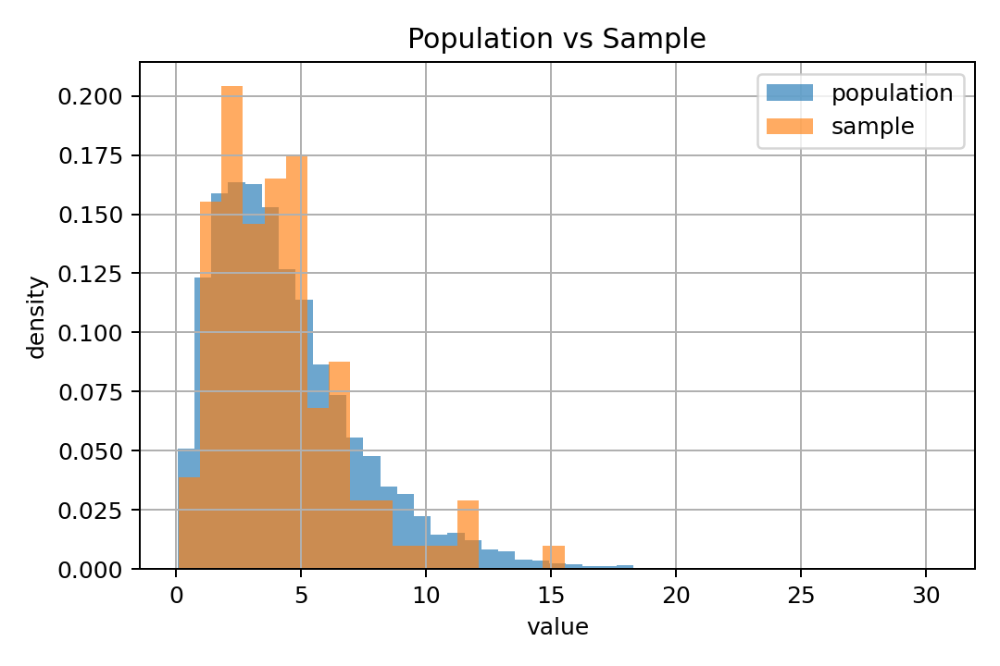
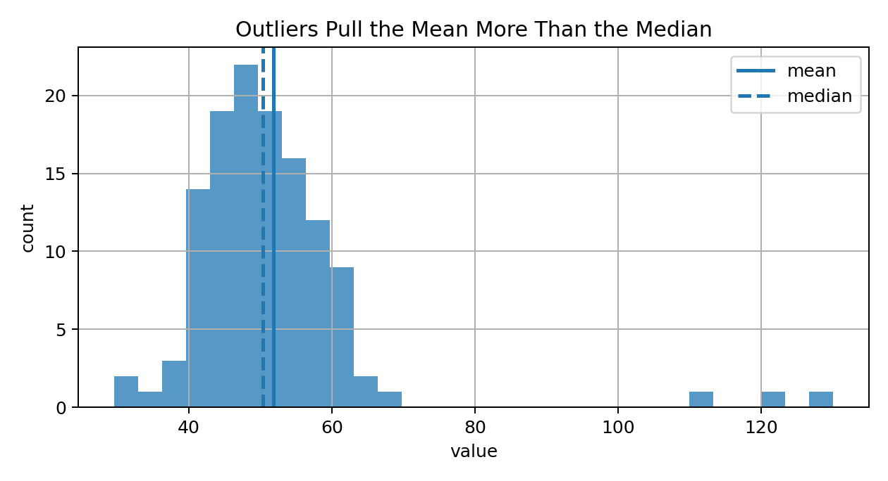
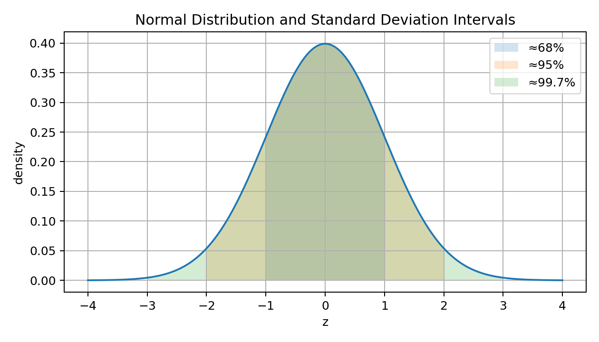
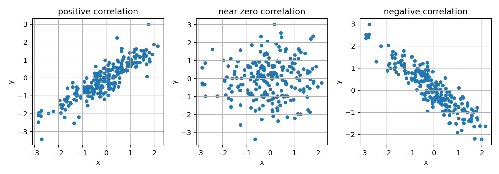
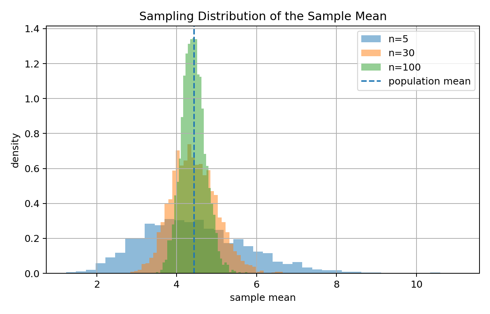
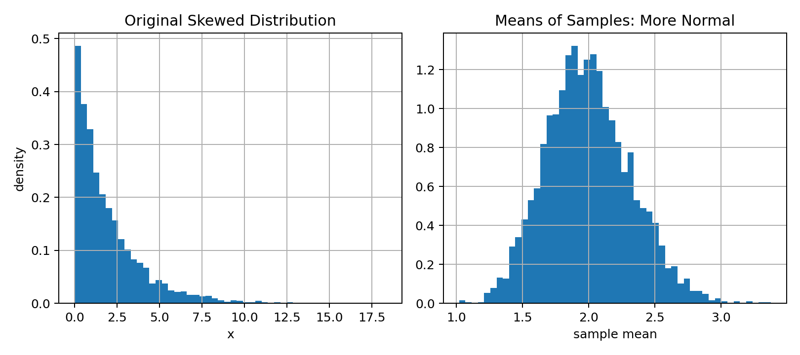
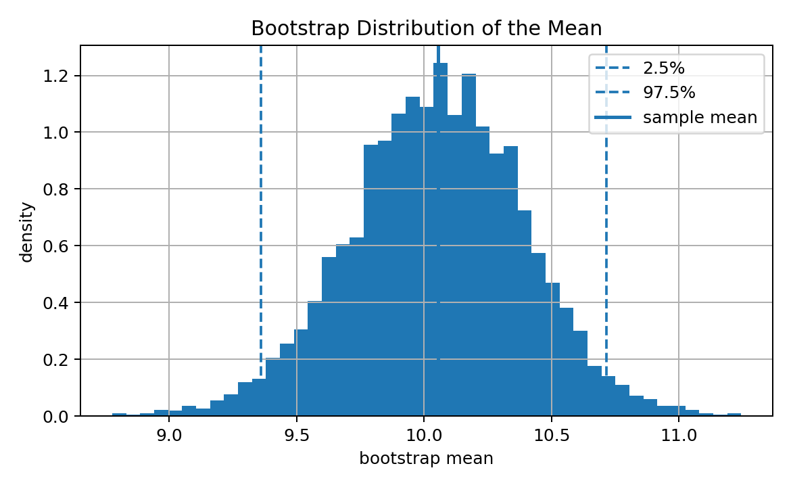
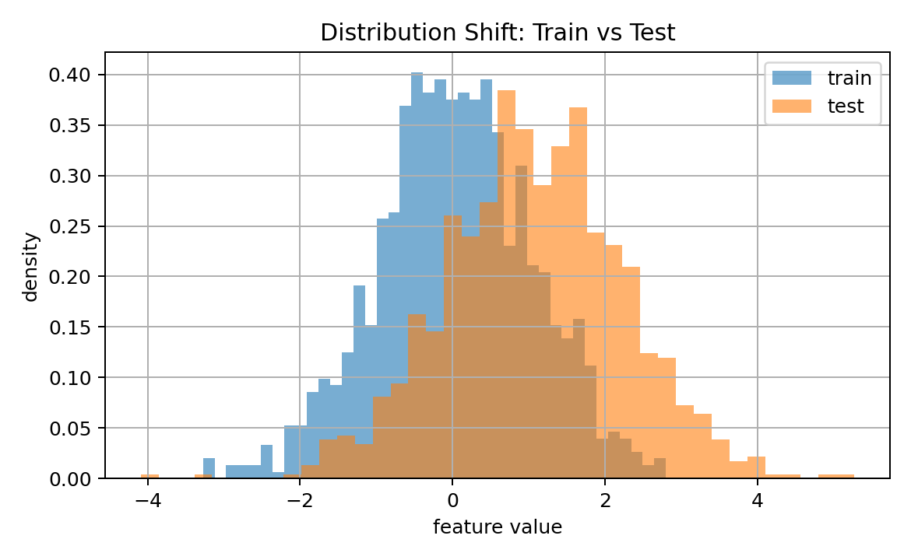
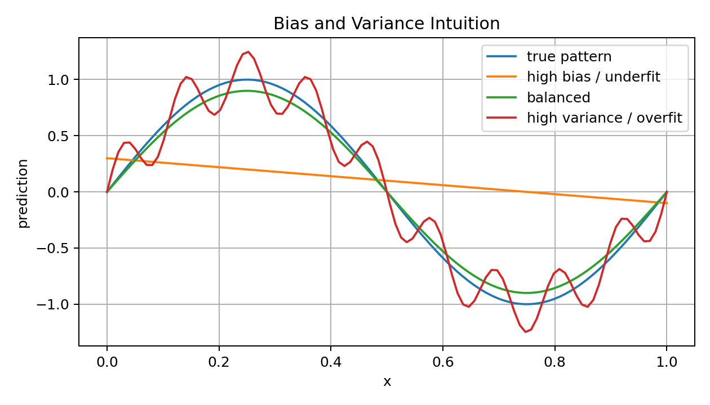

# 08 — Statistics, Distributions, and Sampling for Machine Learning

## Why This Lesson Exists

The previous lesson introduced probability as the language of uncertainty. Probability starts with a theoretical world: random variables, distributions, events, likelihoods, and uncertainty.

Statistics begins when I have data.

In Machine Learning, I rarely know the true distribution that generated the data. I usually have a sample:

```text
a dataset
a training set
a batch
a validation split
a test split
a collection of measurements
```

From that sample, I try to infer something about the larger world.

This is why statistics is essential for ML.

Statistics helps me answer questions like:

```text
What does this dataset look like?
Is this sample representative?
How noisy are my estimates?
Can I trust this metric?
Is my model really better, or was it random luck?
Are train and test distributions similar?
Do outliers distort the analysis?
How much uncertainty is in my evaluation?
```

The central idea of this lesson is:

> Statistics is the bridge from finite data to general conclusions.

Probability asks:

```text
If I know the distribution, what data might I observe?
```

Statistics asks:

```text
Given observed data, what can I infer about the distribution?
```

Machine Learning needs both.

---

## 1. Population and Sample

A **population** is the full group or distribution I care about.

A **sample** is the finite data I actually observe.

Example:

```text
population -> all future users of an app
sample     -> users in my collected dataset
```

or:

```text
population -> all possible seismic signals from a region
sample     -> signals recorded by my sensors
```

Visual intuition:



The population has true properties, often unknown:

```text
true mean
true variance
true class distribution
true relationship between variables
```

The sample has estimates:

```text
sample mean
sample variance
observed class ratio
estimated correlation
validation accuracy
```

A key statistical question:

> How close is my sample estimate to the true population quantity?

---

## 2. Parameters and Statistics

A **parameter** is a numerical property of the population.

A **statistic** is a numerical property computed from a sample.

Examples:

```text
population mean      -> parameter
sample mean          -> statistic

population variance  -> parameter
sample variance      -> statistic

true accuracy on all future data -> parameter
test accuracy on current test set -> statistic
```

Notation:

Population mean:

$$
\mu
$$

Sample mean:

$$
\bar{x}
$$

Population variance:

$$
\sigma^2
$$

Sample variance:

$$
s^2
$$

This distinction is important because in ML, evaluation metrics are usually sample statistics.

A test accuracy of 91% is not the exact true future accuracy. It is an estimate based on a finite test set.

---

## 3. Descriptive Statistics

Descriptive statistics summarize data.

Common summaries:

```text
mean
median
mode
variance
standard deviation
minimum
maximum
quartiles
interquartile range
skewness
correlation
```

The purpose is not only to produce numbers. The purpose is to understand the data before modeling.

In ML, descriptive statistics help detect:

```text
outliers
missing values
scale problems
class imbalance
distribution shift
feature leakage
measurement errors
```

A model trained without statistical understanding can easily learn artifacts instead of real patterns.

---

## 4. Mean

The sample mean is:

$$
\bar{x}=\frac{1}{n}\sum_{i=1}^{n}x_i
$$

It measures the center of the data.

In Python:

```python
import numpy as np

x = np.array([10, 12, 15, 18, 20])

mean = np.mean(x)
```

The mean is sensitive to outliers.

If one extreme value appears, the mean can move strongly.

This matters in ML preprocessing because outliers can distort feature scaling.

---

## 5. Median

The median is the middle value after sorting.

For:

```text
[10, 12, 15, 18, 20]
```

the median is:

```text
15
```

For an even number of values, it is usually the average of the two middle values.

The median is more robust to outliers than the mean.

Visual intuition:



In ML, median is useful for:

```text
robust imputation
outlier-resistant summaries
skewed distributions
income-like variables
real estate prices
sensor spikes
```

---

## 6. Variance and Standard Deviation

Variance measures spread.

Population variance:

$$
\sigma^2=\mathbb{E}[(X-\mu)^2]
$$

Sample variance:

$$
s^2=\frac{1}{n-1}\sum_{i=1}^{n}(x_i-\bar{x})^2
$$

The denominator $n-1$ is called Bessel's correction. It makes the sample variance an unbiased estimator of population variance under standard assumptions.

Standard deviation is:

$$
s=\sqrt{s^2}
$$

Variance is in squared units. Standard deviation returns to original units.

In ML, variance and standard deviation appear in:

```text
standardization
Gaussian assumptions
PCA
bias-variance tradeoff
uncertainty estimation
feature analysis
```

Standardization uses:

$$
z=\frac{x-\mu}{\sigma}
$$

or in sample form:

$$
z_i=\frac{x_i-\bar{x}}{s}
$$

---

## 7. Quantiles and Percentiles

A quantile describes a value below which a certain fraction of data falls.

Examples:

```text
25th percentile -> Q1
50th percentile -> median
75th percentile -> Q3
```

The interquartile range is:

$$
IQR=Q_3-Q_1
$$

A common outlier rule is:

$$
x < Q_1 - 1.5IQR
$$

or:

$$
x > Q_3 + 1.5IQR
$$

This rule is not a law of nature. It is a practical heuristic.

In ML, quantiles are useful for:

```text
outlier detection
robust scaling
boxplots
feature diagnostics
threshold selection
```

---

## 8. Distribution Shape

A distribution describes how values are spread.

Important shape properties:

```text
center
spread
skewness
tails
modes
outliers
```

A symmetric distribution has balanced left and right sides.

A right-skewed distribution has a long right tail.

A heavy-tailed distribution has more extreme values than a Gaussian.

Distribution shape matters because many algorithms and preprocessing choices are sensitive to it.

Examples:

```text
linear regression may be affected by heavy-tailed residuals
KNN may be affected by skewed feature scales
PCA may be affected by outliers
log transforms may help right-skewed variables
```

---

## 9. Normal Distribution

The normal distribution is:

$$
X\sim\mathcal{N}(\mu,\sigma^2)
$$

Its density is:

$$
p(x)=
\frac{1}{\sqrt{2\pi\sigma^2}}
\exp\left(
-\frac{(x-\mu)^2}{2\sigma^2}
\right)
$$

The standard normal distribution is:

$$
Z\sim\mathcal{N}(0,1)
$$

Normal distribution intervals:



Approximate rule:

```text
about 68% within 1 standard deviation
about 95% within 2 standard deviations
about 99.7% within 3 standard deviations
```

In ML, the normal distribution appears in:

```text
standardization
Gaussian noise assumptions
linear regression likelihood
Gaussian Naive Bayes
confidence intervals
central limit theorem
```

---

## 10. Z-Score

A z-score tells how many standard deviations a value is from the mean.

$$
z=\frac{x-\mu}{\sigma}
$$

Using sample estimates:

$$
z_i=\frac{x_i-\bar{x}}{s}
$$

In ML, this is the basis of standard scaling.

Python:

```python
z = (x - x.mean()) / x.std()
```

A z-score near 0 means close to average.

A large positive z-score means unusually high.

A large negative z-score means unusually low.

Important note:

```text
z-score outlier detection assumes the mean and standard deviation are meaningful
```

For strongly skewed data, robust methods may be better.

---

## 11. Covariance

Covariance measures how two variables vary together.

For population variables:

$$
\mathrm{Cov}(X,Y)=\mathbb{E}[(X-\mu_X)(Y-\mu_Y)]
$$

Sample covariance:

$$
\mathrm{Cov}(x,y)
=
\frac{1}{n-1}
\sum_{i=1}^{n}
(x_i-\bar{x})(y_i-\bar{y})
$$

Interpretation:

```text
positive covariance -> variables tend to increase together
negative covariance -> one increases while the other decreases
near zero covariance -> weak linear co-movement
```

But covariance depends on units.

If I change meters to centimeters, covariance changes.

This is why correlation is often easier to interpret.

---

## 12. Correlation

Correlation normalizes covariance.

The Pearson correlation coefficient is:

$$
\rho_{X,Y}
=
\frac{\mathrm{Cov}(X,Y)}{\sigma_X\sigma_Y}
$$

Sample correlation:

$$
r
=
\frac{
\sum_{i=1}^{n}(x_i-\bar{x})(y_i-\bar{y})
}{
\sqrt{\sum_{i=1}^{n}(x_i-\bar{x})^2}
\sqrt{\sum_{i=1}^{n}(y_i-\bar{y})^2}
}
$$

Values:

```text
r = 1    -> perfect positive linear relationship
r = 0    -> no linear relationship
r = -1   -> perfect negative linear relationship
```

Visual intuition:



Important:

> Correlation is not causation.

Also:

> Correlation measures linear relationship, not all forms of dependence.

Two variables can have zero correlation and still be dependent in a nonlinear way.

---

## 13. Sampling

Sampling means selecting observations from a population.

In ML, sampling appears in:

```text
train-test split
mini-batches
cross-validation
bootstrapping
negative sampling
subsampling large datasets
data collection
```

Sampling quality matters.

A biased sample can produce a biased model.

Example:

```text
If a medical dataset underrepresents one group,
the model may perform poorly for that group.
```

A model can only learn from the data distribution it sees.

---

## 14. Sampling Bias

Sampling bias happens when the sample is not representative of the population.

Examples:

```text
survey only includes people with internet access
image dataset mostly contains daylight images
speech dataset lacks accents
seismic dataset overrepresents one region
fraud dataset misses rare fraud patterns
```

Sampling bias is dangerous because model evaluation may look good on a biased test set but fail in reality.

In ML, representativeness is not just a statistical issue. It is a deployment issue.

---

## 15. Sampling Distribution

A statistic changes from sample to sample.

If I repeatedly sample from a population and compute the sample mean each time, I get a distribution of sample means.

This is called the sampling distribution of the sample mean.

Visual intuition:



As sample size increases:

```text
sample means become less variable
sampling distribution becomes narrower
estimate becomes more stable
```

The standard deviation of the sample mean is called the standard error.

---

## 16. Standard Error

The standard error of the sample mean is:

$$
SE(\bar{X})=\frac{\sigma}{\sqrt{n}}
$$

If $\sigma$ is unknown, we estimate it:

$$
SE(\bar{x})=\frac{s}{\sqrt{n}}
$$

This formula says:

```text
more data -> smaller uncertainty in the mean estimate
```

Doubling data does not halve uncertainty. Because of the square root, to halve standard error, I need about four times more data.

This square-root law appears often in statistics and ML evaluation.

---

## 17. Central Limit Theorem

The Central Limit Theorem says that under broad conditions, the sample mean becomes approximately normal as sample size grows.

Even if the original distribution is skewed, the distribution of sample means tends toward normality.

Visual intuition:



More formally, if $X_1,\dots,X_n$ are independent and identically distributed with mean $\mu$ and variance $\sigma^2$, then:

$$
\frac{\bar{X}-\mu}{\sigma/\sqrt{n}}
\Rightarrow
\mathcal{N}(0,1)
$$

as:

$$
n\to\infty
$$

This theorem explains why normal approximations appear so often.

In ML evaluation, it helps reason about uncertainty in average metrics.

---

## 18. Confidence Interval Intuition

A confidence interval gives a range of plausible values for an unknown population parameter.

For a sample mean, an approximate 95% confidence interval is:

$$
\bar{x}\pm 1.96\frac{s}{\sqrt{n}}
$$

Interpretation is subtle.

A 95% confidence interval does not mean:

```text
there is a 95% probability that this fixed interval contains the true parameter
```

In frequentist statistics, the parameter is fixed and the interval is random.

A better intuition:

```text
If I repeated the sampling process many times,
about 95% of such intervals would contain the true parameter.
```

In ML, confidence intervals help communicate uncertainty around evaluation metrics.

---

## 19. Bootstrap

Bootstrap is a resampling method.

Given a dataset of size $n$, bootstrap samples are created by sampling $n$ points **with replacement** from the dataset.

Then I compute a statistic repeatedly.

Example:

```text
resample dataset
compute mean
repeat many times
look at distribution of bootstrap means
```

Visual intuition:



Bootstrap is useful when analytic formulas are difficult.

In ML, bootstrap can estimate uncertainty for:

```text
accuracy
F1 score
AUC
mean error
model comparison
confidence intervals
```

---

## 20. Train, Validation, and Test as Statistical Samples

In ML, train, validation, and test sets are samples.

```text
train      -> used to learn parameters
validation -> used to tune choices
test       -> used to estimate final generalization
```

The test set gives a statistical estimate of future performance.

If the test set is small, the estimate may be noisy.

If the test set is biased, the estimate may be misleading.

If I repeatedly use the test set for decisions, I leak information and overfit to the test set.

This is why evaluation is statistical, not only computational.

---

## 21. Distribution Shift

Distribution shift happens when training and deployment data come from different distributions.

Mathematically:

$$
P_{\text{train}}(X,Y)\neq P_{\text{test}}(X,Y)
$$

Visual intuition:



Types of shift include:

```text
covariate shift: P(X) changes
label shift: P(Y) changes
concept drift: P(Y|X) changes
```

Distribution shift is one of the biggest real-world ML problems.

A model can perform well in experiments and fail after deployment if the data distribution changes.

---

## 22. Bias and Variance of an Estimator

An estimator is a rule for estimating an unknown quantity.

Example:

$$
\bar{x}
$$

estimates:

$$
\mu
$$

Bias of an estimator:

$$
\mathrm{Bias}(\hat{\theta})
=
\mathbb{E}[\hat{\theta}]-\theta
$$

Variance of an estimator:

$$
\mathrm{Var}(\hat{\theta})
=
\mathbb{E}\left[
(\hat{\theta}-\mathbb{E}[\hat{\theta}])^2
\right]
$$

A good estimator should ideally have low bias and low variance.

But often there is a tradeoff.

---

## 23. Bias-Variance Intuition in ML

In supervised learning, bias and variance describe model behavior across different training samples.

High bias:

```text
model is too simple
systematically misses the true pattern
underfitting
```

High variance:

```text
model is too sensitive to training data
fits noise
overfitting
```

Visual intuition:



A model with high bias may perform badly on both train and test sets.

A model with high variance may perform very well on train set but poorly on test set.

This connects statistics directly to generalization.

---

## 24. Statistical Thinking for Metrics

ML metrics are statistics.

Accuracy:

$$
\mathrm{Accuracy}
=
\frac{\text{number of correct predictions}}{\text{number of predictions}}
$$

MAE:

$$
\mathrm{MAE}
=
\frac{1}{n}
\sum_{i=1}^{n}
|y_i-\hat{y}_i|
$$

MSE:

$$
\mathrm{MSE}
=
\frac{1}{n}
\sum_{i=1}^{n}
(y_i-\hat{y}_i)^2
$$

F1 score, AUC, precision, recall, and R² are also computed from finite samples.

So a metric is not pure truth. It is an estimate.

This matters when comparing models.

A tiny metric difference may not be meaningful if the test set is small or noisy.

---

## 25. Statistical Significance and Practical Significance

Statistical significance asks:

```text
Is the observed difference unlikely to be due to random variation?
```

Practical significance asks:

```text
Is the difference large enough to matter in the real world?
```

In ML, both matter.

Example:

```text
Model A accuracy: 91.02%
Model B accuracy: 91.09%
```

This difference may be statistically insignificant, practically irrelevant, or both.

A strong ML engineer should ask:

```text
How large is the test set?
What is the uncertainty?
Does this improvement matter for users?
Is it stable across splits?
```

---

## 26. Data Leakage as a Statistical Failure

Data leakage happens when information from outside the training process enters the model.

Examples:

```text
scaling before train-test split
using future information
duplicate samples across train and test
target-derived features
tuning repeatedly on test set
```

Leakage produces overly optimistic metrics.

Statistically, leakage destroys the independence between training and evaluation.

In ML culture, preventing leakage is one of the most important responsibilities.

---

## 27. Code: Descriptive Statistics

```python
import numpy as np

x = np.array([10, 12, 15, 18, 20, 100])

mean = np.mean(x)
median = np.median(x)
variance = np.var(x, ddof=1)
std = np.std(x, ddof=1)

q1 = np.percentile(x, 25)
q3 = np.percentile(x, 75)
iqr = q3 - q1
```

The `ddof=1` means sample variance with denominator $n-1$.

This is important when estimating population variance from a sample.

---

## 28. Code: Sampling Distribution

```python
import numpy as np

rng = np.random.default_rng(42)

population = rng.gamma(shape=2.0, scale=2.0, size=10000)

sample_means = []

for _ in range(1000):
    sample = rng.choice(population, size=30, replace=True)
    sample_means.append(np.mean(sample))

sample_means = np.array(sample_means)

print(sample_means.mean())
print(sample_means.std())
```

This simulates the sampling distribution of the sample mean.

---

## 29. Code: Bootstrap Confidence Interval

```python
def bootstrap_mean_ci(x, n_boot=5000, confidence=0.95):
    rng = np.random.default_rng(42)
    boot_means = []

    for _ in range(n_boot):
        boot_sample = rng.choice(x, size=len(x), replace=True)
        boot_means.append(np.mean(boot_sample))

    alpha = 1 - confidence
    lower = np.percentile(boot_means, 100 * alpha / 2)
    upper = np.percentile(boot_means, 100 * (1 - alpha / 2))

    return lower, upper
```

Bootstrap is practical because it works with many statistics, not only means.

---

## 30. Code: Train-Test Distribution Check

```python
def compare_feature_means(train, test):
    train_mean = train.mean(axis=0)
    test_mean = test.mean(axis=0)

    difference = test_mean - train_mean

    return difference
```

This is a simple first check for distribution shift.

In real projects, I may use more advanced checks:

```text
histograms
KS test
population stability index
embedding drift
model performance monitoring
```

But the statistical mindset starts with comparing distributions.

---

## 31. Common Mistakes

### Mistake 1: Thinking the sample is the population

A dataset is only a sample from a larger process.

### Mistake 2: Trusting one split too much

One train-test split can be lucky or unlucky.

### Mistake 3: Ignoring uncertainty in metrics

A metric computed on a small test set can be noisy.

### Mistake 4: Confusing mean with typical value

For skewed data, the median may better represent a typical observation.

### Mistake 5: Forgetting distribution shift

Good validation performance does not guarantee deployment performance.

### Mistake 6: Using test set repeatedly

This overfits the test set.

### Mistake 7: Scaling before splitting

This leaks information from test data into preprocessing.

---

## 32. What I Learned From This Lesson

Statistics helps me learn from finite data.

Important ideas:

```text
population vs sample
parameter vs statistic
mean and median
variance and standard deviation
quantiles and IQR
distribution shape
normal distribution
z-score
covariance and correlation
sampling bias
sampling distribution
standard error
central limit theorem
confidence intervals
bootstrap
distribution shift
bias and variance
metric uncertainty
data leakage
```

The central lesson is:

```text
Machine Learning evaluation is statistical inference under finite data.
```

Models do not only need good algorithms. They need trustworthy data and careful evaluation.

---

## Mini Exercise

Create a file called `08-statistics-distributions-sampling.py` inside the `code` folder.

Write code that:

```text
1. computes mean, median, variance, standard deviation
2. computes Q1, Q3, and IQR
3. detects outliers using the 1.5 IQR rule
4. simulates a population and repeated samples
5. plots or prints the sampling distribution of sample means
6. computes standard error
7. creates a bootstrap confidence interval for the mean
8. computes covariance and correlation
9. compares train and test feature means
10. explains whether distribution shift may exist
```

Then answer:

```text
What is the difference between population and sample?
Why is a metric only an estimate?
Why does larger sample size reduce uncertainty?
What does the Central Limit Theorem say?
Why is distribution shift dangerous?
Why is data leakage a statistical failure?
```

---

## Further Reading and Resources

### Books

- [An Introduction to Statistical Learning](https://www.statlearning.com/)
- [The Elements of Statistical Learning](https://hastie.su.domains/ElemStatLearn/)
- [Think Stats by Allen Downey](https://greenteapress.com/wp/think-stats-2e/)
- [Practical Statistics for Data Scientists](https://www.oreilly.com/library/view/practical-statistics-for/9781491952955/)
- [Mathematics for Machine Learning](https://mml-book.github.io/)

### Visual Learning

- [Seeing Theory: Probability and Statistics](https://seeing-theory.brown.edu/)
- [StatQuest with Josh Starmer](https://www.youtube.com/@statquest)
- [Khan Academy: Statistics and Probability](https://www.khanacademy.org/math/statistics-probability)

### ML Connections

- [Scikit-learn: Cross-validation](https://scikit-learn.org/stable/modules/cross_validation.html)
- [Scikit-learn: Model Evaluation](https://scikit-learn.org/stable/modules/model_evaluation.html)
- [Scikit-learn: Preprocessing](https://scikit-learn.org/stable/modules/preprocessing.html)
- [Google Machine Learning Crash Course: Training and Test Sets](https://developers.google.com/machine-learning/crash-course/training-and-test-sets)

### What to Study Next

The next math lesson should be:

```text
09 — Loss Functions and Optimization
```

That lesson will connect probability, statistics, calculus, and optimization into the core objective functions used in Machine Learning.

---

## Final Reflection

Statistics teaches me humility.

A dataset is not the whole world.

A metric is not absolute truth.

A sample can be biased.

A test set can be noisy.

A model can look good for the wrong reason.

This is why strong Machine Learning is not only about writing code or training algorithms.

It is about understanding uncertainty, variation, sampling, and evidence.

Statistics is what protects ML from false confidence.
