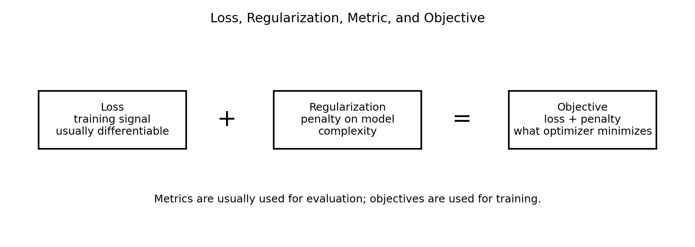
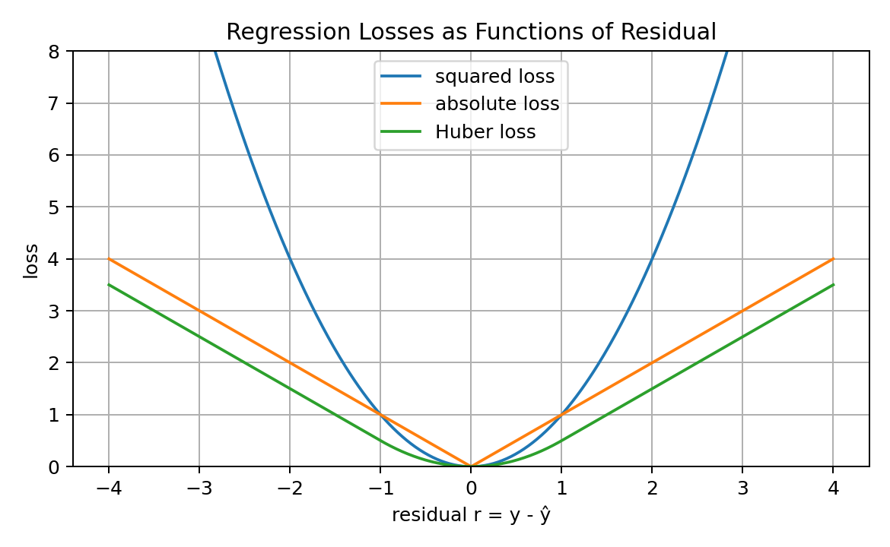
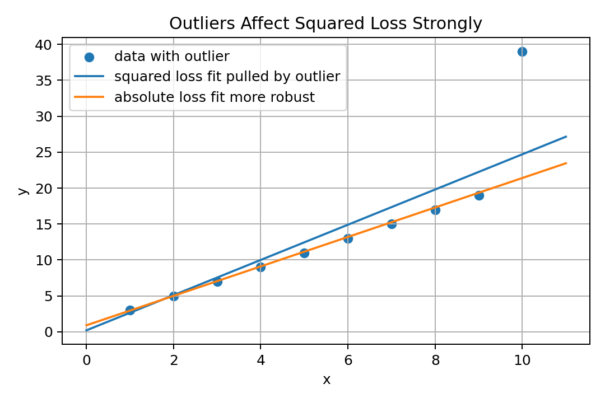
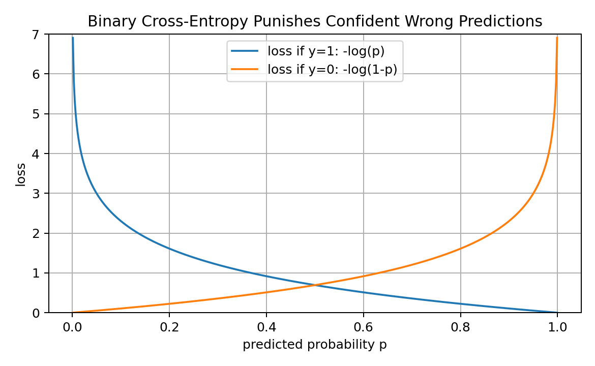
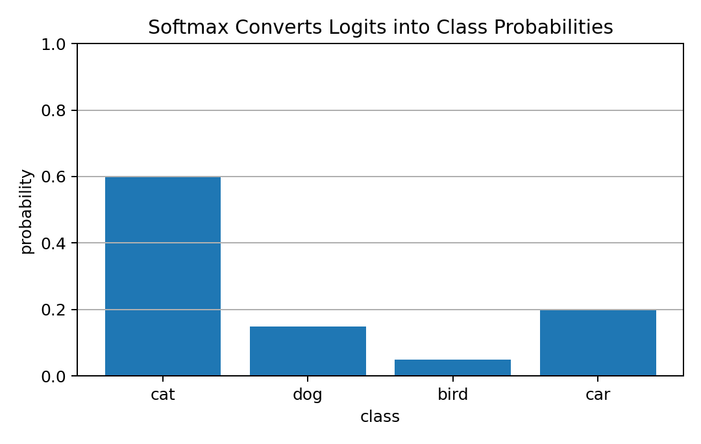
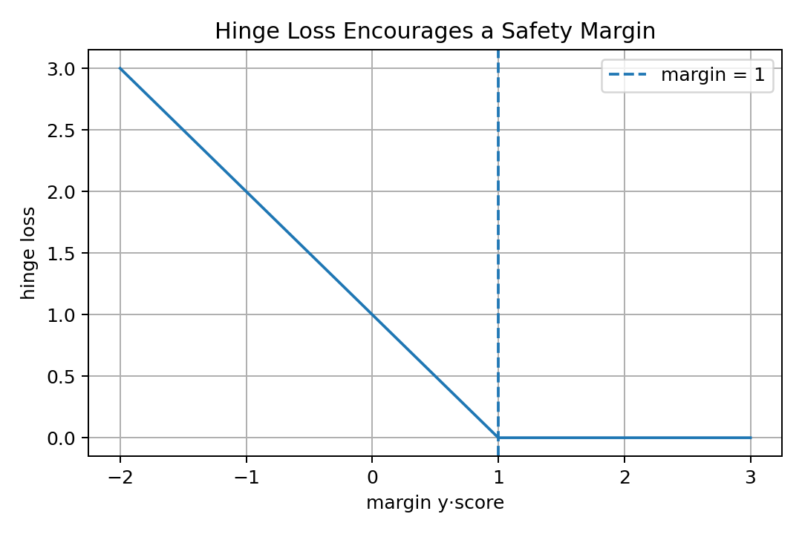
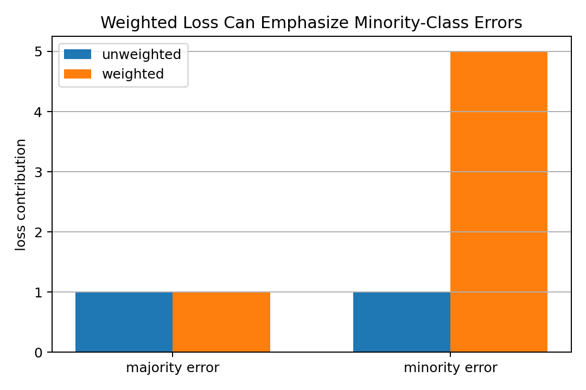
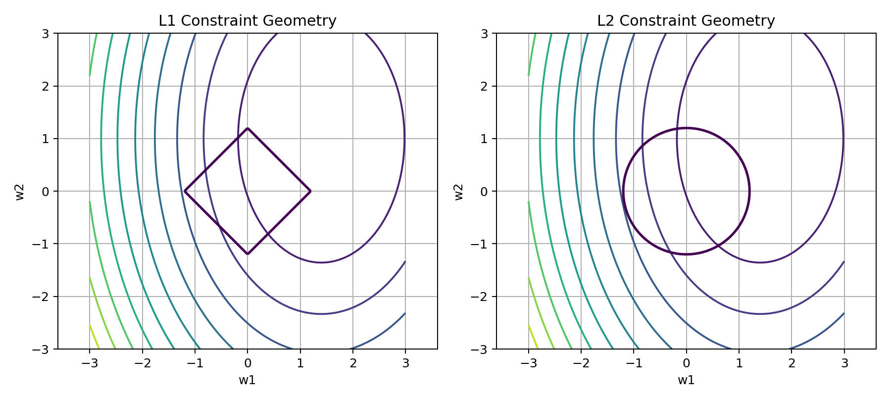
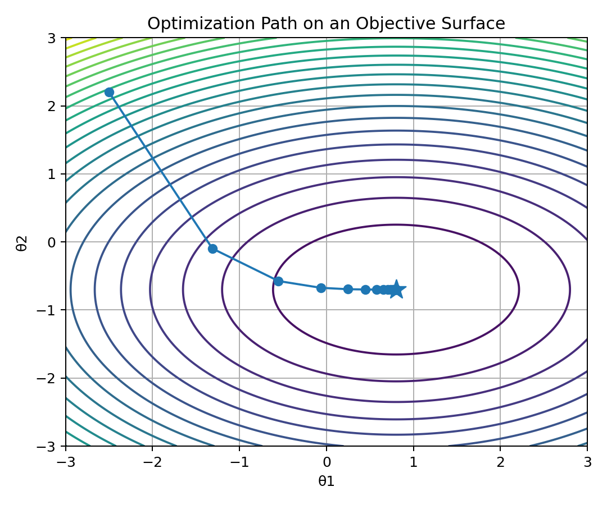
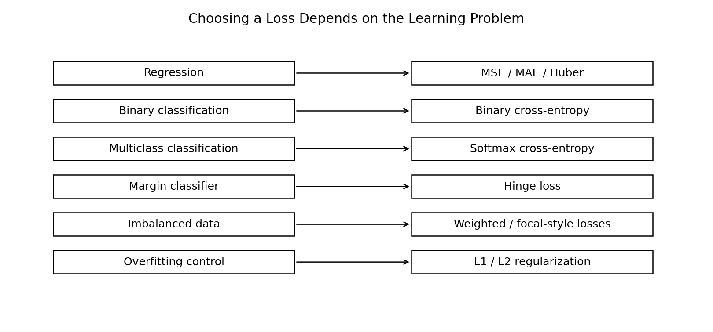

# 09 — Loss Functions and Optimization for Machine Learning

## Why This Lesson Exists

Machine Learning is not only about building models. It is about teaching models what “better” means.

A model makes predictions:

$$
\hat{y}=f_\theta(x)
$$

But a prediction alone does not tell the model whether it is good or bad.

For learning to happen, we need a mathematical signal that measures error.

That signal is the **loss function**.

A loss function tells the model:

```text
how wrong the prediction is
how painful the mistake is
which direction improvement should happen
what kind of behavior the model should prefer
```

Optimization is the process of changing model parameters to reduce that loss.

The central idea of this lesson is:

> A loss function defines the learning problem, and optimization is the process of minimizing it.

This lesson is extremely important because different losses create different models, different gradients, different robustness behavior, and different failure modes.

Choosing a loss is not a small implementation detail.

It is a modeling decision.

---

## 1. The Learning Loop

Most supervised Machine Learning can be summarized as:

```text
input -> model -> prediction -> loss -> gradient -> parameter update
```

Mathematically:

$$
\hat{y}_i=f_\theta(x_i)
$$

Then the loss compares prediction and truth:

$$
\ell(y_i,\hat{y}_i)
$$

For the full dataset:

$$
\mathcal{L}(\theta)=\frac{1}{n}\sum_{i=1}^{n}\ell(y_i,f_\theta(x_i))
$$

Then optimization tries to find:

$$
\theta^*=\arg\min_\theta \mathcal{L}(\theta)
$$

This is the skeleton of training.

The model learns because the loss creates pressure.

Without loss, there is no training signal.

---

## 2. Loss, Cost, Objective, and Metric

These words are often used loosely, but they have different meanings.

### Loss

A loss often refers to error for one example:

$$
\ell(y_i,\hat{y}_i)
$$

Example:

```text
squared error for one prediction
cross-entropy for one classification example
hinge loss for one margin example
```

### Cost or empirical loss

A cost is often the average loss over the dataset:

$$
\mathcal{L}(\theta)
=
\frac{1}{n}
\sum_{i=1}^{n}
\ell(y_i,\hat{y}_i)
$$

### Objective

An objective is the full quantity optimized, often including regularization:

$$
J(\theta)
=
\mathcal{L}(\theta)
+
\lambda \Omega(\theta)
$$

where $\Omega(\theta)$ is a penalty term.

### Metric

A metric is usually used for evaluation.

Examples:

```text
accuracy
F1 score
AUC
precision
recall
R²
MAE
RMSE
```

A metric is not always differentiable or convenient for optimization.

Visual summary:



Important idea:

> The thing I optimize and the thing I report are not always the same.

For example, a classifier may optimize cross-entropy but report accuracy or F1 score.

---

## 3. Empirical Risk Minimization

In theory, I care about performance on the true data-generating distribution.

The expected risk is:

$$
R(f)=\mathbb{E}_{(X,Y)\sim P}[\ell(Y,f(X))]
$$

But I do not know the true distribution $P$.

I only have a dataset:

$$
\mathcal{D}=\{(x_i,y_i)\}_{i=1}^{n}
$$

So I approximate expected risk with empirical risk:

$$
\hat{R}(f)
=
\frac{1}{n}
\sum_{i=1}^{n}
\ell(y_i,f(x_i))
$$

This is called **empirical risk minimization**.

Training usually means:

$$
f^*=\arg\min_f \hat{R}(f)
$$

In parametric models:

$$
\theta^*=\arg\min_\theta
\frac{1}{n}
\sum_{i=1}^{n}
\ell(y_i,f_\theta(x_i))
$$

This is a deep statistical idea:

```text
I cannot minimize true future error directly.
I minimize training error as an estimate.
```

Generalization is the question of whether low empirical risk also means low true risk.

---

## 4. Why Loss Choice Matters

A loss function defines what the model is punished for.

If I use squared error, large errors are punished very strongly.

If I use absolute error, large errors are punished linearly.

If I use cross-entropy, confident wrong classifications are punished heavily.

If I use hinge loss, the model is encouraged to create a margin.

If I use regularization, large weights are punished.

So loss choice affects:

```text
model behavior
gradient behavior
robustness to outliers
probability calibration
class imbalance handling
optimization stability
interpretability
generalization
```

A loss function is a mathematical expression of modeling values.

It answers:

```text
What kind of mistake is expensive?
What kind of prediction is acceptable?
What kind of model complexity should be discouraged?
```

---

## 5. Residuals

For regression, the residual is:

$$
r_i=y_i-\hat{y}_i
$$

It measures prediction error.

A positive residual means:

```text
true value is larger than prediction
model underpredicted
```

A negative residual means:

```text
true value is smaller than prediction
model overpredicted
```

Many regression losses are functions of residuals:

$$
\ell(y_i,\hat{y}_i)=\ell(r_i)
$$

Visual comparison:



The shape of the residual loss determines how errors are punished.

---

## 6. Squared Error Loss

Squared error loss for one sample is:

$$
\ell(y,\hat{y})=(y-\hat{y})^2
$$

For a dataset, Mean Squared Error is:

$$
\mathrm{MSE}
=
\frac{1}{n}
\sum_{i=1}^{n}
(y_i-\hat{y}_i)^2
$$

Squared error punishes large errors strongly.

If the residual doubles, the squared loss becomes four times larger.

Example:

```text
residual = 2  -> squared loss = 4
residual = 10 -> squared loss = 100
```

This makes MSE sensitive to outliers.

### Gradient of squared error

For one sample:

$$
\ell=(y-\hat{y})^2
$$

Derivative with respect to prediction:

$$
\frac{\partial \ell}{\partial \hat{y}}
=
-2(y-\hat{y})
=
2(\hat{y}-y)
$$

This means larger errors create larger gradients.

That can help correct big mistakes, but it can also make outliers dominate training.

---

## 7. Why MSE Is Connected to Gaussian Noise

Suppose the target is generated as:

$$
y=f_\theta(x)+\epsilon
$$

where noise is Gaussian:

$$
\epsilon\sim\mathcal{N}(0,\sigma^2)
$$

Then:

$$
p(y\mid x,\theta)
=
\frac{1}{\sqrt{2\pi\sigma^2}}
\exp\left(
-\frac{(y-f_\theta(x))^2}{2\sigma^2}
\right)
$$

For independent samples, maximizing likelihood is equivalent to minimizing:

$$
\sum_{i=1}^{n}
(y_i-f_\theta(x_i))^2
$$

So MSE is not arbitrary.

It corresponds to a probabilistic assumption:

```text
errors are Gaussian
large errors are increasingly unlikely
```

This connects loss functions to probability and MLE.

---

## 8. Mean Absolute Error

Absolute error loss is:

$$
\ell(y,\hat{y})=|y-\hat{y}|
$$

Mean Absolute Error is:

$$
\mathrm{MAE}
=
\frac{1}{n}
\sum_{i=1}^{n}
|y_i-\hat{y}_i|
$$

MAE punishes errors linearly.

Example:

```text
residual = 2  -> absolute loss = 2
residual = 10 -> absolute loss = 10
```

Compared to MSE, MAE is more robust to outliers.

Visual intuition:



### Gradient issue

MAE is not differentiable at zero residual.

For:

$$
|r|
$$

the derivative is:

```text
+1 if prediction is above target
-1 if prediction is below target
undefined at exactly zero
```

In practice, subgradients can be used.

---

## 9. Huber Loss

Huber loss combines MSE and MAE.

For residual $r=y-\hat{y}$:

$$
\ell_\delta(r)
=
\begin{cases}
\frac{1}{2}r^2, & |r|\leq \delta \\
\delta(|r|-\frac{1}{2}\delta), & |r|>\delta
\end{cases}
$$

For small errors, it behaves like squared error.

For large errors, it behaves like absolute error.

This gives a compromise:

```text
smooth near zero
less sensitive to outliers
more stable than pure MAE
```

Huber loss is useful when most noise is normal but some outliers exist.

---

## 10. RMSE

Root Mean Squared Error is:

$$
\mathrm{RMSE}
=
\sqrt{
\frac{1}{n}
\sum_{i=1}^{n}
(y_i-\hat{y}_i)^2
}
$$

RMSE is in the same unit as the target.

If predicting house prices in dollars, RMSE is also in dollars.

MSE is often easier for optimization.

RMSE is often easier for interpretation.

Important:

```text
MSE and RMSE rank models the same if computed on the same data
```

because square root is monotonic.

---

## 11. Binary Cross-Entropy

For binary classification:

$$
y\in\{0,1\}
$$

The model predicts:

$$
p=P(y=1\mid x)
$$

Binary cross-entropy is:

$$
\ell(y,p)
=
-
\left[
y\log(p)+(1-y)\log(1-p)
\right]
$$

If $y=1$:

$$
\ell=-\log(p)
$$

If $y=0$:

$$
\ell=-\log(1-p)
$$

Visual intuition:



Cross-entropy heavily punishes confident wrong predictions.

Example:

```text
true y=1, predicted p=0.99 -> tiny loss
true y=1, predicted p=0.01 -> huge loss
```

This is why cross-entropy is suitable for probabilistic classification.

---

## 12. Binary Cross-Entropy and Likelihood

Binary cross-entropy is connected to Bernoulli negative log-likelihood.

If:

$$
Y\sim\mathrm{Bernoulli}(p)
$$

then:

$$
P(Y=y)=p^y(1-p)^{1-y}
$$

The log-likelihood for one sample is:

$$
\log P(Y=y)=y\log(p)+(1-y)\log(1-p)
$$

Negative log-likelihood is:

$$
-
\left[
y\log(p)+(1-y)\log(1-p)
\right]
$$

That is binary cross-entropy.

So again, loss functions are connected to probability.

Optimizing binary cross-entropy means maximizing the probability assigned to the observed labels.

---

## 13. Logistic Regression Loss

Logistic regression computes:

$$
z=w^Tx+b
$$

Then:

$$
p=\sigma(z)=\frac{1}{1+e^{-z}}
$$

The binary cross-entropy loss is:

$$
\ell(y,z)
=
-
\left[
y\log(\sigma(z))+(1-y)\log(1-\sigma(z))
\right]
$$

A useful simplification is:

$$
\ell(y,z)=\log(1+e^z)-yz
$$

for:

$$
y\in\{0,1\}
$$

The derivative with respect to $z$ is beautifully simple:

$$
\frac{\partial \ell}{\partial z}
=
\sigma(z)-y
$$

This says:

```text
gradient = predicted probability - true label
```

That is one reason logistic regression and neural classifiers train cleanly with cross-entropy.

---

## 14. Multiclass Cross-Entropy

For multiclass classification with $K$ classes, the model outputs logits:

$$
z=[z_1,z_2,\dots,z_K]
$$

Softmax converts logits to probabilities:

$$
p_k=
\frac{e^{z_k}}
{\sum_{j=1}^{K}e^{z_j}}
$$

Visual intuition:



If the true class is $c$, multiclass cross-entropy is:

$$
\ell=-\log(p_c)
$$

If labels are one-hot encoded:

$$
y=[y_1,\dots,y_K]
$$

then:

$$
\ell(y,p)
=
-\sum_{k=1}^{K}
y_k\log(p_k)
$$

This is the standard loss for multiclass neural networks.

---

## 15. Cross-Entropy Gradient with Softmax

For softmax plus cross-entropy, the gradient with respect to each logit is:

$$
\frac{\partial \ell}{\partial z_k}
=
p_k-y_k
$$

This is a remarkably simple result.

It says:

```text
gradient = predicted probability - true one-hot label
```

If the model gives too much probability to a wrong class, the gradient reduces that logit.

If the model gives too little probability to the true class, the gradient increases that logit.

This is one of the mathematical reasons softmax + cross-entropy is so common.

---

## 16. Hinge Loss

Hinge loss is used in margin-based classification, especially Support Vector Machines.

For labels:

$$
y\in\{-1,+1\}
$$

and score:

$$
s=w^Tx+b
$$

hinge loss is:

$$
\ell(y,s)=\max(0,1-ys)
$$

The quantity:

$$
ys
$$

is the margin.

Visual intuition:



If:

$$
ys\geq 1
$$

the loss is zero.

This means the model is not only correct. It is correct with margin.

Hinge loss encourages a safety buffer between classes.

---

## 17. Zero-One Loss

The most natural classification loss might be:

$$
\ell(y,\hat{y})=
\begin{cases}
0, & y=\hat{y} \\
1, & y\neq \hat{y}
\end{cases}
$$

This directly counts mistakes.

But zero-one loss is not convenient for gradient-based optimization.

It is discontinuous and flat almost everywhere.

This is why we use surrogate losses like:

```text
cross-entropy
hinge loss
logistic loss
```

A surrogate loss is easier to optimize and hopefully improves the metric we care about.

---

## 18. Weighted Loss for Class Imbalance

If one class is rare, ordinary loss may focus too much on the majority class.

For weighted cross-entropy:

$$
\ell(y,p)
=
-
w_y\log(p_y)
$$

where $w_y$ is larger for rare classes.

Visual intuition:



Weighted losses help when mistakes on minority classes should matter more.

But weights must be chosen carefully.

Too much weighting can cause instability or overprediction of rare classes.

---

## 19. Focal Loss Preview

Focal loss is often used when there is severe class imbalance.

For binary classification, a simplified focal loss idea is:

$$
\ell
=
-(1-p_t)^\gamma \log(p_t)
$$

where $p_t$ is the predicted probability of the true class.

If an example is already easy, $p_t$ is high, so:

$$
(1-p_t)^\gamma
$$

is small.

This reduces the contribution of easy examples and focuses training on hard examples.

This is common in object detection and imbalanced classification.

---

## 20. Regularization as Part of the Objective

Training loss alone can encourage overly complex models.

Regularization adds a penalty:

$$
J(\theta)
=
\mathcal{L}(\theta)+\lambda\Omega(\theta)
$$

where:

```text
L(theta) -> data fitting loss
Omega(theta) -> complexity penalty
lambda -> regularization strength
```

The objective is not just:

```text
fit the training data
```

It becomes:

```text
fit the training data, but keep the model controlled
```

This helps generalization.

---

## 21. L2 Regularization

L2 regularization penalizes squared weight size:

$$
\Omega(w)=\|w\|_2^2
$$

Objective:

$$
J(w)=\mathcal{L}(w)+\lambda\|w\|_2^2
$$

This is used in Ridge Regression and weight decay.

L2 regularization tends to shrink weights smoothly.

It discourages very large weights but usually does not set weights exactly to zero.

Gradient of the penalty:

$$
\nabla_w \lambda\|w\|_2^2
=
2\lambda w
$$

So the update includes a force pulling weights toward zero.

---

## 22. L1 Regularization

L1 regularization penalizes absolute weight size:

$$
\Omega(w)=\|w\|_1
$$

Objective:

$$
J(w)=\mathcal{L}(w)+\lambda\|w\|_1
$$

This is used in Lasso Regression.

L1 regularization can produce sparse solutions.

Sparse means:

```text
some weights become exactly zero
```

This can act like feature selection.

Visual intuition:



The sharp corners of the L1 geometry make zero coefficients more likely.

---

## 23. Objective Landscape

The objective function creates a landscape over parameter space.

For two parameters:

$$
J(\theta_1,\theta_2)
$$

I can draw contours.

Optimization moves through this landscape.

Visual intuition:



Gradient descent update:

$$
\theta_{t+1}
=
\theta_t
-
\alpha
\nabla_\theta J(\theta_t)
$$

The optimizer does not know the whole landscape.

It only uses local gradient information.

This is why optimization can be sensitive to learning rate, scaling, initialization, and curvature.

---

## 24. Convexity

A function is convex if:

$$
f(\lambda x+(1-\lambda)y)
\leq
\lambda f(x)+(1-\lambda)f(y)
$$

for:

$$
0\leq \lambda \leq 1
$$

Intuition:

```text
a line segment between two points on the graph lies above the function
```

Convex losses are easier because any local minimum is global.

Examples:

```text
linear regression with MSE is convex
logistic regression with cross-entropy is convex in linear parameters
SVM hinge loss objective is convex
```

Neural network objectives are usually non-convex.

But gradient-based methods can still work well.

---

## 25. Smoothness and Differentiability

Optimization depends heavily on gradient behavior.

A smooth loss has gradients that change gradually.

A non-smooth loss may have corners.

Examples:

```text
MSE -> smooth
MAE -> non-smooth at zero
hinge loss -> non-smooth at margin boundary
ReLU networks -> piecewise linear and non-smooth at some points
```

Non-smooth does not mean unusable.

Subgradients can often be used.

But smooth losses are often easier for gradient-based optimization.

---

## 26. Curvature and Conditioning

Curvature describes how quickly the gradient changes.

If curvature is very different across directions, optimization may zig-zag.

This is called poor conditioning.

Example:

```text
one parameter direction is steep
another direction is flat
```

Gradient descent may require small steps to avoid exploding in the steep direction, but then progress is slow in the flat direction.

Feature scaling helps because it makes the loss landscape more balanced.

This connects preprocessing to optimization.

---

## 27. Loss and Robustness

Different losses react differently to outliers.

MSE:

```text
large errors get squared
very sensitive to outliers
```

MAE:

```text
large errors grow linearly
more robust
```

Huber:

```text
quadratic for small errors
linear for large errors
balanced robustness
```

Robust loss functions are important when data contains:

```text
sensor spikes
wrong labels
rare extreme values
measurement errors
heavy-tailed noise
```

The loss should match the noise structure of the problem.

---

## 28. Loss and Probability Calibration

Cross-entropy rewards calibrated probabilities.

If a model says:

```text
P(class)=0.8
```

then cross-entropy prefers that events predicted with 0.8 confidence happen around 80% of the time.

Accuracy does not care about probability quality.

Example:

```text
p = 0.51 and p = 0.99 may both give same class label
```

But cross-entropy treats them differently.

This is why probabilistic losses matter when confidence matters.

---

## 29. Loss Function Selection Map

Different tasks usually need different losses.



Common choices:

```text
regression with Gaussian-like noise -> MSE
regression with outliers -> MAE or Huber
binary classification -> binary cross-entropy
multiclass classification -> softmax cross-entropy
margin-based classification -> hinge loss
imbalanced classification -> weighted loss / focal loss
overfitting control -> regularization
```

A strong ML engineer does not choose losses blindly.

They ask:

```text
What is the target type?
What does the model output?
What kind of errors matter?
Is the data noisy?
Are there outliers?
Is class imbalance present?
Do I need calibrated probabilities?
```

---

## 30. Loss vs Metric Mismatch

Sometimes the metric is not differentiable.

Examples:

```text
accuracy
F1 score
AUC
precision at k
recall at k
ranking metrics
```

So we train with a differentiable surrogate loss.

Example:

```text
optimize cross-entropy
evaluate F1 score
```

This can create mismatch.

If the dataset is imbalanced, optimizing cross-entropy may not maximize F1.

That is why threshold tuning, class weights, sampling strategies, and metric-aware validation matter.

---

## 31. Numerical Stability

Loss functions can suffer from numerical problems.

For binary cross-entropy:

$$
-\log(p)
$$

If:

$$
p=0
$$

then:

$$
\log(0)
$$

is undefined.

So implementations clip probabilities:

```python
eps = 1e-15
p = np.clip(p, eps, 1 - eps)
```

Softmax can overflow because:

$$
e^z
$$

can be huge.

Stable softmax subtracts the maximum logit:

$$
\mathrm{softmax}(z)_k
=
\frac{e^{z_k-\max(z)}}{\sum_j e^{z_j-\max(z)}}
$$

Numerical stability is not optional in real ML code.

---

## 32. Code: Regression Losses

```python
import numpy as np

def mse(y_true, y_pred):
    return np.mean((y_true - y_pred) ** 2)

def mae(y_true, y_pred):
    return np.mean(np.abs(y_true - y_pred))

def huber_loss(y_true, y_pred, delta=1.0):
    residual = y_true - y_pred
    abs_residual = np.abs(residual)

    quadratic = 0.5 * residual ** 2
    linear = delta * (abs_residual - 0.5 * delta)

    return np.mean(np.where(abs_residual <= delta, quadratic, linear))
```

These losses punish residuals differently.

---

## 33. Code: Binary Cross-Entropy

```python
def binary_cross_entropy(y_true, p_pred, eps=1e-15):
    p_pred = np.clip(p_pred, eps, 1 - eps)
    loss = -(y_true * np.log(p_pred) + (1 - y_true) * np.log(1 - p_pred))
    return np.mean(loss)
```

This implements:

$$
-
\left[
y\log(p)+(1-y)\log(1-p)
\right]
$$

Clipping avoids:

$$
\log(0)
$$

---

## 34. Code: Softmax Cross-Entropy

```python
def softmax(logits):
    shifted = logits - np.max(logits, axis=1, keepdims=True)
    exp_values = np.exp(shifted)
    return exp_values / np.sum(exp_values, axis=1, keepdims=True)

def softmax_cross_entropy(y_true_indices, logits):
    probabilities = softmax(logits)
    n = logits.shape[0]

    correct_probs = probabilities[np.arange(n), y_true_indices]
    loss = -np.log(correct_probs)

    return np.mean(loss)
```

This is the standard multiclass classification loss.

---

## 35. Code: Regularized Objective

```python
def l2_penalty(w):
    return np.sum(w ** 2)

def l1_penalty(w):
    return np.sum(np.abs(w))

def objective_with_l2(data_loss, w, lambda_):
    return data_loss + lambda_ * l2_penalty(w)
```

The training objective can combine fit and complexity.

---

## 36. Code: Gradient Descent on a Loss

```python
def gradient_descent_step(theta, gradient, learning_rate):
    return theta - learning_rate * gradient
```

This simple line represents the optimizer.

The difficult part is choosing the loss, computing the gradient, and making the optimization stable.

---

## 37. Common Mistakes

### Mistake 1: Optimizing the wrong loss for the task

MSE is not appropriate for ordinary classification probabilities.

Cross-entropy is not usually the right loss for continuous regression targets.

### Mistake 2: Confusing loss and metric

The training loss may improve while the evaluation metric does not.

### Mistake 3: Ignoring class imbalance

A model can get high accuracy by ignoring the minority class.

### Mistake 4: Forgetting numerical stability

Logs and exponentials can create infinities or NaNs.

### Mistake 5: Ignoring outliers

MSE can be dominated by extreme residuals.

### Mistake 6: Assuming regularization always helps

Too much regularization causes underfitting.

### Mistake 7: Thinking lower training loss always means better model

Lower training loss can mean overfitting.

Validation performance matters.

---

## 38. What I Learned From This Lesson

Loss functions define what the model tries to improve.

Optimization is the process of minimizing the objective.

Important ideas:

```text
loss
metric
objective
empirical risk
MSE
MAE
Huber loss
binary cross-entropy
softmax cross-entropy
hinge loss
zero-one loss
weighted loss
regularization
L1
L2
convexity
smoothness
curvature
numerical stability
loss-metric mismatch
```

The central lesson is:

```text
A model does not learn what I want.
It learns what the loss function rewards and punishes.
```

So choosing a loss is choosing the training signal.

---

## Mini Exercise

Create a file called `09-loss-functions-and-optimization.py` inside the `code` folder.

Write code that:

```text
1. implements MSE
2. implements MAE
3. implements Huber loss
4. implements binary cross-entropy
5. implements stable softmax
6. implements softmax cross-entropy
7. implements hinge loss
8. implements L1 and L2 penalties
9. compares losses on normal residuals and outliers
10. trains a tiny linear regression model using gradient descent
```

Then answer:

```text
Why does MSE punish outliers more than MAE?
Why is cross-entropy connected to likelihood?
Why is softmax needed for multiclass classification?
Why can loss and metric disagree?
Why does regularization help generalization?
What can go wrong if the learning rate is too large?
```

---

## Further Reading and Resources

### Books

- [The Elements of Statistical Learning](https://hastie.su.domains/ElemStatLearn/)
- [An Introduction to Statistical Learning](https://www.statlearning.com/)
- [Deep Learning Book by Goodfellow, Bengio, and Courville](https://www.deeplearningbook.org/)
- [Pattern Recognition and Machine Learning by Christopher Bishop](https://link.springer.com/book/9780387310732)
- [Mathematics for Machine Learning](https://mml-book.github.io/)

### Visual Learning

- [StatQuest: Loss Functions](https://www.youtube.com/@statquest)
- [3Blue1Brown: Gradient Descent](https://www.3blue1brown.com/lessons/gradient-descent)
- [Google Machine Learning Crash Course: Loss](https://developers.google.com/machine-learning/crash-course/descending-into-ml/training-and-loss)

### ML Connections

- [Scikit-learn: Model Evaluation](https://scikit-learn.org/stable/modules/model_evaluation.html)
- [Scikit-learn: Linear Models](https://scikit-learn.org/stable/modules/linear_model.html)
- [PyTorch Loss Functions](https://pytorch.org/docs/stable/nn.html#loss-functions)
- [TensorFlow Losses](https://www.tensorflow.org/api_docs/python/tf/keras/losses)

### What to Study Next

The next math lesson should be:

```text
10 — MLE, MAP, and Probabilistic Thinking
```

That lesson will explain why many loss functions come from probability, how maximum likelihood works, and how MAP connects likelihood with priors and regularization.

---

## Final Reflection

A loss function is a teacher.

It tells the model what counts as a mistake.

It tells the optimizer where to move.

It tells the training process what kind of solution is preferred.

If the loss is poorly chosen, the model may learn the wrong behavior very efficiently.

That is why understanding loss functions deeply is one of the strongest foundations in Machine Learning.
