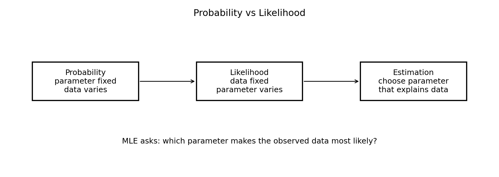
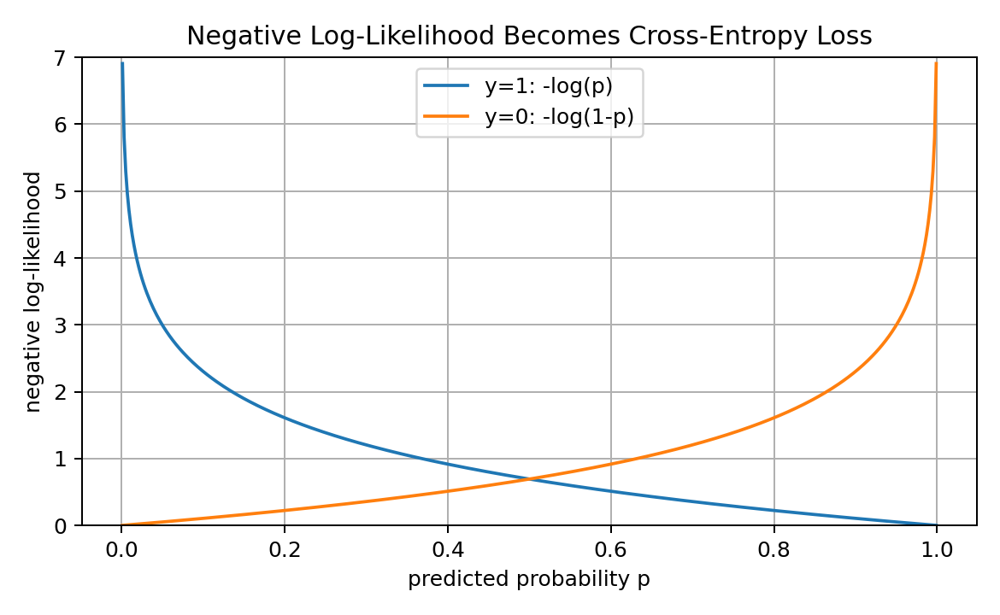
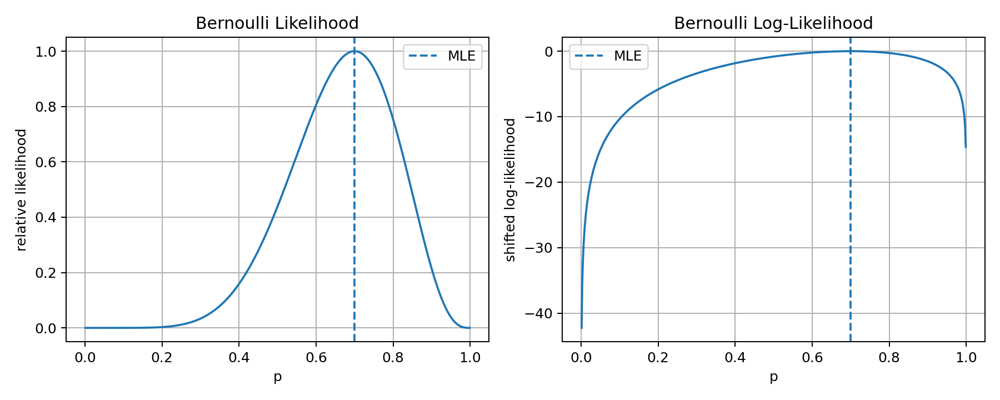
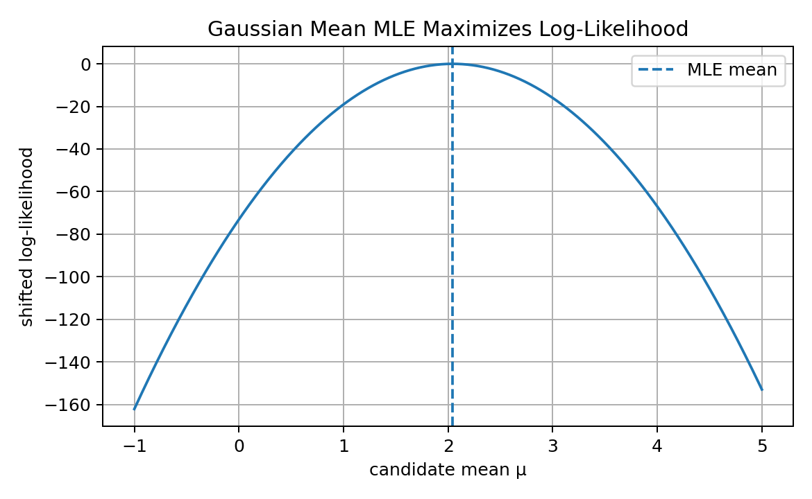
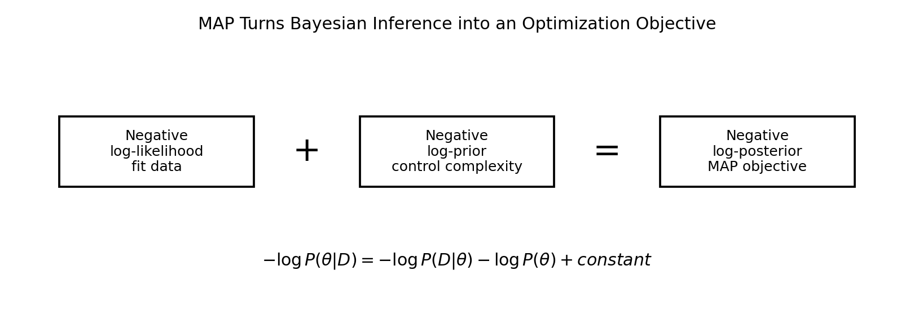
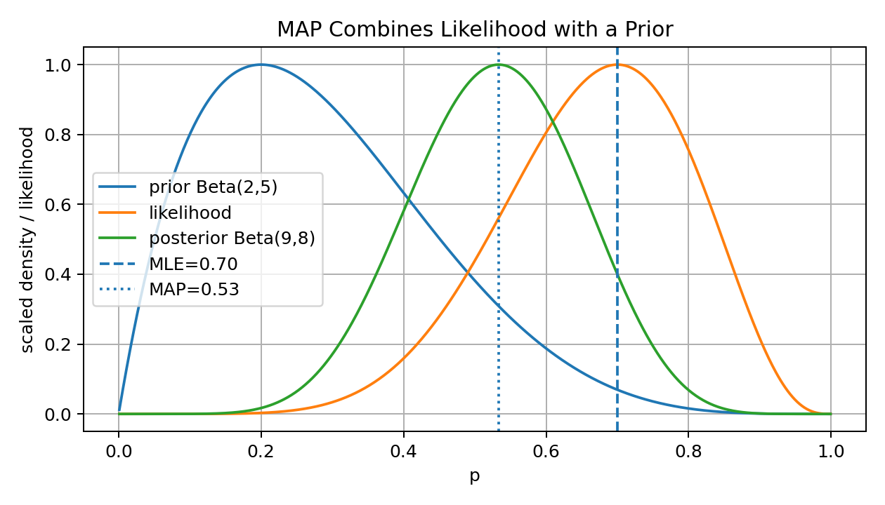
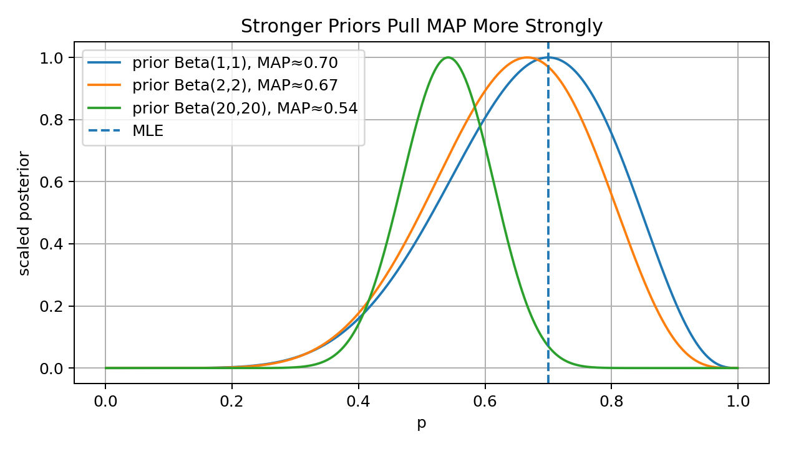
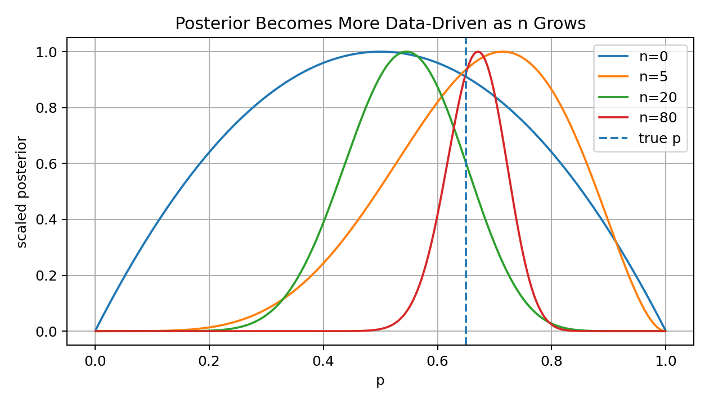
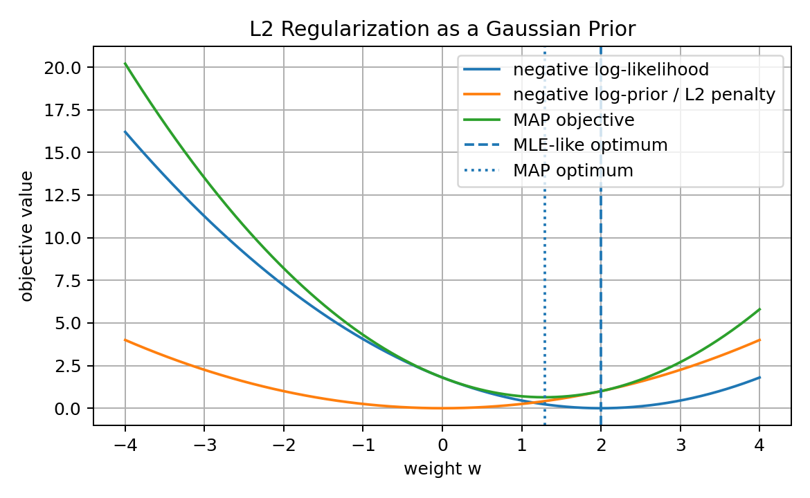
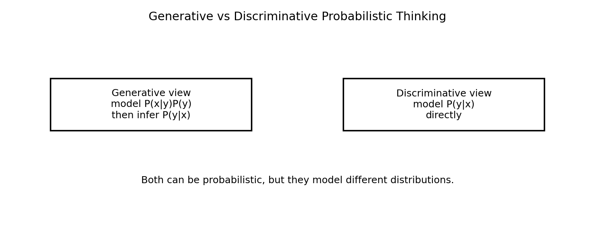

# 10 — MLE, MAP, and Probabilistic Thinking for Machine Learning

## Why This Lesson Exists

The previous lessons gave the ingredients:

```text
probability -> uncertainty
statistics -> learning from samples
loss functions -> training signal
optimization -> minimizing an objective
```

Now I want to connect them into one deeper idea:

> Many Machine Learning losses come from probabilistic assumptions.

This is one of the most important conceptual bridges in ML.

When I train a model with MSE, I am not just minimizing squared numbers. I am often implicitly assuming Gaussian noise.

When I train logistic regression with cross-entropy, I am not just using a convenient formula. I am maximizing the likelihood of Bernoulli labels.

When I add L2 regularization, I am not just shrinking weights. I can interpret it as putting a Gaussian prior on parameters.

This lesson explains the probabilistic meaning behind optimization.

The central idea is:

```text
MLE chooses parameters that make the observed data most likely.
MAP chooses parameters that balance data likelihood with prior belief.
```

This lesson is deep because it connects:

```text
likelihood
log-likelihood
negative log-likelihood
cross-entropy
MSE
regularization
Bayesian priors
posterior distributions
probabilistic modeling
```

After this lesson, loss functions should feel less random.

They should feel like consequences of modeling assumptions.

---

## 1. Probability vs Likelihood

Probability and likelihood use the same mathematical expression, but they answer different questions.

Suppose I have a model with parameter $\theta$ and data $D$.

### Probability view

Probability treats the parameter as fixed and asks:

```text
If theta is fixed, how probable is different data?
```

Mathematically:

$$
P(D\mid \theta)
$$

as a function of $D$.

### Likelihood view

Likelihood treats the data as fixed and asks:

```text
Given the observed data, which theta explains it best?
```

Mathematically:

$$
L(\theta)=P(D\mid \theta)
$$

as a function of $\theta$.

Visual intuition:



The same expression $P(D\mid \theta)$ can be read differently depending on what is fixed and what varies.

This distinction is essential for Maximum Likelihood Estimation.

---

## 2. What Is a Statistical Model?

A statistical model is a family of probability distributions indexed by parameters.

For example:

$$
p(x\mid \theta)
$$

where $\theta$ controls the distribution.

Examples:

### Bernoulli model

$$
X\sim \mathrm{Bernoulli}(p)
$$

Parameter:

$$
\theta=p
$$

### Gaussian model

$$
X\sim \mathcal{N}(\mu,\sigma^2)
$$

Parameters:

$$
\theta=(\mu,\sigma^2)
$$

### Logistic regression

$$
Y\mid X=x \sim \mathrm{Bernoulli}(\sigma(w^Tx+b))
$$

Parameters:

$$
\theta=(w,b)
$$

A model is not only a function. It is also a set of assumptions about how data is generated.

This is the beginning of probabilistic thinking.

---

## 3. Data as Observations from a Distribution

In supervised learning, I observe:

$$
\mathcal{D}=\{(x_i,y_i)\}_{i=1}^{n}
$$

A probabilistic model says:

$$
y_i \sim p(y\mid x_i,\theta)
$$

For independent samples, the probability of the full dataset is:

$$
P(\mathcal{D}\mid \theta)
=
\prod_{i=1}^{n}
p(y_i\mid x_i,\theta)
$$

This product is the likelihood:

$$
L(\theta)
=
\prod_{i=1}^{n}
p(y_i\mid x_i,\theta)
$$

The independence assumption matters.

It says that given the model parameters and inputs, each observed label contributes independently to the likelihood.

This assumption is common, but it should not be forgotten.

---

## 4. Maximum Likelihood Estimation

Maximum Likelihood Estimation, or MLE, chooses the parameter that makes the observed data most likely.

Formally:

$$
\theta_{\mathrm{MLE}}
=
\arg\max_\theta
P(\mathcal{D}\mid \theta)
$$

Using likelihood notation:

$$
\theta_{\mathrm{MLE}}
=
\arg\max_\theta
L(\theta)
$$

In words:

```text
find the parameter theta under which my observed dataset would be most probable
```

MLE is not saying the chosen parameter is definitely true.

It says:

```text
among the parameters allowed by my model,
this one best explains the observed data
```

This distinction matters because if the model family is wrong, MLE can still confidently choose a bad explanation.

---

## 5. Why We Use Log-Likelihood

Likelihood often multiplies many probabilities:

$$
L(\theta)=\prod_{i=1}^{n}p(y_i\mid x_i,\theta)
$$

Products of many small numbers can become extremely tiny and cause numerical underflow.

So we take logs:

$$
\log L(\theta)
=
\log
\prod_{i=1}^{n}
p(y_i\mid x_i,\theta)
$$

Using the log product rule:

$$
\log L(\theta)
=
\sum_{i=1}^{n}
\log p(y_i\mid x_i,\theta)
$$

This is one of the main reasons logs are everywhere in ML.

They turn products into sums.

Because log is monotonic:

$$
\arg\max_\theta L(\theta)
=
\arg\max_\theta \log L(\theta)
$$

So maximizing likelihood and maximizing log-likelihood give the same parameter.

---

## 6. Negative Log-Likelihood as Loss

Optimization libraries usually minimize, not maximize.

So instead of maximizing log-likelihood, we minimize negative log-likelihood:

$$
\theta_{\mathrm{MLE}}
=
\arg\min_\theta
-\log L(\theta)
$$

For independent samples:

$$
-\log L(\theta)
=
-\sum_{i=1}^{n}
\log p(y_i\mid x_i,\theta)
$$

Average negative log-likelihood:

$$
\mathcal{L}(\theta)
=
-\frac{1}{n}
\sum_{i=1}^{n}
\log p(y_i\mid x_i,\theta)
$$

This is a loss function.

Visual intuition:



Key idea:

> Many ML loss functions are negative log-likelihoods.

This is why probability and optimization are deeply connected.

---

## 7. Bernoulli MLE

Suppose I observe binary data:

$$
x_1,x_2,\dots,x_n
$$

where:

$$
x_i\in\{0,1\}
$$

Assume:

$$
X_i\sim \mathrm{Bernoulli}(p)
$$

The probability of one observation is:

$$
P(X_i=x_i)=p^{x_i}(1-p)^{1-x_i}
$$

The likelihood is:

$$
L(p)
=
\prod_{i=1}^{n}
p^{x_i}(1-p)^{1-x_i}
$$

Let:

$$
k=\sum_{i=1}^{n}x_i
$$

Then:

$$
L(p)=p^k(1-p)^{n-k}
$$

Visual:



The MLE is:

$$
p_{\mathrm{MLE}}=\frac{k}{n}
$$

So if I observe 7 successes in 10 trials:

$$
p_{\mathrm{MLE}}=0.7
$$

This makes intuitive sense.

The best estimate of success probability is the observed frequency.

---

## 8. Deriving Bernoulli MLE

The log-likelihood is:

$$
\ell(p)
=
\log L(p)
=
k\log p+(n-k)\log(1-p)
$$

Differentiate:

$$
\frac{d\ell}{dp}
=
\frac{k}{p}
-
\frac{n-k}{1-p}
$$

Set derivative to zero:

$$
\frac{k}{p}
=
\frac{n-k}{1-p}
$$

Cross multiply:

$$
k(1-p)=p(n-k)
$$

Expand:

$$
k-kp=np-kp
$$

So:

$$
k=np
$$

Therefore:

$$
p=\frac{k}{n}
$$

This is the MLE.

This derivation shows a pattern that appears often:

```text
write likelihood
take log
differentiate
set derivative to zero
solve
```

---

## 9. Gaussian MLE for the Mean

Suppose:

$$
X_i\sim \mathcal{N}(\mu,\sigma^2)
$$

and assume $\sigma^2$ is known.

The density is:

$$
p(x_i\mid \mu)
=
\frac{1}{\sqrt{2\pi\sigma^2}}
\exp\left(
-\frac{(x_i-\mu)^2}{2\sigma^2}
\right)
$$

For independent observations:

$$
L(\mu)=\prod_{i=1}^{n}p(x_i\mid \mu)
$$

The log-likelihood is:

$$
\log L(\mu)
=
-\frac{n}{2}\log(2\pi\sigma^2)
-
\frac{1}{2\sigma^2}
\sum_{i=1}^{n}
(x_i-\mu)^2
$$

The first term does not depend on $\mu$.

So maximizing log-likelihood is equivalent to minimizing:

$$
\sum_{i=1}^{n}(x_i-\mu)^2
$$

The solution is:

$$
\mu_{\mathrm{MLE}}=\bar{x}
$$

Visual:



The sample mean is the MLE of the Gaussian mean.

---

## 10. Why MSE Comes from Gaussian Noise

Consider regression:

$$
y_i=f_\theta(x_i)+\epsilon_i
$$

Assume Gaussian noise:

$$
\epsilon_i\sim \mathcal{N}(0,\sigma^2)
$$

Then:

$$
y_i\mid x_i,\theta
\sim
\mathcal{N}(f_\theta(x_i),\sigma^2)
$$

The conditional density is:

$$
p(y_i\mid x_i,\theta)
=
\frac{1}{\sqrt{2\pi\sigma^2}}
\exp\left(
-\frac{(y_i-f_\theta(x_i))^2}{2\sigma^2}
\right)
$$

The negative log-likelihood over the dataset is:

$$
-\log L(\theta)
=
\text{constant}
+
\frac{1}{2\sigma^2}
\sum_{i=1}^{n}
(y_i-f_\theta(x_i))^2
$$

Since constants and positive scaling do not change the optimizer, minimizing negative log-likelihood is equivalent to minimizing:

$$
\sum_{i=1}^{n}
(y_i-\hat{y}_i)^2
$$

That is squared error.

So MSE corresponds to Gaussian noise assumptions.

This is a beautiful result:

```text
MSE is not just a convenient loss.
It is the negative log-likelihood of a Gaussian regression model.
```

---

## 11. Why Cross-Entropy Comes from Bernoulli Likelihood

In binary classification:

$$
Y_i\mid x_i \sim \mathrm{Bernoulli}(p_i)
$$

where:

$$
p_i=P(Y=1\mid x_i)
$$

The probability of label $y_i$ is:

$$
P(Y_i=y_i\mid x_i)
=
p_i^{y_i}(1-p_i)^{1-y_i}
$$

The log-likelihood is:

$$
\log L
=
\sum_{i=1}^{n}
\left[
y_i\log p_i
+
(1-y_i)\log(1-p_i)
\right]
$$

The negative average log-likelihood is:

$$
\mathcal{L}
=
-\frac{1}{n}
\sum_{i=1}^{n}
\left[
y_i\log p_i
+
(1-y_i)\log(1-p_i)
\right]
$$

This is binary cross-entropy.

So binary cross-entropy is the negative log-likelihood of Bernoulli labels.

Again:

```text
loss = negative log-likelihood
```

---

## 12. Multiclass Cross-Entropy from Categorical Likelihood

For multiclass classification:

$$
Y_i\in\{1,2,\dots,K\}
$$

The model outputs probabilities:

$$
p_{ik}=P(Y_i=k\mid x_i)
$$

If the true class is $c_i$, the likelihood for one sample is:

$$
P(Y_i=c_i\mid x_i)=p_{i,c_i}
$$

The log-likelihood is:

$$
\sum_{i=1}^{n}
\log p_{i,c_i}
$$

Negative log-likelihood is:

$$
-\sum_{i=1}^{n}
\log p_{i,c_i}
$$

With one-hot labels $y_{ik}$:

$$
\mathcal{L}
=
-\frac{1}{n}
\sum_{i=1}^{n}
\sum_{k=1}^{K}
y_{ik}\log p_{ik}
$$

This is multiclass cross-entropy.

This is why softmax classifiers use cross-entropy.

They are maximizing categorical likelihood.

---

## 13. MLE as Optimization

MLE can be written as an optimization problem:

$$
\theta_{\mathrm{MLE}}
=
\arg\min_\theta
-\sum_{i=1}^{n}
\log p(y_i\mid x_i,\theta)
$$

This is exactly what gradient-based training does.

For neural networks, the model may define:

$$
p_\theta(y\mid x)
$$

Then training minimizes:

$$
-\log p_\theta(y\mid x)
$$

The optimizer does not need to know the philosophical meaning.

But I should know it.

Because it tells me:

```text
what assumptions the loss makes
why the formula has this shape
what kind of predictions it rewards
```

---

## 14. Limitations of MLE

MLE is powerful, but it has limitations.

### Limitation 1: It can overfit

MLE tries to explain observed data as well as possible.

With small data or flexible models, this can overfit noise.

### Limitation 2: It does not use prior knowledge

MLE only uses likelihood.

If I know something about reasonable parameter values, MLE does not include that unless I encode it.

### Limitation 3: It depends on model assumptions

If the assumed distribution is wrong, MLE estimates the best parameter inside a wrong model family.

### Limitation 4: It can be unstable with small samples

Example:

```text
0 successes in 3 Bernoulli trials
```

MLE gives:

$$
p_{\mathrm{MLE}}=0
$$

But this may be too extreme.

MAP helps with this by adding prior belief.

---

## 15. Bayesian Thinking

Bayesian thinking treats parameters as uncertain.

Instead of only finding one best parameter, Bayesian inference considers a distribution over parameters.

Before seeing data, I have a prior:

$$
P(\theta)
$$

After seeing data, I get a posterior:

$$
P(\theta\mid D)
$$

Bayes theorem:

$$
P(\theta\mid D)
=
\frac{P(D\mid \theta)P(\theta)}{P(D)}
$$

where:

```text
P(theta)      -> prior
P(D|theta)    -> likelihood
P(D)          -> evidence
P(theta|D)    -> posterior
```

The posterior combines prior belief and observed evidence.

---

## 16. Maximum A Posteriori Estimation

Maximum A Posteriori estimation, or MAP, chooses the parameter with the highest posterior probability.

Formally:

$$
\theta_{\mathrm{MAP}}
=
\arg\max_\theta
P(\theta\mid D)
$$

Using Bayes theorem:

$$
P(\theta\mid D)
=
\frac{P(D\mid \theta)P(\theta)}{P(D)}
$$

Since $P(D)$ does not depend on $\theta$:

$$
\theta_{\mathrm{MAP}}
=
\arg\max_\theta
P(D\mid \theta)P(\theta)
$$

Taking logs:

$$
\theta_{\mathrm{MAP}}
=
\arg\max_\theta
[
\log P(D\mid \theta)+\log P(\theta)
]
$$

Equivalently, minimizing negative logs:

$$
\theta_{\mathrm{MAP}}
=
\arg\min_\theta
[
-\log P(D\mid \theta)
-
\log P(\theta)
]
$$

Visual decomposition:



This shows the connection:

```text
MAP objective = data loss + prior penalty
```

---

## 17. MLE vs MAP

MLE:

$$
\theta_{\mathrm{MLE}}
=
\arg\max_\theta
P(D\mid \theta)
$$

MAP:

$$
\theta_{\mathrm{MAP}}
=
\arg\max_\theta
P(D\mid \theta)P(\theta)
$$

Difference:

```text
MLE uses only data likelihood.
MAP uses likelihood plus prior belief.
```

If the prior is uniform, MAP becomes MLE.

Why?

If:

$$
P(\theta)=\text{constant}
$$

then maximizing:

$$
P(D\mid \theta)P(\theta)
$$

is the same as maximizing:

$$
P(D\mid \theta)
$$

So MLE is a special case of MAP with a flat prior.

---

## 18. Bernoulli MAP with Beta Prior

For Bernoulli data:

$$
X_i\sim\mathrm{Bernoulli}(p)
$$

A common prior for $p$ is the Beta distribution:

$$
p\sim\mathrm{Beta}(\alpha,\beta)
$$

The Beta prior has density proportional to:

$$
p^{\alpha-1}(1-p)^{\beta-1}
$$

The likelihood is:

$$
p^k(1-p)^{n-k}
$$

Posterior is proportional to:

$$
p^k(1-p)^{n-k}
p^{\alpha-1}(1-p)^{\beta-1}
$$

Combine powers:

$$
p^{\alpha+k-1}
(1-p)^{\beta+n-k-1}
$$

So:

$$
p\mid D
\sim
\mathrm{Beta}(\alpha+k,\beta+n-k)
$$

The MAP estimate is:

$$
p_{\mathrm{MAP}}
=
\frac{\alpha+k-1}{\alpha+\beta+n-2}
$$

when $\alpha+k>1$ and $\beta+n-k>1$.

Visual:



The prior pulls the estimate toward prior belief.

---

## 19. Prior Strength

A weak prior has little effect.

A strong prior has more effect.

Visual:



If data is small, the prior can strongly influence the posterior.

If data is large, the likelihood usually dominates.

This is an important Bayesian intuition:

```text
with little data, prior matters more
with lots of data, evidence matters more
```

This does not mean priors disappear completely, but data becomes more influential.

---

## 20. Bayesian Updating Over Time

Bayesian inference is naturally sequential.

Start with prior:

$$
P(\theta)
$$

Observe data batch 1 and get posterior:

$$
P(\theta\mid D_1)
$$

Then use that posterior as the next prior.

After data batch 2:

$$
P(\theta\mid D_1,D_2)
$$

Visual:



As more data arrives, uncertainty often decreases and the posterior becomes more concentrated.

This is a powerful way to think about learning:

```text
learning = updating beliefs with evidence
```

---

## 21. Regularization as Prior

Regularization can be interpreted probabilistically.

MAP minimizes:

$$
-\log P(D\mid \theta)-\log P(\theta)
$$

The first term is data loss.

The second term is a prior penalty.

So regularization corresponds to putting a prior on parameters.

This is one of the deepest connections in this lesson.

---

## 22. L2 Regularization as Gaussian Prior

Suppose weights have Gaussian prior:

$$
w_j\sim\mathcal{N}(0,\sigma^2)
$$

Then:

$$
P(w)
\propto
\exp\left(
-\frac{1}{2\sigma^2}
\|w\|_2^2
\right)
$$

Negative log-prior:

$$
-\log P(w)
=
\text{constant}
+
\frac{1}{2\sigma^2}
\|w\|_2^2
$$

So MAP objective becomes:

$$
-\log P(D\mid w)
+
\lambda\|w\|_2^2
$$

That is L2 regularization.

Visual:



Interpretation:

```text
L2 regularization means I believe smaller weights are more plausible.
```

---

## 23. L1 Regularization as Laplace Prior

Suppose weights have Laplace prior:

$$
P(w_j)
\propto
\exp(-\lambda |w_j|)
$$

Then:

$$
-\log P(w)
=
\text{constant}
+
\lambda\|w\|_1
$$

So L1 regularization corresponds to a Laplace prior.

This prior has a sharp peak at zero.

That helps explain why L1 regularization encourages sparsity.

Interpretation:

```text
L1 regularization means I believe many weights should be exactly or nearly zero.
```

---

## 24. Probabilistic Thinking in Linear Regression

Classical linear regression can be seen as:

$$
y=Xw+b+\epsilon
$$

with:

$$
\epsilon\sim\mathcal{N}(0,\sigma^2I)
$$

Then:

$$
p(y\mid X,w,b)
=
\mathcal{N}(Xw+b\mathbf{1},\sigma^2I)
$$

MLE gives least squares.

MAP with Gaussian prior on $w$ gives Ridge Regression.

MAP with Laplace prior on $w$ gives Lasso-like behavior.

So linear regression is not only geometry and algebra.

It is also a probabilistic model.

---

## 25. Probabilistic Thinking in Logistic Regression

Logistic regression models:

$$
P(Y=1\mid X=x)
=
\sigma(w^Tx+b)
$$

where:

$$
\sigma(z)=\frac{1}{1+e^{-z}}
$$

Then:

$$
Y\mid X=x
\sim
\mathrm{Bernoulli}(\sigma(w^Tx+b))
$$

MLE gives cross-entropy training.

MAP adds a prior on weights, which becomes regularized logistic regression.

So logistic regression has three interpretations:

```text
linear score model
probabilistic Bernoulli model
maximum likelihood estimator
```

This is why it is such an important algorithm.

---

## 26. Generative vs Discriminative Probabilistic Models

A generative model models:

$$
P(x,y)
$$

or:

$$
P(x\mid y)P(y)
$$

A discriminative model models:

$$
P(y\mid x)
$$

Visual:



Examples:

```text
Naive Bayes -> generative classifier
Logistic Regression -> discriminative classifier
Gaussian Mixture Model -> generative
Neural classifier -> discriminative
```

Generative models ask:

```text
how was the data generated?
```

Discriminative models ask:

```text
given the data, what is the label?
```

Both are useful.

---

## 27. Posterior Predictive Thinking

Bayesian thinking does not stop at estimating parameters.

It can also predict by averaging over parameter uncertainty.

The posterior predictive distribution is:

$$
P(y_{\mathrm{new}}\mid x_{\mathrm{new}},D)
=
\int
P(y_{\mathrm{new}}\mid x_{\mathrm{new}},\theta)
P(\theta\mid D)
d\theta
$$

This says:

```text
predict using all plausible parameters,
weighted by how plausible they are after seeing data
```

MLE and MAP usually use one parameter estimate.

Bayesian prediction integrates over uncertainty.

This is more expensive but conceptually powerful.

---

## 28. Point Estimate vs Full Posterior

MLE and MAP produce point estimates:

$$
\theta_{\mathrm{MLE}}
$$

or:

$$
\theta_{\mathrm{MAP}}
$$

A full Bayesian approach keeps the posterior distribution:

$$
P(\theta\mid D)
$$

Point estimate:

```text
one best parameter
```

Posterior:

```text
distribution over plausible parameters
```

In deep learning, full Bayesian inference is hard because parameter spaces are huge.

So practical approximations include:

```text
ensembles
dropout uncertainty
Laplace approximations
variational inference
Bayesian neural networks
```

---

## 29. Evidence and Model Comparison

The evidence is:

$$
P(D)=\int P(D\mid \theta)P(\theta)d\theta
$$

It measures how well a model explains data after averaging over parameters.

This can be used for Bayesian model comparison.

Intuition:

```text
A model should fit the data well,
but not only by using a tiny extremely specific parameter region.
```

Evidence naturally includes a complexity penalty.

This is related to Occam's razor.

Complex models are not automatically better if they only explain the data through overly specific parameter choices.

---

## 30. MLE, MAP, and Overfitting

MLE can overfit because it only asks:

```text
which parameter makes training data most likely?
```

MAP adds a prior that can reduce overfitting:

```text
which parameter explains data and is also plausible beforehand?
```

Regularization is the optimization version of this idea.

But MAP can also underfit if the prior is too strong.

So the balance is important:

```text
likelihood -> fit data
prior -> control complexity
posterior -> balance both
```

---

## 31. Log Probabilities in Real ML Systems

Real ML systems often work in log space.

Reasons:

```text
avoid numerical underflow
turn products into sums
make optimization easier
connect directly to losses
```

Example:

```python
log_likelihood = np.sum(np.log(probabilities))
```

In language models, sequence probability is a product:

$$
P(w_1,\dots,w_T)
=
\prod_{t=1}^{T}
P(w_t\mid w_{<t})
$$

Log probability is:

$$
\log P(w_1,\dots,w_T)
=
\sum_{t=1}^{T}
\log P(w_t\mid w_{<t})
$$

This is why language model training uses token-level cross-entropy.

---

## 32. Common Probabilistic ML Patterns

### Regression with Gaussian noise

Assumption:

$$
Y\mid X=x \sim \mathcal{N}(f_\theta(x),\sigma^2)
$$

Loss:

```text
MSE
```

### Regression with Laplace noise

Assumption:

$$
Y\mid X=x \sim \mathrm{Laplace}(f_\theta(x),b)
$$

Loss:

```text
MAE
```

### Binary classification

Assumption:

$$
Y\mid X=x \sim \mathrm{Bernoulli}(p_\theta(x))
$$

Loss:

```text
binary cross-entropy
```

### Multiclass classification

Assumption:

$$
Y\mid X=x \sim \mathrm{Categorical}(p_\theta(x))
$$

Loss:

```text
softmax cross-entropy
```

### Gaussian prior on weights

Prior:

$$
w\sim\mathcal{N}(0,\sigma^2I)
$$

Regularization:

```text
L2
```

### Laplace prior on weights

Prior:

$$
w\sim\mathrm{Laplace}(0,b)
$$

Regularization:

```text
L1
```

This table is a powerful mental map.

---

## 33. Code: Bernoulli MLE and MAP

```python
import numpy as np

data = np.array([1,1,1,1,1,1,1,0,0,0])

n = len(data)
k = data.sum()

p_mle = k / n

alpha = 2
beta = 5

p_map = (alpha + k - 1) / (alpha + beta + n - 2)

print(p_mle)
print(p_map)
```

This compares data-only estimation with prior-informed estimation.

---

## 34. Code: Log-Likelihood

```python
def bernoulli_log_likelihood(p, data):
    data = np.array(data)
    eps = 1e-15
    p = np.clip(p, eps, 1 - eps)
    return np.sum(data * np.log(p) + (1-data) * np.log(1-p))
```

This is safer than multiplying probabilities directly.

---

## 35. Code: Gaussian Negative Log-Likelihood

For fixed $\sigma$:

```python
def gaussian_nll(y_true, y_pred, sigma=1.0):
    residual = y_true - y_pred
    return np.mean(
        0.5 * np.log(2 * np.pi * sigma ** 2)
        + (residual ** 2) / (2 * sigma ** 2)
    )
```

Ignoring constants, this is proportional to MSE.

---

## 36. Code: MAP Objective with L2 Prior

```python
def mse(y_true, y_pred):
    return np.mean((y_true - y_pred) ** 2)

def l2_penalty(w):
    return np.sum(w ** 2)

def map_objective(y_true, y_pred, w, lambda_):
    return mse(y_true, y_pred) + lambda_ * l2_penalty(w)
```

This is the optimization form of:

```text
negative log-likelihood + negative log-prior
```

---

## 37. Common Mistakes

### Mistake 1: Confusing probability and likelihood

Probability varies data with fixed parameters.

Likelihood varies parameters with fixed observed data.

### Mistake 2: Forgetting that MLE depends on model assumptions

MLE is only as good as the probability model family.

### Mistake 3: Multiplying many probabilities directly

This can underflow. Use log-likelihood.

### Mistake 4: Thinking MAP is always better than MLE

MAP depends on the prior. A bad prior can hurt.

### Mistake 5: Ignoring constants incorrectly

Constants can be ignored for optimization only if they do not depend on the parameters being optimized.

### Mistake 6: Treating point estimates as full uncertainty

MLE and MAP give one estimate. They do not show full posterior uncertainty.

### Mistake 7: Thinking regularization is only a trick

Regularization often has a probabilistic interpretation as a prior.

---

## 38. What I Learned From This Lesson

MLE chooses parameters that maximize the likelihood of observed data.

MAP chooses parameters that maximize posterior probability.

Negative log-likelihood becomes a loss function.

MSE comes from Gaussian noise assumptions.

Cross-entropy comes from Bernoulli or categorical likelihood.

L2 regularization corresponds to a Gaussian prior.

L1 regularization corresponds to a Laplace prior.

Important ideas:

```text
probability vs likelihood
log-likelihood
negative log-likelihood
MLE
MAP
prior
posterior
evidence
regularization as prior
Gaussian noise -> MSE
Bernoulli labels -> binary cross-entropy
Categorical labels -> softmax cross-entropy
```

The central lesson is:

```text
Loss functions are often probability models written as optimization problems.
```

---

## Mini Exercise

Create a file called `10-mle-map-probabilistic-thinking.py` inside the `code` folder.

Write code that:

```text
1. creates Bernoulli data
2. computes Bernoulli MLE
3. computes Bernoulli log-likelihood for different p values
4. finds the p that maximizes log-likelihood
5. adds a Beta prior
6. computes MAP estimate
7. compares MLE and MAP for small and large datasets
8. implements Gaussian negative log-likelihood
9. shows that Gaussian NLL is proportional to MSE
10. implements a regularized MAP-style objective
```

Then answer:

```text
What is the difference between probability and likelihood?
Why do we use log-likelihood?
Why is MSE connected to Gaussian noise?
Why is cross-entropy connected to Bernoulli likelihood?
What does MAP add that MLE does not?
How is L2 regularization related to a Gaussian prior?
```

---

## Further Reading and Resources

### Books

- [Mathematics for Machine Learning by Deisenroth, Faisal, and Ong](https://mml-book.github.io/)
- [Pattern Recognition and Machine Learning by Christopher Bishop](https://link.springer.com/book/9780387310732)
- [Machine Learning: A Probabilistic Perspective by Kevin Murphy](https://probml.github.io/pml-book/)
- [Information Theory, Inference, and Learning Algorithms by David MacKay](https://www.inference.org.uk/mackay/itila/book.html)
- [Think Bayes by Allen Downey](https://greenteapress.com/wp/think-bayes/)

### Visual Learning

- [StatQuest: Maximum Likelihood](https://www.youtube.com/@statquest)
- [StatQuest: Logistic Regression](https://www.youtube.com/@statquest)
- [Seeing Theory: Bayesian Inference](https://seeing-theory.brown.edu/bayesian-inference/index.html)
- [3Blue1Brown: Bayes Theorem](https://www.3blue1brown.com/lessons/bayes-theorem)

### ML Connections

- [Scikit-learn: Logistic Regression](https://scikit-learn.org/stable/modules/linear_model.html#logistic-regression)
- [Scikit-learn: Naive Bayes](https://scikit-learn.org/stable/modules/naive_bayes.html)
- [PyTorch Loss Functions](https://pytorch.org/docs/stable/nn.html#loss-functions)
- [TensorFlow Probability](https://www.tensorflow.org/probability)

### What to Study Next

The next math lesson should be:

```text
11 — Eigenvectors, PCA, and Dimensionality Reduction
```

That lesson will connect linear algebra, variance, covariance matrices, projections, eigenvectors, and feature compression.

---

## Final Reflection

MLE and MAP show that Machine Learning is not just curve fitting.

It is probabilistic modeling.

When I choose a loss, I often choose an assumption about how data was generated.

When I add regularization, I often choose a prior belief about parameters.

When I optimize, I turn probabilistic reasoning into numerical learning.

This is why probabilistic thinking is one of the deepest foundations of Machine Learning.
