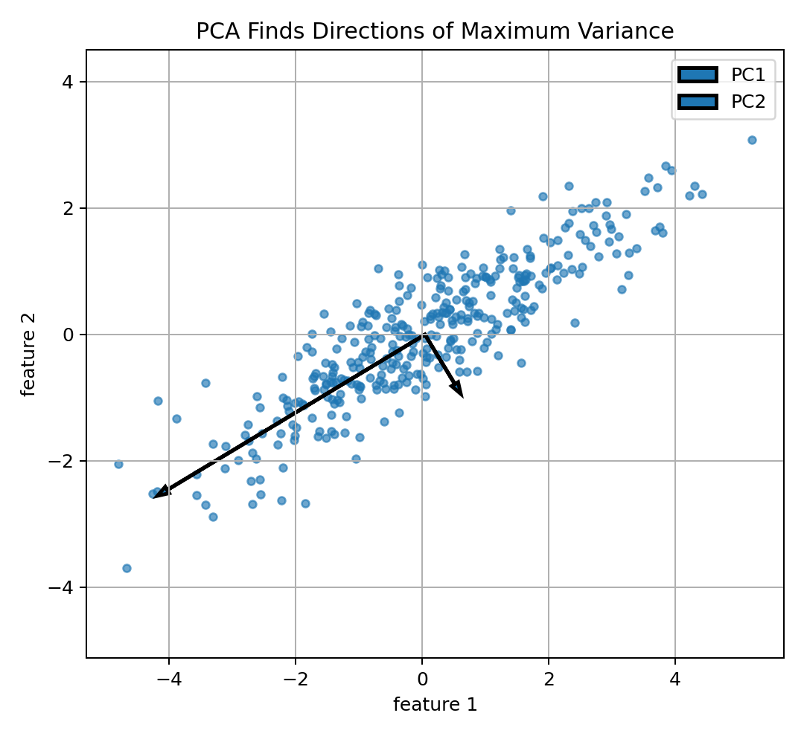
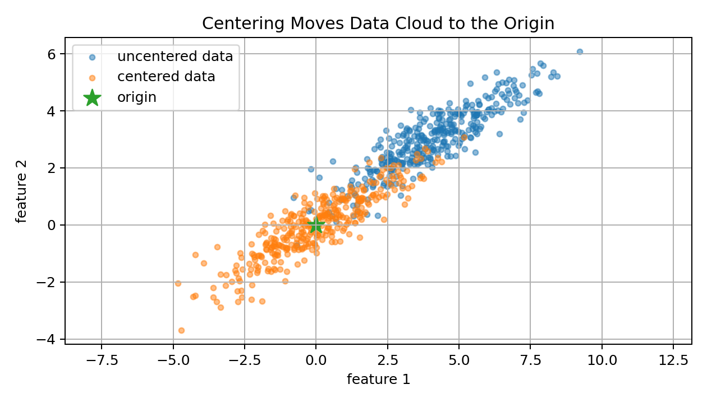
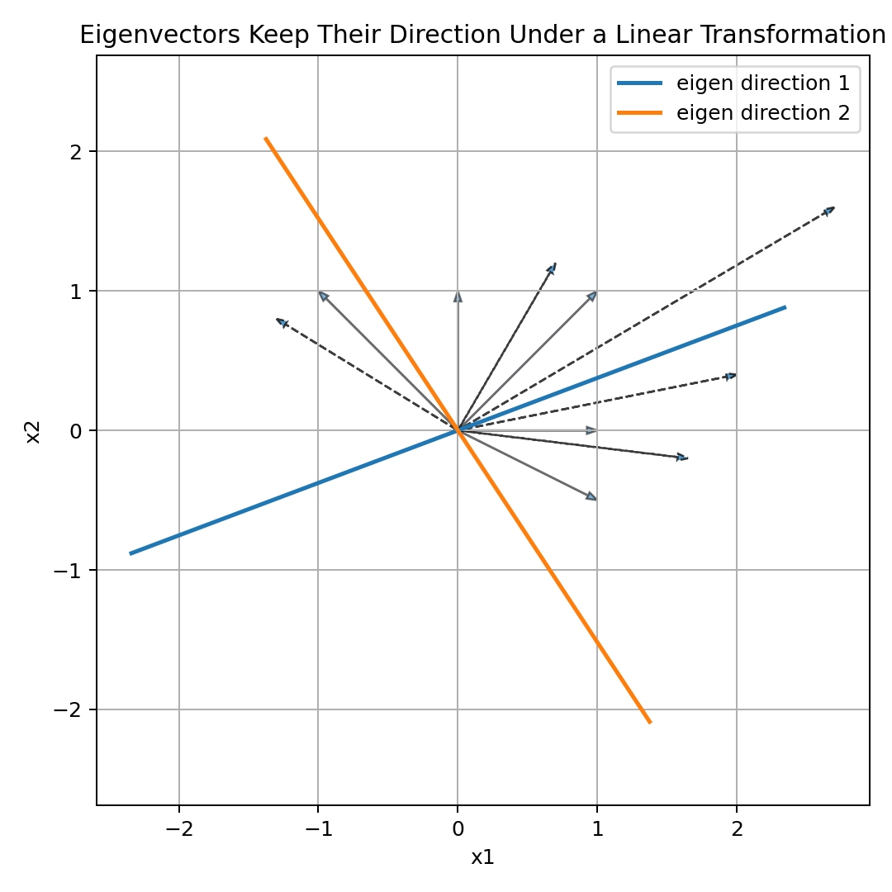
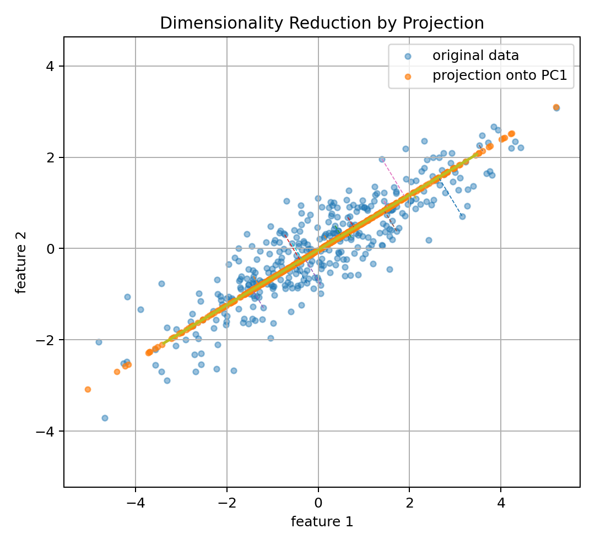
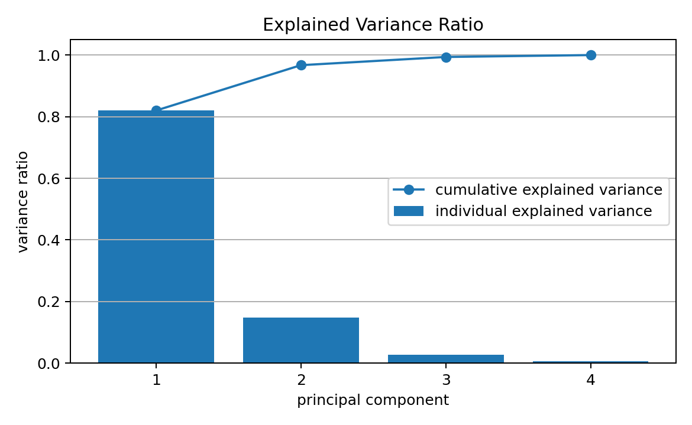
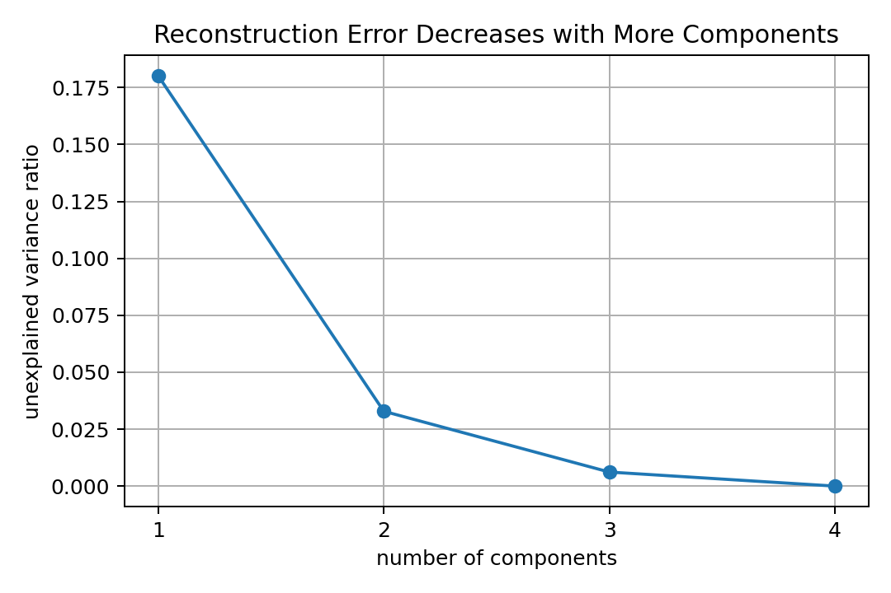
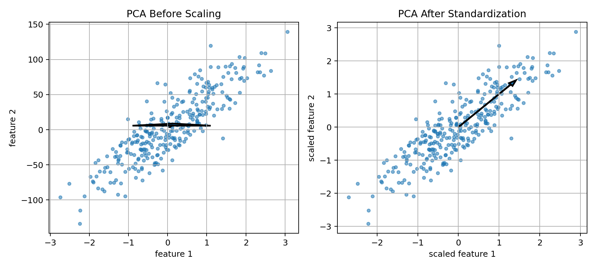
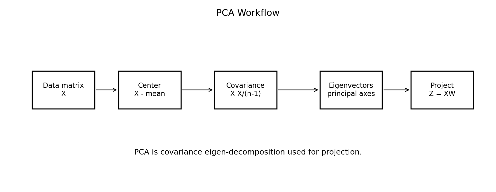
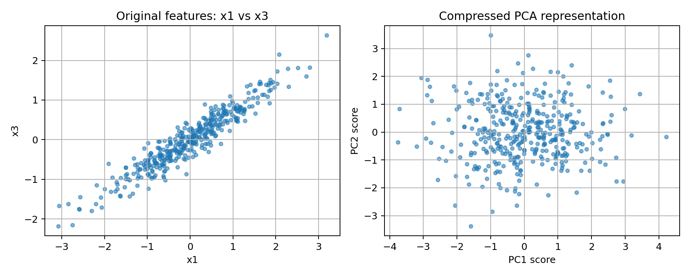
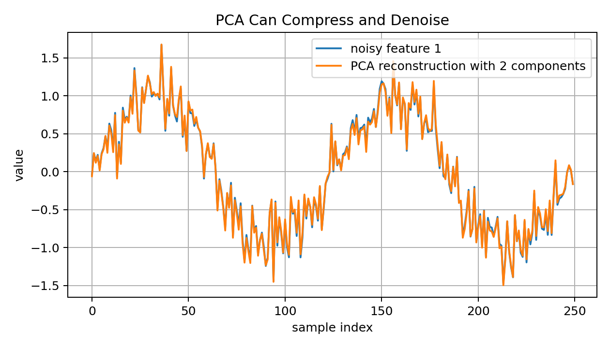

# 11 — Eigenvectors, PCA, and Dimensionality Reduction for Machine Learning

## Why This Lesson Exists

Machine Learning often begins with a dataset that has many features.

Sometimes the number of features is small:

```text
height
weight
age
income
```

But sometimes the number of features is huge:

```text
pixels in an image
words in a document
sensor readings over time
frequency components of a signal
embeddings with hundreds or thousands of dimensions
```

High-dimensional data can be powerful, but it can also be difficult.

It can create problems such as:

```text
noise
redundancy
slow computation
overfitting
hard visualization
distance concentration
correlated features
```

Dimensionality reduction tries to represent data using fewer dimensions while preserving important information.

One of the most important classical methods is **Principal Component Analysis**, or PCA.

PCA is built on linear algebra, especially:

```text
vectors
matrices
covariance
eigenvectors
eigenvalues
projections
variance
```

The central idea is:

> PCA finds the directions in feature space where the data varies the most, then projects the data onto those directions.

This lesson connects linear algebra to real Machine Learning intuition.

---

## 1. The Problem of High Dimensions

Suppose a dataset is represented by a matrix:

$$
X\in\mathbb{R}^{n\times d}
$$

where:

```text
n -> number of samples
d -> number of features
```

If $d$ is large, several issues appear.

### Redundancy

Some features may carry repeated information.

Example:

```text
height in meters
height in centimeters
```

These features are almost the same.

### Noise

Some dimensions may mostly contain measurement noise.

### Visualization difficulty

Humans can visualize 2D and 3D, but not 200D.

### Computation

Many algorithms become slower as the number of features grows.

### Distance problems

In high dimensions, distances can become less informative.

This is one reason dimensionality reduction matters.

---

## 2. What Dimensionality Reduction Tries to Do

Dimensionality reduction tries to transform:

$$
x\in\mathbb{R}^{d}
$$

into:

$$
z\in\mathbb{R}^{k}
$$

where:

$$
k<d
$$

In matrix form:

$$
X\in\mathbb{R}^{n\times d}
$$

becomes:

$$
Z\in\mathbb{R}^{n\times k}
$$

The goal is not just to delete columns randomly.

The goal is to keep meaningful structure.

A good lower-dimensional representation should preserve:

```text
important variation
important geometry
class separation
cluster structure
signal
semantic information
```

Different methods define “important” differently.

PCA defines importance using **variance**.

---

## 3. PCA in One Sentence

Principal Component Analysis finds orthogonal directions where the data has maximum variance.

The first principal component is the direction of greatest variance.

The second principal component is the direction of greatest remaining variance subject to being orthogonal to the first.

The third is the next greatest remaining orthogonal direction, and so on.

So PCA creates a new coordinate system.

In this new coordinate system:

```text
axis 1 -> most variance
axis 2 -> second most variance
axis 3 -> third most variance
```

Visual intuition:



PCA does not use labels.

It is an unsupervised method.

It only looks at the feature matrix $X$.

---

## 4. Why Variance?

Variance measures spread.

If a direction has high variance, the data changes a lot along that direction.

If a direction has low variance, the data barely changes along that direction.

PCA assumes:

> Directions with larger variance contain more important information.

This assumption is often useful, but not always true.

Example where it works:

```text
sensor signal has strong main pattern plus small random noise
```

Example where it may fail:

```text
small-variance direction contains class-separating information
```

So PCA is powerful, but it is not magic.

It is a specific mathematical assumption.

---

## 5. Centering Before PCA

Before PCA, we usually center the data.

For each feature $j$:

$$
\mu_j=\frac{1}{n}\sum_{i=1}^{n}x_{ij}
$$

Then:

$$
x_{ij}^{centered}=x_{ij}-\mu_j
$$

In matrix form:

$$
X_c = X - \mathbf{1}\mu^T
$$

where:

```text
X_c -> centered data matrix
mu  -> vector of feature means
```

Visual intuition:



Why center?

PCA is about directions of variation around the mean.

If the data is not centered, PCA may be affected by the location of the cloud relative to the origin.

Centering makes the mean of each feature zero.

---

## 6. Covariance Matrix

After centering, PCA studies the covariance matrix.

For centered data:

$$
X_c\in\mathbb{R}^{n\times d}
$$

the sample covariance matrix is:

$$
\Sigma
=
\frac{1}{n-1}X_c^T X_c
$$

Shape:

```text
X_c      -> n x d
X_c.T    -> d x n
X_c.T X_c -> d x d
Sigma    -> d x d
```

Each entry:

$$
\Sigma_{ij}
$$

measures how feature $i$ and feature $j$ vary together.

Diagonal entries are variances:

$$
\Sigma_{jj}=\mathrm{Var}(X_j)
$$

Off-diagonal entries are covariances:

$$
\Sigma_{ij}=\mathrm{Cov}(X_i,X_j)
$$

PCA is essentially eigen-decomposition of this covariance matrix.

---

## 7. What Is an Eigenvector?

For a square matrix $A$, an eigenvector is a nonzero vector $v$ such that:

$$
Av=\lambda v
$$

where:

```text
v       -> eigenvector
lambda  -> eigenvalue
```

This equation says:

```text
when A transforms v, the direction of v does not change
only its length is scaled
```

The scalar $\lambda$ tells how much the vector is stretched or compressed.

Visual intuition:



Most vectors change direction under a matrix transformation.

Eigenvectors are special directions that keep their direction.

---

## 8. Eigenvalues and Eigenvectors of the Covariance Matrix

For PCA, the matrix is the covariance matrix:

$$
\Sigma
$$

We solve:

$$
\Sigma v=\lambda v
$$

Here:

```text
v       -> principal direction
lambda  -> variance along that direction
```

This is the key PCA interpretation.

For covariance matrices:

```text
eigenvectors give directions
eigenvalues give amount of variance along those directions
```

The eigenvector with the largest eigenvalue is the first principal component.

The eigenvector with the second largest eigenvalue is the second principal component.

And so on.

---

## 9. Why Eigenvectors Maximize Variance

Let $u$ be a unit vector:

$$
\|u\|_2=1
$$

Project centered data onto $u$:

$$
z=X_cu
$$

The variance of projected data is:

$$
\mathrm{Var}(z)
=
\frac{1}{n-1}z^Tz
$$

Substitute:

$$
z=X_cu
$$

Then:

$$
\mathrm{Var}(z)
=
\frac{1}{n-1}(X_cu)^T(X_cu)
$$

Rewrite:

$$
\mathrm{Var}(z)
=
u^T
\left(
\frac{1}{n-1}X_c^TX_c
\right)
u
$$

So:

$$
\mathrm{Var}(z)=u^T\Sigma u
$$

PCA wants the direction $u$ that maximizes this variance:

$$
\max_{\|u\|=1}u^T\Sigma u
$$

The solution is the eigenvector of $\Sigma$ with the largest eigenvalue.

This is why eigenvectors appear naturally in PCA.

---

## 10. Projection onto Principal Components

Suppose I keep the first $k$ principal components.

Put them into a matrix:

$$
W_k=
\begin{bmatrix}
| & | & & | \\
v_1 & v_2 & \dots & v_k \\
| & | & & |
\end{bmatrix}
$$

where:

$$
W_k\in\mathbb{R}^{d\times k}
$$

The reduced representation is:

$$
Z=X_cW_k
$$

Shape:

```text
X_c -> n x d
W_k -> d x k
Z   -> n x k
```

So each original $d$-dimensional sample becomes a $k$-dimensional vector.

Visual intuition:



Projection is the mathematical act of expressing data in the new PCA coordinate system.

---

## 11. Reconstruction

If I have the reduced representation:

$$
Z=X_cW_k
$$

I can approximately reconstruct the centered data:

$$
\hat{X}_c=ZW_k^T
$$

Then add back the mean:

$$
\hat{X}=\hat{X}_c+\mu
$$

If $k=d$, reconstruction is exact.

If $k<d$, reconstruction loses information.

PCA chooses the $k$-dimensional linear subspace that minimizes squared reconstruction error.

This is another deep interpretation:

> PCA is the best linear compression method under squared reconstruction error.

---

## 12. Explained Variance

Each eigenvalue tells how much variance is explained by its principal component.

If eigenvalues are:

$$
\lambda_1,\lambda_2,\dots,\lambda_d
$$

then total variance is:

$$
\sum_{j=1}^{d}\lambda_j
$$

Explained variance ratio for component $j$ is:

$$
\frac{\lambda_j}{\sum_{m=1}^{d}\lambda_m}
$$

Visual:



Cumulative explained variance tells how much total variance is kept by the first $k$ components:

$$
\frac{\sum_{j=1}^{k}\lambda_j}
{\sum_{j=1}^{d}\lambda_j}
$$

This helps choose $k$.

---

## 13. Reconstruction Error and Choosing k

If I keep only $k$ components, the lost variance is:

$$
\sum_{j=k+1}^{d}\lambda_j
$$

The unexplained variance ratio is:

$$
1-
\frac{\sum_{j=1}^{k}\lambda_j}
{\sum_{j=1}^{d}\lambda_j}
$$

Visual:



Common practical rule:

```text
choose k so cumulative explained variance is around 90%, 95%, or 99%
```

But this rule is not universal.

Sometimes a small-variance component may be important for prediction.

So $k$ should be chosen using both explained variance and downstream validation.

---

## 14. PCA and Scaling

PCA is sensitive to feature scale.

If one feature has much larger numerical values than others, it can dominate variance.

Example:

```text
feature 1: age from 18 to 80
feature 2: income from 0 to 100000
```

Income may dominate PCA just because of scale.

Visual:



If features have different units, standardization is often needed:

$$
z_{ij}=\frac{x_{ij}-\mu_j}{\sigma_j}
$$

Then PCA is applied to standardized features.

Important:

```text
PCA on covariance matrix is scale-sensitive.
PCA on correlation matrix is like PCA after standardization.
```

---

## 15. PCA Algorithm Step by Step

Given:

$$
X\in\mathbb{R}^{n\times d}
$$

### Step 1: Center the data

$$
X_c=X-\mu
$$

### Step 2: Compute covariance matrix

$$
\Sigma=\frac{1}{n-1}X_c^TX_c
$$

### Step 3: Compute eigenvalues and eigenvectors

$$
\Sigma v_j=\lambda_jv_j
$$

### Step 4: Sort by eigenvalues

Sort:

$$
\lambda_1\geq\lambda_2\geq\dots\geq\lambda_d
$$

### Step 5: Choose top k eigenvectors

$$
W_k=[v_1,\dots,v_k]
$$

### Step 6: Project

$$
Z=X_cW_k
$$

Visual workflow:



This is PCA from covariance eigen-decomposition.

---

## 16. PCA with SVD

In practice, PCA is often computed using Singular Value Decomposition, or SVD.

For centered data:

$$
X_c=U S V^T
$$

where:

```text
U -> left singular vectors
S -> singular values
V -> right singular vectors
```

The columns of $V$ are principal directions.

The covariance matrix is:

$$
\Sigma=\frac{1}{n-1}X_c^TX_c
$$

Substitute SVD:

$$
X_c^TX_c
=
(VS^TU^T)(USV^T)
=
VS^2V^T
$$

So eigenvalues of covariance are:

$$
\lambda_j=\frac{s_j^2}{n-1}
$$

where $s_j$ are singular values.

This is why SVD and PCA are deeply connected.

Many libraries use SVD because it is numerically stable.

---

## 17. PCA as Rotation of Coordinate System

PCA can be seen as rotating the coordinate system.

Original coordinates:

```text
feature 1
feature 2
feature 3
...
```

PCA coordinates:

```text
principal component 1
principal component 2
principal component 3
...
```

Each principal component is a linear combination of original features.

If:

$$
v_1=[0.6,0.8]
$$

then the first PC score for sample $x$ is:

$$
z_1=x^Tv_1
$$

This means:

```text
PC1 is 0.6 times feature 1 plus 0.8 times feature 2
```

So PCA creates new features.

These new features are ordered by variance.

---

## 18. PCA Components Are Orthogonal

The principal components are orthogonal:

$$
v_i^Tv_j=0
$$

for:

$$
i\neq j
$$

This means the new axes are perpendicular.

The projected PCA features are uncorrelated.

This is useful because PCA removes linear correlation in the transformed coordinates.

However:

```text
uncorrelated does not always mean independent
```

Independence is stronger than zero correlation.

---

## 19. PCA for Visualization

PCA is often used to visualize high-dimensional data in 2D or 3D.

For example:

```text
embedding vectors -> PCA to 2D
image features -> PCA to 2D
gene expression data -> PCA to 2D
seismic signal features -> PCA to 2D
```

The reduced 2D plot may reveal:

```text
clusters
outliers
class separation
data drift
batch effects
```

But PCA visualization should be interpreted carefully.

A 2D projection can hide structure that exists in higher dimensions.

---

## 20. PCA for Compression

PCA can compress data.

If original data has:

$$
d=1000
$$

features, and I keep:

$$
k=50
$$

components, each sample is represented by 50 numbers instead of 1000.

Compression is useful for:

```text
storage
speed
noise reduction
downstream modeling
visualization
```

Visual intuition:



Compression works well when data lies near a lower-dimensional linear subspace.

---

## 21. PCA for Denoising

Noise often appears in low-variance directions.

If I keep only high-variance components and discard low-variance components, PCA can reduce noise.

Visual:



This is not always safe.

If important signal lies in low-variance directions, PCA may remove useful information.

So PCA denoising depends on the assumption:

```text
signal has higher variance than noise
```

---

## 22. PCA and Supervised Learning

PCA is unsupervised.

It does not use labels.

This means PCA may preserve directions with high feature variance even if they are not useful for predicting the target.

Example:

```text
PC1 explains 80% of feature variance
but class separation happens mostly along PC3
```

So PCA before supervised learning should be validated carefully.

A good workflow:

```text
fit PCA only on training data
transform train, validation, and test
train model
evaluate downstream performance
```

Never fit PCA on the full dataset before train-test split.

That causes data leakage.

---

## 23. PCA and Data Leakage

PCA learns from data.

It computes means, variances, covariances, and principal directions.

If I fit PCA before splitting data, information from the test set influences the representation.

This is leakage.

Wrong:

```text
fit PCA on full dataset
then split train/test
```

Correct:

```text
split train/test
fit PCA on train only
transform train/test using train-fitted PCA
```

This rule also applies to scaling.

Any preprocessing step that learns from data must be fitted only on training data.

---

## 24. PCA vs Feature Selection

PCA is feature extraction.

It creates new features as linear combinations of original features.

Feature selection chooses a subset of original features.

Difference:

```text
PCA -> new compressed features, less interpretable
feature selection -> original features, more interpretable
```

PCA may improve performance or speed but can reduce interpretability.

If interpretability matters, feature selection may be preferable.

---

## 25. PCA vs t-SNE and UMAP

PCA is linear.

It finds linear projections.

t-SNE and UMAP are nonlinear visualization methods.

They can reveal nonlinear structure, but they are more complex and often harder to interpret globally.

PCA is usually a good first dimensionality reduction method because it is:

```text
fast
deterministic
mathematically transparent
useful as baseline
easy to explain
```

For serious analysis, PCA should often be tried before more complex methods.

---

## 26. PCA from Scratch in NumPy

```python
import numpy as np

def pca_fit(X, n_components):
    mean = X.mean(axis=0)
    X_centered = X - mean

    covariance = (X_centered.T @ X_centered) / (X.shape[0] - 1)

    eigenvalues, eigenvectors = np.linalg.eigh(covariance)

    order = np.argsort(eigenvalues)[::-1]
    eigenvalues = eigenvalues[order]
    eigenvectors = eigenvectors[:, order]

    components = eigenvectors[:, :n_components]
    explained_variance = eigenvalues[:n_components]
    explained_variance_ratio = explained_variance / eigenvalues.sum()

    return mean, components, explained_variance, explained_variance_ratio
```

Why `np.linalg.eigh`?

Covariance matrices are symmetric.

For symmetric matrices, `eigh` is more appropriate and stable than general eigen-decomposition.

---

## 27. PCA Transform

After fitting PCA:

$$
Z=X_cW_k
$$

Code:

```python
def pca_transform(X, mean, components):
    X_centered = X - mean
    return X_centered @ components
```

Here:

```text
X -> n x d
components -> d x k
Z -> n x k
```

This is the reduced representation.

---

## 28. PCA Reconstruction

Approximate reconstruction:

$$
\hat{X}=ZW_k^T+\mu
$$

Code:

```python
def pca_inverse_transform(Z, mean, components):
    return Z @ components.T + mean
```

Reconstruction error:

$$
\frac{1}{n}\sum_{i=1}^{n}\|x_i-\hat{x}_i\|_2^2
$$

This measures how much information was lost by compression.

---

## 29. PCA with Scikit-Learn

In real projects, I usually use Scikit-learn.

```python
from sklearn.decomposition import PCA
from sklearn.preprocessing import StandardScaler
from sklearn.pipeline import Pipeline

pipeline = Pipeline([
    ("scaler", StandardScaler()),
    ("pca", PCA(n_components=2))
])

Z = pipeline.fit_transform(X_train)
Z_test = pipeline.transform(X_test)
```

The pipeline prevents mistakes.

It ensures scaling and PCA are fitted on training data and then applied consistently.

---

## 30. Mathematical Summary

Data matrix:

$$
X\in\mathbb{R}^{n\times d}
$$

Centered data:

$$
X_c=X-\mu
$$

Covariance matrix:

$$
\Sigma=\frac{1}{n-1}X_c^TX_c
$$

Eigen-decomposition:

$$
\Sigma v_j=\lambda_jv_j
$$

Principal directions:

$$
v_1,\dots,v_k
$$

Projection matrix:

$$
W_k=[v_1,\dots,v_k]
$$

Reduced data:

$$
Z=X_cW_k
$$

Reconstruction:

$$
\hat{X}=ZW_k^T+\mu
$$

Explained variance ratio:

$$
\frac{\lambda_j}{\sum_m\lambda_m}
$$

This is the core of PCA.

---

## 31. Common Mistakes

### Mistake 1: Not centering the data

PCA should usually be applied to centered data.

### Mistake 2: Forgetting scaling

If features have different units, PCA may be dominated by large-scale features.

### Mistake 3: Fitting PCA before train-test split

This causes data leakage.

### Mistake 4: Thinking PCA uses labels

PCA is unsupervised. It does not know the target.

### Mistake 5: Assuming high variance always means useful for prediction

High variance does not always mean predictive.

### Mistake 6: Overinterpreting 2D PCA plots

A 2D projection may hide important high-dimensional structure.

### Mistake 7: Thinking PCA components are original features

Principal components are linear combinations of original features.

---

## 32. What I Learned From This Lesson

Eigenvectors are directions that keep their direction under a linear transformation.

For covariance matrices, eigenvectors give principal directions of variation.

Eigenvalues tell how much variance exists along those directions.

PCA uses these eigenvectors to create a new coordinate system.

Dimensionality reduction projects data into fewer dimensions.

Important ideas:

```text
high-dimensional data
dimensionality reduction
centering
covariance matrix
eigenvectors
eigenvalues
principal components
projection
reconstruction
explained variance
SVD
scaling
data leakage
compression
denoising
visualization
```

The central lesson is:

```text
PCA is the geometry of variance turned into a dimensionality reduction algorithm.
```

---

## Mini Exercise

Create a file called `11-eigenvectors-pca-dimensionality-reduction.py` inside the `code` folder.

Write code that:

```text
1. creates a 2D correlated dataset
2. centers the dataset
3. computes the covariance matrix
4. computes eigenvalues and eigenvectors
5. sorts eigenvectors by eigenvalues
6. projects the data onto the first principal component
7. reconstructs the data from one component
8. computes reconstruction error
9. computes explained variance ratio
10. compares PCA before and after standardization
```

Then answer:

```text
What is an eigenvector?
What does an eigenvalue mean in PCA?
Why must data be centered before PCA?
Why can scaling change PCA results?
What does explained variance ratio mean?
Why can PCA cause data leakage?
When can PCA remove useful information?
```

---

## Further Reading and Resources

### Books

- [Mathematics for Machine Learning by Deisenroth, Faisal, and Ong](https://mml-book.github.io/)
- [Linear Algebra and Learning from Data by Gilbert Strang](https://math.mit.edu/~gs/learningfromdata/)
- [Introduction to Linear Algebra by Gilbert Strang](https://math.mit.edu/~gs/linearalgebra/)
- [An Introduction to Statistical Learning](https://www.statlearning.com/)
- [The Elements of Statistical Learning](https://hastie.su.domains/ElemStatLearn/)

### Visual Learning

- [3Blue1Brown: Eigenvectors and Eigenvalues](https://www.3blue1brown.com/lessons/eigenvalues)
- [3Blue1Brown: Change of Basis](https://www.3blue1brown.com/lessons/change-of-basis)
- [StatQuest: PCA](https://www.youtube.com/@statquest)
- [MIT OpenCourseWare: Linear Algebra](https://ocw.mit.edu/courses/18-06-linear-algebra-spring-2010/)

### ML Connections

- [Scikit-learn: PCA](https://scikit-learn.org/stable/modules/decomposition.html#pca)
- [Scikit-learn: Decomposing Signals in Components](https://scikit-learn.org/stable/modules/decomposition.html)
- [Scikit-learn: Pipeline](https://scikit-learn.org/stable/modules/compose.html#pipeline)
- [Scikit-learn: StandardScaler](https://scikit-learn.org/stable/modules/generated/sklearn.preprocessing.StandardScaler.html)

### What to Study Next

The next math lesson should be:

```text
12 — Information Theory for Machine Learning
```

That lesson will connect entropy, cross-entropy, KL divergence, information gain, decision trees, compression, and language models.

---

## Final Reflection

PCA is one of the best examples of Machine Learning mathematics becoming an algorithm.

Variance comes from statistics.

Covariance comes from probability and linear algebra.

Eigenvectors come from matrix theory.

Projection comes from geometry.

Dimensionality reduction comes from learning.

All of these ideas meet inside PCA.

That is why PCA is not just a technique.

It is a beautiful bridge between mathematical thinking and practical data understanding.
