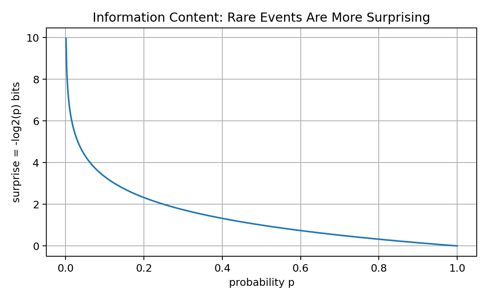
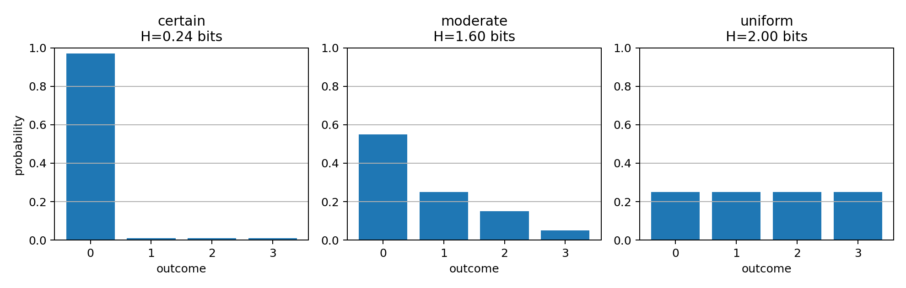
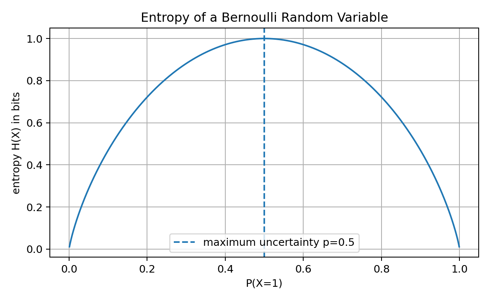
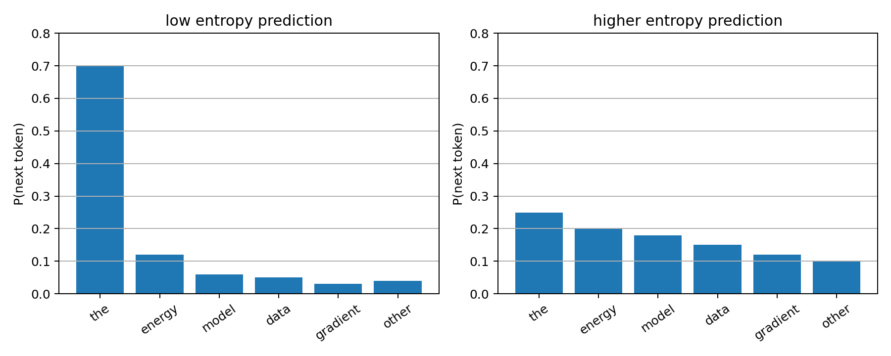
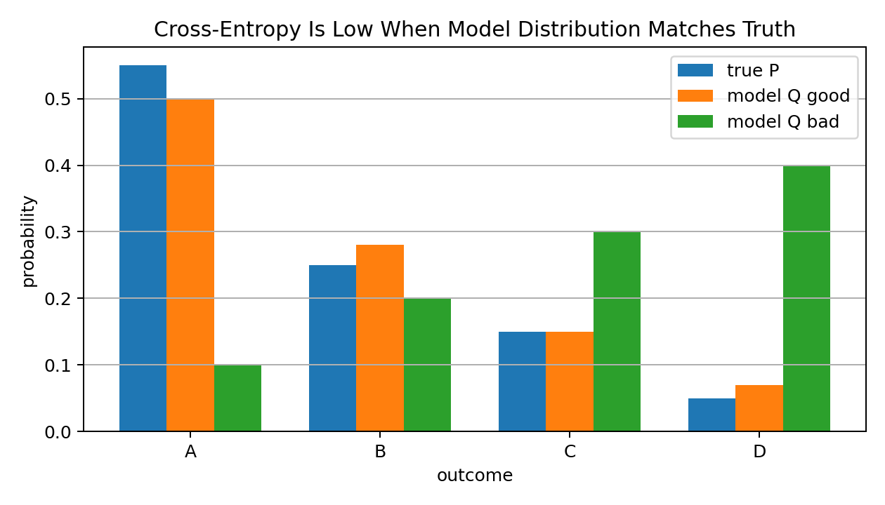
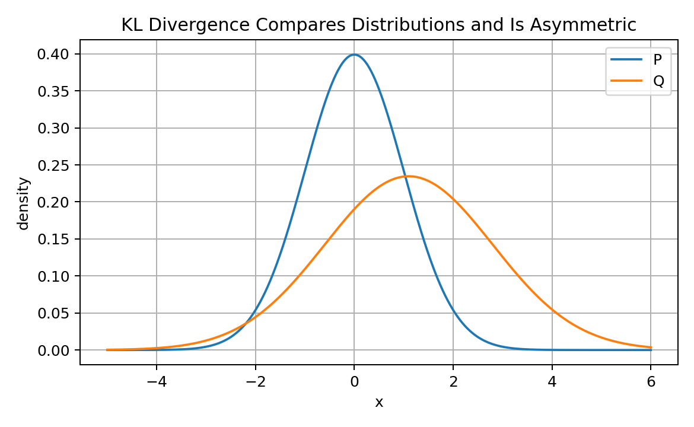
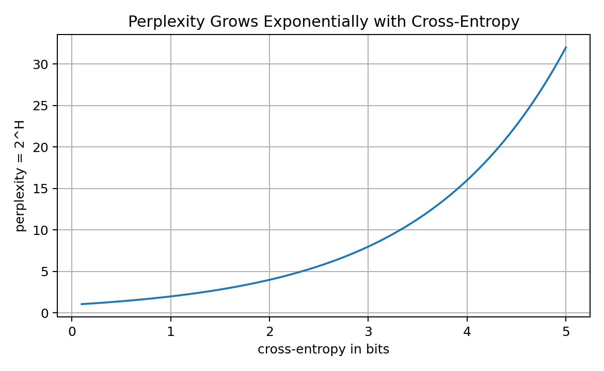
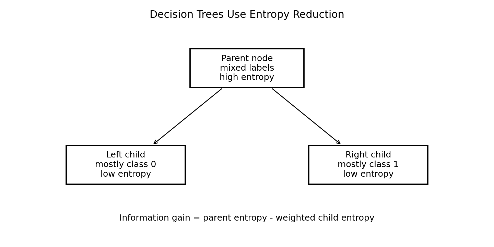
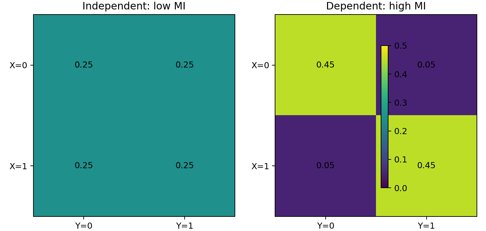

# 12 — Information Theory for Machine Learning

## Why This Lesson Exists

Machine Learning is not only about numbers, models, and optimization. It is also about information.

A dataset contains information about a pattern.

A feature may contain information about a target.

A decision tree split is useful if it gives information about class labels.

A probability distribution has uncertainty.

A classifier is trained by reducing uncertainty about the correct class.

A language model predicts the next token by learning probability distributions over words or tokens.

These ideas belong to **information theory**.

Information theory gives mathematical language for questions like:

```text
How surprising is this event?
How uncertain is this distribution?
How much information does a feature give about a label?
How different are two probability distributions?
How good is a predicted probability distribution?
How much compression is possible?
Why does cross-entropy appear in classification and language modeling?
```

The central idea is:

> Information theory measures uncertainty, surprise, and distribution mismatch.

This lesson is deep because information theory connects many ML topics:

```text
cross-entropy loss
classification
decision trees
KL divergence
language models
perplexity
feature selection
mutual information
compression
representation learning
```

After this lesson, cross-entropy should not feel like a random formula. It should feel like a natural measure of how well a model’s predicted distribution matches reality.

---

## 1. Information as Surprise

Information theory begins with a simple intuition:

```text
rare events are more surprising than common events
```

If an event has probability:

$$
p
$$

then its information content, or surprise, is:

$$
I(p)=-\log_2(p)
$$

The unit is **bits** when log base 2 is used.

Visual intuition:



Examples:

If:

$$
p=1
$$

then:

$$
I(p)=-\log_2(1)=0
$$

A certain event gives no surprise.

If:

$$
p=\frac{1}{2}
$$

then:

$$
I(p)=1
$$

This means one bit of information.

If:

$$
p=\frac{1}{8}
$$

then:

$$
I(p)=3
$$

A rarer event carries more information when it happens.

---

## 2. Why Logarithms Appear

The information content is:

$$
-\log(p)
$$

because logs have a very important property:

$$
\log(ab)=\log(a)+\log(b)
$$

For independent events $A$ and $B$:

$$
P(A\cap B)=P(A)P(B)
$$

Information should add for independent events.

So:

$$
I(A\cap B)
=
-\log(P(A)P(B))
$$

Using the log product rule:

$$
I(A\cap B)
=
-\log P(A)-\log P(B)
$$

Therefore:

$$
I(A\cap B)=I(A)+I(B)
$$

This is one reason logs are natural for information.

Information from independent events adds.

---

## 3. Bits, Nats, and Log Bases

The unit depends on the logarithm base.

### Base 2

$$
-\log_2(p)
$$

Unit:

```text
bits
```

### Base e

$$
-\ln(p)
$$

Unit:

```text
nats
```

### Base 10

$$
-\log_{10}(p)
$$

Unit:

```text
hartleys
```

Machine Learning libraries usually use natural logarithms because calculus with $e$ is convenient.

So losses like cross-entropy are often measured in nats.

But the conceptual idea is the same.

Changing log base only rescales the value.

---

## 4. Entropy

Entropy is the expected surprise of a random variable.

For a discrete random variable $X$ with distribution $p(x)$:

$$
H(X)
=
-\sum_x p(x)\log_2 p(x)
$$

Equivalently:

$$
H(X)
=
\mathbb{E}_{X\sim p}[-\log_2 p(X)]
$$

So entropy means:

```text
average amount of surprise before seeing the outcome
```

If the outcome is almost certain, entropy is low.

If many outcomes are equally likely, entropy is high.

Visual comparison:



Entropy is not disorder in a vague poetic sense. In ML, it is a precise measure of uncertainty in a probability distribution.

---

## 5. Bernoulli Entropy

For a Bernoulli random variable:

$$
X\sim\mathrm{Bernoulli}(p)
$$

the entropy is:

$$
H(X)
=
-
p\log_2 p
-
(1-p)\log_2(1-p)
$$

Visual:



When:

$$
p=0
$$

or:

$$
p=1
$$

the outcome is certain, so entropy is zero.

When:

$$
p=0.5
$$

the outcome is maximally uncertain, so entropy is maximum.

For a fair coin:

$$
H(X)=1 \text{ bit}
$$

This means one fair coin toss gives one bit of information on average.

---

## 6. Maximum Entropy

A uniform distribution has maximum entropy among distributions over a fixed finite set.

If there are $K$ equally likely outcomes:

$$
p(x)=\frac{1}{K}
$$

then entropy is:

$$
H(X)
=
-\sum_{x=1}^{K}
\frac{1}{K}
\log_2\left(\frac{1}{K}\right)
$$

Since there are $K$ terms:

$$
H(X)
=
-\log_2\left(\frac{1}{K}\right)
=
\log_2 K
$$

So if there are 8 equally likely outcomes:

$$
H(X)=\log_2(8)=3 \text{ bits}
$$

Interpretation:

```text
I need 3 yes/no questions to identify one of 8 equally likely outcomes.
```

This connects entropy to compression and coding.

---

## 7. Entropy in Machine Learning

Entropy appears in ML in several ways.

### Classification uncertainty

If a model predicts:

```text
cat: 0.99
dog: 0.01
```

entropy is low.

If it predicts:

```text
cat: 0.50
dog: 0.50
```

entropy is high.

High entropy means the model is uncertain.

### Decision trees

A split is useful if it reduces label entropy.

### Reinforcement learning

Entropy can encourage exploration.

### Language models

Next-token entropy measures uncertainty over possible next tokens.

Visual:



A sharp distribution means the model strongly expects one token.

A flat distribution means the model is uncertain.

---

## 8. Cross-Entropy

Entropy measures uncertainty under the true distribution $P$.

Cross-entropy measures how many bits are needed on average if the true distribution is $P$, but we use another distribution $Q$ to encode or predict outcomes.

Definition:

$$
H(P,Q)
=
-\sum_x P(x)\log Q(x)
$$

Read this carefully:

```text
expectation is taken under P
but the log probability comes from Q
```

In ML:

```text
P -> true label distribution
Q -> model predicted distribution
```

If $Q$ assigns high probability to outcomes that actually happen under $P$, cross-entropy is low.

If $Q$ assigns low probability to true outcomes, cross-entropy is high.

Visual:



This is why cross-entropy is a natural training loss for probabilistic classifiers.

---

## 9. Cross-Entropy for One-Hot Labels

In classification, the true label is often one-hot.

Suppose there are $K$ classes and the true class is $c$.

The true distribution $P$ is:

$$
P(c)=1
$$

and:

$$
P(k)=0
$$

for:

$$
k\neq c
$$

Cross-entropy becomes:

$$
H(P,Q)
=
-\sum_{k=1}^{K}P(k)\log Q(k)
$$

Only the true class term remains:

$$
H(P,Q)=-\log Q(c)
$$

So classification cross-entropy is:

```text
negative log probability assigned to the true class
```

If the model assigns high probability to the correct class, loss is low.

If it assigns low probability to the correct class, loss is high.

---

## 10. Binary Cross-Entropy as Information Loss

For binary classification:

$$
y\in\{0,1\}
$$

and predicted probability:

$$
p=P(y=1\mid x)
$$

binary cross-entropy is:

$$
\ell(y,p)
=
-
[
y\log p
+
(1-y)\log(1-p)
]
$$

If $y=1$:

$$
\ell=-\log p
$$

If $y=0$:

$$
\ell=-\log(1-p)
$$

This is exactly the information penalty for assigning low probability to the observed label.

So cross-entropy is not only an optimization trick.

It is the average surprise of the true labels under the model's predicted probabilities.

---

## 11. KL Divergence

KL divergence measures how different one probability distribution is from another.

Definition:

$$
D_{KL}(P\|Q)
=
\sum_x
P(x)
\log
\frac{P(x)}{Q(x)}
$$

It can also be written as:

$$
D_{KL}(P\|Q)
=
\sum_x P(x)\log P(x)
-
\sum_x P(x)\log Q(x)
$$

Using entropy and cross-entropy:

$$
D_{KL}(P\|Q)=H(P,Q)-H(P)
$$

This means:

```text
KL divergence = extra coding cost from using Q instead of true P
```

KL divergence is always nonnegative:

$$
D_{KL}(P\|Q)\geq 0
$$

and:

$$
D_{KL}(P\|Q)=0
$$

only when:

$$
P=Q
$$

---

## 12. KL Divergence Is Not Symmetric

KL divergence is not a distance metric because:

$$
D_{KL}(P\|Q)\neq D_{KL}(Q\|P)
$$

in general.

Visual intuition:



The direction matters.

$D_{KL}(P\|Q)$ asks:

```text
How bad is it to use Q when data really comes from P?
```

$D_{KL}(Q\|P)$ asks a different question:

```text
How bad is it to use P when data really comes from Q?
```

This asymmetry matters in variational inference, generative modeling, and distribution matching.

---

## 13. Cross-Entropy Minimization and KL Minimization

Cross-entropy decomposes as:

$$
H(P,Q)=H(P)+D_{KL}(P\|Q)
$$

When training a model, $P$ is the true data distribution.

The term:

$$
H(P)
$$

does not depend on the model.

So minimizing:

$$
H(P,Q)
$$

with respect to $Q$ is equivalent to minimizing:

$$
D_{KL}(P\|Q)
$$

This is a deep reason cross-entropy works:

```text
training with cross-entropy tries to make the model distribution Q close to the true distribution P
```

In practice, we do not know $P$ exactly.

We approximate it using the training data.

---

## 14. Negative Log-Likelihood and Cross-Entropy

For a dataset:

$$
\mathcal{D}=\{(x_i,y_i)\}_{i=1}^{n}
$$

a probabilistic model predicts:

$$
q_\theta(y_i\mid x_i)
$$

The negative log-likelihood is:

$$
-\sum_{i=1}^{n}
\log q_\theta(y_i\mid x_i)
$$

Average negative log-likelihood is:

$$
-\frac{1}{n}
\sum_{i=1}^{n}
\log q_\theta(y_i\mid x_i)
$$

For classification with one-hot labels, this is cross-entropy.

So:

```text
cross-entropy loss = average negative log-likelihood for classification
```

This connects information theory, probability, and optimization.

---

## 15. Perplexity

Perplexity is commonly used in language modeling.

If cross-entropy is measured in bits:

$$
\mathrm{Perplexity}=2^{H}
$$

If cross-entropy is measured in nats:

$$
\mathrm{Perplexity}=e^{H}
$$

Visual:



Interpretation:

```text
perplexity is the effective average number of choices the model is uncertain between
```

If perplexity is 10, the model behaves as if it is choosing among about 10 equally likely options on average.

Lower perplexity means the model assigns higher probability to the correct next token.

---

## 16. Entropy and Compression

Entropy gives a theoretical lower bound on average code length.

If a source has entropy:

$$
H(X)
$$

then, under ideal coding, the average number of bits needed per symbol cannot be lower than:

$$
H(X)
$$

This connects information theory to compression.

Common outcomes should receive shorter codes.

Rare outcomes receive longer codes.

This idea is also connected to machine learning:

```text
a good probabilistic model compresses data well
```

Why?

Because if the model assigns high probability to observed data, the negative log probability is low, meaning fewer bits are needed to encode the data.

This is the compression view of learning.

---

## 17. Information Gain

Information gain measures entropy reduction.

In decision trees, suppose a node has label entropy:

$$
H(Y)
$$

After splitting by feature $X$, the conditional entropy is:

$$
H(Y\mid X)
$$

Information gain is:

$$
IG(Y,X)=H(Y)-H(Y\mid X)
$$

Visual intuition:



A good split makes child nodes purer.

Pure nodes have low entropy.

So decision trees choose splits that reduce uncertainty about the label.

---

## 18. Conditional Entropy

Conditional entropy measures remaining uncertainty in $Y$ after knowing $X$.

Definition:

$$
H(Y\mid X)
=
-\sum_x P(x)
\sum_y
P(y\mid x)\log P(y\mid x)
$$

Interpretation:

```text
how uncertain am I about Y after observing X?
```

If $X$ perfectly determines $Y$:

$$
H(Y\mid X)=0
$$

If $X$ gives no information about $Y$:

$$
H(Y\mid X)=H(Y)
$$

This leads directly to mutual information.

---

## 19. Mutual Information

Mutual information measures how much knowing one variable reduces uncertainty about another.

Definition:

$$
I(X;Y)=H(Y)-H(Y\mid X)
$$

Equivalent form:

$$
I(X;Y)
=
\sum_{x,y}
P(x,y)
\log
\frac{P(x,y)}{P(x)P(y)}
$$

Visual intuition:



If $X$ and $Y$ are independent:

$$
P(x,y)=P(x)P(y)
$$

then:

$$
I(X;Y)=0
$$

If $X$ strongly predicts $Y$, mutual information is high.

In ML, mutual information appears in:

```text
feature selection
representation learning
self-supervised learning
information bottleneck
decision trees
dependence measurement
```

---

## 20. Mutual Information vs Correlation

Correlation measures linear relationship.

Mutual information measures general statistical dependence.

If two variables have a nonlinear relationship, correlation may be near zero while mutual information is positive.

Example:

$$
Y=X^2
$$

If $X$ is symmetric around zero, correlation between $X$ and $Y$ may be near zero.

But $X$ clearly gives information about $Y$.

So mutual information is more general than correlation.

However, estimating mutual information from finite data can be difficult.

---

## 21. Information Theory in Decision Trees

Decision trees often use entropy or Gini impurity to choose splits.

Entropy impurity:

$$
H(Y)
=
-\sum_c p_c\log p_c
$$

Information gain:

$$
IG=H(parent)-\sum_{child}
\frac{n_{child}}{n_{parent}}
H(child)
$$

A split is good if it creates child nodes with lower entropy.

In simple words:

```text
before split: labels are mixed
after split: labels are more pure
information gain: uncertainty reduced
```

This is information theory directly inside a classical ML algorithm.

---

## 22. Information Theory in Neural Networks

Neural networks often use cross-entropy loss.

For classification:

$$
\mathcal{L}
=
-\sum_k y_k\log p_k
$$

This trains the network to assign high probability to the correct class.

In representation learning, information ideas appear in:

```text
contrastive learning
mutual information maximization
information bottleneck
compression
self-supervised objectives
```

Even when not explicitly named, information theory is often behind the objective.

---

## 23. Information Theory in Language Models

Language models estimate:

$$
P(w_t\mid w_{<t})
$$

The training loss is usually token-level negative log-likelihood:

$$
-\log P(w_t\mid w_{<t})
$$

Average over tokens gives cross-entropy.

The model improves by assigning higher probability to the observed next token.

Sequence probability decomposes as:

$$
P(w_1,w_2,\dots,w_T)
=
\prod_{t=1}^{T}
P(w_t\mid w_{<t})
$$

Log probability:

$$
\log P(w_1,\dots,w_T)
=
\sum_{t=1}^{T}
\log P(w_t\mid w_{<t})
$$

This is why language model loss is deeply information-theoretic.

---

## 24. Information Theory and RAG

In Retrieval-Augmented Generation, the system retrieves documents to reduce uncertainty.

Before retrieval, the model may be uncertain about an answer.

After retrieving relevant context, uncertainty should decrease.

Information-theoretic interpretation:

```text
use retrieved context to reduce uncertainty about the output
```

Embeddings, retrieval scores, reranking, and grounding are not usually written directly as entropy formulas in simple systems, but the conceptual goal is information gain.

A retrieved document is useful if it provides information relevant to the query.

---

## 25. Information Bottleneck Intuition

The information bottleneck idea asks for representations that keep useful information and discard irrelevant information.

A representation $Z$ of input $X$ should:

```text
preserve information about target Y
discard unnecessary information about X
```

Conceptually:

$$
\text{keep } I(Z;Y) \text{ high}
$$

while:

$$
\text{keep } I(Z;X) \text{ controlled}
$$

This is a deep idea behind representation learning, compression, and generalization.

In simple words:

```text
a good representation should remember what matters and forget what does not
```

---

## 26. Entropy and Model Confidence

Entropy can measure uncertainty in a model's predicted distribution.

For predicted probabilities:

$$
p_1,p_2,\dots,p_K
$$

prediction entropy is:

$$
H(p)
=
-\sum_{k=1}^{K}
p_k\log p_k
$$

Low entropy:

```text
model is confident
```

High entropy:

```text
model is uncertain
```

But confidence is not the same as correctness.

A model can be confidently wrong.

This is why calibration matters.

Entropy is a useful uncertainty signal, but it is not perfect.

---

## 27. Label Smoothing Preview

In classification, one-hot labels are very sharp:

```text
true class probability = 1
other classes = 0
```

Label smoothing replaces this with a softer target distribution.

For example, with $K$ classes and smoothing $\epsilon$:

$$
y_c=1-\epsilon
$$

and for other classes:

$$
y_k=\frac{\epsilon}{K-1}
$$

This prevents the model from becoming too confident.

Information-theoretically, label smoothing changes the target distribution in cross-entropy.

It can improve calibration and generalization in some settings.

---

## 28. Code: Entropy

```python
import numpy as np

def entropy(probs, base=2):
    probs = np.array(probs, dtype=float)
    probs = probs[probs > 0]

    logs = np.log(probs) / np.log(base)
    return -np.sum(probs * logs)
```

We remove zero probabilities because:

$$
\lim_{p\to 0} p\log p=0
$$

So zero-probability terms contribute zero to entropy.

---

## 29. Code: Cross-Entropy

```python
def cross_entropy(p_true, q_model, base=2, eps=1e-15):
    p_true = np.array(p_true, dtype=float)
    q_model = np.array(q_model, dtype=float)

    q_model = np.clip(q_model, eps, 1)

    logs = np.log(q_model) / np.log(base)
    return -np.sum(p_true * logs)
```

This computes:

$$
H(P,Q)=-\sum_xP(x)\log Q(x)
$$

If the true distribution is one-hot, cross-entropy becomes negative log probability of the true class.

---

## 30. Code: KL Divergence

```python
def kl_divergence(p_true, q_model, base=2, eps=1e-15):
    p_true = np.array(p_true, dtype=float)
    q_model = np.array(q_model, dtype=float)

    mask = p_true > 0
    p = p_true[mask]
    q = np.clip(q_model[mask], eps, 1)

    logs = np.log(p / q) / np.log(base)
    return np.sum(p * logs)
```

This computes:

$$
D_{KL}(P\|Q)
=
\sum_xP(x)\log\frac{P(x)}{Q(x)}
$$

Numerical stability matters because if $Q(x)=0$ while $P(x)>0$, KL divergence becomes infinite.

---

## 31. Code: Mutual Information from a Joint Table

```python
def mutual_information(joint, base=2, eps=1e-15):
    joint = np.array(joint, dtype=float)

    px = joint.sum(axis=1, keepdims=True)
    py = joint.sum(axis=0, keepdims=True)

    expected = px @ py

    mask = joint > 0
    ratio = joint[mask] / np.clip(expected[mask], eps, None)

    logs = np.log(ratio) / np.log(base)
    return np.sum(joint[mask] * logs)
```

This implements:

$$
I(X;Y)=
\sum_{x,y}P(x,y)\log
\frac{P(x,y)}{P(x)P(y)}
$$

---

## 32. Code: Information Gain

```python
def information_gain(parent_labels, left_labels, right_labels):
    def label_entropy(labels):
        values, counts = np.unique(labels, return_counts=True)
        probs = counts / counts.sum()
        return entropy(probs)

    parent_entropy = label_entropy(parent_labels)

    n = len(parent_labels)
    weighted_child_entropy = (
        len(left_labels) / n * label_entropy(left_labels)
        + len(right_labels) / n * label_entropy(right_labels)
    )

    return parent_entropy - weighted_child_entropy
```

This is the core idea behind entropy-based decision tree splitting.

---

## 33. Code: Perplexity

If cross-entropy is measured in bits:

```python
def perplexity_from_bits(cross_entropy_bits):
    return 2 ** cross_entropy_bits
```

If cross-entropy is measured in nats:

```python
def perplexity_from_nats(cross_entropy_nats):
    return np.exp(cross_entropy_nats)
```

Perplexity is common in language modeling.

---

## 34. Common Mistakes

### Mistake 1: Thinking entropy means error

Entropy measures uncertainty, not prediction error.

A model can have high entropy because the input is genuinely ambiguous.

### Mistake 2: Confusing entropy and cross-entropy

Entropy uses the true distribution inside the log.

Cross-entropy uses the model distribution inside the log.

### Mistake 3: Treating KL divergence as a symmetric distance

KL divergence is not symmetric.

### Mistake 4: Ignoring zero probabilities

If the model assigns zero probability to an event that actually happens, cross-entropy and KL can become infinite.

### Mistake 5: Thinking lower entropy always means better

Low entropy means confidence, not necessarily correctness.

### Mistake 6: Misinterpreting perplexity

Perplexity is related to average uncertainty, not direct accuracy.

### Mistake 7: Assuming mutual information is easy to estimate

Mutual information is powerful but can be difficult to estimate reliably from finite continuous data.

---

## 35. What I Learned From This Lesson

Information theory gives mathematical tools for uncertainty, surprise, and distribution mismatch.

Important ideas:

```text
information content
surprise
bits
entropy
cross-entropy
KL divergence
perplexity
conditional entropy
information gain
mutual information
compression
decision trees
language modeling
classification loss
model confidence
```

The central lesson is:

```text
Cross-entropy trains models by punishing them for assigning low probability to the truth.
```

And the deeper lesson is:

```text
Machine Learning can be seen as learning representations and distributions that preserve useful information and reduce uncertainty.
```

---

## Mini Exercise

Create a file called `12-information-theory-for-machine-learning.py` inside the `code` folder.

Write code that:

```text
1. computes information content -log2(p)
2. computes entropy of a discrete distribution
3. compares entropy of certain, skewed, and uniform distributions
4. computes cross-entropy between P and Q
5. computes KL divergence D_KL(P||Q)
6. verifies H(P,Q) = H(P) + D_KL(P||Q)
7. computes mutual information from a joint probability table
8. computes information gain for a decision tree split
9. computes perplexity from cross-entropy
10. computes prediction entropy for a classifier output
```

Then answer:

```text
Why are rare events more informative?
Why is entropy highest for a uniform distribution?
What is the difference between entropy and cross-entropy?
Why is KL divergence not a true distance?
Why does cross-entropy appear in classification?
What does information gain measure in decision trees?
How is perplexity related to language models?
```

---

## Further Reading and Resources

### Books

- [Information Theory, Inference, and Learning Algorithms by David MacKay](https://www.inference.org.uk/mackay/itila/book.html)
- [Elements of Information Theory by Cover and Thomas](https://onlinelibrary.wiley.com/doi/book/10.1002/047174882X)
- [Deep Learning Book by Goodfellow, Bengio, and Courville](https://www.deeplearningbook.org/)
- [Pattern Recognition and Machine Learning by Christopher Bishop](https://link.springer.com/book/9780387310732)
- [Mathematics for Machine Learning](https://mml-book.github.io/)

### Visual Learning

- [3Blue1Brown: Information Theory](https://www.3blue1brown.com/topics/information-theory)
- [StatQuest: Entropy and Information Gain](https://www.youtube.com/@statquest)
- [Seeing Theory](https://seeing-theory.brown.edu/)

### ML Connections

- [Scikit-learn: Decision Trees](https://scikit-learn.org/stable/modules/tree.html)
- [PyTorch CrossEntropyLoss](https://pytorch.org/docs/stable/generated/torch.nn.CrossEntropyLoss.html)
- [TensorFlow CategoricalCrossentropy](https://www.tensorflow.org/api_docs/python/tf/keras/losses/CategoricalCrossentropy)
- [Scikit-learn: Mutual Information Feature Selection](https://scikit-learn.org/stable/modules/feature_selection.html#univariate-feature-selection)

### What to Study Next

The next math lesson should be:

```text
13 — Optimization Beyond Gradient Descent
```

That lesson will go deeper into learning rates, momentum, Adam, curvature, second-order intuition, saddle points, plateaus, exploding/vanishing gradients, and optimization diagnostics.

---

## Final Reflection

Information theory makes Machine Learning feel more unified.

Entropy measures uncertainty.

Cross-entropy measures how surprised the model is by the truth.

KL divergence measures distribution mismatch.

Mutual information measures shared information.

Information gain measures uncertainty reduction.

Language models, decision trees, classifiers, and representation learning all use these ideas in different forms.

So information theory is not separate from ML.

It is one of the hidden grammars of modern learning systems.
