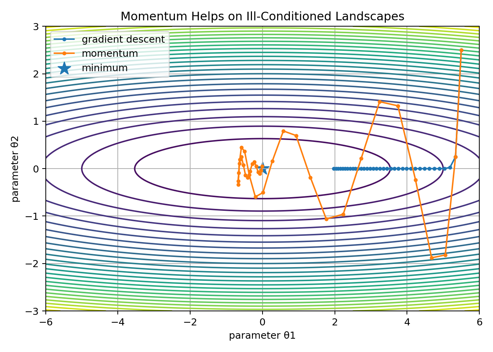
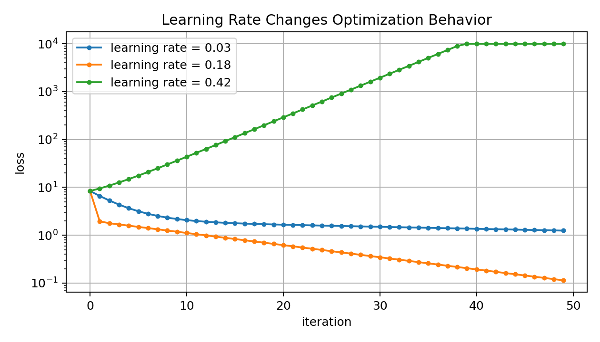
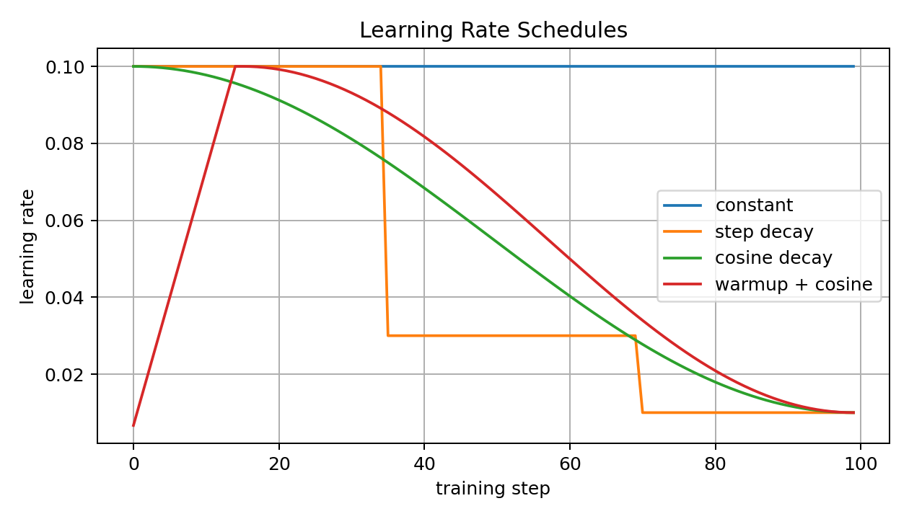
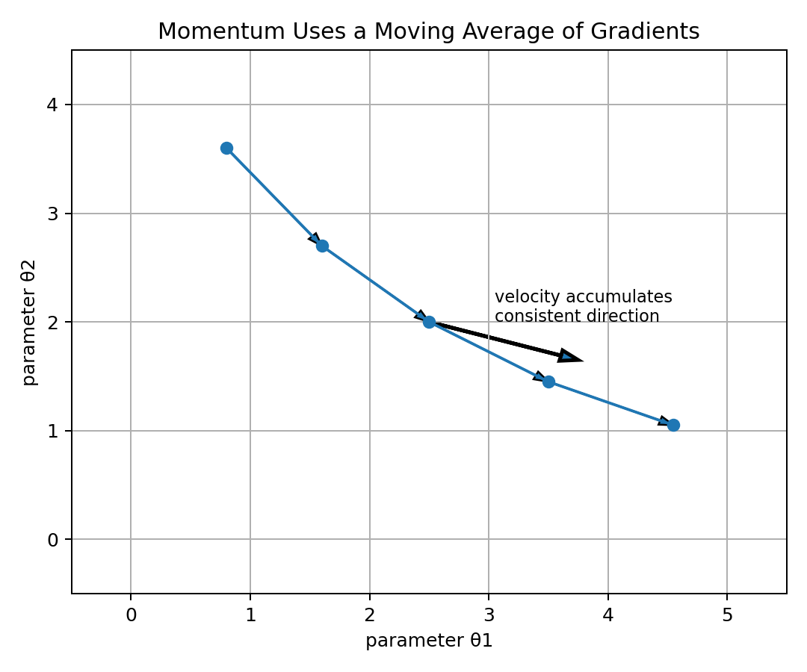
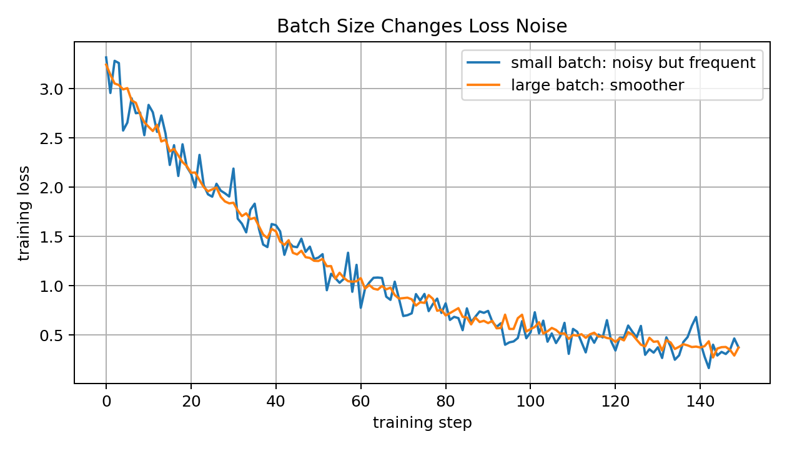
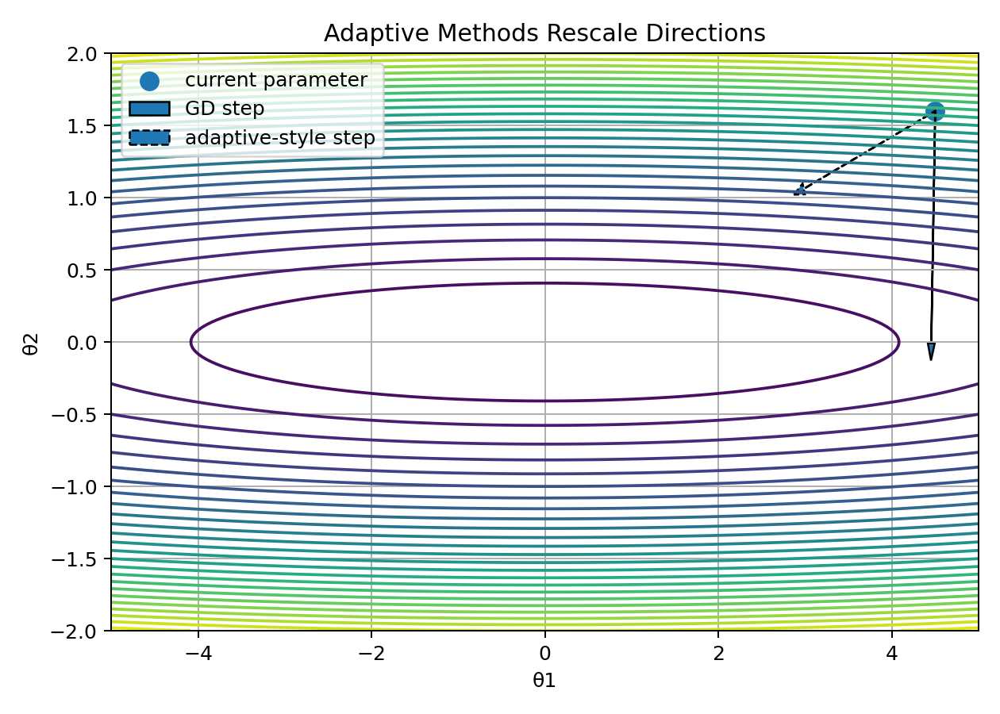
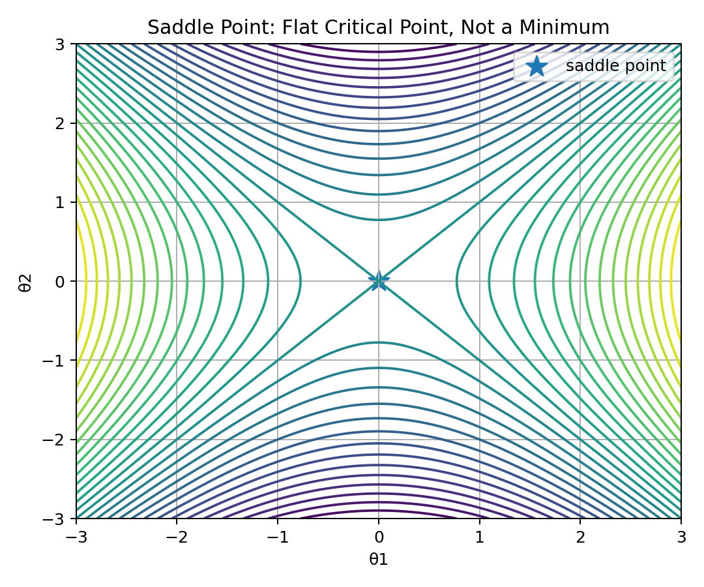
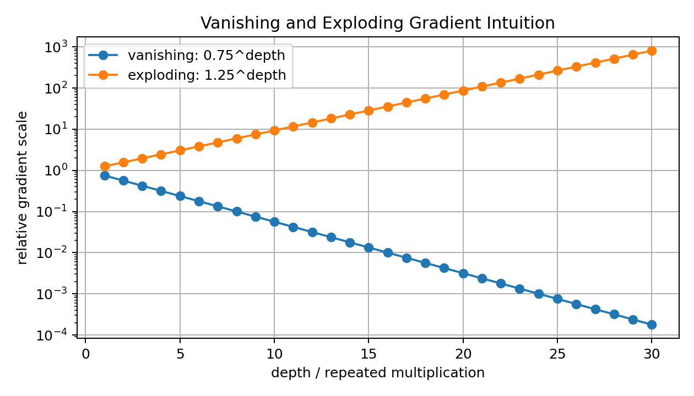
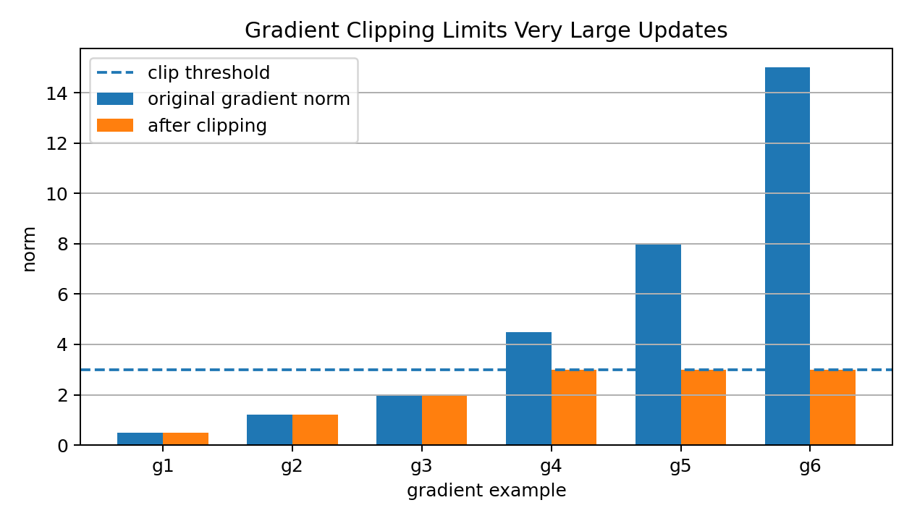
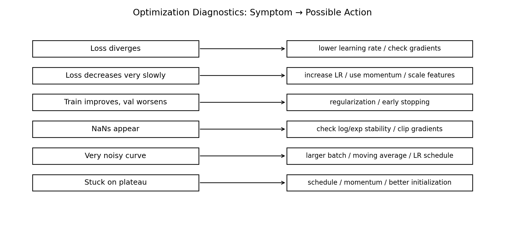

# 13 — Optimization Beyond Gradient Descent for Machine Learning

## Why This Lesson Exists

In the previous lessons, I learned the core idea of gradient descent:

$$
\theta_{t+1}
=
\theta_t
-
\alpha
\nabla_\theta \mathcal{L}(\theta_t)
$$

This is beautiful and simple.

But real Machine Learning optimization is rarely that clean.

In practice, training can be difficult because loss landscapes may be:

```text
ill-conditioned
noisy
non-convex
flat in some directions
steep in other directions
full of saddle points
sensitive to learning rate
affected by feature scale
affected by initialization
affected by batch size
```

So this lesson asks:

```text
What happens after basic gradient descent?
```

The answer is a family of optimization ideas that make training faster, more stable, and more practical:

```text
learning rate schedules
momentum
Nesterov momentum
AdaGrad
RMSProp
Adam
AdamW
gradient clipping
early stopping
batch size tuning
optimization diagnostics
```

The central idea is:

> Basic gradient descent gives the direction of learning, but practical optimization controls how that direction is used.

This lesson is important because many ML projects fail not because the model idea is bad, but because optimization is unstable, slow, or poorly diagnosed.

---

## 1. The Optimization Problem

Most supervised learning can be written as:

$$
\theta^*
=
\arg\min_\theta
J(\theta)
$$

where:

$$
J(\theta)
=
\mathcal{L}(\theta)
+
\lambda\Omega(\theta)
$$

Here:

```text
theta              -> model parameters
L(theta)           -> data loss
Omega(theta)       -> regularization penalty
lambda             -> regularization strength
J(theta)           -> objective function
```

Optimization is the process of searching parameter space for a low value of $J(\theta)$.

For small convex problems, this can be simple.

For deep learning, $\theta$ may contain millions or billions of parameters.

So optimization becomes one of the central engineering and mathematical challenges of ML.

---

## 2. Why Basic Gradient Descent Is Not Always Enough

Basic gradient descent has one main rule:

$$
\theta_{t+1}
=
\theta_t
-
\alpha g_t
$$

where:

$$
g_t=\nabla_\theta J(\theta_t)
$$

This uses the current gradient only.

Problems can happen when:

```text
the learning rate is too large
the learning rate is too small
features are poorly scaled
gradients are noisy
the surface has narrow valleys
the surface has plateaus
gradients explode
gradients vanish
the model is non-convex
```

So practical optimizers modify the basic update.

They may use:

```text
past gradients
adaptive step sizes
moving averages
gradient clipping
learning rate schedules
decoupled weight decay
```

The goal is not to replace calculus.

The goal is to make gradient-based learning work better in real conditions.

---

## 3. Ill-Conditioned Loss Landscapes

An ill-conditioned loss landscape has very different curvature in different directions.

Imagine a long narrow valley.

One direction is steep.

Another direction is flat.

In such a landscape, gradient descent may zig-zag.

Visual intuition:



A simple quadratic example:

$$
J(\theta_1,\theta_2)
=
0.08\theta_1^2
+
2.5\theta_2^2
$$

The curvature in the $\theta_2$ direction is much larger than in the $\theta_1$ direction.

Gradient descent may bounce across the steep direction while moving slowly along the flat direction.

This is why feature scaling and better optimizers matter.

---

## 4. Learning Rate Is Not a Small Detail

The learning rate controls step size.

Gradient descent update:

$$
\theta_{t+1}
=
\theta_t
-
\alpha g_t
$$

The same gradient can create very different behavior depending on $\alpha$.

If $\alpha$ is too small:

```text
training is stable but painfully slow
```

If $\alpha$ is good:

```text
loss decreases efficiently
```

If $\alpha$ is too large:

```text
training can oscillate or diverge
```

Visual intuition:



The learning rate is often the first hyperparameter to check when training behaves badly.

---

## 5. Learning Rate Schedules

A learning rate schedule changes $\alpha$ over training.

Instead of using one constant learning rate:

$$
\alpha_t = \alpha
$$

we use a time-dependent learning rate:

$$
\alpha_t
$$

Common schedules:

```text
constant learning rate
step decay
exponential decay
cosine decay
warmup + decay
cyclical learning rate
```

Visual:



Why schedules help:

```text
large early steps explore quickly
smaller later steps refine solution
warmup prevents unstable early updates
decay helps convergence
```

A common deep learning pattern:

```text
start with warmup
reach peak learning rate
then decay slowly
```

This is especially common in transformer training.

---

## 6. Momentum

Momentum improves gradient descent by accumulating a moving average of past gradients.

Basic momentum:

$$
v_t
=
\beta v_{t-1}
+
g_t
$$

Then update:

$$
\theta_{t+1}
=
\theta_t
-
\alpha v_t
$$

where:

```text
v_t       -> velocity
beta      -> momentum coefficient
g_t       -> current gradient
alpha     -> learning rate
```

Visual intuition:



Momentum helps because consistent gradient directions accumulate.

If gradients keep pointing in a similar direction, momentum speeds up movement.

If gradients alternate directions, momentum can dampen oscillations.

In narrow valleys, this is very useful.

---

## 7. Momentum Intuition

Momentum is like a ball rolling down a landscape.

Gradient descent says:

```text
look at the current slope and step downhill
```

Momentum says:

```text
remember previous downhill directions and build velocity
```

This helps in two ways.

### It accelerates useful movement

If the gradient repeatedly points in the same direction, velocity grows.

### It reduces zig-zagging

If gradients alternate across a steep valley, the alternating parts cancel somewhat.

So momentum can move faster along the valley direction and less violently across it.

This is why momentum is often better than plain gradient descent.

---

## 8. Exponential Moving Average

Momentum uses an exponential moving average idea.

A moving average update looks like:

$$
v_t=\beta v_{t-1}+(1-\beta)g_t
$$

When $\beta$ is close to 1, the average remembers the past longer.

Example:

```text
beta = 0.9  -> long memory
beta = 0.5  -> shorter memory
```

Many optimizers use moving averages.

Adam uses moving averages of:

```text
gradients
squared gradients
```

So understanding momentum prepares me for Adam.

---

## 9. Nesterov Momentum

Nesterov momentum modifies momentum by looking ahead.

Ordinary momentum computes the gradient at the current position.

Nesterov computes the gradient after a momentum lookahead step.

A simplified idea:

$$
\tilde{\theta}_t
=
\theta_t
-
\alpha\beta v_{t-1}
$$

Then compute:

$$
g_t=
\nabla J(\tilde{\theta}_t)
$$

Then update velocity.

Intuition:

```text
ordinary momentum rolls forward
Nesterov momentum peeks ahead before correcting direction
```

This can make optimization more responsive.

In practice, Nesterov momentum often improves convergence in some settings.

---

## 10. Stochastic Gradients and Noise

Full batch gradient:

$$
g_t
=
\nabla_\theta
\frac{1}{n}
\sum_{i=1}^{n}
\ell_i(\theta)
$$

Mini-batch gradient:

$$
g_t
=
\nabla_\theta
\frac{1}{|B|}
\sum_{i\in B}
\ell_i(\theta)
$$

Mini-batch gradients are noisy estimates of the full gradient.

This noise has both good and bad sides.

Good:

```text
cheaper updates
can help escape some sharp or difficult regions
regularizing effect
```

Bad:

```text
loss curve becomes noisy
updates can be unstable
harder to diagnose convergence
```

Visual:



Batch size is therefore an optimization hyperparameter, not only a hardware detail.

---

## 11. AdaGrad

AdaGrad adapts the learning rate for each parameter.

It accumulates squared gradients:

$$
s_t
=
s_{t-1}
+
g_t^2
$$

Then updates:

$$
\theta_{t+1}
=
\theta_t
-
\frac{\alpha}{\sqrt{s_t}+\epsilon}
g_t
$$

All operations here are elementwise.

Intuition:

```text
parameters with large historical gradients get smaller steps
parameters with small historical gradients get larger relative steps
```

AdaGrad can work well for sparse features.

But because $s_t$ only grows, the effective learning rate can become too small over time.

This can cause training to slow down too much.

---

## 12. RMSProp

RMSProp fixes AdaGrad's aggressive accumulation by using an exponential moving average of squared gradients.

Squared gradient average:

$$
s_t
=
\beta s_{t-1}
+
(1-\beta)g_t^2
$$

Update:

$$
\theta_{t+1}
=
\theta_t
-
\frac{\alpha}{\sqrt{s_t}+\epsilon}
g_t
$$

RMSProp remembers recent squared gradients more than old ones.

This prevents the learning rate from shrinking forever.

RMSProp is especially historically important in neural network training.

---

## 13. Adam

Adam combines momentum and RMSProp-style adaptation.

It tracks the first moment:

$$
m_t
=
\beta_1m_{t-1}
+
(1-\beta_1)g_t
$$

and the second moment:

$$
v_t
=
\beta_2v_{t-1}
+
(1-\beta_2)g_t^2
$$

Here:

```text
m_t -> moving average of gradients
v_t -> moving average of squared gradients
```

Bias correction:

$$
\hat{m}_t=
\frac{m_t}{1-\beta_1^t}
$$

$$
\hat{v}_t=
\frac{v_t}{1-\beta_2^t}
$$

Update:

$$
\theta_{t+1}
=
\theta_t
-
\alpha
\frac{\hat{m}_t}{\sqrt{\hat{v}_t}+\epsilon}
$$

Adam is popular because it often works well with less tuning than plain SGD.

But Adam is not magic.

It can still overfit, fail with bad learning rates, or behave differently from SGD in generalization.

---

## 14. Why Adam Needs Bias Correction

At the start of training:

$$
m_0=0
$$

and:

$$
v_0=0
$$

The moving averages are biased toward zero early on.

Bias correction divides by:

$$
1-\beta_1^t
$$

and:

$$
1-\beta_2^t
$$

This makes early estimates more accurate.

Without bias correction, early Adam steps can be too small.

This is a small detail mathematically, but important in implementation.

---

## 15. AdamW and Decoupled Weight Decay

Adam with L2 regularization is not exactly the same as weight decay in adaptive optimizers.

AdamW decouples weight decay from the adaptive gradient update.

A simplified AdamW-style update:

$$
\theta_{t+1}
=
\theta_t
-
\alpha
\frac{\hat{m}_t}{\sqrt{\hat{v}_t}+\epsilon}
-
\alpha\lambda\theta_t
$$

The last term directly decays weights.

Why this matters:

```text
adaptive scaling changes how L2 penalty behaves
decoupled weight decay is often more reliable with Adam
```

AdamW is widely used in modern deep learning, especially transformer training.

---

## 16. Adaptive Optimizers as Rescaling

Adaptive methods rescale gradients parameter by parameter.

If one parameter has consistently large gradients, Adam reduces its effective step.

If another has small gradients, it may get a relatively larger step.

Visual intuition:



This helps when different parameters have different gradient scales.

But adaptive methods can sometimes hide problems.

A model may train even when features or architecture are poorly scaled, but generalization may still suffer.

---

## 17. Curvature and the Hessian

For a function:

$$
J(\theta)
$$

the gradient is first-order information:

$$
\nabla J(\theta)
$$

The Hessian is second-order information:

$$
H(\theta)
=
\nabla^2 J(\theta)
$$

It contains second partial derivatives:

$$
H_{ij}
=
\frac{\partial^2 J}{\partial \theta_i \partial \theta_j}
$$

The Hessian describes curvature.

If curvature is large in one direction and small in another, optimization is harder.

Second-order methods use curvature information, but they are expensive for large neural networks.

Still, curvature intuition is important.

It explains why some landscapes are difficult.

---

## 18. Newton's Method Preview

Newton's method uses the Hessian:

$$
\theta_{t+1}
=
\theta_t
-
H^{-1}
\nabla J(\theta_t)
$$

Compared with gradient descent, Newton's method adjusts the step using curvature.

In a quadratic problem, Newton's method can converge very quickly.

But in large ML models:

```text
Hessian is huge
matrix inversion is expensive
Hessian may be indefinite
stochastic training adds noise
```

So full Newton methods are not common in deep learning.

But many optimization ideas are inspired by curvature correction.

---

## 19. Saddle Points

A saddle point is a critical point where the gradient is zero, but the point is not a minimum.

Example:

$$
f(x,y)=x^2-y^2
$$

At:

$$
(0,0)
$$

the gradient is zero.

But one direction goes upward and another goes downward.

Visual:



In high-dimensional non-convex optimization, saddle points are common.

This matters for neural networks because training can slow near flat saddle regions.

Noise from mini-batches and momentum can help move away from some saddle points.

---

## 20. Plateaus

A plateau is a region where gradients are very small.

If:

$$
\|\nabla J(\theta)\|
$$

is tiny, updates become tiny.

Training may appear stuck.

Plateaus can occur because of:

```text
activation saturation
bad initialization
poor scaling
vanishing gradients
flat regions in the objective
```

Possible responses:

```text
adjust learning rate
use normalization
change initialization
use residual connections
use better activations
use momentum
```

A plateau is not always a true optimum.

It can be an optimization difficulty.

---

## 21. Vanishing and Exploding Gradients

In deep networks, gradients are propagated backward through many layers.

Repeated multiplication can shrink or grow gradients.

If factors are mostly smaller than 1:

```text
gradients vanish
```

If factors are mostly larger than 1:

```text
gradients explode
```

Visual:



Vanishing gradients cause early layers to learn slowly.

Exploding gradients cause unstable updates and sometimes NaNs.

Solutions include:

```text
better initialization
normalization
residual connections
gated architectures
gradient clipping
careful learning rates
```

---

## 22. Gradient Clipping

Gradient clipping limits the size of updates.

If the gradient norm is too large, rescale it.

Given gradient $g$, clip threshold $c$:

$$
g_{\text{clipped}}
=
g
\cdot
\min\left(1,\frac{c}{\|g\|}\right)
$$

Visual:



If:

$$
\|g\|\leq c
$$

nothing changes.

If:

$$
\|g\|>c
$$

the gradient is rescaled to have norm approximately $c$.

Gradient clipping is common in recurrent networks, transformers, and unstable training setups.

---

## 23. Initialization

Optimization begins from initial parameters.

Bad initialization can cause:

```text
dead activations
symmetry problems
vanishing gradients
exploding gradients
slow training
```

For neural networks, common initialization methods try to preserve activation and gradient scale across layers.

Examples:

```text
Xavier / Glorot initialization
He initialization
small random initialization
orthogonal initialization
```

The goal is not random for randomness's sake.

The goal is to start in a region where signals and gradients can flow.

---

## 24. Normalization and Optimization

Normalization can make optimization easier.

Examples:

```text
feature standardization
batch normalization
layer normalization
RMS normalization
```

Feature standardization helps classical models and gradient descent.

BatchNorm and LayerNorm help neural networks by stabilizing activation distributions.

Optimization benefit:

```text
smoother training
less sensitivity to initialization
larger usable learning rates
improved gradient flow
```

Normalization is not only preprocessing.

In deep learning, it is part of architecture and optimization.

---

## 25. Early Stopping

Early stopping is an optimization-based regularization method.

During training:

```text
training loss may keep decreasing
validation loss may start increasing
```

This can indicate overfitting.

Early stopping says:

```text
stop training when validation performance stops improving
```

It prevents the optimizer from continuing to fit noise in the training data.

Early stopping connects optimization and generalization.

The best model is not always the one with the lowest training loss.

---

## 26. Train Loss vs Validation Loss

Training loss tells how well the model fits the training data.

Validation loss estimates how well it generalizes to unseen data.

Common patterns:

```text
train loss high, val loss high -> underfitting
train loss low, val loss high -> overfitting
both decreasing -> learning
loss unstable or NaN -> optimization problem
```

A strong ML workflow watches both.

Optimization is not only about making training loss smaller.

It is about making validation performance better.

---

## 27. Optimizer Choice

Common practical choices:

### SGD with momentum

Often strong for vision and some classical neural network training.

Can generalize well but may need tuning.

### Adam

Often strong default for deep learning and NLP.

Works well with sparse or noisy gradients.

### AdamW

Common modern choice for transformers and many deep learning workflows.

Decoupled weight decay often behaves better than Adam + L2.

### RMSProp

Historically important and still useful in some settings.

The best optimizer depends on:

```text
model architecture
dataset size
batch size
loss landscape
regularization
training budget
generalization needs
```

There is no universal optimizer.

---

## 28. Practical Optimization Recipe

A reasonable practical workflow:

```text
1. Start with a simple baseline.
2. Standardize features if needed.
3. Choose a loss appropriate for the task.
4. Start with Adam or SGD with momentum.
5. Tune learning rate first.
6. Watch train and validation curves.
7. Add learning rate schedule.
8. Add regularization or early stopping.
9. Use gradient clipping if gradients explode.
10. Compare optimizers only after basics are stable.
```

This prevents random hyperparameter guessing.

Optimization should be diagnosed, not blindly changed.

---

## 29. Optimization Diagnostics

Training symptoms can suggest possible actions.

Visual:



Examples:

```text
loss diverges -> lower learning rate
loss decreases slowly -> increase learning rate or use momentum
NaNs appear -> check numerical stability or clip gradients
validation worsens -> regularization or early stopping
curve is too noisy -> larger batch or moving average
```

This diagnostic mindset is what turns training from guessing into engineering.

---

## 30. Code: Momentum Optimizer from Scratch

```python
import numpy as np

def momentum_update(theta, grad, velocity, lr=0.01, beta=0.9):
    velocity = beta * velocity + grad
    theta = theta - lr * velocity
    return theta, velocity
```

This implements:

$$
v_t=\beta v_{t-1}+g_t
$$

$$
\theta_{t+1}=\theta_t-\alpha v_t
$$

---

## 31. Code: RMSProp from Scratch

```python
def rmsprop_update(theta, grad, square_avg, lr=0.001, beta=0.9, eps=1e-8):
    square_avg = beta * square_avg + (1 - beta) * (grad ** 2)
    theta = theta - lr * grad / (np.sqrt(square_avg) + eps)
    return theta, square_avg
```

This rescales gradients by recent squared gradient magnitude.

---

## 32. Code: Adam from Scratch

```python
def adam_update(theta, grad, m, v, t, lr=0.001, beta1=0.9, beta2=0.999, eps=1e-8):
    m = beta1 * m + (1 - beta1) * grad
    v = beta2 * v + (1 - beta2) * (grad ** 2)

    m_hat = m / (1 - beta1 ** t)
    v_hat = v / (1 - beta2 ** t)

    theta = theta - lr * m_hat / (np.sqrt(v_hat) + eps)

    return theta, m, v
```

Adam combines momentum-like first moments and RMSProp-like second moments.

---

## 33. Code: Gradient Clipping

```python
def clip_gradient_by_norm(grad, max_norm):
    norm = np.linalg.norm(grad)

    if norm <= max_norm:
        return grad

    return grad * (max_norm / norm)
```

This prevents extremely large gradient updates.

---

## 34. Code: Learning Rate Schedule

```python
def step_decay_lr(initial_lr, step, drop_every=100, drop_factor=0.5):
    num_drops = step // drop_every
    return initial_lr * (drop_factor ** num_drops)
```

A schedule changes the learning rate during training.

---

## 35. Common Mistakes

### Mistake 1: Changing optimizer before checking learning rate

Learning rate is often the real problem.

### Mistake 2: Watching only training loss

Validation loss matters for generalization.

### Mistake 3: Ignoring feature scaling

Poor scaling can make optimization slow or unstable.

### Mistake 4: Assuming Adam always generalizes best

Adam often trains fast, but SGD with momentum can sometimes generalize better.

### Mistake 5: Ignoring NaNs

NaNs usually indicate numerical instability, exploding gradients, invalid logs, or too-large learning rate.

### Mistake 6: Using too much regularization or weight decay

This can cause underfitting.

### Mistake 7: Comparing optimizers unfairly

Different optimizers need different learning rates.

### Mistake 8: Forgetting that mini-batch noise is normal

Noisy loss curves do not automatically mean failure.

---

## 36. What I Learned From This Lesson

Basic gradient descent is the foundation, but practical optimization needs more tools.

Important ideas:

```text
ill-conditioned landscapes
learning rate schedules
momentum
Nesterov momentum
AdaGrad
RMSProp
Adam
AdamW
curvature
Hessian intuition
saddle points
plateaus
vanishing gradients
exploding gradients
gradient clipping
initialization
normalization
early stopping
batch size effects
optimization diagnostics
```

The central lesson is:

```text
Optimization is not just applying gradients.
It is controlling parameter movement so learning becomes stable, fast, and generalizable.
```

---

## Mini Exercise

Create a file called `13-optimization-beyond-gradient-descent.py` inside the `code` folder.

Write code that:

```text
1. defines a simple quadratic objective
2. implements plain gradient descent
3. implements momentum
4. compares loss curves
5. implements RMSProp
6. implements Adam
7. implements gradient clipping
8. tests different learning rates
9. creates a simple learning rate schedule
10. prints diagnostic messages based on loss behavior
```

Then answer:

```text
Why can gradient descent zig-zag in narrow valleys?
How does momentum help?
Why do adaptive optimizers rescale gradients?
Why does Adam use bias correction?
What is the difference between Adam and AdamW?
Why can gradients vanish or explode?
When should gradient clipping be used?
Why is validation loss important during optimization?
```

---

## Further Reading and Resources

### Books

- [Deep Learning Book by Goodfellow, Bengio, and Courville](https://www.deeplearningbook.org/)
- [Mathematics for Machine Learning by Deisenroth, Faisal, and Ong](https://mml-book.github.io/)
- [Convex Optimization by Boyd and Vandenberghe](https://web.stanford.edu/~boyd/cvxbook/)
- [Dive into Deep Learning](https://d2l.ai/)
- [Understanding Deep Learning by Simon Prince](https://udlbook.github.io/udlbook/)

### Visual Learning

- [3Blue1Brown: Gradient Descent](https://www.3blue1brown.com/lessons/gradient-descent)
- [StatQuest: Gradient Descent](https://www.youtube.com/@statquest)
- [Distill: Why Momentum Really Works](https://distill.pub/2017/momentum/)

### ML Connections

- [PyTorch Optimizers](https://pytorch.org/docs/stable/optim.html)
- [TensorFlow Optimizers](https://www.tensorflow.org/api_docs/python/tf/keras/optimizers)
- [Scikit-learn SGD](https://scikit-learn.org/stable/modules/sgd.html)
- [AdamW Paper: Decoupled Weight Decay Regularization](https://arxiv.org/abs/1711.05101)
- [Adam Paper: A Method for Stochastic Optimization](https://arxiv.org/abs/1412.6980)

### What to Study Next

The next math lesson should be:

```text
14 — Evaluation Metrics and Generalization
```

That lesson will connect statistics, loss functions, validation, overfitting, underfitting, train/test split, cross-validation, classification metrics, regression metrics, and model selection.

---

## Final Reflection

Optimization is where mathematical learning becomes practical training.

The gradient says where the loss increases.

The optimizer decides how to move.

The learning rate controls step size.

Momentum remembers direction.

Adam adapts movement.

Schedules change the training rhythm.

Clipping prevents instability.

Validation tells whether optimization is becoming real generalization.

So optimization is not only about reaching low loss.

It is about reaching useful, stable, and trustworthy learning.
