# 14 — Evaluation Metrics and Generalization for Machine Learning

## Why This Lesson Exists

Training a model is not the same as building a useful model.

A model can have low training loss and still fail on new data.

A model can have high accuracy and still be useless for an imbalanced problem.

A model can look better than another model because of a lucky train-test split.

A model can output probabilities that look confident but are badly calibrated.

This lesson is about one of the most important questions in Machine Learning:

```text
How do I know if my model is actually good?
```

To answer this, I need evaluation metrics and generalization thinking.

Evaluation metrics measure model performance.

Generalization asks whether performance transfers to unseen data.

The central idea is:

> Machine Learning is not about memorizing training data. It is about performing well on future data from the real problem distribution.

This lesson connects:

```text
train / validation / test split
overfitting
underfitting
bias-variance tradeoff
classification metrics
regression metrics
threshold tuning
cross-validation
calibration
model selection
data leakage
generalization gap
```

This lesson is crucial because a weak evaluation process can make a bad model look good.

---

## 1. What Is Generalization?

Generalization means performing well on unseen data.

A model sees training data:

$$
\mathcal{D}_{train}
=
\{(x_i,y_i)\}_{i=1}^{n}
$$

But I care about future data:

$$
(x,y)\sim P_{real}
$$

The ideal goal is low expected error:

$$
R(f)
=
\mathbb{E}_{(X,Y)\sim P_{real}}
[
\ell(Y,f(X))
]
$$

But I do not know the full real distribution.

So I estimate performance using validation and test sets.

Generalization asks:

```text
Did the model learn a real pattern,
or did it memorize accidental details of the training data?
```

This is the heart of ML evaluation.

---

## 2. Training Performance Is Not Enough

Training performance measures how well the model fits data it already saw.

But a model can memorize training examples.

For example, a very flexible model may fit every training point perfectly.

Training loss can become very low:

$$
\mathcal{L}_{train}\approx 0
$$

But test loss may be high:

$$
\mathcal{L}_{test}\gg \mathcal{L}_{train}
$$

This means the model did not generalize.

The difference between test or validation error and train error is often called the generalization gap:

$$
\text{generalization gap}
=
\mathcal{L}_{val}
-
\mathcal{L}_{train}
$$

A large gap usually suggests overfitting.

---

## 3. Train, Validation, and Test Sets

A typical ML workflow splits data into three parts.

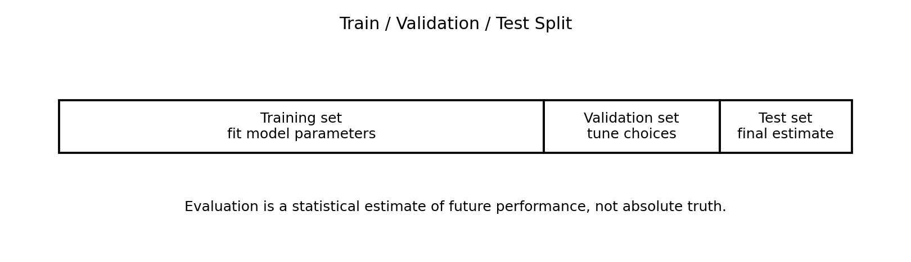

### Training set

Used to fit model parameters.

Example:

```text
learn weights
learn tree splits
learn embeddings
fit scaler if inside training pipeline
```

### Validation set

Used to tune choices.

Example:

```text
choose hyperparameters
choose model architecture
choose threshold
choose number of PCA components
choose regularization strength
```

### Test set

Used once at the end for final evaluation.

The test set should estimate future performance.

If I repeatedly use the test set to make choices, it becomes a validation set and the final estimate becomes biased.

---

## 4. Data Leakage

Data leakage happens when information from validation or test data enters training.

Examples:

```text
scaling before train-test split
fitting PCA on full dataset before splitting
using future information in time series
duplicates across train and test
target-derived features
choosing model after repeatedly checking test score
```

Leakage makes evaluation too optimistic.

A correct workflow:

```text
split first
fit preprocessing on training set only
transform validation/test using training-fitted preprocessing
```

In Scikit-learn, pipelines help avoid leakage.

Leakage is dangerous because the model may appear strong in experiments but fail in reality.

---

## 5. Underfitting and Overfitting

Underfitting happens when the model is too simple or poorly trained.

It cannot capture the true pattern.

Symptoms:

```text
training error high
validation error high
model too simple
features insufficient
optimization not finished
```

Overfitting happens when the model fits training noise or accidental patterns.

Symptoms:

```text
training error low
validation error high
large generalization gap
model too complex
not enough regularization
too much training
```

Visual intuition:

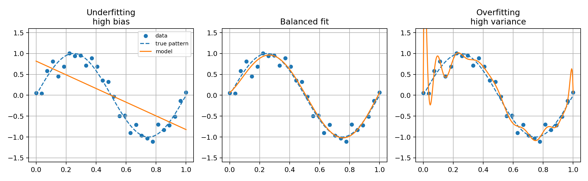

A good model balances fit and simplicity.

---

## 6. Training Loss vs Validation Loss

During training, I should monitor both training loss and validation loss.

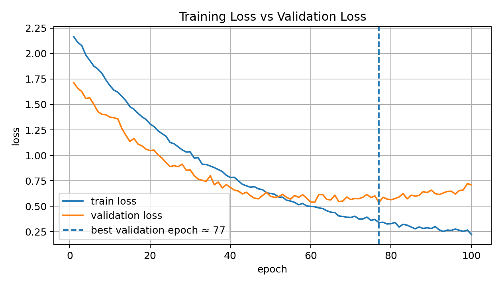

Common patterns:

### Both high

```text
underfitting
```

### Training low, validation high

```text
overfitting
```

### Both decreasing

```text
model is learning
```

### Validation loss starts increasing while training loss decreases

```text
overfitting begins
early stopping may help
```

Validation loss is one of the most important signals during training.

The best model is often not the final epoch.

It is the checkpoint with best validation performance.

---

## 7. Bias-Variance Tradeoff

Expected prediction error can be decomposed conceptually into:

```text
bias²
variance
irreducible error
```

A simplified form:

$$
\mathbb{E}[(Y-\hat{f}(X))^2]
=
\text{Bias}^2
+
\text{Variance}
+
\sigma^2
$$

where:

```text
Bias² -> error from overly simple assumptions
Variance -> error from sensitivity to training data
sigma² -> irreducible noise
```

Visual:

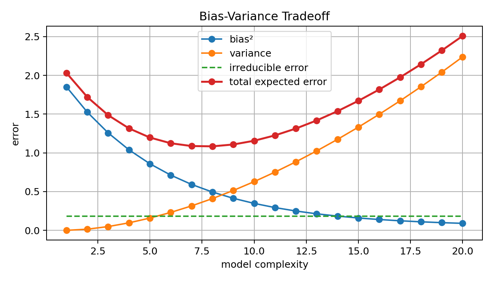

High bias:

```text
underfitting
```

High variance:

```text
overfitting
```

The goal is not zero bias or zero variance.

The goal is a useful balance.

---

## 8. Classification Evaluation

For classification, predictions are class labels or probabilities.

Binary classification usually has:

```text
positive class
negative class
```

Example:

```text
spam / not spam
fraud / not fraud
disease / no disease
survived / not survived
```

A classifier may output probability:

$$
p=P(y=1\mid x)
$$

Then a threshold converts probability to class:

$$
\hat{y}
=
\begin{cases}
1, & p\geq t \\
0, & p<t
\end{cases}
$$

Changing the threshold changes metrics like precision and recall.

So classification evaluation is not only about the model. It is also about the decision threshold.

---

## 9. Confusion Matrix

A confusion matrix counts prediction outcomes.

For binary classification:

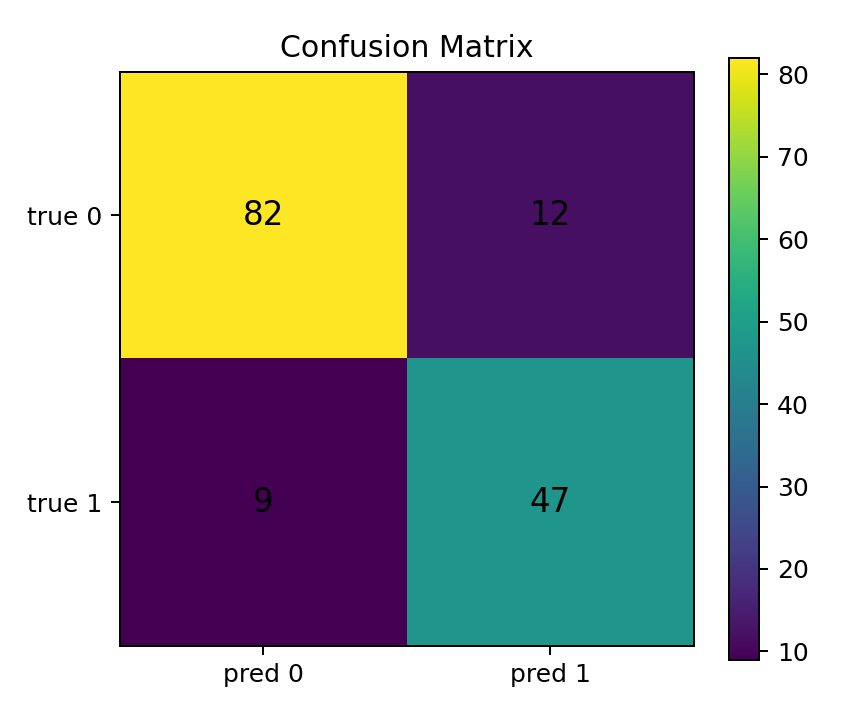

The four outcomes are:

### True Positive

$$
TP
$$

Model predicts positive and truth is positive.

### True Negative

$$
TN
$$

Model predicts negative and truth is negative.

### False Positive

$$
FP
$$

Model predicts positive but truth is negative.

### False Negative

$$
FN
$$

Model predicts negative but truth is positive.

All classification metrics are built from these counts.

---

## 10. Accuracy

Accuracy is:

$$
\mathrm{Accuracy}
=
\frac{TP+TN}{TP+TN+FP+FN}
$$

It measures the fraction of correct predictions.

Accuracy is useful when classes are balanced and error costs are similar.

But accuracy can be misleading for imbalanced data.

Example:

```text
99% normal
1% fraud
```

A model that predicts “normal” for everything gets 99% accuracy but detects no fraud.

So accuracy is not enough when minority class matters.

---

## 11. Precision

Precision is:

$$
\mathrm{Precision}
=
\frac{TP}{TP+FP}
$$

It answers:

```text
Of everything the model predicted positive,
how many were actually positive?
```

High precision means few false positives.

Precision matters when false positives are costly.

Examples:

```text
flagging innocent users as fraud
marking normal emails as spam
sending unnecessary medical alarms
```

Precision focuses on trustworthiness of positive predictions.

---

## 12. Recall

Recall is:

$$
\mathrm{Recall}
=
\frac{TP}{TP+FN}
$$

It answers:

```text
Of all actual positives,
how many did the model find?
```

High recall means few false negatives.

Recall matters when missing positives is costly.

Examples:

```text
missing a disease
missing fraud
missing a safety fault
missing an earthquake signal
```

Recall focuses on coverage of actual positives.

---

## 13. Precision-Recall Tradeoff

Precision and recall often trade off through the decision threshold.

If threshold is high:

```text
model predicts positive only when very confident
precision may increase
recall may decrease
```

If threshold is low:

```text
model predicts positive more often
recall may increase
precision may decrease
```

Visual:

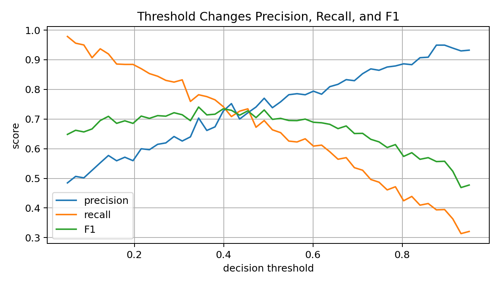

This is why threshold selection should depend on the real problem.

There is no universal best threshold.

---

## 14. F1 Score

F1 score is the harmonic mean of precision and recall:

$$
F1
=
2
\cdot
\frac{
\mathrm{Precision}\cdot\mathrm{Recall}
}{
\mathrm{Precision}+\mathrm{Recall}
}
$$

F1 is high only when both precision and recall are reasonably high.

It is useful when:

```text
classes are imbalanced
both false positives and false negatives matter
a single summary score is needed
```

But F1 ignores true negatives.

So it may not be ideal when true negatives are important.

---

## 15. Macro, Micro, and Weighted Averages

For multiclass classification, precision, recall, and F1 can be averaged in different ways.

### Macro average

Compute metric for each class, then average equally:

$$
\mathrm{MacroF1}
=
\frac{1}{K}
\sum_{k=1}^{K}F1_k
$$

Macro average treats all classes equally.

Good for imbalanced datasets when minority classes matter.

### Micro average

Aggregate total TP, FP, FN across classes, then compute metric.

Micro average gives more weight to frequent classes.

### Weighted average

Average class metrics weighted by class support.

Useful, but can hide poor minority-class performance.

A strong evaluation report should often show per-class metrics, not only one average.

---

## 16. ROC Curve and ROC-AUC

ROC curve plots:

$$
TPR
$$

against:

$$
FPR
$$

where:

$$
TPR=\frac{TP}{TP+FN}
$$

and:

$$
FPR=\frac{FP}{FP+TN}
$$

Visual:

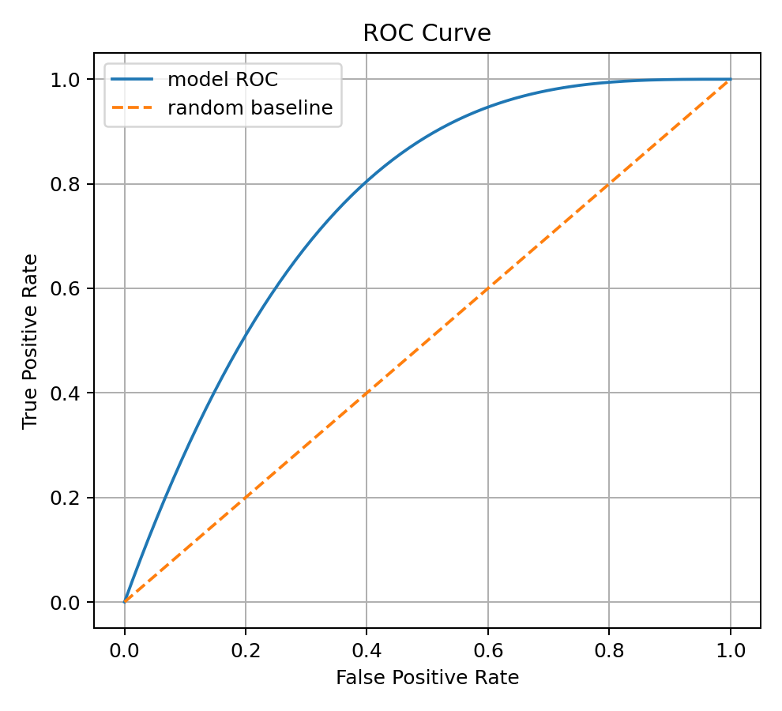

ROC-AUC measures ranking ability across thresholds.

AUC near 1 means the model ranks positives above negatives well.

AUC near 0.5 is like random ranking.

ROC-AUC is useful, but with strong class imbalance, PR-AUC may be more informative.

---

## 17. Precision-Recall Curve and PR-AUC

Precision-recall curve plots precision against recall across thresholds.

Visual:

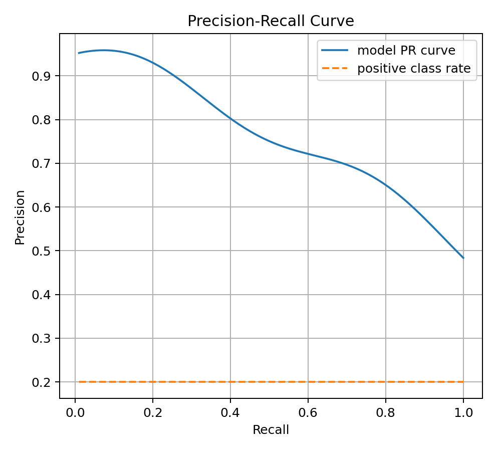

PR-AUC is especially useful for imbalanced classification.

Why?

Because precision directly reflects false positives among positive predictions.

When positives are rare, ROC-AUC can sometimes look good even if positive predictions are not very useful.

For rare event detection, PR-AUC is often more informative than ROC-AUC.

---

## 18. Log Loss

Log loss is cross-entropy for classification probabilities.

For binary classification:

$$
\mathrm{LogLoss}
=
-\frac{1}{n}
\sum_{i=1}^{n}
[
y_i\log p_i
+
(1-y_i)\log(1-p_i)
]
$$

Log loss evaluates probability quality.

It strongly punishes confident wrong predictions.

Accuracy only cares about the final class label.

Log loss cares about probability confidence.

Example:

```text
true label = 1
model A predicts 0.51
model B predicts 0.99
```

Both are correct at threshold 0.5, but log loss rewards model B more.

If the true label were 0, model B would be punished much more.

---

## 19. Calibration

Calibration asks whether predicted probabilities match observed frequencies.

If a model predicts probability 0.8 for many examples, about 80% of those examples should be positive.

Visual:

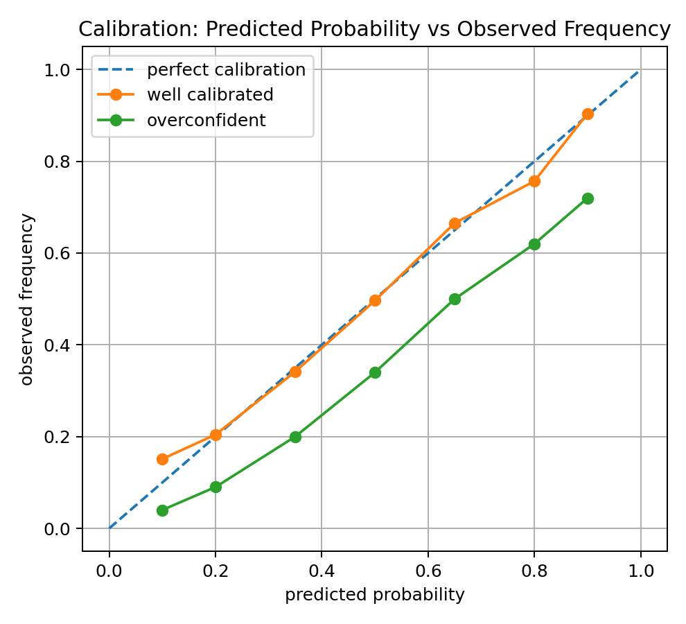

A model can have high accuracy but poor calibration.

Calibration matters when probabilities are used for decisions.

Examples:

```text
risk scoring
medical prediction
financial default probability
weather forecasting
human-in-the-loop triage
```

Metrics for probability quality include:

```text
log loss
Brier score
calibration curves
expected calibration error
```

---

## 20. Regression Evaluation

For regression, the target is continuous.

Common metrics:

```text
MAE
MSE
RMSE
R²
MAPE
residual analysis
```

A regression model should not only have a low average error.

I should also inspect residuals.

Residual:

$$
r_i=y_i-\hat{y}_i
$$

Residual plots can reveal patterns.

Visual:

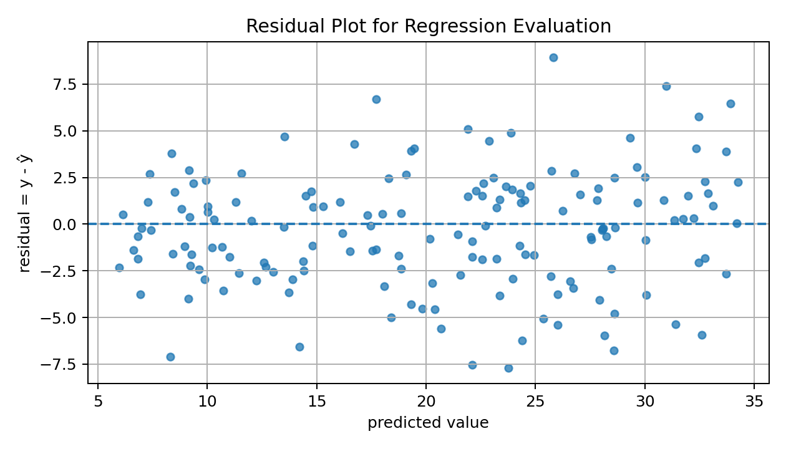

If residuals show structure, the model is missing something.

---

## 21. Mean Absolute Error

Mean Absolute Error is:

$$
\mathrm{MAE}
=
\frac{1}{n}
\sum_{i=1}^{n}
|y_i-\hat{y}_i|
$$

MAE is easy to interpret because it is in the same unit as the target.

Example:

```text
MAE = 5 barrels/day
MAE = 2.3 degrees
MAE = 120 dollars
```

MAE is more robust to outliers than MSE.

It answers:

```text
On average, how far are predictions from truth?
```

---

## 22. Mean Squared Error and RMSE

MSE is:

$$
\mathrm{MSE}
=
\frac{1}{n}
\sum_{i=1}^{n}
(y_i-\hat{y}_i)^2
$$

RMSE is:

$$
\mathrm{RMSE}
=
\sqrt{\mathrm{MSE}}
$$

MSE punishes large errors strongly.

RMSE returns to the original unit of the target.

RMSE is useful when large errors are especially bad.

MAE and RMSE together can tell whether errors are dominated by outliers.

If RMSE is much larger than MAE, some large errors may exist.

---

## 23. R-Squared

R-squared measures how much variance in the target is explained by the model.

$$
R^2
=
1
-
\frac{
\sum_i(y_i-\hat{y}_i)^2
}{
\sum_i(y_i-\bar{y})^2
}
$$

Interpretation:

```text
R² = 1      -> perfect prediction
R² = 0      -> no better than predicting the mean
R² < 0      -> worse than predicting the mean
```

R² is useful but should not be used alone.

A model can have high R² and still have problematic residuals.

---

## 24. MAPE and Percentage Errors

Mean Absolute Percentage Error is:

$$
\mathrm{MAPE}
=
\frac{100}{n}
\sum_i
\left|
\frac{y_i-\hat{y}_i}{y_i}
\right|
$$

It is easy to communicate as a percentage.

But MAPE has problems.

If $y_i$ is near zero, the percentage error can explode.

So MAPE is dangerous when targets can be zero or close to zero.

Alternatives include:

```text
SMAPE
MAE
RMSE
domain-specific normalized errors
```

---

## 25. Residual Analysis

Metrics summarize errors into numbers.

Residual analysis shows error structure.

Good residuals often look:

```text
centered around zero
no obvious trend
similar spread across prediction range
few extreme outliers
```

Bad residual patterns:

```text
curved pattern -> model missing nonlinearity
fan shape -> heteroscedasticity
clusters -> missing categorical feature
large outliers -> data quality or rare cases
```

Residual plots are important because one metric can hide systematic failure.

---

## 26. Cross-Validation

Cross-validation estimates performance by training and validating on multiple splits.

In k-fold cross-validation:

```text
split data into k folds
train on k-1 folds
validate on the remaining fold
repeat k times
average the scores
```

Visual:

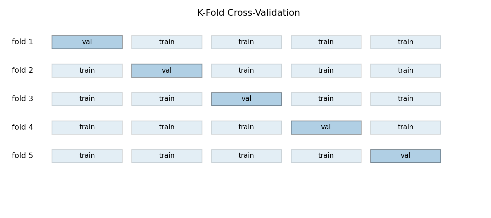

Cross-validation gives:

```text
mean performance
variation across folds
more stable estimate than one split
```

It is useful when data is limited.

But it can be expensive because the model is trained multiple times.

---

## 27. Stratified Cross-Validation

For classification, folds should preserve class distribution.

Stratified k-fold keeps approximately the same class ratios in each fold.

This is important for imbalanced datasets.

Without stratification, one fold may contain too few minority-class examples.

That can make evaluation unstable or misleading.

For time series, ordinary random cross-validation may be wrong because it breaks time order.

Evaluation strategy must match data structure.

---

## 28. Time Series Evaluation

Time series needs special care.

Future data should not influence past training.

Wrong:

```text
randomly shuffle all time points
train on future and test on past
```

Correct:

```text
train on past
validate/test on future
```

A common method is walk-forward validation.

This respects time order.

Time leakage is one of the most common mistakes in time series ML.

---

## 29. Model Selection

Model selection means choosing among models and hyperparameters.

Examples:

```text
choose k in KNN
choose regularization strength
choose tree depth
choose learning rate
choose number of PCA components
choose threshold
```

These choices should be made using validation data or cross-validation.

The test set should be used only for final evaluation.

If I use the test set repeatedly for model selection, I overfit the test set.

That makes the final score too optimistic.

---

## 30. Confidence Intervals for Metrics

A metric computed on a finite test set is an estimate.

It has uncertainty.

For accuracy, if there are $n$ test examples and observed accuracy is $\hat{p}$, an approximate standard error is:

$$
SE
=
\sqrt{
\frac{\hat{p}(1-\hat{p})}{n}
}
$$

An approximate 95% confidence interval is:

$$
\hat{p}
\pm
1.96SE
$$

For complex metrics like F1 or AUC, bootstrap can estimate uncertainty.

This matters when comparing models.

A difference of 0.2% may not be meaningful if the test set is small.

---

## 31. Statistical vs Practical Significance

Statistical significance asks:

```text
Is the difference likely real rather than random noise?
```

Practical significance asks:

```text
Does the difference matter in the real problem?
```

Example:

```text
Model A F1 = 0.842
Model B F1 = 0.846
```

This may be statistically real but practically tiny.

Or it may be random variation.

A good ML evaluation asks both:

```text
Is the improvement reliable?
Is the improvement useful?
```

---

## 32. Distribution Shift

Evaluation assumes test data represents future data.

If future data changes, test performance may not hold.

Distribution shift means:

$$
P_{train}(X,Y)\neq P_{future}(X,Y)
$$

Types:

```text
covariate shift: P(X) changes
label shift: P(Y) changes
concept drift: P(Y|X) changes
```

A model can pass offline evaluation and still fail after deployment if distribution changes.

Real ML systems need monitoring.

---

## 33. Metric Choice Depends on the Problem

There is no universal best metric.

Visual:

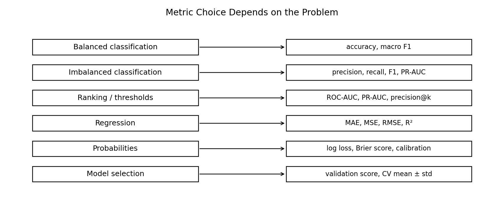

Metric choice depends on:

```text
target type
class balance
cost of false positives
cost of false negatives
need for probabilities
ranking vs classification
business or scientific goal
deployment threshold
```

A strong ML engineer asks what mistake matters most.

The metric should match the real cost of errors.

---

## 34. Example: Medical Screening

Suppose a model screens for a serious disease.

False negative:

```text
patient has disease but model says no
```

False positive:

```text
patient does not have disease but model says yes
```

If missing disease is very dangerous, recall may be more important.

But if false positives cause expensive or harmful follow-up tests, precision also matters.

So the decision threshold should be chosen with domain context.

This is why metrics are not only mathematical.

They are connected to real consequences.

---

## 35. Example: Fraud Detection

Fraud is usually rare.

Accuracy may be misleading.

A model predicting “not fraud” for everything may get high accuracy.

Better metrics:

```text
precision
recall
F1
PR-AUC
precision@k
cost-based evaluation
```

In fraud detection, the threshold may depend on investigation capacity.

Example:

```text
analysts can review only top 500 suspicious transactions
```

Then precision@k can be more meaningful than accuracy.

---

## 36. Evaluation Report Checklist

A strong evaluation report should include:

```text
dataset split method
class distribution
main metric
secondary metrics
confusion matrix
per-class performance
validation strategy
test-set protocol
confidence interval or variability
known limitations
error analysis
examples of failures
```

For regression, include:

```text
MAE
RMSE
R²
residual plot
outlier analysis
performance by subgroup or range
```

For classification, include:

```text
precision
recall
F1
ROC-AUC or PR-AUC
confusion matrix
threshold choice
calibration if probabilities matter
```

Evaluation is not one number.

It is an argument that the model is trustworthy.

---

## 37. Code: Classification Metrics from Confusion Matrix

```python
def classification_metrics(tp, fp, tn, fn):
    accuracy = (tp + tn) / (tp + fp + tn + fn)

    precision = tp / (tp + fp) if (tp + fp) > 0 else 0
    recall = tp / (tp + fn) if (tp + fn) > 0 else 0

    f1 = (
        2 * precision * recall / (precision + recall)
        if (precision + recall) > 0
        else 0
    )

    return accuracy, precision, recall, f1
```

This shows how the main binary metrics are built from TP, FP, TN, and FN.

---

## 38. Code: Regression Metrics

```python
import numpy as np

def mae(y_true, y_pred):
    return np.mean(np.abs(y_true - y_pred))

def mse(y_true, y_pred):
    return np.mean((y_true - y_pred) ** 2)

def rmse(y_true, y_pred):
    return np.sqrt(mse(y_true, y_pred))

def r2_score(y_true, y_pred):
    ss_res = np.sum((y_true - y_pred) ** 2)
    ss_tot = np.sum((y_true - np.mean(y_true)) ** 2)
    return 1 - ss_res / ss_tot
```

These metrics answer different questions.

MAE measures average absolute error.

RMSE punishes large errors more strongly.

R² compares the model to predicting the mean.

---

## 39. Code: Train / Validation / Test Split

```python
from sklearn.model_selection import train_test_split

X_train, X_temp, y_train, y_temp = train_test_split(
    X,
    y,
    test_size=0.30,
    random_state=42,
    stratify=y
)

X_val, X_test, y_val, y_test = train_test_split(
    X_temp,
    y_temp,
    test_size=0.50,
    random_state=42,
    stratify=y_temp
)
```

For classification, `stratify=y` preserves class ratios.

For regression, stratification is not directly used unless targets are binned.

For time series, random splitting is usually wrong.

---

## 40. Code: Bootstrap Confidence Interval for Accuracy

```python
def bootstrap_accuracy_ci(y_true, y_pred, n_boot=5000, confidence=0.95):
    rng = np.random.default_rng(42)
    n = len(y_true)
    scores = []

    for _ in range(n_boot):
        idx = rng.choice(n, size=n, replace=True)
        scores.append(np.mean(y_true[idx] == y_pred[idx]))

    alpha = 1 - confidence
    lower = np.percentile(scores, 100 * alpha / 2)
    upper = np.percentile(scores, 100 * (1 - alpha / 2))

    return lower, upper
```

This estimates uncertainty in accuracy using resampling.

Bootstrap can also be used for MAE, RMSE, F1, and other metrics.

---

## 41. Common Mistakes

### Mistake 1: Reporting only accuracy

Accuracy can hide poor minority-class performance.

### Mistake 2: Using the test set for tuning

This overfits the test set and makes final evaluation biased.

### Mistake 3: Ignoring class imbalance

Imbalanced data needs metrics beyond accuracy.

### Mistake 4: Forgetting threshold tuning

Probability outputs need a decision threshold.

### Mistake 5: Comparing models without uncertainty

Small metric differences may not be meaningful.

### Mistake 6: Ignoring calibration

Probability confidence may be unreliable even if accuracy is good.

### Mistake 7: Random split for time series

This leaks future information into training.

### Mistake 8: Not doing error analysis

Metrics say how much error exists. Error analysis says what kind of error exists.

---

## 42. What I Learned From This Lesson

Evaluation tells me whether a model is useful beyond training data.

Generalization is the real goal.

Important ideas:

```text
train / validation / test split
data leakage
underfitting
overfitting
bias-variance tradeoff
confusion matrix
accuracy
precision
recall
F1
ROC-AUC
PR-AUC
log loss
calibration
MAE
MSE
RMSE
R²
residual analysis
cross-validation
time series evaluation
confidence intervals
distribution shift
model selection
```

The central lesson is:

```text
A model is only as trustworthy as its evaluation process.
```

---

## Mini Exercise

Create a file called `14-evaluation-metrics-and-generalization.py` inside the `code` folder.

Write code that:

```text
1. computes TP, FP, TN, FN
2. computes accuracy, precision, recall, and F1
3. tests these metrics on an imbalanced classification example
4. computes MAE, MSE, RMSE, and R² for regression
5. compares two models using validation scores
6. creates a simple threshold sweep for precision and recall
7. performs bootstrap confidence interval for accuracy
8. simulates train and validation loss curves
9. identifies overfitting from the curves
10. explains which metric is best for a given problem
```

Then answer:

```text
Why is training accuracy not enough?
Why can accuracy be misleading for imbalanced data?
What is the difference between precision and recall?
When is PR-AUC better than ROC-AUC?
Why should the test set be used only once?
What does a large generalization gap mean?
Why does calibration matter?
```

---

## Further Reading and Resources

### Books

- [An Introduction to Statistical Learning](https://www.statlearning.com/)
- [The Elements of Statistical Learning](https://hastie.su.domains/ElemStatLearn/)
- [Hands-On Machine Learning with Scikit-Learn, Keras, and TensorFlow](https://www.oreilly.com/library/view/hands-on-machine-learning/9781098125967/)
- [Deep Learning Book by Goodfellow, Bengio, and Courville](https://www.deeplearningbook.org/)
- [Pattern Recognition and Machine Learning by Christopher Bishop](https://link.springer.com/book/9780387310732)

### Visual Learning

- [StatQuest: Confusion Matrix](https://www.youtube.com/@statquest)
- [StatQuest: ROC and AUC](https://www.youtube.com/@statquest)
- [StatQuest: Bias and Variance](https://www.youtube.com/@statquest)
- [Google Machine Learning Crash Course: Classification](https://developers.google.com/machine-learning/crash-course/classification)

### ML Connections

- [Scikit-learn: Model Evaluation](https://scikit-learn.org/stable/modules/model_evaluation.html)
- [Scikit-learn: Cross-Validation](https://scikit-learn.org/stable/modules/cross_validation.html)
- [Scikit-learn: Calibration](https://scikit-learn.org/stable/modules/calibration.html)
- [Scikit-learn: Train Test Split](https://scikit-learn.org/stable/modules/generated/sklearn.model_selection.train_test_split.html)

### What to Study Next

The next math lesson should be:

```text
15 — Math for Linear and Logistic Regression
```

That lesson will connect all previous math into the first real ML algorithms: linear regression and logistic regression.

---

## Final Reflection

Evaluation is where Machine Learning becomes honest.

Training loss can mislead.

Accuracy can mislead.

A single split can mislead.

A test set can be overused.

A model can be confident and wrong.

So strong ML is not only about building models.

It is about measuring them carefully.

Generalization is the real exam.
