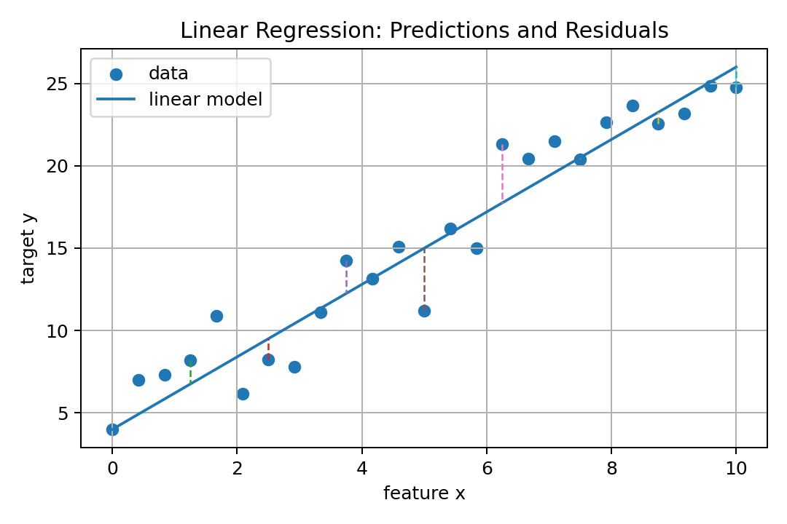
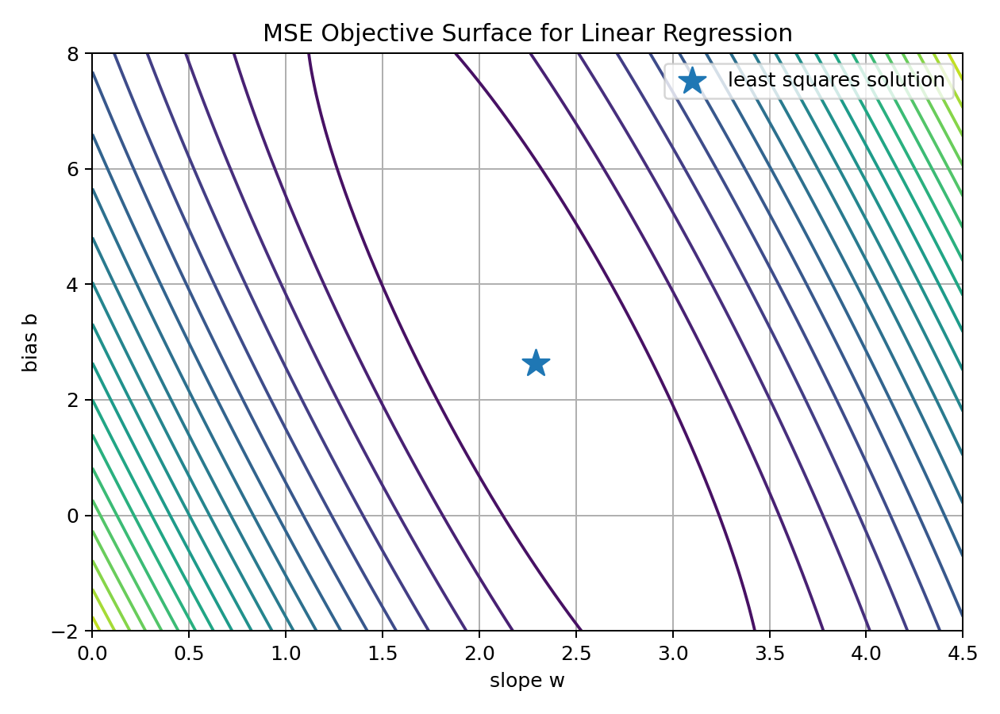
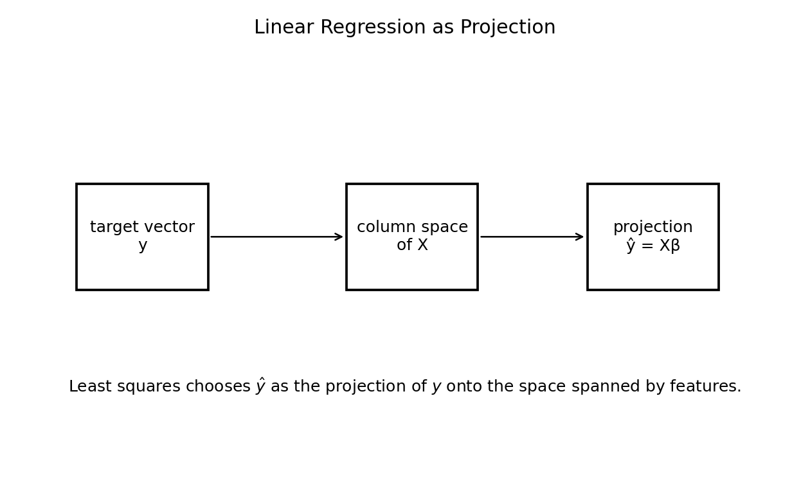
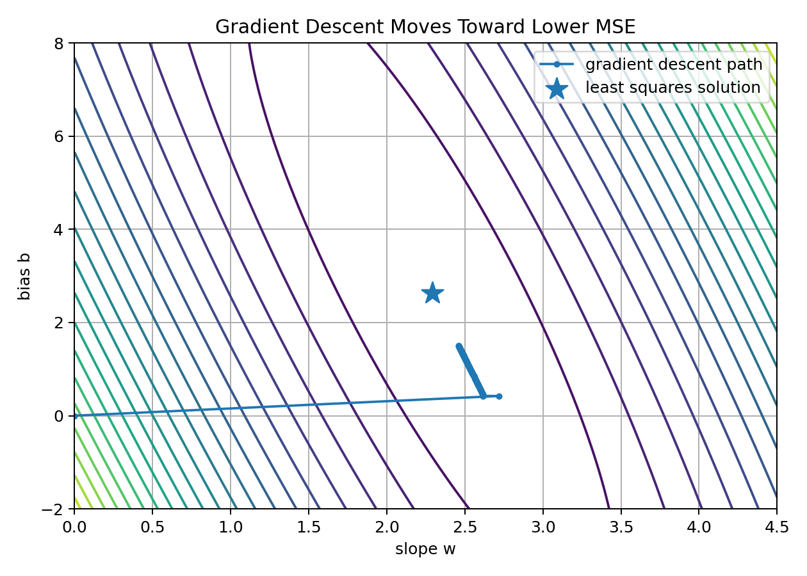
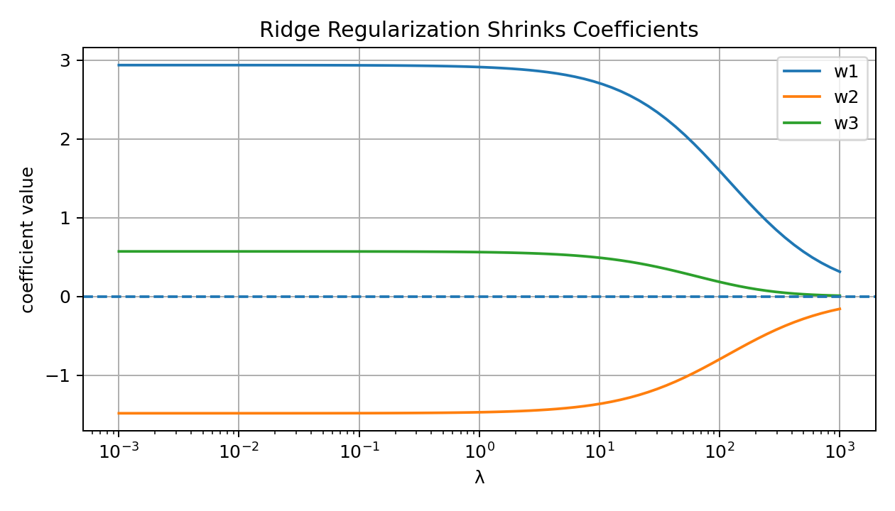
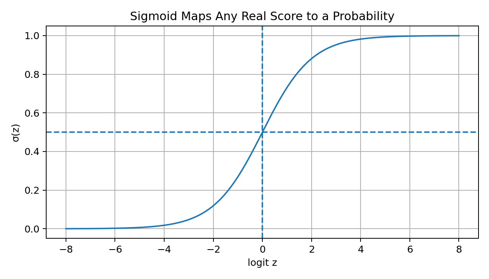
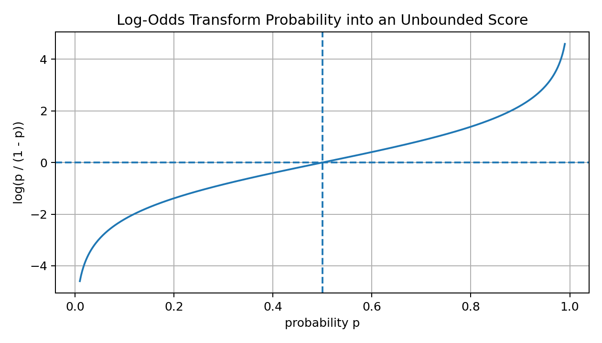
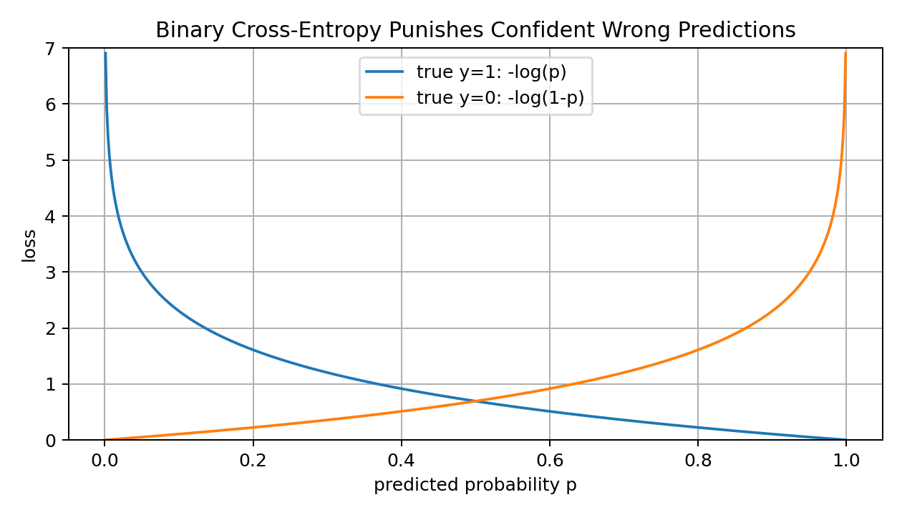
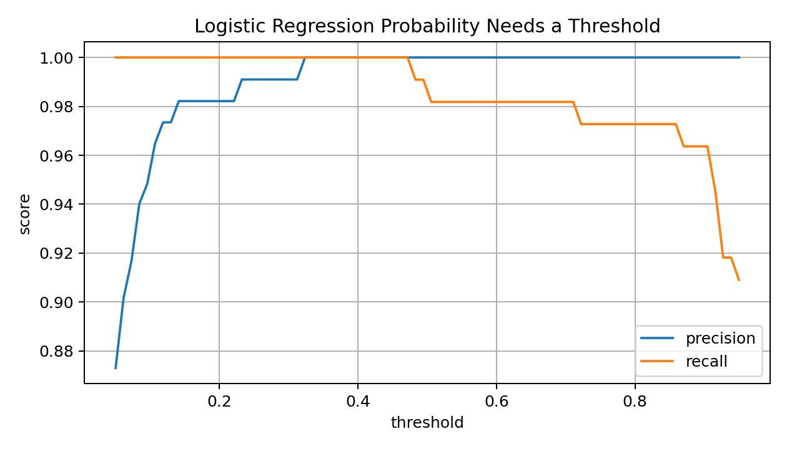
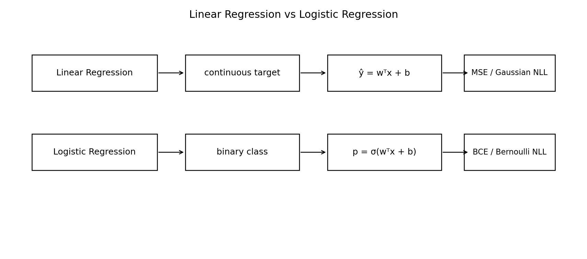

# 15 — Math for Linear and Logistic Regression

## Why This Lesson Exists

This lesson is the bridge between the Math for ML section and the real Machine Learning algorithms section.

Until now, I learned many separate mathematical ideas:

```text
vectors
matrices
dot products
norms
derivatives
gradients
probability
statistics
loss functions
optimization
MLE and MAP
evaluation
```

Linear Regression and Logistic Regression are where these ideas finally meet inside real models.

Linear Regression teaches:

```text
prediction as a linear function
residuals
MSE
least squares
normal equation
gradient descent
Gaussian noise interpretation
regularization
```

Logistic Regression teaches:

```text
classification as probability estimation
sigmoid function
log-odds
decision boundary
Bernoulli likelihood
binary cross-entropy
gradient descent
thresholding
calibration
```

These two algorithms look simple, but they are foundational.

Many advanced models are built from the same ideas:

```text
linear scores
weighted sums
logits
probabilities
loss minimization
regularization
gradient-based training
```

The central idea is:

> Linear Regression predicts continuous values, Logistic Regression predicts probabilities for classes, and both are trained by minimizing a mathematically meaningful loss.

This lesson should make the first real ML algorithms feel natural rather than mysterious.

---

## 1. Linear Models as Weighted Sums

A linear model combines features using weights.

For one sample:

$$
x=
\begin{bmatrix}
x_1 \\
x_2 \\
\vdots \\
x_d
\end{bmatrix}
$$

and weights:

$$
w=
\begin{bmatrix}
w_1 \\
w_2 \\
\vdots \\
w_d
\end{bmatrix}
$$

the linear score is:

$$
z=w^Tx+b
$$

Expanded:

$$
z=w_1x_1+w_2x_2+\dots+w_dx_d+b
$$

This is the core form behind both Linear Regression and Logistic Regression.

The difference is what we do with $z$.

For Linear Regression:

$$
\hat{y}=z=w^Tx+b
$$

For Logistic Regression:

$$
p=P(y=1\mid x)=\sigma(z)=\sigma(w^Tx+b)
$$

So Logistic Regression is still built on a linear score, but the score is transformed into a probability.

---

## 2. Why Linear Models Matter

Linear models are important because they are:

```text
simple
interpretable
fast
mathematically clear
strong baselines
easy to debug
connected to optimization and probability
```

A linear model assumes the target changes approximately linearly with features.

For regression:

```text
if x_j increases by 1, prediction changes by w_j, holding other features fixed
```

For logistic regression:

```text
if x_j increases by 1, log-odds change by w_j, holding other features fixed
```

This interpretability is one reason linear models remain useful even in the deep learning era.

A neural network layer is also a linear transformation followed by nonlinearity:

$$
h=g(Wx+b)
$$

So understanding linear models helps understand neural networks later.

---

## 3. Linear Regression Problem Setup

Linear Regression is used when the target is continuous.

Examples:

```text
predict house price
predict temperature
predict oil production
predict exam score
predict sensor value
predict seismic feature amplitude
```

Dataset:

$$
\mathcal{D}=\{(x_i,y_i)\}_{i=1}^{n}
$$

where:

$$
x_i\in\mathbb{R}^d
$$

and:

$$
y_i\in\mathbb{R}
$$

Model:

$$
\hat{y}_i=w^Tx_i+b
$$

Goal:

```text
choose w and b so predictions are close to true y values
```

The word “linear” means linear in parameters, not necessarily that raw features must be simple.

If I create polynomial features:

$$
[1,x,x^2,x^3]
$$

a linear model in these features can fit nonlinear curves.

---

## 4. Residuals

The residual for sample $i$ is:

$$
r_i=y_i-\hat{y}_i
$$

It measures prediction error.

If:

$$
r_i>0
$$

then:

```text
the model underpredicted
```

If:

$$
r_i<0
$$

then:

```text
the model overpredicted
```

Visual intuition:



Linear Regression tries to choose the line or hyperplane that makes residuals small overall.

The most common way is to minimize squared residuals.

---

## 5. Mean Squared Error for Linear Regression

The squared error for one sample is:

$$
(y_i-\hat{y}_i)^2
$$

The Mean Squared Error is:

$$
\mathrm{MSE}(w,b)
=
\frac{1}{n}
\sum_{i=1}^{n}
(y_i-(w^Tx_i+b))^2
$$

This is the loss function.

The optimization problem is:

$$
(w^*,b^*)
=
\arg\min_{w,b}
\frac{1}{n}
\sum_{i=1}^{n}
(y_i-(w^Tx_i+b))^2
$$

Visual objective surface for one feature:



MSE is convex for Linear Regression.

That means there is one global minimum, assuming the problem is well-posed.

This makes Linear Regression mathematically clean.

---

## 6. Matrix Form of Linear Regression

For many samples, stack the inputs into a matrix.

Without bias:

$$
X=
\begin{bmatrix}
---x_1^T--- \\
---x_2^T--- \\
\vdots \\
---x_n^T---
\end{bmatrix}
\in\mathbb{R}^{n\times d}
$$

Weights:

$$
w\in\mathbb{R}^{d}
$$

Predictions:

$$
\hat{y}=Xw
$$

To include bias, add a column of ones:

$$
\tilde{X}=
\begin{bmatrix}
1 & x_{11} & x_{12} & \dots & x_{1d} \\
1 & x_{21} & x_{22} & \dots & x_{2d} \\
\vdots & \vdots & \vdots & & \vdots \\
1 & x_{n1} & x_{n2} & \dots & x_{nd}
\end{bmatrix}
$$

Then define:

$$
\beta=
\begin{bmatrix}
b \\
w_1 \\
w_2 \\
\vdots \\
w_d
\end{bmatrix}
$$

Predictions:

$$
\hat{y}=\tilde{X}\beta
$$

This notation makes formulas cleaner.

---

## 7. Least Squares Objective

Using matrix notation:

$$
\hat{y}=X\beta
$$

where $X$ includes the bias column.

The residual vector is:

$$
r=y-X\beta
$$

The sum of squared errors is:

$$
SSE(\beta)=\|y-X\beta\|_2^2
$$

Expanded:

$$
SSE(\beta)=(y-X\beta)^T(y-X\beta)
$$

The least squares problem is:

$$
\beta^*
=
\arg\min_\beta
\|y-X\beta\|_2^2
$$

This is called least squares because it minimizes the sum of squared residuals.

---

## 8. Normal Equation

Linear Regression has a closed-form solution when $X^TX$ is invertible.

The normal equation is:

$$
\beta^*
=
(X^TX)^{-1}X^Ty
$$

This gives the least squares solution directly.

Why does this work?

Start with:

$$
J(\beta)=\|y-X\beta\|_2^2
$$

The gradient is:

$$
\nabla_\beta J
=
-2X^T(y-X\beta)
$$

Set gradient to zero:

$$
-2X^T(y-X\beta)=0
$$

So:

$$
X^T(y-X\beta)=0
$$

Expand:

$$
X^Ty-X^TX\beta=0
$$

Therefore:

$$
X^TX\beta=X^Ty
$$

If $X^TX$ is invertible:

$$
\beta=(X^TX)^{-1}X^Ty
$$

This is the normal equation.

---

## 9. Linear Regression as Projection

Least squares has a beautiful geometric interpretation.

The prediction vector is:

$$
\hat{y}=X\beta
$$

This means $\hat{y}$ must lie in the column space of $X$.

The true target vector $y$ may not lie exactly in that column space.

Linear Regression finds the closest vector $\hat{y}$ in the column space of $X$.

Visual intuition:



At the optimum, the residual vector:

$$
r=y-\hat{y}
$$

is orthogonal to the column space of $X$.

That is why:

$$
X^T(y-X\beta)=0
$$

This is not only algebra.

It is geometry.

---

## 10. Gradient Descent for Linear Regression

Instead of using the normal equation, we can use gradient descent.

Loss:

$$
\mathcal{L}(w,b)
=
\frac{1}{n}
\sum_{i=1}^{n}
(y_i-\hat{y}_i)^2
$$

For one feature:

$$
\hat{y}_i=wx_i+b
$$

Gradients:

$$
\frac{\partial \mathcal{L}}{\partial w}
=
-\frac{2}{n}
\sum_{i=1}^{n}
x_i(y_i-\hat{y}_i)
$$

$$
\frac{\partial \mathcal{L}}{\partial b}
=
-\frac{2}{n}
\sum_{i=1}^{n}
(y_i-\hat{y}_i)
$$

Updates:

$$
w\leftarrow w-\alpha\frac{\partial \mathcal{L}}{\partial w}
$$

$$
b\leftarrow b-\alpha\frac{\partial \mathcal{L}}{\partial b}
$$

Visual:



Gradient descent is more general than the normal equation.

It also works when closed-form solutions are expensive or impossible.

---

## 11. Vectorized Gradient for Linear Regression

With matrix notation:

$$
\hat{y}=X\beta
$$

Loss:

$$
\mathcal{L}(\beta)
=
\frac{1}{n}
\|y-X\beta\|_2^2
$$

Gradient:

$$
\nabla_\beta \mathcal{L}
=
-\frac{2}{n}X^T(y-X\beta)
$$

Equivalently:

$$
\nabla_\beta \mathcal{L}
=
\frac{2}{n}X^T(X\beta-y)
$$

Update:

$$
\beta\leftarrow
\beta
-
\alpha
\nabla_\beta\mathcal{L}
$$

Shape check:

```text
X        -> n x (d+1)
beta     -> (d+1)
X beta   -> n
y        -> n
X.T(...) -> (d+1)
gradient -> same shape as beta
```

Shape logic prevents many implementation mistakes.

---

## 12. Probabilistic View of Linear Regression

Assume:

$$
y_i=w^Tx_i+b+\epsilon_i
$$

where:

$$
\epsilon_i\sim\mathcal{N}(0,\sigma^2)
$$

Then:

$$
y_i\mid x_i,w,b
\sim
\mathcal{N}(w^Tx_i+b,\sigma^2)
$$

The likelihood is:

$$
P(y\mid X,w,b)
=
\prod_{i=1}^{n}
\mathcal{N}(y_i\mid w^Tx_i+b,\sigma^2)
$$

The negative log-likelihood becomes:

$$
-\log P(y\mid X,w,b)
=
\text{constant}
+
\frac{1}{2\sigma^2}
\sum_{i=1}^{n}
(y_i-\hat{y}_i)^2
$$

So minimizing MSE is equivalent to maximizing Gaussian likelihood.

This means Linear Regression with MSE assumes Gaussian noise around the line.

---

## 13. Ridge Regression

Ridge Regression adds L2 regularization.

Objective:

$$
J(w)
=
\frac{1}{n}
\|y-Xw\|_2^2
+
\lambda\|w\|_2^2
$$

Ridge discourages large weights.

It helps when:

```text
features are correlated
model overfits
X^T X is nearly singular
coefficients are unstable
```

Visual:



Ridge does not usually make coefficients exactly zero.

It shrinks them smoothly.

Probabilistic view:

```text
Ridge = MAP estimation with Gaussian prior on weights
```

---

## 14. Lasso Regression Preview

Lasso adds L1 regularization.

Objective:

$$
J(w)
=
\frac{1}{n}
\|y-Xw\|_2^2
+
\lambda\|w\|_1
$$

Lasso can make some weights exactly zero.

This creates sparsity.

It can be useful for feature selection.

Probabilistic view:

```text
Lasso = MAP estimation with Laplace prior on weights
```

Ridge and Lasso are not just tricks.

They are ways of controlling model complexity.

---

## 15. When Linear Regression Can Fail

Linear Regression can fail when:

```text
relationship is strongly nonlinear
important features are missing
outliers dominate MSE
errors are not independent
errors have non-constant variance
features are highly collinear
target has extreme skew
data contains leakage
```

Residual plots help diagnose problems.

If residuals show structure, the model may be too simple.

Linear Regression is powerful, but it should not be blindly trusted.

---

## 16. Logistic Regression Problem Setup

Logistic Regression is used for classification.

Despite its name, it is a classification model, not a regression model in the ordinary sense.

For binary classification:

$$
y\in\{0,1\}
$$

Examples:

```text
spam or not spam
survived or not survived
fraud or not fraud
disease or no disease
fault or normal
```

The model estimates:

$$
P(y=1\mid x)
$$

It outputs a probability.

The prediction is:

$$
\hat{p}=\sigma(w^Tx+b)
$$

Then a threshold turns probability into a class:

$$
\hat{y}=
\begin{cases}
1, & \hat{p}\geq t \\
0, & \hat{p}<t
\end{cases}
$$

Common default:

$$
t=0.5
$$

But the best threshold depends on the problem.

---

## 17. Why Not Use Linear Regression for Classification?

A linear regression model outputs:

$$
\hat{y}=w^Tx+b
$$

This value can be any real number:

$$
-\infty<\hat{y}<\infty
$$

But a probability must satisfy:

$$
0\leq p\leq 1
$$

For classification, I want:

$$
P(y=1\mid x)
$$

So I need a function that maps real scores to probabilities.

That function is the sigmoid.

---

## 18. Sigmoid Function

The sigmoid function is:

$$
\sigma(z)=\frac{1}{1+e^{-z}}
$$

It maps:

$$
z\in\mathbb{R}
$$

to:

$$
\sigma(z)\in(0,1)
$$

Visual:



Important values:

$$
\sigma(0)=0.5
$$

If $z$ is large positive:

$$
\sigma(z)\approx 1
$$

If $z$ is large negative:

$$
\sigma(z)\approx 0
$$

So Logistic Regression computes:

$$
z=w^Tx+b
$$

then:

$$
p=\sigma(z)
$$

The linear score becomes a probability.

---

## 19. Odds and Log-Odds

If probability is:

$$
p=P(y=1\mid x)
$$

then odds are:

$$
\frac{p}{1-p}
$$

Log-odds are:

$$
\log\frac{p}{1-p}
$$

In Logistic Regression:

$$
\log\frac{p}{1-p}=w^Tx+b
$$

This is the deepest interpretation of Logistic Regression:

> Logistic Regression is linear in log-odds.

Visual:



This means each coefficient changes the log-odds linearly.

If $w_j$ is positive, increasing feature $x_j$ increases the log-odds of class 1.

If $w_j$ is negative, increasing feature $x_j$ decreases the log-odds of class 1.

---

## 20. Decision Boundary

The decision boundary at threshold 0.5 occurs when:

$$
P(y=1\mid x)=0.5
$$

Since:

$$
\sigma(0)=0.5
$$

this happens when:

$$
w^Tx+b=0
$$

So the boundary is linear.

In 2D, it is a line.

In 3D, it is a plane.

In higher dimensions, it is a hyperplane.

Visual:


Logistic Regression can classify nonlinear patterns only if I provide nonlinear features.

For example:

$$
[x_1,x_2,x_1^2,x_2^2,x_1x_2]
$$

The model is linear in features, but features can be engineered.

---

## 21. Bernoulli Likelihood for Logistic Regression

For binary labels:

$$
y_i\in\{0,1\}
$$

The model predicts:

$$
p_i=P(y_i=1\mid x_i)=\sigma(w^Tx_i+b)
$$

Assume:

$$
Y_i\mid x_i\sim\mathrm{Bernoulli}(p_i)
$$

Then:

$$
P(Y_i=y_i\mid x_i)
=
p_i^{y_i}(1-p_i)^{1-y_i}
$$

For the full dataset:

$$
L(w,b)
=
\prod_{i=1}^{n}
p_i^{y_i}(1-p_i)^{1-y_i}
$$

Log-likelihood:

$$
\log L(w,b)
=
\sum_{i=1}^{n}
[
y_i\log p_i+(1-y_i)\log(1-p_i)
]
$$

The negative average log-likelihood is Binary Cross-Entropy.

---

## 22. Binary Cross-Entropy Loss

Binary Cross-Entropy is:

$$
\mathcal{L}(w,b)
=
-\frac{1}{n}
\sum_{i=1}^{n}
[
y_i\log p_i+(1-y_i)\log(1-p_i)
]
$$

where:

$$
p_i=\sigma(w^Tx_i+b)
$$

Visual:



If the true label is 1 and the model predicts high probability, loss is small.

If the true label is 1 and the model predicts low probability, loss is large.

Cross-entropy punishes confident wrong predictions heavily.

This makes it suitable for probabilistic classification.

---

## 23. Gradient of Logistic Regression

Let:

$$
p_i=\sigma(w^Tx_i+b)
$$

Binary Cross-Entropy gradient has a simple form.

For weights:

$$
\nabla_w\mathcal{L}
=
\frac{1}{n}
X^T(p-y)
$$

For bias:

$$
\frac{\partial \mathcal{L}}{\partial b}
=
\frac{1}{n}
\sum_{i=1}^{n}
(p_i-y_i)
$$

This is elegant.

The error signal is:

$$
p_i-y_i
$$

So for Logistic Regression:

```text
gradient = feature matrix transposed times probability error
```

Compare with Linear Regression:

```text
linear regression error: y_hat - y
logistic regression error: p - y
```

The pattern is very similar.

---

## 24. Gradient Descent for Logistic Regression

Update rule:

$$
w\leftarrow w-\alpha\nabla_w\mathcal{L}
$$

$$
b\leftarrow b-\alpha\frac{\partial\mathcal{L}}{\partial b}
$$

In vectorized form with bias included in $X$:

$$
\beta\leftarrow
\beta
-
\alpha
\frac{1}{n}
X^T(p-y)
$$

Training reduces cross-entropy:


Unlike Linear Regression with MSE, Logistic Regression usually does not have a simple normal-equation closed-form solution.

So it is usually trained with iterative optimization.

---

## 25. Numerical Stability in Logistic Regression

Logistic Regression uses exponentials and logarithms.

This can create numerical problems.

Sigmoid:

$$
\sigma(z)=\frac{1}{1+e^{-z}}
$$

If $z$ is very negative, $e^{-z}$ can overflow.

Cross-entropy:

$$
-\log(p)
$$

If $p=0$, log is undefined.

Practical fixes:

```python
z = np.clip(z, -40, 40)
p = np.clip(p, 1e-15, 1 - 1e-15)
```

In professional libraries, binary cross-entropy is often implemented from logits directly for better stability.

Numerical stability is part of correct ML implementation.

---

## 26. Thresholds and Classification Decisions

Logistic Regression outputs probabilities.

A threshold turns probabilities into classes.

Default:

$$
t=0.5
$$

But threshold should depend on the problem.

If false negatives are very costly, I may lower threshold to increase recall.

If false positives are very costly, I may raise threshold to increase precision.

Visual:



The model gives scores.

The threshold defines decisions.

These are related but different steps.

---

## 27. Linear Regression vs Logistic Regression

Visual summary:



Linear Regression:

```text
target: continuous
output: real number
model: y_hat = w^T x + b
loss: MSE
probabilistic view: Gaussian likelihood
```

Logistic Regression:

```text
target: binary class
output: probability
model: p = sigmoid(w^T x + b)
loss: binary cross-entropy
probabilistic view: Bernoulli likelihood
```

Both use:

```text
dot products
linear scores
loss functions
gradients
optimization
regularization
evaluation
```

---

## 28. Regularized Logistic Regression

Logistic Regression can also use regularization.

L2-regularized objective:

$$
J(w,b)
=
\mathcal{L}(w,b)
+
\lambda\|w\|_2^2
$$

Usually we do not regularize the bias term.

L1-regularized logistic regression:

$$
J(w,b)
=
\mathcal{L}(w,b)
+
\lambda\|w\|_1
$$

Regularization helps prevent overfitting.

It is especially useful when:

```text
many features exist
features are correlated
dataset is small
model overfits
```

---

## 29. Feature Scaling

Feature scaling matters for both Linear and Logistic Regression.

If one feature has huge values, its gradient can dominate.

This can cause:

```text
slow convergence
unstable optimization
coefficient scale issues
regularization imbalance
```

Standardization:

$$
z=\frac{x-\mu}{\sigma}
$$

Benefits:

```text
faster gradient descent
more stable optimization
more meaningful regularization
easier coefficient comparison
```

Scaling is especially important when regularization is used.

---

## 30. Multiclass Logistic Regression Preview

Binary Logistic Regression uses sigmoid.

For multiclass classification, we use softmax.

Logits:

$$
z_k=w_k^Tx+b_k
$$

Softmax:

$$
p_k
=
\frac{e^{z_k}}
{\sum_{j=1}^{K}e^{z_j}}
$$

Cross-entropy:

$$
\mathcal{L}
=
-\sum_{k=1}^{K}
y_k\log p_k
$$

This is sometimes called multinomial logistic regression or softmax regression.

It is the direct ancestor of neural network classifiers.

---

## 31. Evaluation Connection

Linear Regression is evaluated with regression metrics:

```text
MAE
MSE
RMSE
R²
residual plots
```

Logistic Regression is evaluated with classification metrics:

```text
accuracy
precision
recall
F1
ROC-AUC
PR-AUC
log loss
calibration
confusion matrix
```

Loss and metric are not always the same.

Linear Regression may train with MSE but report MAE.

Logistic Regression may train with cross-entropy but report F1.

A strong workflow tracks both:

```text
training loss
validation metric
test metric
error analysis
```

---

## 32. Code: Linear Regression Closed Form

```python
import numpy as np

def add_bias_column(X):
    return np.column_stack([np.ones(X.shape[0]), X])

def linear_regression_closed_form(X, y):
    X_bias = add_bias_column(X)
    beta = np.linalg.inv(X_bias.T @ X_bias) @ X_bias.T @ y
    return beta
```

In practice, `np.linalg.solve` or pseudo-inverse is often safer than explicitly computing inverse.

Safer version:

```python
beta = np.linalg.solve(X_bias.T @ X_bias, X_bias.T @ y)
```

Or:

```python
beta = np.linalg.pinv(X_bias) @ y
```

---

## 33. Code: Linear Regression Gradient Descent

```python
def train_linear_regression_gd(X, y, lr=0.01, steps=1000):
    X_bias = add_bias_column(X)
    beta = np.zeros(X_bias.shape[1])

    for _ in range(steps):
        y_pred = X_bias @ beta
        gradient = (2 / len(y)) * X_bias.T @ (y_pred - y)
        beta = beta - lr * gradient

    return beta
```

This implements:

$$
\beta\leftarrow
\beta
-
\alpha
\frac{2}{n}
X^T(X\beta-y)
$$

---

## 34. Code: Logistic Regression from Scratch

```python
def sigmoid(z):
    z = np.clip(z, -40, 40)
    return 1 / (1 + np.exp(-z))

def binary_cross_entropy(y, p, eps=1e-15):
    p = np.clip(p, eps, 1 - eps)
    return -np.mean(y * np.log(p) + (1 - y) * np.log(1 - p))

def train_logistic_regression_gd(X, y, lr=0.1, steps=1000):
    X_bias = add_bias_column(X)
    beta = np.zeros(X_bias.shape[1])

    for _ in range(steps):
        logits = X_bias @ beta
        p = sigmoid(logits)

        gradient = (1 / len(y)) * X_bias.T @ (p - y)
        beta = beta - lr * gradient

    return beta
```

This is the mathematical heart of Logistic Regression.

---

## 35. Code: Prediction

Linear Regression prediction:

```python
def predict_linear(X, beta):
    X_bias = add_bias_column(X)
    return X_bias @ beta
```

Logistic Regression probability:

```python
def predict_proba_logistic(X, beta):
    X_bias = add_bias_column(X)
    return sigmoid(X_bias @ beta)
```

Logistic Regression class:

```python
def predict_class_logistic(X, beta, threshold=0.5):
    probabilities = predict_proba_logistic(X, beta)
    return (probabilities >= threshold).astype(int)
```

The threshold is part of decision-making, not training itself.

---

## 36. Common Mistakes

### Mistake 1: Thinking Logistic Regression is for continuous regression

Despite the name, Logistic Regression is used for classification.

### Mistake 2: Using MSE for ordinary classification

Cross-entropy is usually more appropriate because it comes from Bernoulli likelihood.

### Mistake 3: Forgetting the bias term

Without bias, the model may be forced through the origin.

### Mistake 4: Not scaling features

Optimization and regularization can behave badly.

### Mistake 5: Interpreting logistic coefficients as direct probability changes

Logistic coefficients are linear changes in log-odds, not direct probability changes.

### Mistake 6: Using threshold 0.5 blindly

The best threshold depends on false positive and false negative costs.

### Mistake 7: Computing matrix inverse unnecessarily

Use `solve` or pseudo-inverse for numerical stability.

### Mistake 8: Forgetting numerical stability in sigmoid and log loss

Clip logits or probabilities to avoid overflow and log(0).

---

## 37. What I Learned From This Lesson

Linear Regression and Logistic Regression are foundational ML algorithms.

Linear Regression:

```text
predicts continuous values
uses linear function
minimizes MSE
has closed-form least squares solution
can be trained with gradient descent
connects to Gaussian likelihood
```

Logistic Regression:

```text
predicts class probabilities
uses sigmoid on a linear score
models log-odds linearly
minimizes binary cross-entropy
is trained with gradient descent
connects to Bernoulli likelihood
```

Both use:

```text
vectors
matrices
dot products
gradients
loss functions
optimization
regularization
statistical assumptions
evaluation metrics
```

The central lesson is:

```text
Linear and Logistic Regression are not isolated algorithms.
They are the first complete meeting point of ML mathematics.
```

---

## Mini Exercise

Create a file called `15-math-for-linear-and-logistic-regression.py` inside the `code` folder.

Write code that:

```text
1. creates a synthetic regression dataset
2. fits Linear Regression using the normal equation
3. fits Linear Regression using gradient descent
4. compares both parameter vectors
5. computes MSE and MAE
6. creates a synthetic binary classification dataset
7. trains Logistic Regression using gradient descent
8. computes binary cross-entropy
9. converts probabilities to classes with different thresholds
10. computes accuracy, precision, recall, and F1
```

Then answer:

```text
Why does Linear Regression minimize squared residuals?
What is the normal equation?
What is the geometric meaning of least squares?
Why does Logistic Regression use sigmoid?
What are log-odds?
Why is binary cross-entropy the right loss for Bernoulli labels?
Why does threshold choice affect precision and recall?
```

---

## Further Reading and Resources

### Books

- [An Introduction to Statistical Learning](https://www.statlearning.com/)
- [The Elements of Statistical Learning](https://hastie.su.domains/ElemStatLearn/)
- [Pattern Recognition and Machine Learning by Christopher Bishop](https://link.springer.com/book/9780387310732)
- [Mathematics for Machine Learning](https://mml-book.github.io/)
- [Hands-On Machine Learning with Scikit-Learn, Keras, and TensorFlow](https://www.oreilly.com/library/view/hands-on-machine-learning/9781098125967/)

### Visual Learning

- [StatQuest: Linear Regression](https://www.youtube.com/@statquest)
- [StatQuest: Logistic Regression](https://www.youtube.com/@statquest)
- [3Blue1Brown: Essence of Linear Algebra](https://www.3blue1brown.com/topics/linear-algebra)
- [Khan Academy: Regression](https://www.khanacademy.org/math/statistics-probability/describing-relationships-quantitative-data)

### ML Connections

- [Scikit-learn: Linear Regression](https://scikit-learn.org/stable/modules/generated/sklearn.linear_model.LinearRegression.html)
- [Scikit-learn: Ridge](https://scikit-learn.org/stable/modules/generated/sklearn.linear_model.Ridge.html)
- [Scikit-learn: Logistic Regression](https://scikit-learn.org/stable/modules/generated/sklearn.linear_model.LogisticRegression.html)
- [Scikit-learn: Linear Models User Guide](https://scikit-learn.org/stable/modules/linear_model.html)

### What to Study Next

Now the Math for ML foundation is ready.

The next section should begin:

```text
03-machine-learning/
00 — Entering Machine Learning Culture
01 — KNN
02 — Linear Regression
03 — Logistic Regression
04 — Naive Bayes
```

In the next section, the focus will shift from mathematical foundations to full ML algorithms, workflows, datasets, training, evaluation, and projects.

---

## Final Reflection

Linear Regression and Logistic Regression are simple only on the surface.

Inside them, almost the whole Math for ML foundation appears:

```text
linear algebra gives predictions
calculus gives gradients
probability gives likelihood
statistics gives assumptions
loss functions give training signals
optimization gives learning
evaluation gives trust
```

That is why these algorithms are the perfect ending for the Math for ML section and the perfect beginning for Machine Learning.
