# 13 — Feature Engineering, Data Leakage, and Dataset Design

## Why This Lesson Exists

Up to now, I learned many important ML ideas:

```text
models
loss functions
cross-validation
pipelines
thresholds
metrics
imbalanced learning
```

But there is one uncomfortable truth in Machine Learning:

```text
A good model cannot save a badly designed dataset.
```

This lesson is about the part of ML that looks less glamorous than algorithms but often matters more:

```text
feature engineering
data leakage
dataset design
```

Feature engineering is the work of turning raw messy information into useful model inputs.

Dataset design is the work of defining:

```text
what one row means
what the target means
what information is allowed
what time point prediction happens at
how train/test split should be done
```

Data leakage is what happens when information sneaks into training that would not be available in real prediction.

The central idea is:

> Feature engineering is not just creating columns. It is designing a truthful representation of the prediction problem.

This lesson should feel practical, but still deep.

Because serious ML is not only:

```python
model.fit(X_train, y_train)
```

Serious ML is asking:

```text
What is X?
What is y?
Could this feature exist at prediction time?
Am I accidentally giving the answer to the model?
Is my validation realistic?
```

That is the mindset we need here.

---

## 1. From Raw Data to Feature Matrix

Models do not understand raw reality.

They understand matrices.

Most ML models expect something like:

$$
X\in\mathbb{R}^{n\times d}
$$

where:

```text
n -> number of samples / rows
d -> number of features / columns
```

And target:

$$
y\in\mathbb{R}^{n}
$$

or for classification:

$$
y\in\{0,1,\dots,C-1\}^n
$$

Visual:

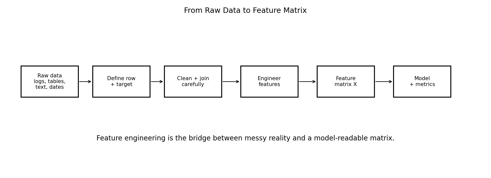

Raw data may be:

```text
transaction logs
customer tables
sensor readings
timestamps
text
images
geospatial coordinates
medical records
clickstream data
```

Feature engineering turns these into model-readable variables.

Student version:

```text
The model does not see the world.
The model sees the representation I give it.
```

That is why feature engineering is powerful.

And risky.

---

## 2. What Is a Feature?

A feature is one measurable input variable used by the model.

Examples:

```text
age
income
number_of_transactions_last_30_days
average_delay_last_3_months
device_type
country
hour_of_day
text_length
missing_income_flag
distance_to_city_center
```

A feature is not automatically useful.

A useful feature should usually be:

```text
available at prediction time
related to the target
stable enough to generalize
not leaking future information
encoded in a model-compatible way
```

A feature can be mathematically simple but practically strong.

Example:

```text
number_of_failed_logins_last_24h
```

This may be more useful than a fancy model.

---

## 3. Feature Engineering Is Representation Design

Feature engineering is not only cleaning.

It is representation design.

The same raw data can be represented in different ways.

Example timestamp:

```text
2026-08-03 19:20
```

Possible features:

```text
hour = 19
day_of_week = Monday
is_weekend = 0
month = 8
days_since_last_activity = 12
is_night = 0
```

Each representation gives the model a different view.

This is the key idea:

```text
A model can only learn patterns that are visible in the features.
```

If the useful pattern is hidden, the model may fail.

If the useful pattern is made clear, even a simple model can work well.

---

## 4. Feature Types

Different feature types need different treatment.

Visual:

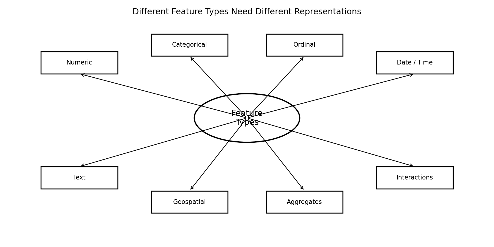

Common feature types:

```text
numeric
categorical
ordinal
datetime
text
geospatial
aggregated
interaction features
binary flags
count features
ratio features
```

The first question is not:

```text
Which model should I train?
```

The first question is often:

```text
What kind of feature is this?
```

Because the preprocessing depends on the type.

---

## 5. Numeric Features

Numeric features are values like:

```text
age
income
temperature
transaction_amount
distance
pressure
velocity
```

Common transformations:

```text
standardization
min-max scaling
log transform
winsorization / clipping
binning
missing value imputation
outlier flags
ratio features
```

For some models, numeric scaling matters a lot.

Examples:

```text
KNN
SVM
Logistic Regression
Linear Regression with regularization
PCA
Neural networks
```

For tree-based models, scaling is usually less important.

But missing values and outliers still matter.

---

## 6. Scaling

Standardization:

$$
z=\frac{x-\mu}{\sigma}
$$

Min-max scaling:

$$
z=\frac{x-x_{\min}}{x_{\max}-x_{\min}}
$$

Visual:

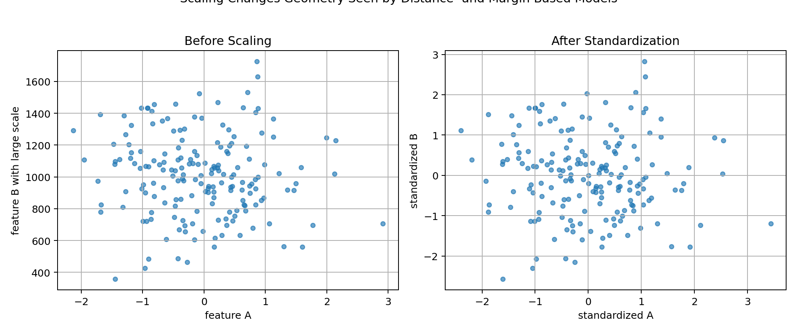

Scaling changes the geometry of the feature space.

This matters when models use:

```text
distance
dot products
gradients
regularization
margins
```

Examples:

```text
KNN uses distance
SVM uses margin and kernels
Logistic Regression uses regularized weights
PCA uses variance directions
```

Important rule:

```text
Fit scaler on training data only.
Transform validation/test using the training scaler.
```

If I fit the scaler on the full dataset before splitting, that is leakage.

---

## 7. Categorical Features

Categorical features are labels or groups:

```text
city
product_type
device_type
job_title
merchant_category
card_type
rock_type
```

Most ML models cannot directly use raw strings.

So categories must be encoded.

Common encodings:

```text
one-hot encoding
ordinal encoding
target encoding
frequency encoding
hashing encoding
embeddings
```

The right encoding depends on:

```text
number of categories
model type
dataset size
leakage risk
whether categories are ordered
```

---

## 8. One-Hot Encoding

One-hot encoding creates one binary column per category.

Visual:

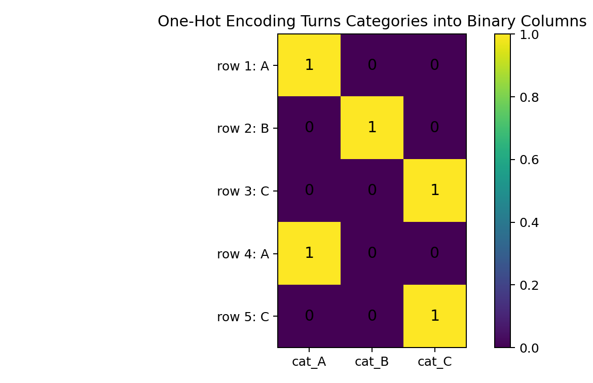

Example:

```text
color = red, blue, green
```

becomes:

```text
color_red
color_blue
color_green
```

One-hot encoding is good when:

```text
categories are nominal
number of categories is not too huge
linear models need category representation
```

But it can become large if there are many categories.

Example:

```text
merchant_id with 100,000 unique values
```

One-hot encoding may become too sparse and high-dimensional.

---

## 9. Ordinal Encoding

Ordinal features have meaningful order.

Examples:

```text
education_level: high_school < bachelor < master < phd
risk_level: low < medium < high
satisfaction: 1 < 2 < 3 < 4 < 5
```

Ordinal encoding can assign:

```text
low = 0
medium = 1
high = 2
```

But be careful.

If the categories do not have real order, ordinal encoding can create fake mathematical meaning.

Example:

```text
city: Baku=0, Paris=1, Tokyo=2
```

This is bad because it implies Tokyo > Paris > Baku in some numeric sense.

For unordered categories, use one-hot or another nominal encoding.

---

## 10. Target Encoding

Target encoding replaces a category with the average target value for that category.

Example:

```text
merchant_category = electronics
target mean = 0.17
```

So electronics becomes:

```text
0.17
```

Target encoding can be powerful for high-cardinality categorical features.

But it is dangerous because it uses the target.

Visual:

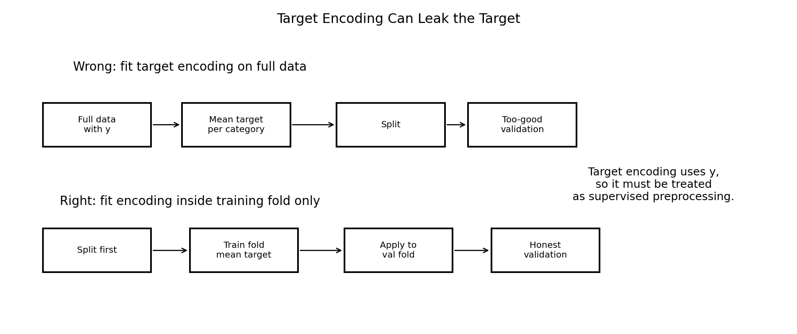

Wrong:

```text
calculate category target means on full dataset
then split train/test
```

This leaks target information.

Correct:

```text
split first
fit target encoding only on training folds
apply to validation/test
use smoothing
use out-of-fold encoding for training rows
```

Target encoding is supervised preprocessing.

Treat it like a model.

---

## 11. Missing Values

Missing values are not just annoying.

They can be informative.

Example:

```text
income is missing
```

This might mean:

```text
customer did not report income
system failed to collect income
income is not applicable
manual process skipped a field
```

Visual:

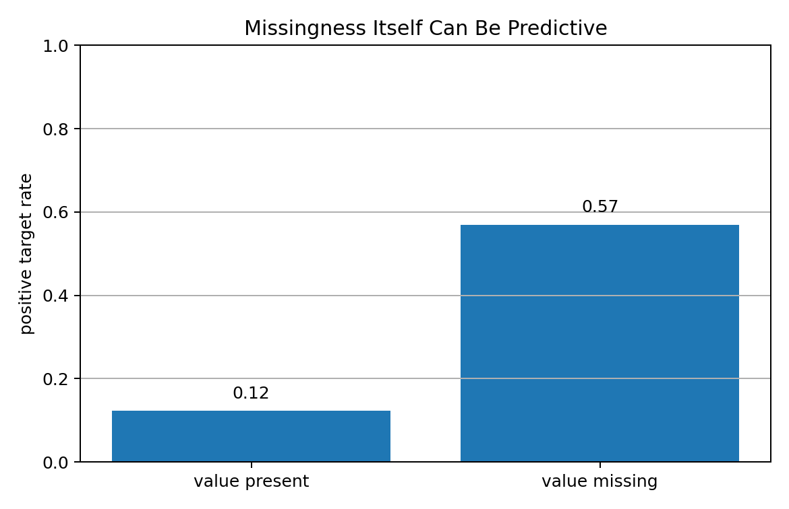

Common strategies:

```text
mean / median imputation
mode imputation
constant value imputation
missing indicator flag
model-based imputation
leave missing if model supports it
```

A useful pattern:

```text
impute value + add missingness flag
```

Example:

```text
income_imputed = median income
income_missing = 1
```

The missingness flag lets the model learn whether missing itself matters.

---

## 12. Outliers and Skewed Features

Some numeric features have extreme values.

Examples:

```text
income
transaction amount
number of clicks
insurance claim amount
production volume
```

Raw skewed features can be hard for some models.

Visual:

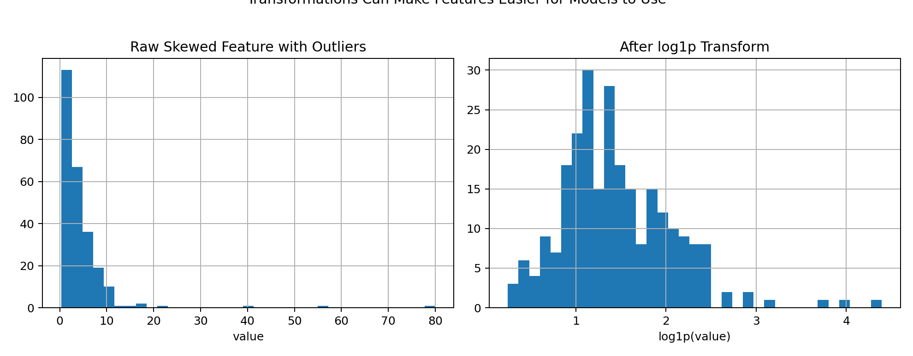

Useful transformations:

```text
log1p(x)
sqrt(x)
clipping
winsorization
robust scaling
bucketization
```

Example:

$$
x_{\text{new}}=\log(1+x)
$$

This reduces the effect of very large values.

But do not blindly remove outliers.

Sometimes outliers are exactly the important signal.

In fraud, failure detection, and risk modeling, rare extreme values can matter.

---

## 13. Interaction Features

Sometimes the target depends on a combination of features, not each feature alone.

Example:

```text
income alone may not be enough
loan_amount alone may not be enough
but loan_amount / income may be very useful
```

Interaction features:

```text
x1 * x2
x1 / x2
x1 - x2
category + time combination
count in last 7 days / count in last 30 days
```

Visual:

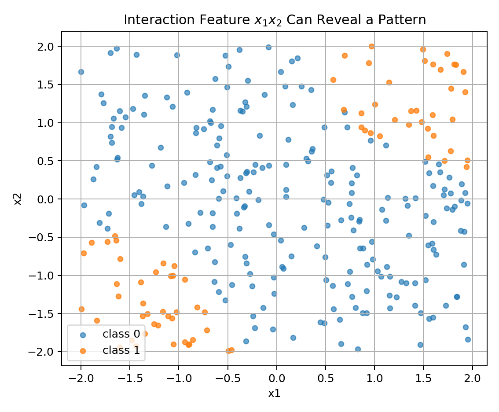

Linear models especially benefit from interaction features because they cannot automatically create nonlinear interactions unless we give them.

Tree models can discover some interactions themselves.

But even for trees, thoughtful features can help.

---

## 14. Aggregation Features

Many real datasets are event-based.

Example:

```text
one customer has many transactions
one user has many clicks
one sensor has many readings
one well has many monthly production records
```

But the model may need one row per customer, user, sensor, or well.

Aggregation features summarize history:

```text
number_of_transactions_last_7_days
avg_amount_last_30_days
max_delay_last_6_months
days_since_last_purchase
count_failed_logins_last_24h
std_sensor_reading_last_hour
```

Important:

```text
Aggregations must respect the prediction time.
```

If I predict on Jan 1, I cannot use transactions from Jan 10.

That would be temporal leakage.

---

## 15. Datetime Features

Datetime features are everywhere.

Raw timestamp:

```text
2026-08-03 19:20
```

Possible features:

```text
hour
day_of_week
month
quarter
is_weekend
is_holiday
days_since_signup
time_since_last_event
season
```

Cyclical features are useful when values wrap around.

Example hour:

```text
23 is close to 0
```

A better representation:

$$
hour_{\sin}=\sin\left(\frac{2\pi\cdot hour}{24}\right)
$$

$$
hour_{\cos}=\cos\left(\frac{2\pi\cdot hour}{24}\right)
$$

This tells the model that hour 23 and hour 0 are near each other.

---

## 16. Text Features Preview

Text can be represented in many ways.

Classical ML features:

```text
bag of words
TF-IDF
character n-grams
word n-grams
document length
number of digits
number of uppercase words
```

Modern features:

```text
word embeddings
sentence embeddings
transformer embeddings
domain-specific embeddings
```

For classical ML, TF-IDF + Logistic Regression or Linear SVM can be surprisingly strong.

Important:

```text
Vectorizer must be fitted on training data only.
```

If vocabulary or statistics are learned from the full dataset, validation/test information leaks.

---

## 17. Geospatial Features Preview

Geospatial raw data:

```text
latitude
longitude
```

Possible features:

```text
distance to city center
distance to nearest station
region
grid cell
cluster id
urban/rural flag
elevation
distance to fault line
```

For geoscience, geospatial features can be very meaningful.

But they must be designed carefully.

If the split is random but nearby locations are highly correlated, evaluation can be too optimistic.

Sometimes spatial split is more honest than random split.

---

## 18. Dataset Design Starts Before Modeling

Dataset design means defining the prediction problem precisely.

Visual:

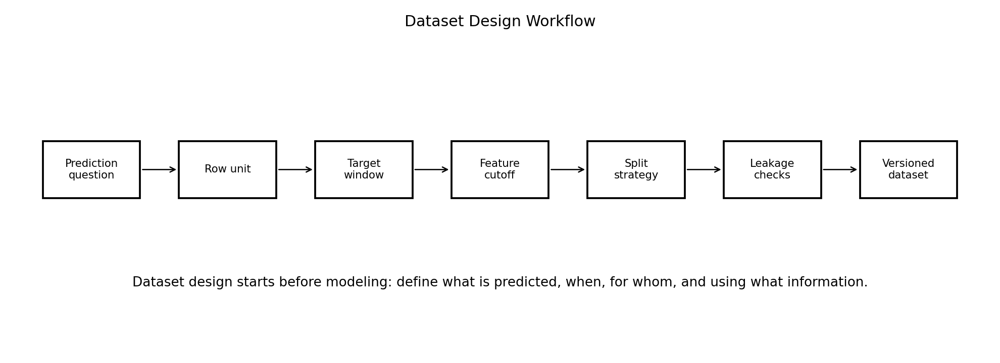

Before modeling, ask:

```text
What is one row?
What is the target?
At what time is prediction made?
What information is available at that time?
What is the target window?
What is the feature window?
How should train/test split be done?
What counts as leakage?
```

Example:

```text
Predict whether a customer will default in next 30 days.
```

Then:

```text
row = customer at application date
feature cutoff = application date
target window = next 30 days
features allowed = information available before or at application date
features forbidden = anything after application date
```

This is much more precise than:

```text
predict default
```

Precision saves projects.

---

## 19. Target Leakage

Target leakage happens when a feature directly or indirectly contains the answer.

Examples:

```text
using final diagnosis to predict disease
using future repayment status to predict default
using cancellation_date to predict churn
using "fraud_investigation_result" to predict fraud
using post-event measurements to predict the event
```

Target leakage can make validation scores extremely high.

But the model fails in real life because that feature is not available at prediction time.

The key question:

```text
Would I know this feature at the moment of prediction?
```

If no, it is leakage.

---

## 20. Temporal Leakage

Temporal leakage happens when future information is used to predict the past.

Visual:

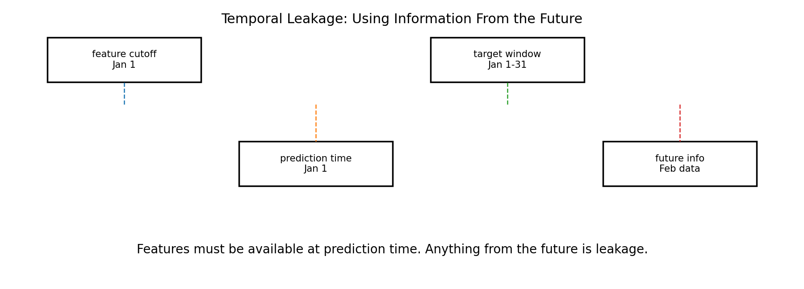

Example:

```text
predict default at application date
but use payments made after application date
```

That is leakage.

For temporal problems, every feature should have a timestamp logic.

Important terms:

```text
prediction time
feature cutoff
lookback window
target window
event time
observation time
```

A safe feature sounds like:

```text
number_of_late_payments_in_last_6_months_before_application
```

A dangerous feature sounds like:

```text
number_of_late_payments_in_application_month_and_after
```

---

## 21. Preprocessing Leakage

Preprocessing leakage happens when transformations are fitted on the full dataset before splitting.

Examples:

```text
scaler.fit(X_full)
imputer.fit(X_full)
PCA.fit(X_full)
feature_selector.fit(X_full, y_full)
target_encoder.fit(X_full, y_full)
```

Correct:

```text
fit preprocessing on training data only
apply to validation/test
```

In cross-validation, preprocessing should be fitted inside each training fold.

This is why pipelines are so important.

---

## 22. Group Leakage

Group leakage happens when related rows appear in both train and test.

Visual:

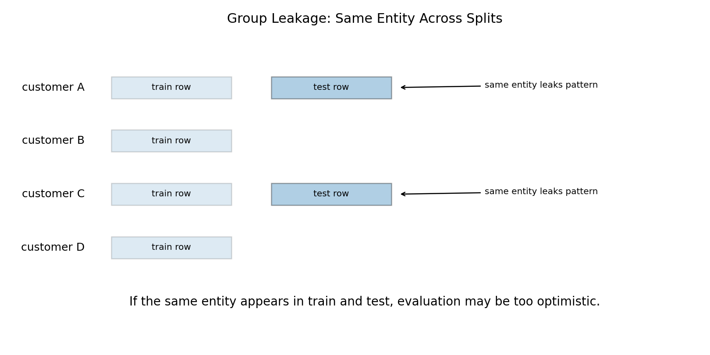

Examples:

```text
same customer has rows in train and test
same patient has multiple visits split across train/test
same device has readings in both sets
same location appears in both sets
same document duplicated with small changes
```

The model may appear to generalize, but really it recognizes the entity.

Solution:

```text
GroupKFold
group-based split
customer-level split
patient-level split
spatial split
time-based split
```

The split must match the real deployment scenario.

---

## 23. Train-Serving Skew

Train-serving skew happens when training features differ from production features.

Visual:

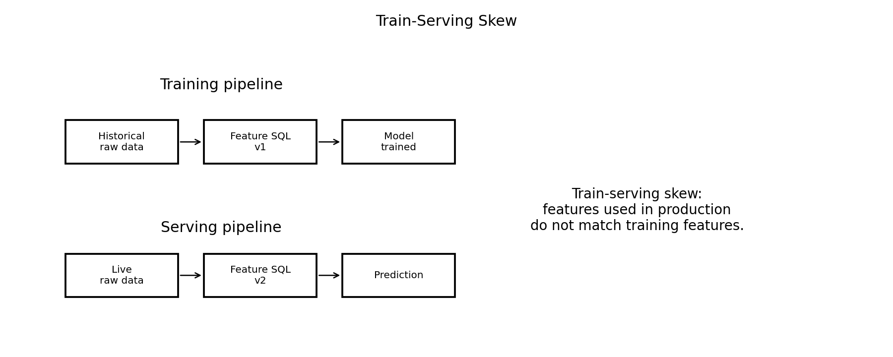

Examples:

```text
training uses cleaned offline data
production uses raw live data
training feature SQL differs from serving feature SQL
training has a column not available online
production category values differ
real-time feature delay exists
```

This is why production ML needs:

```text
feature definitions
versioning
monitoring
data contracts
feature stores
training-serving consistency checks
```

A model can be good in notebook and bad in production if feature pipelines differ.

---

## 24. Dataset Shift

Dataset shift happens when training distribution and future distribution differ.

Visual:

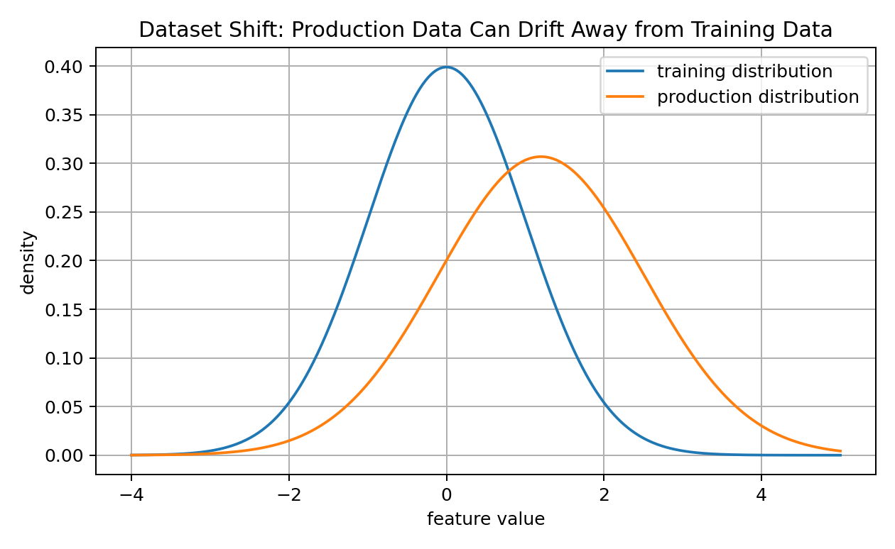

Types:

```text
covariate shift: P(X) changes
label shift: P(y) changes
concept drift: P(y|X) changes
```

Examples:

```text
customer behavior changes
new product launched
economic conditions change
sensor replaced
policy rules changed
fraudsters adapt
seasonality changes
```

Dataset shift does not mean the old model is useless immediately.

But it means performance must be monitored.

---

## 25. Feature Selection

More features are not always better.

Too many features can cause:

```text
overfitting
noise
slower training
harder interpretation
multicollinearity
leakage risk
maintenance burden
```

Feature selection methods:

```text
domain knowledge
correlation checks
mutual information
regularization
permutation importance
tree-based importance
recursive feature elimination
stability across folds
```

But be careful:

```text
Feature selection using y must happen inside cross-validation.
```

If I select features using the full dataset before CV, that leaks target information.

---

## 26. Dataset Versioning

A dataset used for modeling should be reproducible.

Track:

```text
data source
query version
feature definitions
target definition
date range
split logic
random seed
preprocessing logic
labeling rules
excluded rows
known limitations
```

If I cannot recreate the dataset, I cannot fully trust the experiment.

This matters for:

```text
research
work projects
production ML
audits
debugging
collaboration
```

A serious ML project should not only save the model.

It should save the dataset recipe.

---

## 27. From-Scratch: Train-Only Standardization

```python
def fit_standardizer(X_train):
    mean = X_train.mean(axis=0)
    std = X_train.std(axis=0)
    std = np.where(std == 0, 1, std)
    return mean, std

def transform_standardizer(X, mean, std):
    return (X - mean) / std
```

Usage:

```python
mean, std = fit_standardizer(X_train)

X_train_scaled = transform_standardizer(X_train, mean, std)
X_test_scaled = transform_standardizer(X_test, mean, std)
```

Never fit mean and standard deviation on the full dataset before splitting.

---

## 28. From-Scratch: One-Hot Encoding with Unknown Categories

```python
def fit_one_hot(categories):
    return {cat: i for i, cat in enumerate(sorted(set(categories)))}

def transform_one_hot(categories, mapping):
    X = np.zeros((len(categories), len(mapping)))

    for row, cat in enumerate(categories):
        if cat in mapping:
            X[row, mapping[cat]] = 1

    return X
```

If a category appears in test but not training, this simple version leaves all zeros.

That is a basic way to handle unknown categories.

In production, unknown category handling should be explicit.

---

## 29. From-Scratch: Median Imputation + Missing Flag

```python
def fit_median_imputer(x_train):
    median = np.nanmedian(x_train)
    return median

def transform_median_imputer(x, median):
    missing_flag = np.isnan(x).astype(float)
    x_filled = np.where(np.isnan(x), median, x)
    return x_filled, missing_flag
```

This creates two features:

```text
filled value
missingness flag
```

The missing flag is important when missingness itself is predictive.

---

## 30. Scikit-Learn ColumnTransformer Example

For mixed data, Scikit-learn uses `ColumnTransformer`.

```python
from sklearn.compose import ColumnTransformer
from sklearn.preprocessing import StandardScaler, OneHotEncoder
from sklearn.impute import SimpleImputer
from sklearn.pipeline import Pipeline
from sklearn.linear_model import LogisticRegression

numeric_features = ["age", "income"]
categorical_features = ["city", "device_type"]

numeric_pipeline = Pipeline([
    ("imputer", SimpleImputer(strategy="median")),
    ("scaler", StandardScaler())
])

categorical_pipeline = Pipeline([
    ("imputer", SimpleImputer(strategy="most_frequent")),
    ("onehot", OneHotEncoder(handle_unknown="ignore"))
])

preprocess = ColumnTransformer([
    ("num", numeric_pipeline, numeric_features),
    ("cat", categorical_pipeline, categorical_features)
])

model = Pipeline([
    ("preprocess", preprocess),
    ("classifier", LogisticRegression())
])
```

This is a professional pattern.

The preprocessing lives inside the model pipeline.

So cross-validation can be done safely.

---

## 31. Common Mistakes

### Mistake 1: Creating features before defining prediction time

Without prediction time, leakage is hard to detect.

### Mistake 2: Using future information

If the feature is not available at prediction time, it is not allowed.

### Mistake 3: Fitting preprocessing on full data

Scaler, imputer, PCA, target encoder, and feature selector must be fitted on training data only.

### Mistake 4: Random split when group split is needed

Same customer/patient/device/location across train and test can leak identity.

### Mistake 5: Treating target encoding as ordinary encoding

Target encoding uses y and can leak easily.

### Mistake 6: Ignoring train-serving skew

Notebook features and production features must match.

### Mistake 7: Adding many features without checking stability

More columns can mean more noise and more maintenance.

### Mistake 8: Not documenting dataset definition

If the dataset cannot be recreated, the experiment is weak.

---

## 32. Interview-Level Explanation

Short explanation:

```text
Feature engineering is the process of transforming raw data into model-usable variables. Dataset design defines the row unit, target, prediction time, feature windows, and split strategy. Data leakage occurs when the model uses information during training or validation that would not be available at prediction time. To avoid leakage, preprocessing must be fitted only on training data, supervised transformations must happen inside cross-validation, and temporal or group structure must be respected.
```

Natural explanation:

```text
Feature engineering is how we decide what the model gets to see. Dataset design is how we make sure the prediction problem is defined honestly. Leakage is when we accidentally give the model information from the future or from the answer itself. A model can look amazing with leakage, but that score is fake.
```

---

## 33. What I Learned From This Lesson

This lesson taught:

```text
feature representation
numeric features
categorical encoding
ordinal encoding
target encoding
missing values
outliers
scaling
interaction features
aggregation features
datetime features
text features
geospatial features
dataset design
target leakage
temporal leakage
preprocessing leakage
group leakage
train-serving skew
dataset shift
feature selection
dataset versioning
```

The central lesson:

```text
Good ML starts before model.fit().
It starts with a truthful dataset.
```

---

## Mini Exercise

Create a file called `13-feature-engineering-data-leakage-dataset-design.py` inside the `code` folder.

Write code that:

```text
1. creates a small mixed-type dataset
2. defines row unit and target
3. splits train/test first
4. implements train-only standardization
5. implements train-only median imputation
6. adds missingness flags
7. implements one-hot encoding with unknown category handling
8. creates a simple interaction feature
9. demonstrates why fitting preprocessing on full data is wrong
10. explains one example of target leakage and one example of temporal leakage
```

Then answer:

```text
What is one row in my dataset?
What is the prediction time?
What is the target window?
Which features are allowed?
Which features are forbidden?
Could any feature leak the answer?
Should the split be random, temporal, group-based, or spatial?
Does production have the same features as training?
```

---

## Further Reading and Resources

### Books

- [An Introduction to Statistical Learning](https://www.statlearning.com/)
- [The Elements of Statistical Learning](https://hastie.su.domains/ElemStatLearn/)
- [Hands-On Machine Learning with Scikit-Learn, Keras, and TensorFlow](https://www.oreilly.com/library/view/hands-on-machine-learning/9781098125967/)

### Documentation

- [Scikit-learn Preprocessing](https://scikit-learn.org/stable/modules/preprocessing.html)
- [Scikit-learn Pipeline](https://scikit-learn.org/stable/modules/compose.html#pipeline)
- [Scikit-learn ColumnTransformer](https://scikit-learn.org/stable/modules/generated/sklearn.compose.ColumnTransformer.html)
- [Scikit-learn OneHotEncoder](https://scikit-learn.org/stable/modules/generated/sklearn.preprocessing.OneHotEncoder.html)
- [Scikit-learn Imputation](https://scikit-learn.org/stable/modules/impute.html)

### What to Study Next

After this, the next logical lesson is:

```text
14 — Model Interpretability and Error Analysis
```

Because once features and datasets are designed, I need to understand:

```text
what the model learned
where it fails
which feature groups matter
which data slices are weak
```

---

## Final Reflection

This lesson is not only technical.

It is about honesty.

A model can look strong because the features are good.

That is real progress.

But a model can also look strong because the features leaked the answer.

That is fake progress.

The difference between those two is dataset design.

So before I trust any ML result, I should ask:

```text
What was known at prediction time?
Was the split realistic?
Was preprocessing fitted only on training data?
Did the target leak?
Can this dataset be recreated?
```

That is how feature engineering becomes serious ML.
