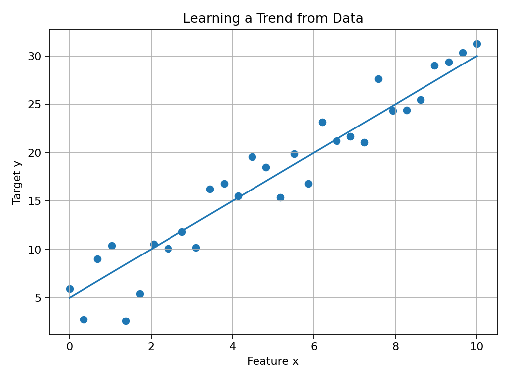
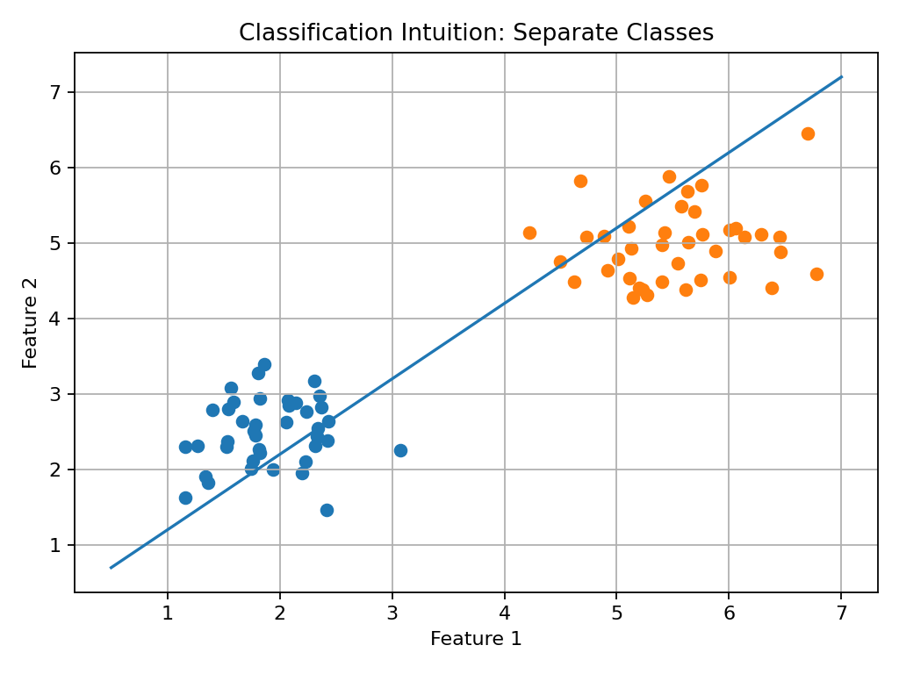
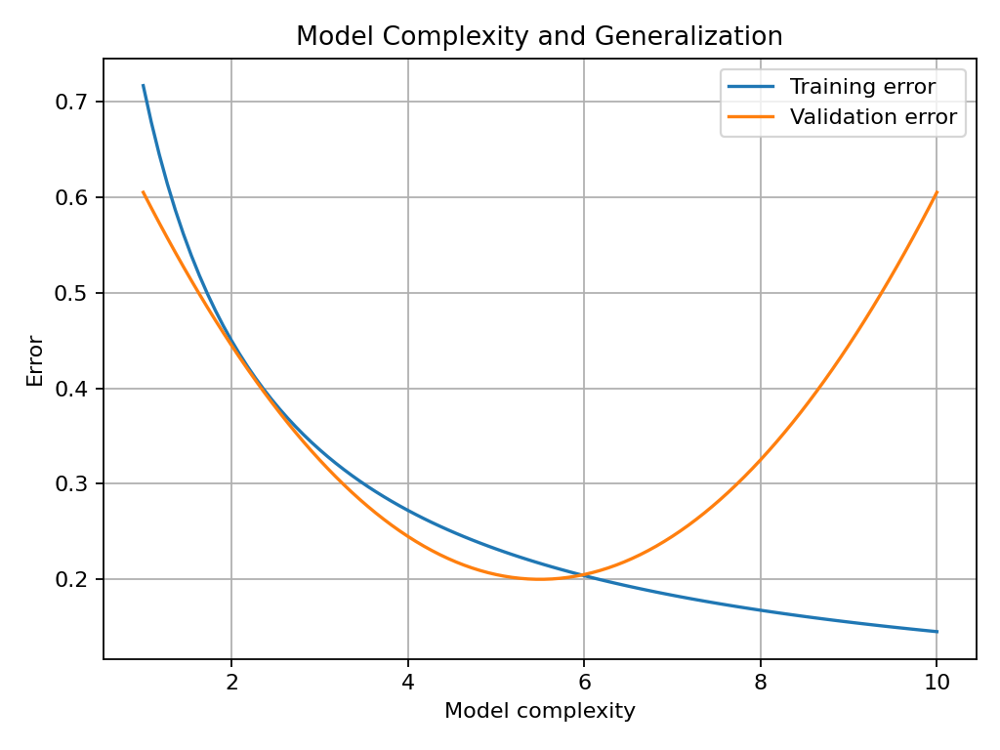
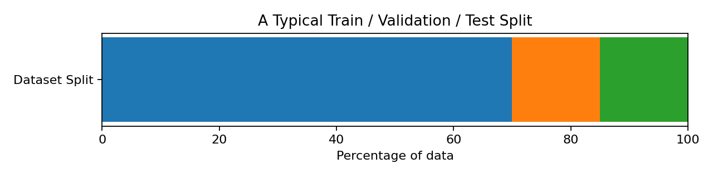

# 00 — Entering Machine Learning: Culture, Mental Models, and First Principles

## Why This Lesson Exists

Now I am entering the Machine Learning section of the repository, and I do not want to enter it in a shallow way.

I want to enter it with the right **culture**, the right **mental models**, and the right **mathematical foundation**.

Machine Learning is often introduced in a confusing way. Some people jump too quickly into code. Others jump too quickly into formulas. Some people treat ML like magic. Others treat it like a collection of libraries. I do not want to do either.

I want to understand Machine Learning as a discipline.

That means I want to understand:

```text
what problem ML is trying to solve
what data looks like in ML
what a model really is
what training means
what prediction means
what loss means
what a metric means
what generalization means
why overfitting happens
why train/validation/test split matters
how to think like an ML practitioner
```

This lesson is the doorway into that world.

---

## 1. Entering ML with the Right Culture

Before formulas, before algorithms, before code, there is a mindset.

A strong ML culture usually includes these beliefs:

### 1.1 ML is not magic

A model does not “understand” the world like a human. It learns patterns from data.

If the data is weak, noisy, biased, or incomplete, the model may learn the wrong thing.

### 1.2 Start with the problem, not the algorithm

A beginner often asks:

```text
Which algorithm should I use?
```

A stronger question is:

```text
What is the problem?
What is the input?
What is the output?
What does success mean?
What metric should represent success?
```

The problem comes first. The algorithm comes later.

### 1.3 Data matters more than hype

In practice, many ML problems are not solved by using a “fancier” model. They are solved by:

```text
cleaner data
better features
better labeling
better evaluation
better error analysis
```

### 1.4 Baselines matter

Before I celebrate a model, I should ask:

```text
Is it better than a simple baseline?
```

If a very simple rule performs almost as well as the complex model, then the complex model may not be worth it.

### 1.5 Honest evaluation matters

A model should be judged on data it did not train on. If I evaluate on the same data I used to fit the model, I may fool myself.

### 1.6 Failure analysis matters

When a model performs badly, the next question is not:

```text
Which new algorithm should I try?
```

The better question is:

```text
Where exactly is it failing?
Which examples are hard?
Which class is weak?
What kind of errors is it making?
```

This is the culture I want for the ML part of this repository.

---

## 2. What Machine Learning Really Is

A simple definition:

> Machine Learning is the study of methods that learn patterns from data in order to make predictions, decisions, or useful representations.

A more mathematical view:

Suppose I have input data $x$ and a desired output $y$.

Machine Learning tries to learn a function

$$
f_\theta(x) \approx y
$$

where:

```text
x      -> input
y      -> target / desired output
f      -> model
theta  -> model parameters
```

So the whole idea is:

```text
data in -> learned mapping -> prediction out
```

If the model learns well, then for a new input $x_{\text{new}}$, it can produce a good prediction:

$$
\hat{y} = f_\theta(x_{\text{new}})
$$

This symbol $\hat{y}$ means “predicted y”.

---

## 3. Samples, Features, and Targets

Machine Learning starts with data.

A dataset is often written as:

$$
\mathcal{D} = \{(x_i, y_i)\}_{i=1}^{n}
$$

This means the dataset contains $n$ examples, and each example has:

```text
x_i -> the input features
y_i -> the target or label
```

For example, in a house-price problem:

```text
x_i = [size, number_of_rooms, distance_to_center]
y_i = house_price
```

If each input has $d$ features, then a single example is:

$$
x_i \in \mathbb{R}^{d}
$$

A full dataset of inputs is often written as a matrix:

$$
X \in \mathbb{R}^{n \times d}
$$

where:

```text
n -> number of samples
d -> number of features
```

And the targets are often written as:

$$
y \in \mathbb{R}^{n}
$$

for regression, or a vector of class labels for classification.

This is one of the most important mental models in ML:

```text
Rows are examples.
Columns are features.
y is what I want to predict.
```

---

## 4. Regression vs Classification

Two of the most common supervised learning problems are:

### Regression

Regression means predicting a continuous value.

Examples:

```text
house price
temperature tomorrow
energy consumption
earthquake magnitude estimate
```

Mathematically:

$$
y \in \mathbb{R}
$$

for each sample.

Example intuition image:



### Classification

Classification means predicting a category or class label.

Examples:

```text
spam or not spam
disease or no disease
cat / dog / bird
normal signal / earthquake-like signal / noise
```

For binary classification:

$$
y \in \{0, 1\}
$$

For multi-class classification:

$$
y \in \{1, 2, \dots, K\}
$$

Example intuition image:



This lesson is not about choosing one algorithm yet. It is about understanding the kinds of problems ML solves.

---

## 5. Supervised, Unsupervised, and Beyond

### Supervised Learning

In supervised learning, the dataset includes both inputs and targets.

$$
(x_i, y_i)
$$

The goal is to learn from labeled examples.

Examples:

```text
regression
classification
```

### Unsupervised Learning

In unsupervised learning, I usually have only inputs:

$$
x_1, x_2, \dots, x_n
$$

There is no explicit target label.

The goal may be:

```text
clustering
dimensionality reduction
representation learning
pattern discovery
```

### Semi-supervised, self-supervised, reinforcement learning

These exist too, but for now I want the first foundation to be strong: supervised learning first, then broader paradigms later.

---

## 6. What Is a Model?

A model is a function with adjustable parameters.

For example, a simple linear model is:

$$
\hat{y} = w^T x + b
$$

where:

```text
w -> weights
b -> bias / intercept
x -> input vector
y_hat -> predicted output
```

If:

$$
x = [x_1, x_2, \dots, x_d]
$$

and

$$
w = [w_1, w_2, \dots, w_d]
$$

then:

$$
\hat{y} = w_1x_1 + w_2x_2 + \dots + w_dx_d + b
$$

This equation appears again and again in ML.

Even when later models become more complex, this core idea remains:

```text
A model combines inputs using parameters to produce predictions.
```

---

## 7. Parameters vs Hyperparameters

This distinction is extremely important.

### Parameters

Parameters are learned from the data.

Examples:

```text
weights in linear regression
weights in logistic regression
tree split values
neural network weights
```

In notation, parameters are often represented by $\theta$, $w$, and $b$.

### Hyperparameters

Hyperparameters are chosen by the practitioner before or during training.

Examples:

```text
k in KNN
learning rate
number of epochs
tree depth
regularization strength
batch size
```

A good mental model:

```text
parameters     -> learned by the model
hyperparameters -> chosen by me
```

This difference matters because a lot of ML work is really about good hyperparameter choices and good evaluation, not only about formulas.

---

## 8. Training vs Inference

### Training

Training means using data to learn the parameters.

The model sees examples $(x_i, y_i)$, makes predictions $\hat{y}_i$, compares them with the true targets $y_i$, and adjusts parameters to reduce error.

### Inference

Inference means using the trained model to make predictions on new inputs.

If a model has already learned useful parameters, then inference is simply:

$$
\hat{y} = f_\theta(x_{\text{new}})
$$

So:

```text
training  -> learning from known examples
inference -> predicting on new examples
```

This distinction is central to ML culture. A model is not judged by how well it memorizes training data, but by how well it generalizes to unseen data.

---

## 9. Loss Functions: How the Model Knows It Is Wrong

A loss function tells the model how wrong its predictions are.

For regression, a common loss is **Mean Squared Error (MSE)**:

$$
\mathrm{MSE} = \frac{1}{n}\sum_{i=1}^{n}(y_i - \hat{y}_i)^2
$$

This means:

```text
prediction error
-> square it
-> average it
```

The square makes large errors count more strongly.

For classification, a common metric is accuracy, but the training loss is often something else, such as cross-entropy.

A simple accuracy formula is:

$$
\mathrm{Accuracy} = \frac{\text{number of correct predictions}}{\text{total number of predictions}}
$$

A crucial distinction:

```text
Loss   -> what the model tries to optimize during training
Metric -> how I judge the model from the outside
```

Sometimes loss and metric are similar. Sometimes they are quite different.

---

## 10. Optimization: Learning by Reducing Loss

Training usually means solving an optimization problem.

I want to find parameters $\theta$ that minimize the loss:

$$
\theta^* = \arg\min_{\theta} \mathcal{L}(\theta)
$$

This expression means:

```text
find the parameter values theta
that make the loss as small as possible
```

This is the mathematical heart of training.

In many algorithms, especially deep learning, this is done iteratively using optimization methods such as gradient descent.

Even before studying gradient descent deeply, this mental picture matters:

```text
model makes prediction
-> compare with truth
-> compute loss
-> adjust parameters
-> repeat
```

That loop is the engine of learning.

---

## 11. Generalization: The Real Goal

A model is not useful if it only performs well on the training data.

The real goal is **generalization**.

Generalization means:

> the ability of a model to perform well on new, unseen data.

This is one of the deepest ideas in ML.

If I train on one dataset and the model only memorizes those examples, then it may fail on slightly different data. A strong model should learn a pattern, not just a memory table.

This is why evaluation culture matters so much.

---

## 12. Overfitting and Underfitting

### Underfitting

Underfitting happens when the model is too simple or too weak to capture the real pattern.

Signs:

```text
high training error
high validation/test error
```

### Overfitting

Overfitting happens when the model learns the training data too specifically and fails to generalize.

Signs:

```text
very low training error
worse validation/test error
```

### Good fit

A good model balances learning and generalization.

Intuition image:



This idea is part of the famous **bias-variance tradeoff**, which I will study more deeply later.

For now, the main lesson is:

```text
A model should not only fit.
It should generalize.
```

---

## 13. Train / Validation / Test Split

To evaluate honestly, I should separate my data.

A common split is:

```text
train       -> used to learn parameters
validation  -> used to tune choices
test        -> used only for final evaluation
```

Intuition image:



The training set teaches the model.

The validation set helps me choose things like:

```text
which model is better
which hyperparameters are better
whether I am overfitting
```

The test set is the final exam. It should be used only after the model design is mostly settled.

If I keep looking at the test set while making decisions, I slowly overfit to the test set too.

That is bad ML culture.

---

## 14. The Smallest End-to-End ML Workflow

A minimal ML workflow often looks like this:

```text
1. define the problem
2. load the data
3. inspect the data
4. choose features X and target y
5. split into train and test
6. choose a model
7. train the model
8. make predictions
9. evaluate with a metric
10. analyze errors
```

In code, this workflow may look surprisingly short.

For example, using Scikit-learn and a simple KNN classifier:

```python
from sklearn.datasets import load_iris
from sklearn.model_selection import train_test_split
from sklearn.neighbors import KNeighborsClassifier
from sklearn.metrics import accuracy_score

data = load_iris()
X = data.data
y = data.target

X_train, X_test, y_train, y_test = train_test_split(
    X, y, test_size=0.2, random_state=42
)

model = KNeighborsClassifier(n_neighbors=3)
model.fit(X_train, y_train)

y_pred = model.predict(X_test)

accuracy = accuracy_score(y_test, y_pred)

print("Accuracy:", accuracy)
```

This code is simple, but it contains the skeleton of a real ML pipeline.

---

## 15. Why This Code Matters

Let me read that workflow like a story.

### `X = data.data`

This is the feature matrix.

### `y = data.target`

This is the target vector.

### `train_test_split(...)`

This separates learning from evaluation.

### `KNeighborsClassifier(...)`

This chooses a model family and a hyperparameter (`n_neighbors=3`).

### `model.fit(...)`

This is training.

### `model.predict(...)`

This is inference.

### `accuracy_score(...)`

This is evaluation.

If I can read these lines not only as code, but as concepts, I am entering ML correctly.

---

## 16. Basic Terminology I Must Know

Here are the core terms from this lesson in one place.

### Dataset
A collection of examples.

### Sample / Observation
One row in the dataset.

### Feature
An input variable used for prediction.

### Target / Label
The output I want the model to predict.

### Model
A parameterized function that maps inputs to outputs.

### Parameter
A learned internal value of the model.

### Hyperparameter
A user-chosen setting that influences training or model structure.

### Training
The process of learning parameters from data.

### Inference
The process of making predictions with a trained model.

### Loss
A function measuring prediction error during training.

### Metric
A score used to evaluate performance.

### Generalization
Performance on unseen data.

### Overfitting
Good training performance, weak unseen performance.

### Underfitting
Weak performance even on training data.

### Baseline
A simple reference model or rule used for comparison.

These terms are the alphabet of ML.

---

## 17. Common Beginner Mistakes

One common mistake is starting from libraries instead of concepts.

Another mistake is choosing algorithms before understanding the problem.

A third mistake is not separating training and evaluation clearly.

A fourth mistake is believing that higher accuracy automatically means a good model. Accuracy may be misleading for imbalanced classes.

A fifth mistake is not inspecting the data before training.

A sixth mistake is ignoring the difference between parameters and hyperparameters.

A seventh mistake is skipping error analysis.

Machine Learning becomes much clearer when I move slowly and honestly.

---

## 18. What I Learned From This Lesson

This lesson did not teach one single algorithm deeply. Instead, it gave me the mental architecture of Machine Learning.

The most important ideas are:

```text
ML learns a mapping from inputs to outputs
data is organized as samples and features
models have parameters
people choose hyperparameters
training uses a loss
evaluation uses metrics
generalization matters more than memorization
overfitting is a real danger
honest train/validation/test separation matters
ML culture is about careful thinking, not hype
```

This is the right place to start.

---

## Mini Exercise

Create a file called `09-ml-first-workflow.py` inside the `code` folder.

The script should:

```text
1. load a small built-in dataset
2. define X and y
3. split into train and test
4. train a KNN classifier
5. predict on the test set
6. calculate accuracy
7. print the result
```

Then answer these questions in your own words:

```text
What is X?
What is y?
What is training?
What is prediction?
What is the difference between a model parameter and a hyperparameter?
Why do we split data?
```

---

## Further Reading and Resources

### Official Documentation

- [Scikit-learn: User Guide](https://scikit-learn.org/stable/user_guide.html)
- [Scikit-learn: Supervised Learning](https://scikit-learn.org/stable/supervised_learning.html)
- [Scikit-learn: Model Selection and Evaluation](https://scikit-learn.org/stable/model_selection.html)

### Books

- [An Introduction to Statistical Learning](https://www.statlearning.com/)
- [The Elements of Statistical Learning](https://hastie.su.domains/ElemStatLearn/)
- [Hands-On Machine Learning with Scikit-Learn, Keras, and TensorFlow](https://www.oreilly.com/library/view/hands-on-machine-learning/9781098125967/)
- [Pattern Recognition and Machine Learning by Christopher Bishop](https://link.springer.com/book/10.1007/978-0-387-45528-0)

### Friendly Conceptual Resources

- [Google Machine Learning Glossary](https://developers.google.com/machine-learning/glossary)
- [Kaggle Learn: Intro to Machine Learning](https://www.kaggle.com/learn/intro-to-machine-learning)
- [Kaggle Learn: Intermediate Machine Learning](https://www.kaggle.com/learn/intermediate-machine-learning)

### What to Study Next

The next lesson should go from this big-picture introduction into the first real algorithm.

A strong next step is:

```text
K-Nearest Neighbors (KNN)
```

because it is conceptually simple, visual, and helps me understand distance, neighbors, decision boundaries, and the idea of prediction from examples.

---

## Final Reflection

Entering Machine Learning correctly means entering it with discipline.

I do not want to only run `.fit()` and `.predict()`.

I want to understand what those actions mean.

I do not want to only memorize formulas.

I want to connect formulas, code, data, and intuition.

If I build this section carefully, then later topics such as linear regression, logistic regression, trees, neural networks, transformers, and MLOps will stand on a strong foundation.

That is how I want this repository to grow.
