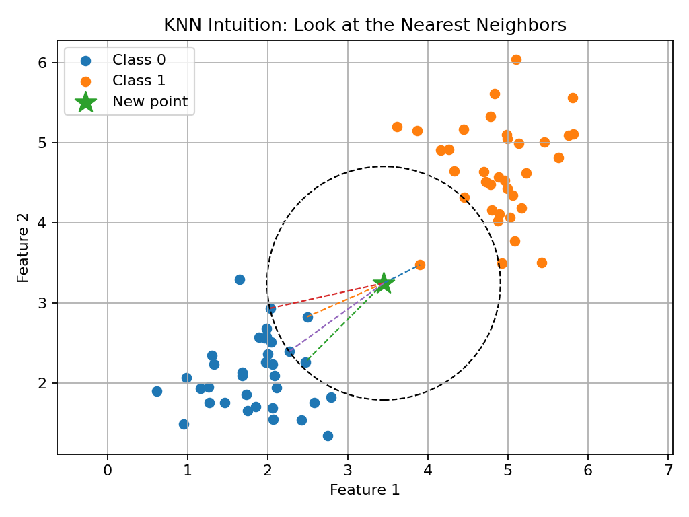
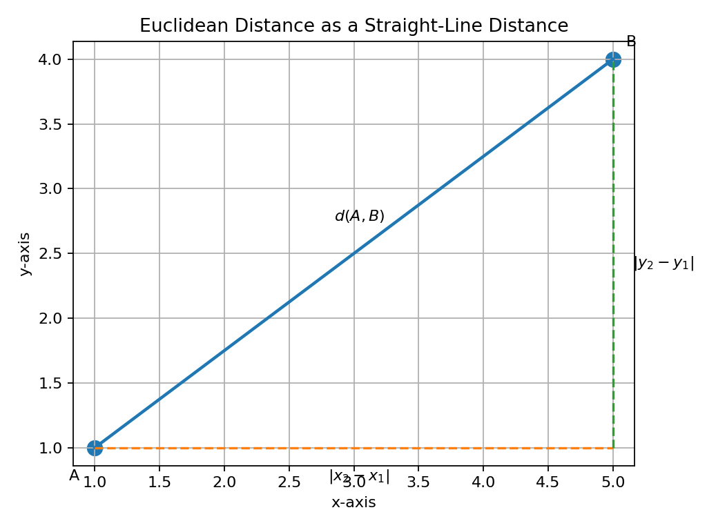
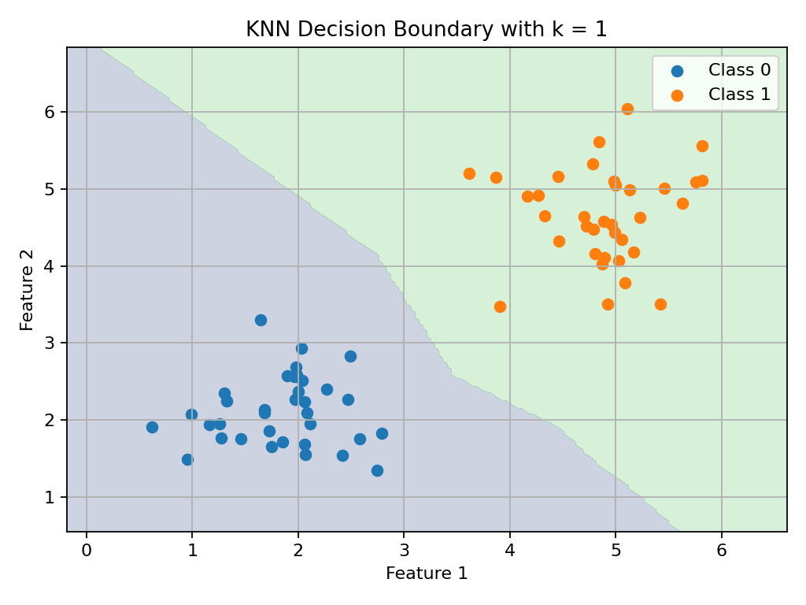
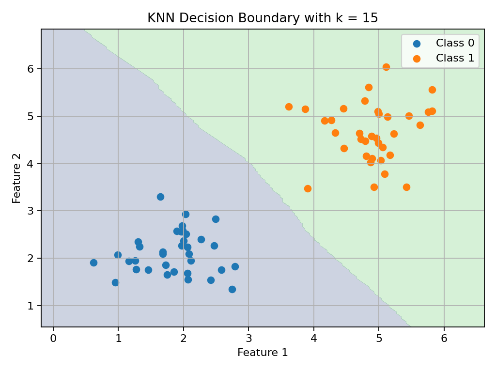
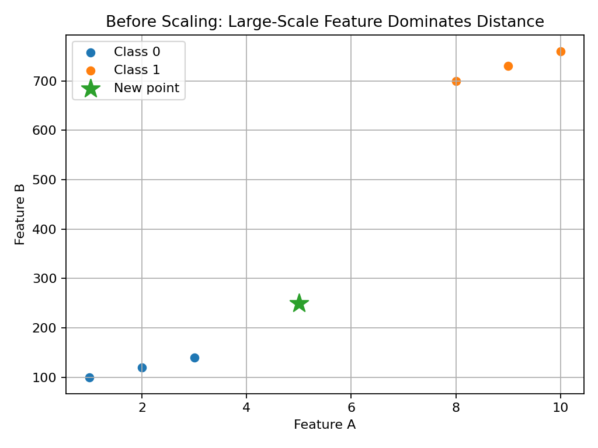
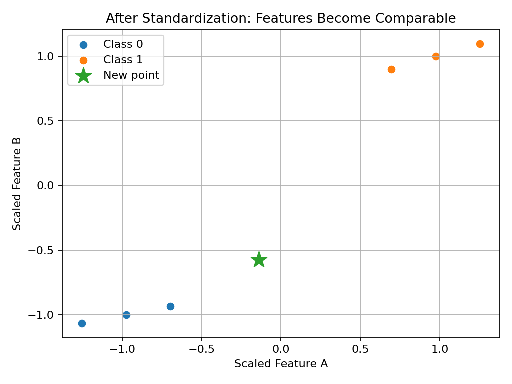

# 01 — K-Nearest Neighbors from Intuition to Math to Code

## Why This Lesson Exists

This is the first real algorithm lesson in the Machine Learning section.

I want to start with **K-Nearest Neighbors**, usually called **KNN**, because it is one of the most intuitive algorithms in Machine Learning. KNN does not begin with complicated optimization, gradients, matrix calculus, or probability distributions. It begins with a very human idea:

> To understand a new example, look at the most similar examples you already know.

This is almost how people make many everyday decisions. If I move to a new neighborhood and want to know whether a café is good, I may look at similar cafés nearby. If I hear a new music track, I may compare it with songs I already know. If I see an unknown data point, KNN compares it with known data points.

But the simplicity is deceptive. KNN introduces deep ML ideas:

```text
distance
similarity
feature space
classification
regression
decision boundaries
hyperparameters
scaling
computational cost
overfitting and underfitting
```

So KNN is not only “an easy algorithm.” It is a doorway into how Machine Learning thinks with geometry.

This lesson follows the Week 1 ML syllabus direction: KNN for classification and regression, distance metrics, choosing `k`, computational cost, validation, bias-variance thinking, and evaluation.

---

## 1. The Core Intuition

Imagine I have a dataset of labeled points.

Some points belong to Class 0.  
Some points belong to Class 1.  
Now I receive a new point, and I do not know its class.

KNN says:

```text
Find the k closest known points.
Look at their labels.
Use them to decide the label of the new point.
```

If most of the nearest neighbors belong to Class 1, then the new point is predicted as Class 1.

Example intuition:



This picture shows the basic idea. The star is a new point. The dashed lines show its nearby examples. KNN predicts by looking at these neighbors.

In one sentence:

> KNN predicts the label or value of a new point by looking at the closest known examples.

---

## 2. Why KNN Feels Different from Other Algorithms

Many algorithms learn parameters during training.

For example, linear regression learns weights:

$$
\hat{y} = w^T x + b
$$

The model has learned values $w$ and $b$.

KNN is different. During “training,” it mostly stores the training data.

There is no big parameter-learning step like gradient descent. The real work happens during prediction.

This is why KNN is sometimes called a **lazy learning algorithm**.

```text
Training phase  -> store the data
Prediction phase -> compute distances and find neighbors
```

This is simple, but it has consequences.

Training can be fast. Prediction can be slow, especially if the dataset is large.

---

## 3. What Does “Nearest” Mean?

The word “nearest” depends on a distance metric.

A distance metric tells us how far two points are from each other.

If I have two points:

$$
a = [a_1, a_2, \dots, a_d]
$$

and

$$
b = [b_1, b_2, \dots, b_d]
$$

then a distance function gives a number:

$$
d(a,b)
$$

Small distance means the points are similar or close. Large distance means they are far apart.

KNN depends heavily on this idea:

```text
similar examples should be close in feature space
different examples should be farther away
```

If the feature space is badly designed, KNN will struggle.

---

## 4. Euclidean Distance

The most common distance metric is **Euclidean distance**.

In 2D, for two points:

$$
a = (x_1, y_1)
$$

and

$$
b = (x_2, y_2)
$$

the Euclidean distance is:

$$
d(a,b) = \sqrt{(x_2 - x_1)^2 + (y_2 - y_1)^2}
$$

This is the ordinary straight-line distance from geometry.



In higher dimensions:

$$
d(a,b) = \sqrt{\sum_{j=1}^{d}(a_j - b_j)^2}
$$

where $d$ is the number of features.

In Python:

```python
import numpy as np

a = np.array([1, 2])
b = np.array([4, 6])

distance = np.sqrt(np.sum((a - b) ** 2))

print(distance)
```

This calculates:

$$
\sqrt{(1-4)^2 + (2-6)^2}
$$

which is:

$$
\sqrt{9 + 16} = 5
$$

---

## 5. Manhattan Distance

Another common distance is **Manhattan distance**.

Instead of straight-line distance, it measures distance like walking through city blocks.

For two vectors:

$$
a = [a_1, a_2, \dots, a_d]
$$

and

$$
b = [b_1, b_2, \dots, b_d]
$$

Manhattan distance is:

$$
d(a,b) = \sum_{j=1}^{d}|a_j - b_j|
$$

In Python:

```python
import numpy as np

a = np.array([1, 2])
b = np.array([4, 6])

distance = np.sum(np.abs(a - b))

print(distance)
```

This gives:

```text
7
```

because:

$$
|1-4| + |2-6| = 3 + 4 = 7
$$

Different distance metrics can lead to different neighbors and different predictions.

---

## 6. Feature Space

KNN lives in feature space.

If each example has two features, I can draw it as a point on a 2D plane. If each example has three features, I can imagine it in 3D. If each example has hundreds or thousands of features, I cannot visualize it directly, but mathematically it still lives in a high-dimensional space.

A data point with $d$ features is:

$$
x_i = [x_{i1}, x_{i2}, \dots, x_{id}]
$$

The dataset is:

$$
X \in \mathbb{R}^{n \times d}
$$

where:

```text
n -> number of samples
d -> number of features
```

KNN assumes that distance in this feature space is meaningful.

This is a very important assumption. If the features are bad, irrelevant, noisy, or badly scaled, then “nearest” may not mean “most similar.”

---

## 7. KNN Classification

In classification, KNN predicts a class label.

Suppose the nearest neighbors of a new point have labels:

```text
[1, 1, 0, 1, 0]
```

If $k=5$, then Class 1 appears three times and Class 0 appears two times.

So KNN predicts:

```text
Class 1
```

Mathematically, KNN classification can be written as:

$$
\hat{y} = \arg\max_{c} \sum_{i \in N_k(x)} \mathbf{1}(y_i = c)
$$

Let me unpack this.

```text
N_k(x)       -> the set of k nearest neighbors of x
c            -> a class
1(y_i = c)   -> equals 1 if neighbor i belongs to class c, otherwise 0
argmax       -> choose the class with the largest vote count
```

In simple words:

```text
count the neighbor labels
choose the most common label
```

This is majority voting.

---

## 8. KNN Regression

KNN can also be used for regression.

In regression, the target is a continuous value. Instead of voting for a class, KNN averages the values of the nearest neighbors.

If the nearest neighbor target values are:

```text
[120, 125, 130]
```

then the prediction is:

$$
\hat{y} = \frac{120 + 125 + 130}{3} = 125
$$

Mathematically:

$$
\hat{y} = \frac{1}{k}\sum_{i \in N_k(x)} y_i
$$

In simple words:

```text
find k nearest neighbors
take the average of their target values
```

So KNN classification uses voting, while KNN regression uses averaging.

---

## 9. What is `k`?

The `k` in KNN is the number of neighbors used for prediction.

If:

```text
k = 1
```

the model only looks at the single nearest point.

If:

```text
k = 15
```

the model looks at the 15 nearest points.

The choice of `k` changes the behavior of the model.

Small `k`:

```text
very flexible
sensitive to noise
can overfit
```

Large `k`:

```text
smoother predictions
less sensitive to noise
can underfit
```

So `k` is a **hyperparameter**.

It is not learned automatically by basic KNN. I choose it, usually using validation or cross-validation.

---

## 10. Decision Boundaries

A decision boundary is the region where the model changes its predicted class.

KNN with a small `k` can create very complex boundaries.



With a larger `k`, the boundary becomes smoother.



This is a visual version of the bias-variance tradeoff.

```text
small k -> low bias, high variance
large k -> higher bias, lower variance
```

This does not mean large `k` is always better or small `k` is always bad. It means I should choose `k` carefully using validation.

---

## 11. KNN and Feature Scaling

KNN is distance-based, so feature scaling is extremely important.

Suppose I have two features:

```text
feature A: values from 1 to 10
feature B: values from 100 to 1000
```

If I use Euclidean distance directly, feature B may dominate the distance because its numerical scale is much larger.

Before scaling:



After standardization:



Standardization uses:

$$
z = \frac{x - \mu}{\sigma}
$$

where:

```text
x -> original value
mu -> mean
sigma -> standard deviation
z -> standardized value
```

In Python:

```python
X_scaled = (X - X.mean(axis=0)) / X.std(axis=0)
```

This makes features more comparable.

Important lesson:

> KNN usually needs feature scaling because it relies directly on distances.

---

## 12. KNN from Scratch: Distance Function

Before using Scikit-learn, I want to write a small KNN idea from scratch.

First, Euclidean distance:

```python
import numpy as np

def euclidean_distance(a, b):
    return np.sqrt(np.sum((a - b) ** 2))
```

Test it:

```python
a = np.array([1, 2])
b = np.array([4, 6])

print(euclidean_distance(a, b))
```

Output:

```text
5.0
```

This function is small, but it contains the geometric heart of KNN.

---

## 13. KNN from Scratch: Finding Neighbors

Now I can find the nearest neighbors.

```python
import numpy as np

def get_k_nearest_neighbors(X_train, query_point, k):
    distances = []

    for index, train_point in enumerate(X_train):
        distance = euclidean_distance(train_point, query_point)
        distances.append((distance, index))

    distances.sort(key=lambda item: item[0])

    neighbors = distances[:k]

    return neighbors
```

This returns the closest training examples.

The logic is:

```text
for every training point:
    compute distance to query point
sort by distance
take the first k
```

This is the brute-force version of KNN.

It is easy to understand but can be slow for large datasets.

---

## 14. KNN from Scratch: Classification

Now I can classify a new point.

```python
from collections import Counter

def knn_predict_classification(X_train, y_train, query_point, k):
    neighbors = get_k_nearest_neighbors(X_train, query_point, k)

    neighbor_labels = []

    for distance, index in neighbors:
        neighbor_labels.append(y_train[index])

    vote_counts = Counter(neighbor_labels)

    prediction = vote_counts.most_common(1)[0][0]

    return prediction
```

This function:

```text
finds nearest neighbors
collects their labels
counts votes
returns the most common label
```

That is KNN classification.

---

## 15. KNN from Scratch: Regression

Regression is similar, but instead of voting, I average target values.

```python
def knn_predict_regression(X_train, y_train, query_point, k):
    neighbors = get_k_nearest_neighbors(X_train, query_point, k)

    neighbor_values = []

    for distance, index in neighbors:
        neighbor_values.append(y_train[index])

    prediction = sum(neighbor_values) / len(neighbor_values)

    return prediction
```

This function:

```text
finds nearest neighbors
collects their target values
averages them
returns the average
```

This is KNN regression.

---

## 16. Full Tiny KNN Example from Scratch

```python
import numpy as np
from collections import Counter

def euclidean_distance(a, b):
    return np.sqrt(np.sum((a - b) ** 2))

def get_k_nearest_neighbors(X_train, query_point, k):
    distances = []

    for index, train_point in enumerate(X_train):
        distance = euclidean_distance(train_point, query_point)
        distances.append((distance, index))

    distances.sort(key=lambda item: item[0])
    return distances[:k]

def knn_predict_classification(X_train, y_train, query_point, k):
    neighbors = get_k_nearest_neighbors(X_train, query_point, k)

    neighbor_labels = [y_train[index] for distance, index in neighbors]

    vote_counts = Counter(neighbor_labels)
    prediction = vote_counts.most_common(1)[0][0]

    return prediction

X_train = np.array([
    [1, 2],
    [2, 3],
    [3, 3],
    [6, 5],
    [7, 7],
    [8, 6]
])

y_train = np.array([0, 0, 0, 1, 1, 1])

query_point = np.array([4, 4])

prediction = knn_predict_classification(
    X_train,
    y_train,
    query_point,
    k=3
)

print("Prediction:", prediction)
```

This is not production-level code, but it is excellent for understanding.

---

## 17. KNN with Scikit-learn

In real projects, I usually use Scikit-learn.

```python
from sklearn.neighbors import KNeighborsClassifier
```

A simple KNN workflow:

```python
from sklearn.datasets import load_iris
from sklearn.model_selection import train_test_split
from sklearn.neighbors import KNeighborsClassifier
from sklearn.metrics import accuracy_score
from sklearn.preprocessing import StandardScaler

data = load_iris()
X = data.data
y = data.target

X_train, X_test, y_train, y_test = train_test_split(
    X,
    y,
    test_size=0.2,
    random_state=42
)

scaler = StandardScaler()
X_train_scaled = scaler.fit_transform(X_train)
X_test_scaled = scaler.transform(X_test)

model = KNeighborsClassifier(n_neighbors=5)
model.fit(X_train_scaled, y_train)

y_pred = model.predict(X_test_scaled)

accuracy = accuracy_score(y_test, y_pred)

print("Accuracy:", accuracy)
```

This is the professional version of the workflow.

Important details:

```text
fit scaler only on training data
transform train and test using the same scaler
train KNN on scaled training data
evaluate on scaled test data
```

---

## 18. Why `fit_transform` on Train but Only `transform` on Test?

This is a very important detail.

```python
X_train_scaled = scaler.fit_transform(X_train)
X_test_scaled = scaler.transform(X_test)
```

The scaler learns the mean and standard deviation from the training data only.

If I fit the scaler on the full dataset before splitting, or fit it on the test set, information from the test data leaks into training.

This is called **data leakage**.

Good ML culture:

```text
learn preprocessing rules from training data only
apply them to validation/test data
```

This protects honest evaluation.

---

## 19. Choosing `k`

How do I choose `k`?

A simple method:

```text
try several k values
evaluate on validation data
choose the k that performs best
```

Example:

```python
k_values = [1, 3, 5, 7, 9, 11]

for k in k_values:
    model = KNeighborsClassifier(n_neighbors=k)
    model.fit(X_train_scaled, y_train)
    y_pred = model.predict(X_val_scaled)
    accuracy = accuracy_score(y_val, y_pred)
    print(k, accuracy)
```

A better method is cross-validation, which we will study more deeply in the validation lesson.

For now, the main idea is:

```text
k is not guessed blindly
k is selected using validation
```

---

## 20. Computational Cost

KNN can be expensive at prediction time.

For one query point, brute-force KNN compares the query point to every training point.

If:

```text
n -> number of training samples
d -> number of features
```

then brute-force distance computation is roughly:

$$
O(nd)
$$

For many query points, the cost grows even more.

This is why KNN can be slow for large datasets.

Scikit-learn includes different neighbor search algorithms such as brute force, KD-tree, and Ball tree, depending on data and settings. But the basic idea remains: nearest neighbor search can become computationally expensive.

---

## 21. Strengths of KNN

KNN has several strengths.

```text
simple to understand
no complex training phase
works for classification and regression
can model nonlinear boundaries
useful baseline algorithm
```

Because KNN is intuitive, it is a good first algorithm for learning ML.

It is also useful as a baseline. If KNN performs well, the dataset may have a strong local structure.

---

## 22. Weaknesses of KNN

KNN also has important weaknesses.

```text
prediction can be slow
sensitive to feature scaling
sensitive to irrelevant features
struggles in high dimensions
requires storing training data
choice of k matters
distance metric matters
```

The high-dimensional issue is connected to the **curse of dimensionality**.

As dimensions increase, distances can become less meaningful. Points may all start to look far from each other, and the idea of “nearest” becomes weaker.

This is a deep topic that will return later in dimensionality reduction.

---

## 23. KNN and the Bias-Variance Tradeoff

KNN is a beautiful example of bias and variance.

Small `k`, such as `k=1`:

```text
very flexible
can fit noise
low bias
high variance
```

Large `k`:

```text
smoother
less sensitive to individual noisy points
higher bias
lower variance
```

This is why KNN is a good algorithm for learning the bias-variance idea visually.

A model is not good just because it fits the training data. A model is good if it generalizes to new data.

---

## 24. KNN Terminology Summary

### Neighbor
A training point close to the query point.

### Query point
The new point I want to classify or predict.

### Distance metric
A function measuring how far two points are.

### `k`
The number of nearest neighbors used.

### Majority vote
Classification rule where the most common neighbor label wins.

### Averaging
Regression rule where neighbor target values are averaged.

### Decision boundary
The region where the predicted class changes.

### Scaling
Transforming features so distances are not dominated by one feature.

### Lazy learning
A method where most computation happens at prediction time.

---

## 25. Common Mistakes

One common mistake is using KNN without scaling features. Since KNN depends on distance, feature scale matters a lot.

Another mistake is choosing `k=1` and assuming high training accuracy means success. With `k=1`, the model can memorize training data and overfit.

A third mistake is using test data to choose `k`. The test set should be used for final evaluation, not repeated tuning.

A fourth mistake is using accuracy blindly. If the dataset is imbalanced, accuracy may be misleading.

A fifth mistake is forgetting computational cost. KNN may be simple, but prediction can become slow on large datasets.

---

## 26. What I Learned From This Lesson

KNN is a simple algorithm, but it teaches deep Machine Learning ideas.

The most important ideas are:

```text
prediction from similarity
feature space
distance metrics
classification by voting
regression by averaging
k as a hyperparameter
scaling matters
decision boundaries
overfitting with small k
underfitting with large k
computational cost
```

KNN helps me see that Machine Learning is often about geometry, assumptions, and evaluation.

It also shows why preprocessing and validation are not optional. If distance is meaningful, KNN can work well. If distance is meaningless, KNN will fail.

---

## Mini Exercise

Create a file called `10-knn-from-scratch-and-sklearn.py` inside the `code` folder.

The script should:

```text
1. implement Euclidean distance
2. implement KNN classification from scratch
3. test it on a tiny 2D dataset
4. train Scikit-learn KNN on the Iris dataset
5. scale the features
6. evaluate accuracy
7. try different values of k
```

Run it:

```powershell
python code\10-knn-from-scratch-and-sklearn.py
```

Then answer:

```text
What happens when k is very small?
What happens when k is larger?
Why does scaling matter?
Why is KNN called lazy learning?
What is the difference between KNN classification and KNN regression?
```

---

## Further Reading and Resources

### Official Documentation

- [Scikit-learn Nearest Neighbors User Guide](https://scikit-learn.org/stable/modules/neighbors.html)
- [Scikit-learn KNeighborsClassifier Documentation](https://scikit-learn.org/stable/modules/generated/sklearn.neighbors.KNeighborsClassifier.html)
- [Scikit-learn KNeighborsRegressor Documentation](https://scikit-learn.org/stable/modules/generated/sklearn.neighbors.KNeighborsRegressor.html)

### Books

- [An Introduction to Statistical Learning](https://www.statlearning.com/)
- [The Elements of Statistical Learning](https://hastie.su.domains/ElemStatLearn/)
- [Pattern Recognition and Machine Learning by Christopher Bishop](https://link.springer.com/book/9780387310732)
- [Hands-On Machine Learning with Scikit-Learn, Keras, and TensorFlow](https://www.oreilly.com/library/view/hands-on-machine-learning/9781098125967/)

### Papers and Deep Dives

- [k-Nearest Neighbour Classifiers: 2nd Edition, Cunningham and Delany](https://arxiv.org/abs/2004.04523)
- [Nearest Neighbor Pattern Classification, Cover and Hart, 1967](https://ieeexplore.ieee.org/document/1053964)

### Practice

- [Kaggle Learn: Intro to Machine Learning](https://www.kaggle.com/learn/intro-to-machine-learning)
- [Scikit-learn Nearest Neighbors Examples](https://scikit-learn.org/stable/auto_examples/neighbors/index.html)

### What to Study Next

The next lesson should be about **model validation**.

KNN raises important questions:

```text
How do I choose k?
How do I know if the model generalizes?
Why is test accuracy not enough during development?
What is cross-validation?
```

So the next natural topic is:

```text
Train / validation / test split and cross-validation
```

---

## Final Reflection

KNN is simple enough to understand visually, but deep enough to teach important ML culture.

It shows that an algorithm is never just code. It depends on assumptions:

```text
distance should mean similarity
features should be meaningful
scales should be comparable
evaluation should be honest
hyperparameters should be validated
```

That is why KNN is a powerful first algorithm.

It teaches me to look at data geometrically, think about similarity, respect validation, and never trust a model just because it runs.
