# 01 — Linear Regression From First Principles

## Why This Lesson Exists

Welcome to the first real Machine Learning algorithm lesson.

We are starting with **Linear Regression** not because it is the most advanced model, but because it is one of the most important models for understanding how Machine Learning works internally.

Linear Regression is simple enough to derive by hand, but deep enough to connect almost every foundation we studied:

```text
vectors
matrices
dot products
projections
loss functions
gradients
optimization
probability
statistics
regularization
evaluation
generalization
```

This lesson will be deep, formula-heavy, visual, and practical. But we will not make it cold or robotic.

The goal is not only to say:

```text
Linear Regression fits a line.
```

The goal is to understand:

```text
What exactly is being optimized?
Why squared error?
Why does the normal equation work?
What does geometry say?
What does probability say?
How does gradient descent learn the same solution?
When does Linear Regression fail?
How do we evaluate it like a real ML engineer?
```

The central idea is:

> Linear Regression learns the best linear relationship between input features and a continuous target by minimizing prediction error, usually squared error.

But under that simple sentence, there is a lot of beautiful mathematics.

---

## 1. What Problem Does Linear Regression Solve?

Linear Regression is used for **supervised regression** problems.

Supervised means:

```text
we have inputs X
we have target values y
the model learns from examples
```

Regression means:

```text
the target is continuous
```

Examples:

```text
predict house price
predict temperature
predict production rate
predict exam score
predict energy demand
predict sensor value
predict seismic amplitude
predict reservoir property
```

A dataset looks like:

$$
\mathcal{D}=\{(x_i,y_i)\}_{i=1}^{n}
$$

where:

$$
x_i\in\mathbb{R}^{d}
$$

and:

$$
y_i\in\mathbb{R}
$$

Here:

```text
n -> number of samples
d -> number of features
x_i -> feature vector for sample i
y_i -> continuous target for sample i
```

The model tries to learn a function:

$$
f(x)\approx y
$$

For Linear Regression, the function is linear:

$$
\hat{y}=w^Tx+b
$$

---

## 2. Model Equation

For one sample:

$$
x=
\begin{bmatrix}
x_1\\
x_2\\
\vdots\\
x_d
\end{bmatrix}
$$

weights:

$$
w=
\begin{bmatrix}
w_1\\
w_2\\
\vdots\\
w_d
\end{bmatrix}
$$

bias:

$$
b\in\mathbb{R}
$$

prediction:

$$
\hat{y}=w^Tx+b
$$

Expanded:

$$
\hat{y}=w_1x_1+w_2x_2+\dots+w_dx_d+b
$$

Each weight tells how much that feature contributes to the prediction, assuming other features are fixed.

If:

$$
w_j>0
$$

then increasing feature $x_j$ tends to increase prediction.

If:

$$
w_j<0
$$

then increasing feature $x_j$ tends to decrease prediction.

If:

$$
w_j\approx 0
$$

then that feature has little linear effect in the fitted model.

This interpretability is one reason Linear Regression is still important.

---

## 3. The Simplest Case: One Feature

For one feature:

$$
\hat{y}=wx+b
$$

This is a line.

```text
w -> slope
b -> intercept
```

Visual:

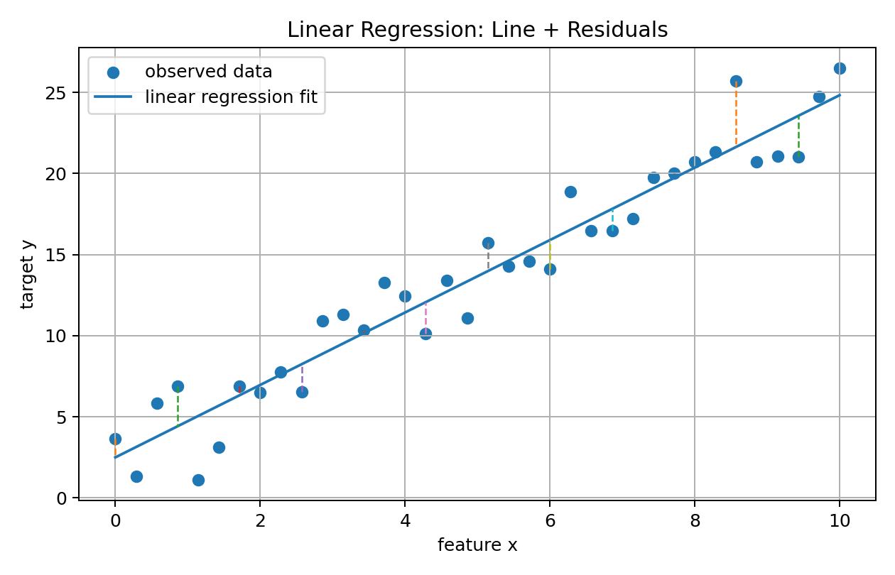

The data points usually do not lie perfectly on one line.

So the model must choose a line that is “best” in some sense.

That “best” depends on the loss function.

---

## 4. Residuals

The residual for sample $i$ is:

$$
r_i=y_i-\hat{y}_i
$$

It measures the vertical error between the true target and the prediction.

If:

$$
r_i>0
$$

the model underpredicted.

If:

$$
r_i<0
$$

the model overpredicted.

The goal is not to make one residual zero.

The goal is to make all residuals small together.

But residuals can be positive or negative. If we simply sum residuals, errors can cancel:

$$
\sum_i r_i
$$

So we need a way to measure error magnitude.

Common choices:

```text
absolute error: |r_i|
squared error: r_i²
```

Linear Regression usually uses squared error.

---

## 5. Why Squared Error?

Squared error for one sample:

$$
\ell_i=(y_i-\hat{y}_i)^2
$$

Mean Squared Error:

$$
\mathrm{MSE}
=
\frac{1}{n}
\sum_{i=1}^{n}
(y_i-\hat{y}_i)^2
$$

Squared error has useful properties:

```text
it is always non-negative
it punishes larger errors more strongly
it is differentiable
it gives a convex objective for ordinary Linear Regression
it has a clean matrix solution
it connects to Gaussian noise
```

Visual:

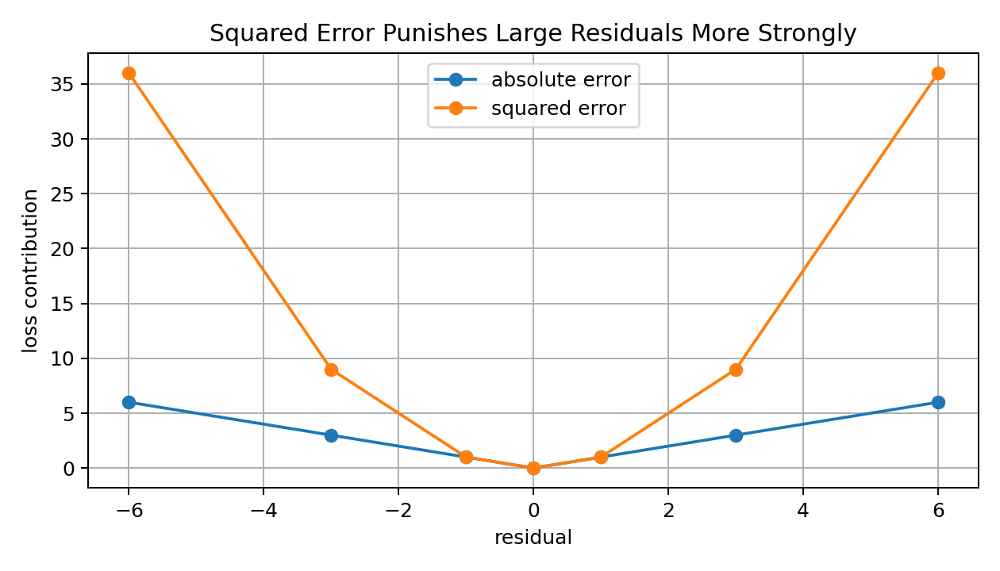

Squared error is not always the best choice.

It is sensitive to outliers because large residuals become extremely large after squaring.

But mathematically, it creates one of the cleanest learning problems in ML.

---

## 6. Linear Regression Objective

The model prediction is:

$$
\hat{y}_i=w^Tx_i+b
$$

The MSE objective is:

$$
\mathcal{L}(w,b)
=
\frac{1}{n}
\sum_{i=1}^{n}
(y_i-(w^Tx_i+b))^2
$$

Training means solving:

$$
(w^*,b^*)
=
\arg\min_{w,b}
\mathcal{L}(w,b)
$$

In simple words:

```text
choose the slope(s) and intercept that minimize average squared prediction error
```

Visual loss surface for one feature:

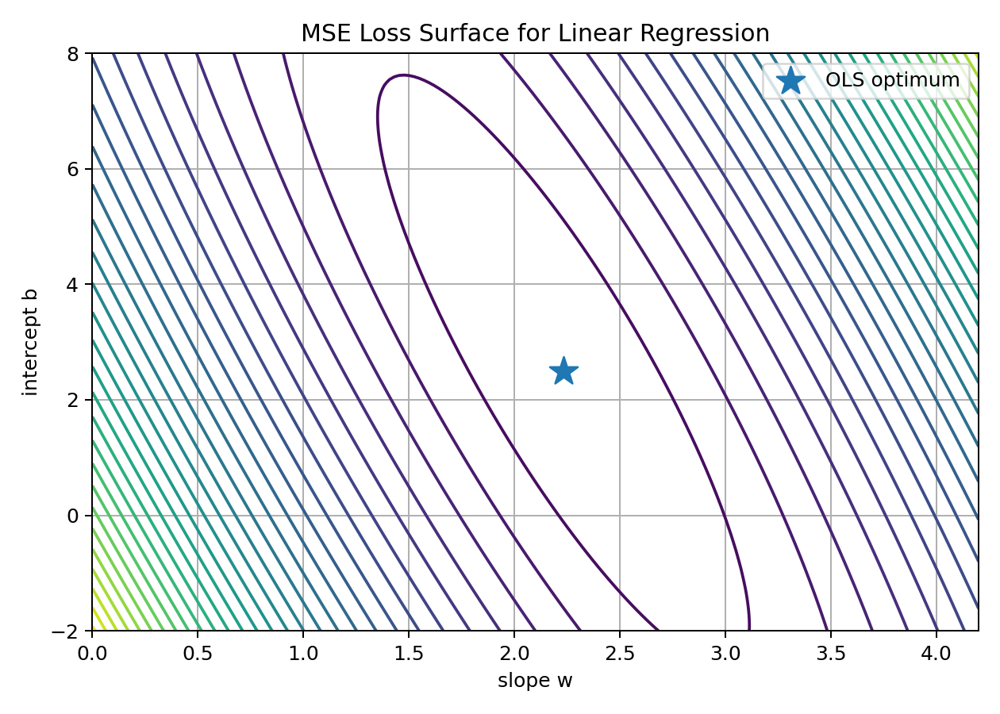

For ordinary Linear Regression with MSE, the loss surface is convex.

That means the optimization problem has no bad local minima.

This is a major reason Linear Regression is mathematically friendly.

---

## 7. Matrix Form

For all samples, stack feature vectors into a matrix:

$$
X=
\begin{bmatrix}
---x_1^T---\\
---x_2^T---\\
\vdots\\
---x_n^T---
\end{bmatrix}
\in\mathbb{R}^{n\times d}
$$

Target vector:

$$
y=
\begin{bmatrix}
y_1\\
y_2\\
\vdots\\
y_n
\end{bmatrix}
\in\mathbb{R}^{n}
$$

Weights:

$$
w\in\mathbb{R}^{d}
$$

Predictions:

$$
\hat{y}=Xw+b\mathbf{1}
$$

To make notation cleaner, we include the bias inside the matrix by adding a column of ones.

Define:

$$
\tilde{X}=
\begin{bmatrix}
1 & x_{11} & x_{12} & \dots & x_{1d}\\
1 & x_{21} & x_{22} & \dots & x_{2d}\\
\vdots & \vdots & \vdots & & \vdots\\
1 & x_{n1} & x_{n2} & \dots & x_{nd}
\end{bmatrix}
$$

and:

$$
\beta=
\begin{bmatrix}
b\\
w_1\\
w_2\\
\vdots\\
w_d
\end{bmatrix}
$$

Then:

$$
\hat{y}=\tilde{X}\beta
$$

To keep notation simple, many books rename $\tilde{X}$ back to $X$.

Then:

$$
\hat{y}=X\beta
$$

---

## 8. Least Squares Objective in Matrix Form

Residual vector:

$$
r=y-X\beta
$$

Sum of squared errors:

$$
SSE(\beta)=\|y-X\beta\|_2^2
$$

Expanded:

$$
SSE(\beta)
=
(y-X\beta)^T(y-X\beta)
$$

Mean squared error:

$$
MSE(\beta)=\frac{1}{n}\|y-X\beta\|_2^2
$$

The least squares problem:

$$
\beta^*
=
\arg\min_\beta
\|y-X\beta\|_2^2
$$

This is the core optimization problem behind Linear Regression.

---

## 9. Deriving the Normal Equation

Start with:

$$
J(\beta)=\|y-X\beta\|_2^2
$$

Expanded:

$$
J(\beta)
=
(y-X\beta)^T(y-X\beta)
$$

Expand the quadratic:

$$
J(\beta)
=
y^Ty
-
2\beta^TX^Ty
+
\beta^TX^TX\beta
$$

Take gradient with respect to $\beta$:

$$
\nabla_\beta J
=
-2X^Ty
+
2X^TX\beta
$$

Set gradient equal to zero:

$$
-2X^Ty+2X^TX\beta=0
$$

Divide by 2:

$$
X^TX\beta=X^Ty
$$

If $X^TX$ is invertible:

$$
\beta^*=(X^TX)^{-1}X^Ty
$$

This is the **normal equation**.

It gives the exact least squares solution.

---

## 10. Why the Normal Equation Can Fail Numerically

The formula:

$$
\beta^*=(X^TX)^{-1}X^Ty
$$

looks clean, but directly computing the inverse is often not ideal.

Problems:

```text
XᵀX may not be invertible
features may be highly correlated
numerical instability may occur
large feature spaces make inversion expensive
```

In code, prefer:

```python
np.linalg.solve(X.T @ X, X.T @ y)
```

or:

```python
np.linalg.pinv(X) @ y
```

The pseudo-inverse handles rank-deficient cases more gracefully.

A professional ML mindset is:

```text
know the formula
but implement it numerically safely
```

---

## 11. Geometric View: Projection

Linear Regression has a beautiful geometric interpretation.

Predictions must have the form:

$$
\hat{y}=X\beta
$$

So $\hat{y}$ must lie in the column space of $X$.

The true target vector $y$ may not lie exactly in that space.

Linear Regression finds the closest vector in the column space of $X$ to $y$.

Visual:

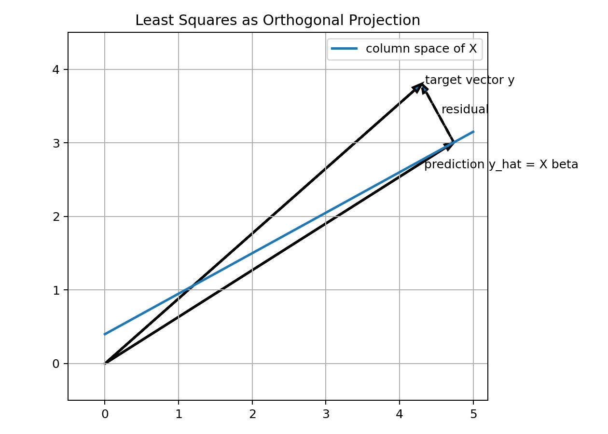

At the optimum:

$$
r=y-\hat{y}
$$

is orthogonal to every column of $X$.

So:

$$
X^T(y-X\beta)=0
$$

This is exactly the normal equation:

$$
X^TX\beta=X^Ty
$$

This is one of the most elegant parts of Linear Regression:

```text
the algebra and geometry say the same thing
```

---

## 12. Gradient Descent View

Instead of solving directly, we can learn $\beta$ iteratively.

Loss:

$$
\mathcal{L}(\beta)
=
\frac{1}{n}
\|X\beta-y\|_2^2
$$

Gradient:

$$
\nabla_\beta \mathcal{L}
=
\frac{2}{n}X^T(X\beta-y)
$$

Gradient descent update:

$$
\beta_{t+1}
=
\beta_t
-
\alpha
\frac{2}{n}X^T(X\beta_t-y)
$$

Visual:

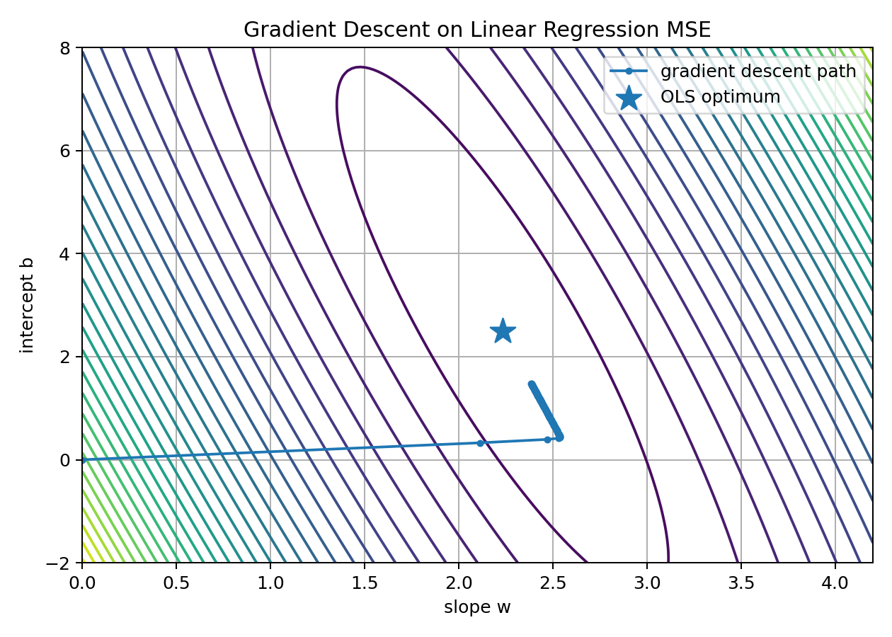

Gradient descent is useful when:

```text
dataset is large
closed-form solution is expensive
model is extended beyond ordinary least squares
we want mini-batch training
we want the same training style as deep learning
```

Linear Regression is one of the best places to learn gradient descent because we can compare the iterative solution to the closed-form solution.

---

## 13. Shape Thinking for the Gradient

Let:

```text
X      -> n x p
beta   -> p
X beta -> n
y      -> n
X beta - y -> n
X.T @ (X beta - y) -> p
```

So:

$$
\nabla_\beta \mathcal{L}
$$

has the same shape as $\beta$.

This must be true because we update:

$$
\beta \leftarrow \beta - \alpha \nabla_\beta \mathcal{L}
$$

Shape checking is a very practical debugging tool.

If your shapes do not make sense, your math or code probably has a mistake.

---

## 14. Statistical Assumptions

Ordinary Linear Regression is often associated with assumptions.

A common data-generating view is:

$$
y_i=w^Tx_i+b+\epsilon_i
$$

where:

$$
\epsilon_i
$$

is noise.

Classical assumptions often include:

```text
linearity
independent errors
zero-mean errors
constant variance of errors
no perfect multicollinearity
approximately Gaussian errors for inference
```

Important distinction:

```text
For prediction, some assumptions can be relaxed.
For classical statistical inference, assumptions matter more strongly.
```

Machine Learning often focuses on predictive performance.

Statistics often also cares about valid confidence intervals, hypothesis tests, and coefficient interpretation.

Both views are useful.

---

## 15. Probabilistic View: Gaussian Noise

Assume:

$$
\epsilon_i\sim\mathcal{N}(0,\sigma^2)
$$

Then:

$$
y_i\mid x_i,\beta
\sim
\mathcal{N}(x_i^T\beta,\sigma^2)
$$

The likelihood is:

$$
P(y\mid X,\beta)
=
\prod_{i=1}^{n}
\frac{1}{\sqrt{2\pi\sigma^2}}
\exp\left(
-\frac{(y_i-x_i^T\beta)^2}{2\sigma^2}
\right)
$$

The negative log-likelihood is:

$$
-\log P(y\mid X,\beta)
=
\text{constant}
+
\frac{1}{2\sigma^2}
\sum_{i=1}^{n}
(y_i-x_i^T\beta)^2
$$

So maximizing Gaussian likelihood is equivalent to minimizing squared error.

This is a deep result:

```text
MSE is not random.
MSE is the negative log-likelihood of a Gaussian-noise regression model.
```

---

## 16. Evaluation Metrics

Linear Regression is usually evaluated with regression metrics.

### MAE

$$
MAE=
\frac{1}{n}
\sum_{i=1}^{n}
|y_i-\hat{y}_i|
$$

Interpretation:

```text
average absolute prediction error
same unit as target
more robust to outliers than MSE
```

### MSE

$$
MSE=
\frac{1}{n}
\sum_{i=1}^{n}
(y_i-\hat{y}_i)^2
$$

Interpretation:

```text
average squared error
strongly punishes large mistakes
```

### RMSE

$$
RMSE=\sqrt{MSE}
$$

Interpretation:

```text
like MSE but back in original target units
```

### R-Squared

$$
R^2
=
1-
\frac{
\sum_i(y_i-\hat{y}_i)^2
}{
\sum_i(y_i-\bar{y})^2
}
$$

Interpretation:

```text
how much variance in y is explained by the model compared with predicting the mean
```

Important:

```text
R² can be negative on test data
```

That means the model is worse than predicting the mean.

---

## 17. Train/Test Generalization

A model should not only fit training data.

It should generalize to unseen data.

Visual:

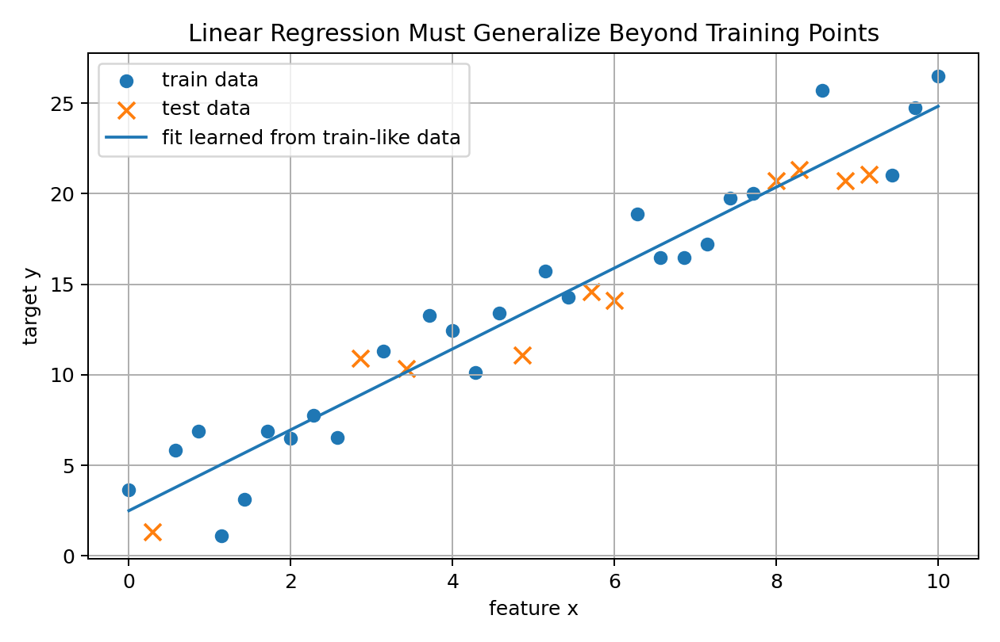

Workflow:

```text
split data
fit on training set
evaluate on validation/test set
inspect residuals
compare against baseline
```

Baseline for regression:

```text
always predict training mean
```

If Linear Regression cannot beat the mean baseline, something is wrong:

```text
features may be weak
relationship may be nonlinear
data may be noisy
train/test distributions may differ
implementation may be wrong
```

---

## 18. Residual Diagnostics

Metrics summarize errors.

Residual plots show error structure.

Residual:

$$
r_i=y_i-\hat{y}_i
$$

Visual:

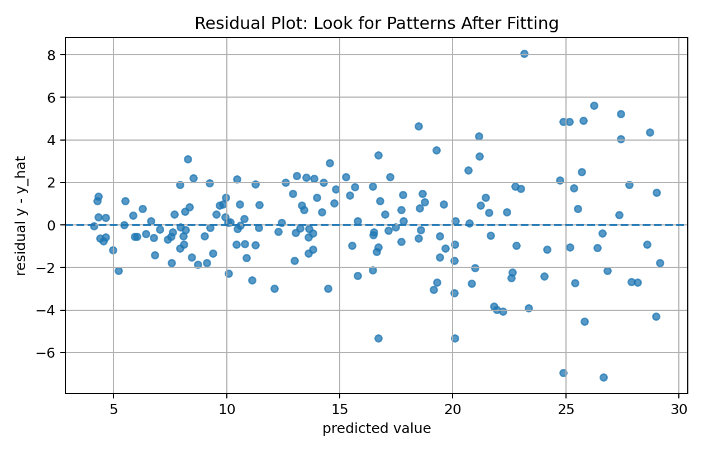

Good residual behavior:

```text
centered around zero
no clear pattern
similar spread across prediction range
few extreme outliers
```

Bad residual behavior:

```text
curved pattern -> missing nonlinearity
fan shape -> non-constant variance
clusters -> missing categorical feature
outliers -> data quality or rare behavior
```

A strong ML engineer does not only print MSE.

They inspect errors.

---

## 19. Outlier Sensitivity

Squared error punishes large errors strongly.

This makes Linear Regression sensitive to outliers.

Visual:

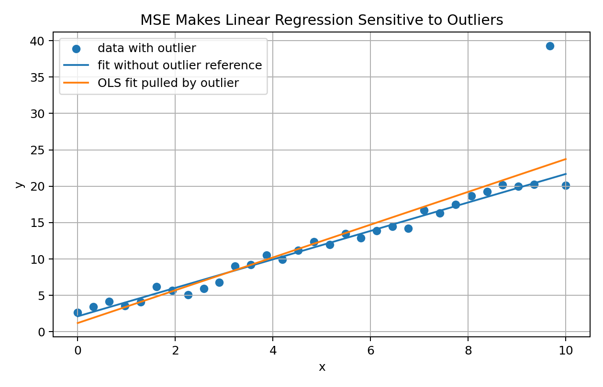

One extreme point can pull the line.

Possible responses:

```text
check data quality
use robust regression
use MAE/Huber-style loss
transform target
clip impossible values only if justified
analyze outliers separately
```

Important:

```text
Do not delete outliers blindly.
```

An outlier can be an error, but it can also be the most important signal.

---

## 20. Feature Scaling

Feature scaling can strongly affect gradient descent.

Visual:

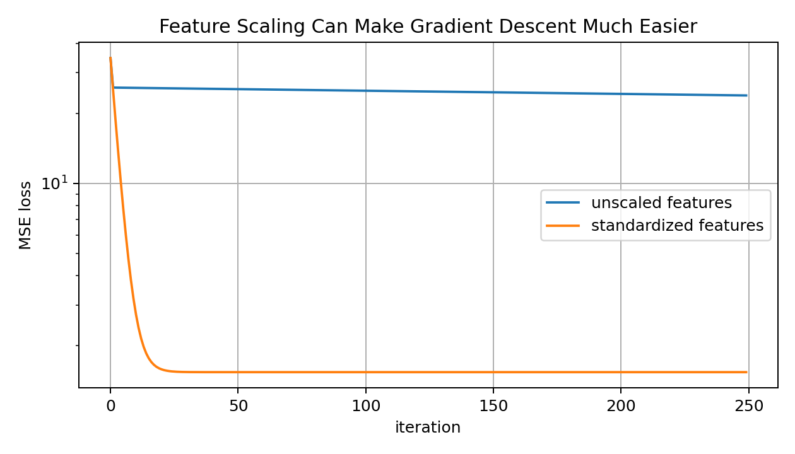

If one feature has values around 1 and another around 100000, gradients can be badly scaled.

Standardization:

$$
z=\frac{x-\mu}{\sigma}
$$

Benefits:

```text
faster gradient descent
more stable optimization
regularization treats features more fairly
coefficients become easier to compare after scaling
```

Closed-form OLS can still produce a solution without scaling, but optimization and regularization often benefit greatly from scaling.

---

## 21. Multicollinearity

Multicollinearity means features are strongly linearly related.

Example:

```text
height in meters
height in centimeters
```

or:

```text
feature_5 ≈ 0.9 * feature_1
```

Problems:

```text
coefficients become unstable
small data changes can change weights a lot
interpretation becomes difficult
XᵀX becomes ill-conditioned
```

Prediction may still be good, but coefficient interpretation can become unreliable.

Solutions:

```text
remove redundant features
use Ridge Regression
use PCA
collect more data
use domain knowledge
```

---

## 22. Ridge Regression

Ridge Regression adds L2 regularization.

Objective:

$$
J(\beta)
=
\frac{1}{n}
\|X\beta-y\|_2^2
+
\lambda\|\beta\|_2^2
$$

Usually the bias term is not regularized.

Ridge shrinks coefficients.

Visual:

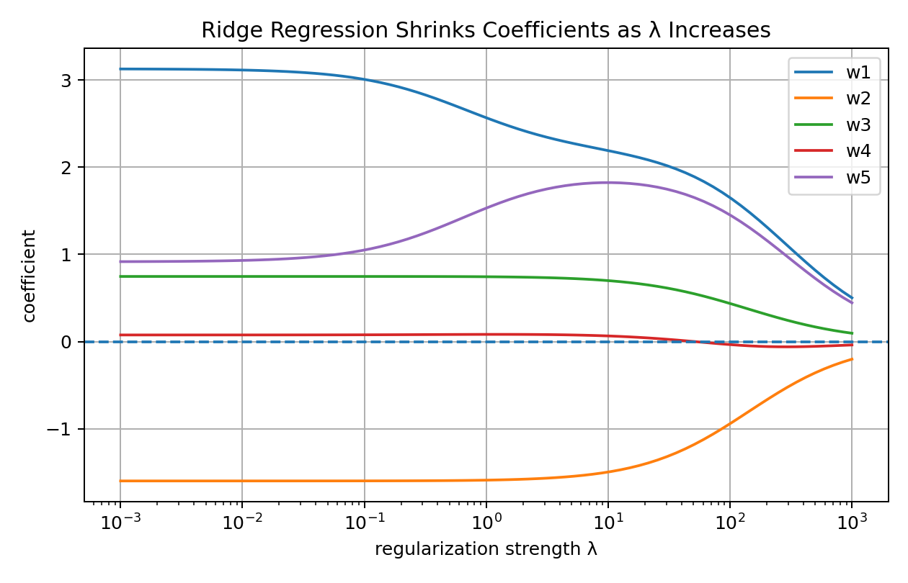

Ridge is useful when:

```text
features are correlated
model has high variance
coefficients are unstable
there are many features
```

Closed form:

$$
\beta_{ridge}
=
(X^TX+\lambda I)^{-1}X^Ty
$$

with the detail that we often avoid penalizing the intercept.

Probabilistic view:

```text
Ridge = MAP estimation with Gaussian prior on weights
```

---

## 23. Lasso and Elastic Net Preview

Lasso uses L1 regularization:

$$
J(\beta)
=
\frac{1}{n}
\|X\beta-y\|_2^2
+
\lambda\|\beta\|_1
$$

Lasso can set coefficients exactly to zero.

This makes it useful for feature selection.

Elastic Net combines L1 and L2:

$$
J(\beta)
=
\frac{1}{n}
\|X\beta-y\|_2^2
+
\lambda_1\|\beta\|_1
+
\lambda_2\|\beta\|_2^2
$$

Elastic Net is useful when features are correlated and sparsity is still desired.

---

## 24. Polynomial Features

Linear Regression is linear in parameters, not necessarily linear in raw input.

If raw input is $x$, we can create features:

$$
\phi(x)=
\begin{bmatrix}
1\\
x\\
x^2\\
x^3
\end{bmatrix}
$$

Then the model:

$$
\hat{y}=\beta_0+\beta_1x+\beta_2x^2+\beta_3x^3
$$

is nonlinear in $x$, but linear in parameters $\beta$.

Visual:

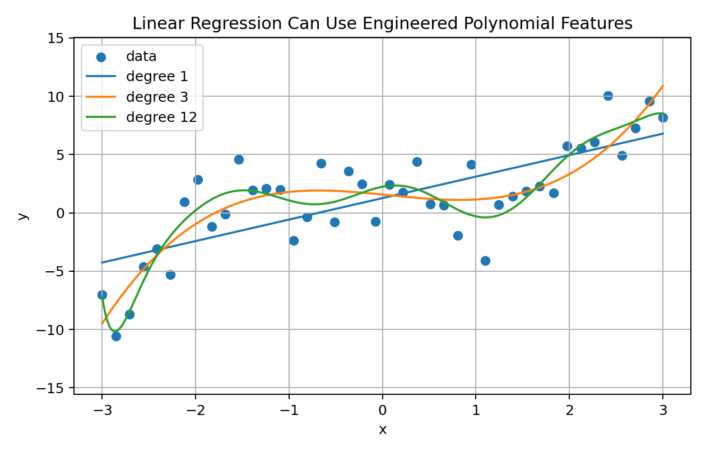

This is powerful, but high-degree polynomials can overfit.

So feature engineering and regularization matter.

---

## 25. Linear Regression Workflow

Linear Regression is not only a formula.

It is a full ML workflow.

Visual:

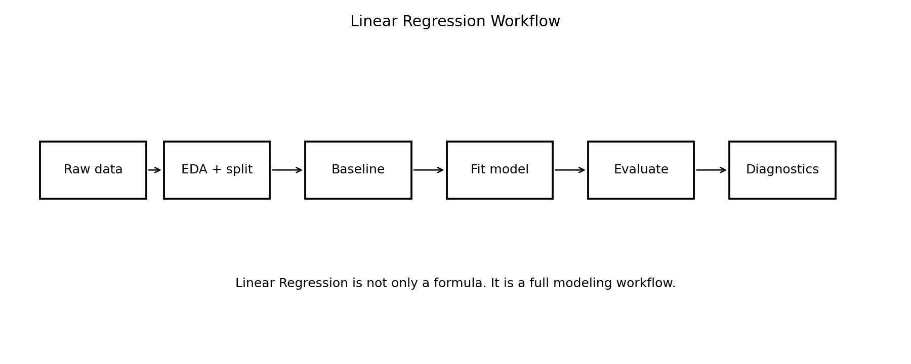

A strong workflow:

```text
1. Understand the target.
2. Inspect data.
3. Split train/validation/test.
4. Build a mean baseline.
5. Fit Linear Regression.
6. Evaluate MAE, RMSE, R².
7. Plot residuals.
8. Check outliers and leakage.
9. Try scaling and regularization.
10. Compare with validation results.
11. Write conclusions honestly.
```

The model is simple.

The thinking around it should not be shallow.

---

## 26. From-Scratch Implementation: Helper Functions

```python
import numpy as np

def add_bias_column(X):
    return np.column_stack([np.ones(X.shape[0]), X])

def predict_linear(X, beta):
    X_bias = add_bias_column(X)
    return X_bias @ beta
```

Adding a bias column lets the model learn an intercept.

Without it, the regression line or hyperplane is forced through the origin.

That is often wrong.

---

## 27. From-Scratch Implementation: Closed Form

```python
def linear_regression_closed_form(X, y):
    X_bias = add_bias_column(X)
    beta = np.linalg.pinv(X_bias) @ y
    return beta
```

This uses the pseudo-inverse:

$$
\beta=X^+y
$$

It is safer than directly computing:

$$
(X^TX)^{-1}X^Ty
$$

because the pseudo-inverse can handle singular or near-singular matrices better.

---

## 28. From-Scratch Implementation: Gradient Descent

```python
def train_linear_regression_gd(X, y, lr=0.01, steps=1000):
    X_bias = add_bias_column(X)
    beta = np.zeros(X_bias.shape[1])
    losses = []

    for _ in range(steps):
        y_pred = X_bias @ beta
        error = y_pred - y

        loss = np.mean(error ** 2)
        losses.append(loss)

        gradient = (2 / len(y)) * X_bias.T @ error
        beta = beta - lr * gradient

    return beta, np.array(losses)
```

This implements:

$$
\beta\leftarrow
\beta
-
\alpha
\frac{2}{n}X^T(X\beta-y)
$$

This is the same learning loop used in more advanced models.

---

## 29. From-Scratch Implementation: Metrics

```python
def mae(y_true, y_pred):
    return np.mean(np.abs(y_true - y_pred))

def mse(y_true, y_pred):
    return np.mean((y_true - y_pred) ** 2)

def rmse(y_true, y_pred):
    return np.sqrt(mse(y_true, y_pred))

def r2_score(y_true, y_pred):
    ss_res = np.sum((y_true - y_pred) ** 2)
    ss_tot = np.sum((y_true - np.mean(y_true)) ** 2)
    return 1 - ss_res / ss_tot
```

Metrics are part of the model story.

They tell us what kind of error the model is making.

---

## 30. Scikit-Learn Implementation

In real projects, use Scikit-learn for reliable workflows.

```python
from sklearn.pipeline import Pipeline
from sklearn.preprocessing import StandardScaler
from sklearn.linear_model import LinearRegression, Ridge
from sklearn.metrics import mean_absolute_error, mean_squared_error, r2_score

model = Pipeline([
    ("scaler", StandardScaler()),
    ("regressor", Ridge(alpha=1.0))
])

model.fit(X_train, y_train)

pred = model.predict(X_test)

mae = mean_absolute_error(y_test, pred)
rmse = mean_squared_error(y_test, pred, squared=False)
r2 = r2_score(y_test, pred)
```

Pipeline is important because preprocessing is fitted only on training data.

This helps prevent leakage.

---

## 31. Common Mistakes

### Mistake 1: Thinking Linear Regression means only a 2D line

With many features, it is a hyperplane.

### Mistake 2: Forgetting the bias term

Without bias, predictions are forced through the origin.

### Mistake 3: Evaluating only on training data

Training performance is not generalization.

### Mistake 4: Ignoring residual plots

Metrics can hide systematic error.

### Mistake 5: Not checking outliers

MSE is sensitive to large residuals.

### Mistake 6: Interpreting correlated-feature coefficients too confidently

Multicollinearity can make coefficients unstable.

### Mistake 7: Forgetting feature scaling when using gradient descent or regularization

Scaling can change optimization and regularization behavior.

### Mistake 8: Using R² alone

R² does not show error units or residual structure.

### Mistake 9: Assuming linear model means weak model

With good features, linear models can be very strong.

---

## 32. Interview-Level Explanation

A good short explanation:

```text
Linear Regression is a supervised regression algorithm that models the target as a linear combination of input features. It learns weights by minimizing the sum or mean of squared residuals. In matrix form, predictions are Xβ, and the least-squares solution can be found using the normal equation β = (XᵀX)⁻¹Xᵀy when XᵀX is invertible. Geometrically, it projects y onto the column space of X. Probabilistically, minimizing MSE corresponds to maximum likelihood under Gaussian noise. In practice, we evaluate with MAE, RMSE, R², residual plots, and test-set performance.
```

A more natural version:

```text
Linear Regression tries to find the best linear relationship between features and a continuous target. It chooses the line or hyperplane that makes prediction errors small, usually by minimizing squared error. It is simple, interpretable, and a very strong baseline, but it can struggle with nonlinear patterns, outliers, multicollinearity, and distribution shifts.
```

---

## 33. What I Learned From This Lesson

Linear Regression is more than fitting a line.

It is a meeting point of many ML foundations:

```text
dot product -> prediction
MSE -> loss
gradient -> learning direction
normal equation -> closed-form optimum
projection -> geometry
Gaussian likelihood -> probability
Ridge -> regularization
residuals -> diagnostics
metrics -> evaluation
```

The central lesson:

```text
Linear Regression is simple enough to understand deeply, but deep enough to teach the whole ML workflow.
```

That is why it is one of the best first algorithms.

---

## Mini Exercise

Create a file called `01-linear-regression-from-first-principles.py` inside the `code` folder.

Write code that:

```text
1. creates a synthetic regression dataset
2. splits data into train and test
3. fits a mean baseline
4. fits Linear Regression using pseudo-inverse
5. fits Linear Regression using gradient descent
6. compares parameters from both methods
7. computes MAE, MSE, RMSE, and R²
8. plots or prints residuals
9. adds one outlier and refits the model
10. compares ordinary Linear Regression with Ridge Regression
```

Then answer:

```text
What is the objective function of Linear Regression?
Why do residuals not simply get summed?
Why does squared error make the model sensitive to outliers?
What is the normal equation?
What is the projection interpretation of least squares?
Why can multicollinearity make coefficients unstable?
Why is Ridge Regression useful?
What should I check after fitting the model?
```

---

## Further Reading and Resources

### Books

- [An Introduction to Statistical Learning](https://www.statlearning.com/)
- [The Elements of Statistical Learning](https://hastie.su.domains/ElemStatLearn/)
- [Pattern Recognition and Machine Learning by Christopher Bishop](https://link.springer.com/book/9780387310732)
- [Mathematics for Machine Learning](https://mml-book.github.io/)
- [Linear Algebra and Learning from Data by Gilbert Strang](https://math.mit.edu/~gs/learningfromdata/)

### Visual Learning

- [StatQuest: Linear Regression](https://www.youtube.com/@statquest)
- [3Blue1Brown: Linear Algebra](https://www.3blue1brown.com/topics/linear-algebra)
- [Khan Academy: Regression](https://www.khanacademy.org/math/statistics-probability/describing-relationships-quantitative-data)

### ML Documentation

- [Scikit-learn Linear Regression](https://scikit-learn.org/stable/modules/generated/sklearn.linear_model.LinearRegression.html)
- [Scikit-learn Ridge Regression](https://scikit-learn.org/stable/modules/generated/sklearn.linear_model.Ridge.html)
- [Scikit-learn Linear Models User Guide](https://scikit-learn.org/stable/modules/linear_model.html)
- [Scikit-learn Pipelines](https://scikit-learn.org/stable/modules/compose.html#pipeline)

### What to Study Next

The next ML lesson should be:

```text
02 — Logistic Regression From First Principles
```

Linear Regression taught continuous prediction.

Logistic Regression will teach probability-based classification using sigmoid, log-odds, Bernoulli likelihood, and binary cross-entropy.

---

## Final Reflection

Linear Regression is the first algorithm, but it should not be treated as a toy.

It teaches us how ML really works:

```text
represent data
define a prediction rule
choose a loss
optimize parameters
evaluate honestly
inspect errors
improve carefully
```

This is the rhythm of Machine Learning.

And from this lesson onward, every algorithm will follow that rhythm.
