# 02 — Logistic Regression From First Principles

## Why This Lesson Exists

Linear Regression taught us how a model predicts a **continuous number**.

Now we move to one of the most important classification algorithms in Machine Learning:

```text
Logistic Regression
```

Despite the word “regression,” Logistic Regression is mainly used for **classification**.

That name can be confusing at first, but the idea is beautiful:

```text
Linear Regression predicts a real number.
Logistic Regression predicts a probability.
```

More precisely, Logistic Regression learns a linear score:

$$
z=w^Tx+b
$$

then converts that score into a probability:

$$
p=P(y=1\mid x)=\sigma(z)
$$

where $\sigma$ is the sigmoid function.

This lesson is deep because Logistic Regression connects many core ML ideas:

```text
linear scores
sigmoid function
probability
odds and log-odds
Bernoulli likelihood
binary cross-entropy
gradient descent
decision boundaries
thresholds
classification metrics
regularization
calibration
```

The central idea is:

> Logistic Regression is a probabilistic linear classifier that learns class probabilities by minimizing binary cross-entropy.

It is simple enough to implement from scratch, but deep enough to prepare us for neural networks.

Because neural network classifiers also use:

```text
logits
sigmoid or softmax
cross-entropy
gradients
probability outputs
thresholds or argmax decisions
```

So this lesson is not “just another classical ML algorithm.”

It is one of the foundations of modern ML thinking.

---

## 1. What Problem Does Logistic Regression Solve?

Logistic Regression is used for classification.

The most basic form is binary classification:

$$
y\in\{0,1\}
$$

Examples:

```text
spam or not spam
fraud or not fraud
fault or normal
disease or no disease
customer will churn or will not churn
student will pass or will not pass
rock type A or not rock type A
```

Dataset:

$$
\mathcal{D}=\{(x_i,y_i)\}_{i=1}^{n}
$$

where:

$$
x_i\in\mathbb{R}^{d}
$$

and:

$$
y_i\in\{0,1\}
$$

The model wants to estimate:

$$
P(y=1\mid x)
$$

This is important.

Logistic Regression does not only say:

```text
class 0 or class 1
```

It first gives a probability:

```text
P(class 1 | x) = 0.83
```

Then we choose a threshold to convert probability into a class.

---

## 2. Why Linear Regression Is Not Enough for Classification

A tempting idea:

```text
Why not use Linear Regression for y=0 or y=1?
```

Linear Regression outputs:

$$
\hat{y}=w^Tx+b
$$

But this value can be any real number:

$$
-\infty < \hat{y} < \infty
$$

A probability must satisfy:

$$
0\leq p\leq 1
$$

Linear Regression can predict:

```text
-0.4
1.7
8.2
```

These are not valid probabilities.

So for classification we need a function that maps real numbers into the interval $(0,1)$.

That function is the **sigmoid**.

---

## 3. Linear Score or Logit

Logistic Regression starts with the same linear score as Linear Regression:

$$
z=w^Tx+b
$$

This score is called a **logit**.

The logit is not yet a probability.

It is an unbounded real-valued score.

```text
large positive z -> strong evidence for class 1
large negative z -> strong evidence for class 0
z = 0 -> uncertain midpoint
```

Then the sigmoid function converts $z$ to probability.

---

## 4. Sigmoid Function

The sigmoid function is:

$$
\sigma(z)=\frac{1}{1+e^{-z}}
$$

It maps:

$$
z\in\mathbb{R}
$$

to:

$$
\sigma(z)\in(0,1)
$$

Visual:

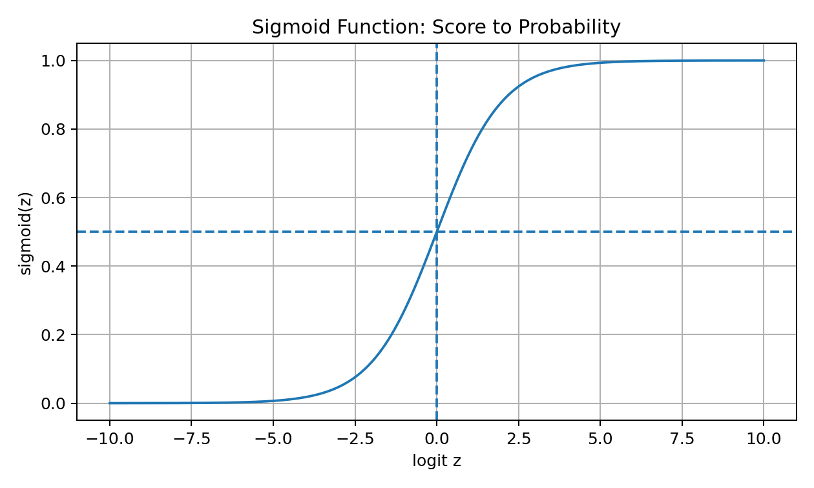

Important values:

$$
\sigma(0)=0.5
$$

If:

$$
z\to+\infty
$$

then:

$$
\sigma(z)\to 1
$$

If:

$$
z\to-\infty
$$

then:

$$
\sigma(z)\to 0
$$

So Logistic Regression prediction is:

$$
p_i=\sigma(w^Tx_i+b)
$$

This gives:

$$
p_i=P(y_i=1\mid x_i)
$$

---

## 5. Odds and Log-Odds

Probability is not the only way to express uncertainty.

If:

$$
p=P(y=1\mid x)
$$

then odds are:

$$
\frac{p}{1-p}
$$

Examples:

```text
p = 0.5 -> odds = 1
p = 0.8 -> odds = 4
p = 0.2 -> odds = 0.25
```

Log-odds are:

$$
\log\frac{p}{1-p}
$$

Visual:

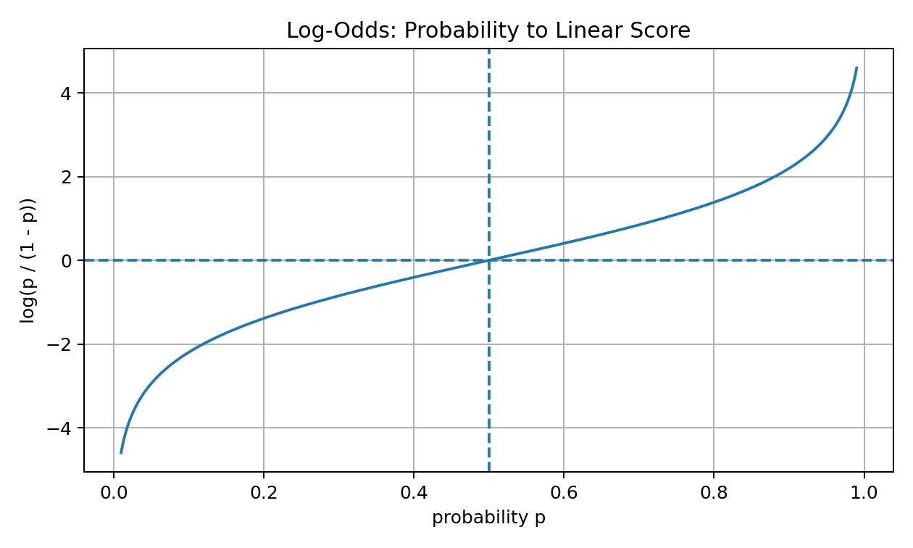

Logistic Regression assumes that log-odds are linear in the features:

$$
\log\frac{p}{1-p}=w^Tx+b
$$

This is the deeper meaning of Logistic Regression.

It is not saying probability itself changes linearly.

It says:

```text
log-odds change linearly with features
```

That is why coefficient interpretation is about log-odds, not direct probability.

---

## 6. From Log-Odds to Sigmoid

Starting from:

$$
\log\frac{p}{1-p}=z
$$

Exponentiate both sides:

$$
\frac{p}{1-p}=e^z
$$

Solve for $p$:

$$
p=e^z(1-p)
$$

$$
p=e^z-e^zp
$$

$$
p+e^zp=e^z
$$

$$
p(1+e^z)=e^z
$$

$$
p=\frac{e^z}{1+e^z}
$$

Divide numerator and denominator by $e^z$:

$$
p=\frac{1}{1+e^{-z}}
$$

So:

$$
p=\sigma(z)
$$

This shows why sigmoid naturally appears from a linear log-odds model.

---

## 7. Decision Boundary

The model predicts probability:

$$
p=\sigma(w^Tx+b)
$$

To convert probability into a class, choose a threshold $t$.

Default:

$$
t=0.5
$$

Prediction rule:

$$
\hat{y}=
\begin{cases}
1, & p\geq 0.5\\
0, & p<0.5
\end{cases}
$$

Since:

$$
\sigma(0)=0.5
$$

the decision boundary at threshold 0.5 is where:

$$
w^Tx+b=0
$$

In 2D, this is a line.

In 3D, it is a plane.

In higher dimensions, it is a hyperplane.

Visual:

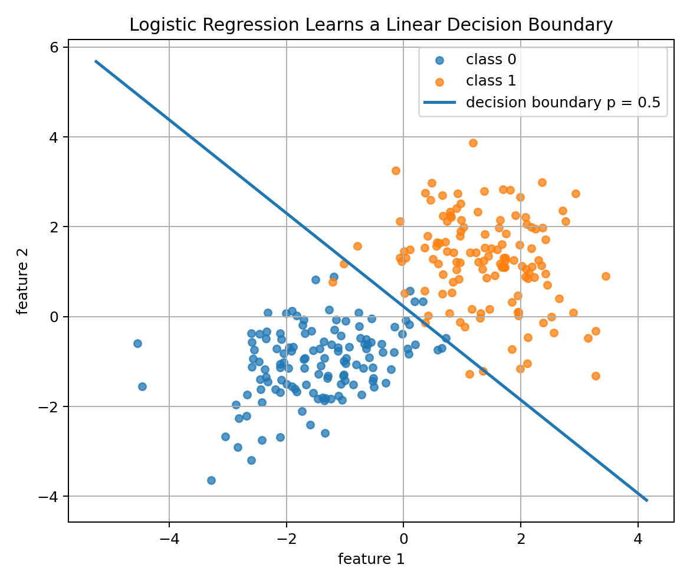

This is why Logistic Regression is a **linear classifier**.

Its probability surface is smooth, but the boundary is linear.

---

## 8. Probability Surface

Logistic Regression does more than draw a boundary.

It gives a probability at every point.

Visual:

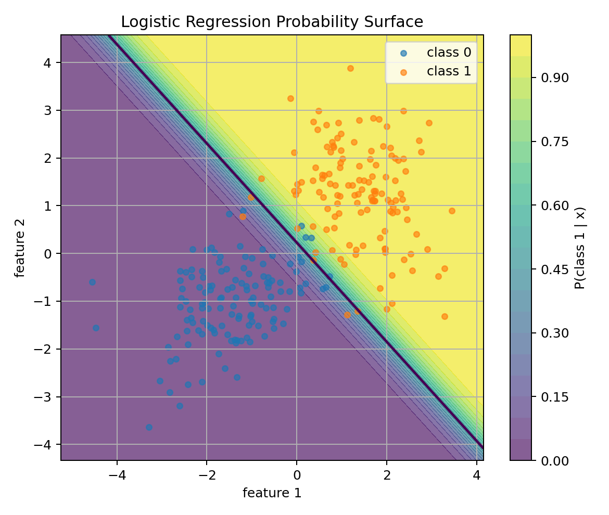

Points far on one side of the boundary get probabilities close to 0.

Points far on the other side get probabilities close to 1.

Points near the boundary get probabilities near 0.5.

This is useful because real decisions often need confidence, not only labels.

Example:

```text
fraud probability = 0.92 -> urgent review
fraud probability = 0.55 -> maybe low-priority review
fraud probability = 0.03 -> probably normal
```

---

## 9. Why We Need a Different Loss

For Linear Regression, MSE worked well:

$$
(y-\hat{y})^2
$$

For classification, MSE is usually not the best loss.

Why?

Because the model output is a probability, and the label is Bernoulli.

A probabilistic classifier should be rewarded for assigning high probability to the correct class.

If the true label is 1, the model should make:

$$
p\to 1
$$

If the true label is 0, the model should make:

$$
p\to 0
$$

Binary Cross-Entropy does exactly this.

---

## 10. Bernoulli Likelihood

For one binary label:

$$
y_i\in\{0,1\}
$$

and predicted probability:

$$
p_i=P(y_i=1\mid x_i)
$$

The Bernoulli probability mass function is:

$$
P(Y_i=y_i\mid x_i)
=
p_i^{y_i}(1-p_i)^{1-y_i}
$$

Check both cases.

If:

$$
y_i=1
$$

then:

$$
P(Y_i=1)=p_i
$$

If:

$$
y_i=0
$$

then:

$$
P(Y_i=0)=1-p_i
$$

For the whole dataset, assuming independent samples:

$$
L(w,b)
=
\prod_{i=1}^{n}
p_i^{y_i}(1-p_i)^{1-y_i}
$$

This is the likelihood.

Logistic Regression tries to choose parameters that make the observed labels likely.

---

## 11. Log-Likelihood

Products are hard to optimize, so we take logs.

Log-likelihood:

$$
\log L(w,b)
=
\sum_{i=1}^{n}
\left[
y_i\log p_i
+
(1-y_i)\log(1-p_i)
\right]
$$

MLE wants to maximize this.

But optimization usually minimizes a loss, so we minimize the negative log-likelihood.

---

## 12. Binary Cross-Entropy

Binary Cross-Entropy loss is:

$$
\mathcal{L}(w,b)
=
-\frac{1}{n}
\sum_{i=1}^{n}
\left[
y_i\log p_i
+
(1-y_i)\log(1-p_i)
\right]
$$

where:

$$
p_i=\sigma(w^Tx_i+b)
$$

Visual:

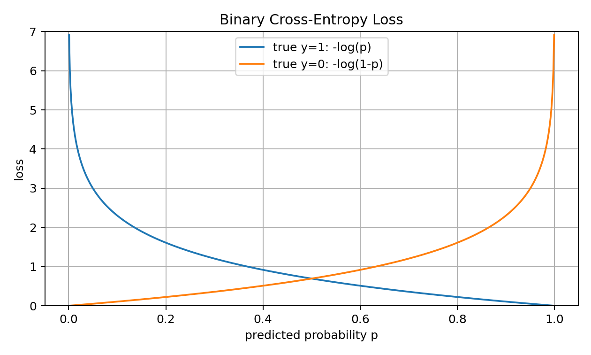

If the true label is 1:

$$
\ell=-\log(p)
$$

If the true label is 0:

$$
\ell=-\log(1-p)
$$

So the model is punished when it assigns low probability to the true class.

The punishment becomes very large for confident wrong predictions.

This is exactly what we want from a probabilistic classifier.

---

## 13. Cross-Entropy as Average Surprise

Binary Cross-Entropy is also an information-theoretic idea.

If the true label happens and the model assigned probability $p$ to it, the surprise is:

$$
-\log(p)
$$

So cross-entropy measures:

```text
how surprised the model is by the true labels
```

A good classifier is less surprised by the data.

A bad classifier assigns low probability to correct labels and becomes highly surprised.

This is why cross-entropy is used in:

```text
Logistic Regression
neural network classifiers
language models
softmax classifiers
```

It is one of the most important losses in ML.

---

## 14. Gradient of Logistic Regression

Now the beautiful part.

For Logistic Regression with BCE, the gradient has a simple form.

Let:

$$
p=\sigma(X\beta)
$$

where $X$ includes the bias column.

Loss:

$$
\mathcal{L}(\beta)
=
-\frac{1}{n}
\sum_{i=1}^{n}
[y_i\log p_i+(1-y_i)\log(1-p_i)]
$$

Gradient:

$$
\nabla_\beta \mathcal{L}
=
\frac{1}{n}X^T(p-y)
$$

This is elegant.

The error signal is:

$$
p-y
$$

Compare:

```text
Linear Regression gradient uses: y_hat - y
Logistic Regression gradient uses: p - y
```

The pattern is almost the same.

Both models learn by comparing prediction with truth and pushing weights in the direction that reduces error.

---

## 15. Gradient Descent Update

The update is:

$$
\beta_{t+1}
=
\beta_t
-
\alpha
\frac{1}{n}X^T(p-y)
$$

where:

```text
alpha -> learning rate
p -> predicted probabilities
y -> true labels
X -> feature matrix with bias column
```

Training loss decreases as parameters improve.

Visual:

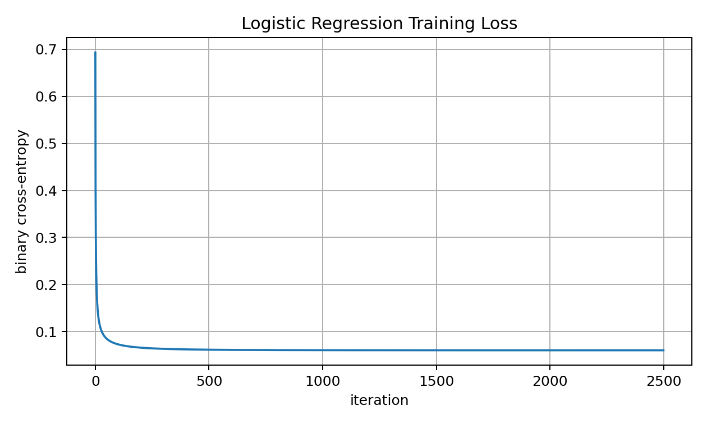

Unlike ordinary Linear Regression, Logistic Regression has no simple normal-equation closed form.

It is usually trained iteratively using:

```text
gradient descent
Newton methods
LBFGS
SGD
Adam in neural variants
```

---

## 16. Loss Surface

For simple Logistic Regression, the BCE objective is convex.

Visual for one-feature Logistic Regression:

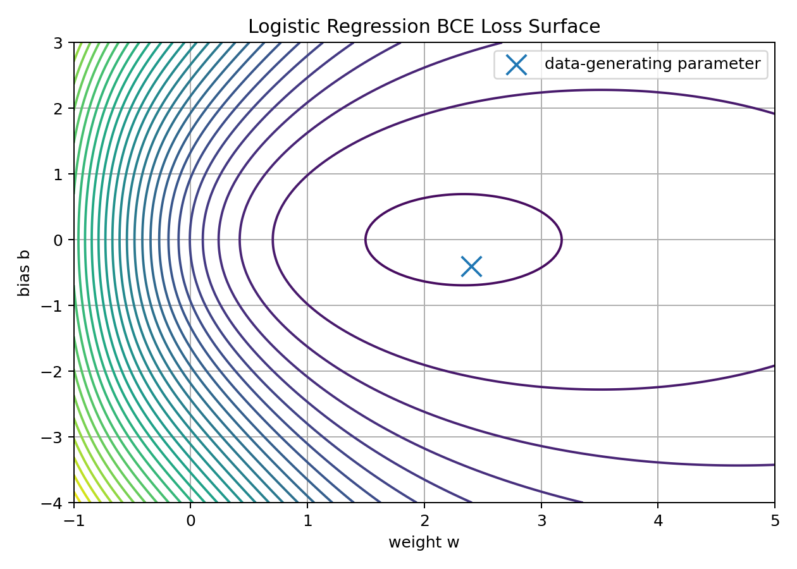

Convexity means there is a global optimum.

But in practice, optimization can still be affected by:

```text
feature scaling
regularization
linearly separable data
learning rate
numerical stability
```

So convex does not mean “no thinking required.”

It means the problem is mathematically nicer than deep neural network training.

---

## 17. Numerical Stability

Logistic Regression uses exponentials and logarithms.

Potential problems:

```text
exp overflow
log(0)
probability exactly 0 or 1
```

Naive sigmoid:

$$
\sigma(z)=\frac{1}{1+e^{-z}}
$$

If $z$ is very negative, $e^{-z}$ may overflow.

A simple protection:

```python
z = np.clip(z, -50, 50)
```

For BCE:

```python
p = np.clip(p, 1e-15, 1 - 1e-15)
```

Professional libraries often compute BCE directly from logits for better stability.

A strong implementation is not only mathematically correct.

It is numerically safe.

---

## 18. Thresholds Are Decisions

Logistic Regression outputs probabilities.

The threshold converts probabilities into labels.

Default:

$$
t=0.5
$$

But threshold choice depends on the problem.

If false negatives are costly:

```text
lower threshold -> higher recall
```

If false positives are costly:

```text
higher threshold -> higher precision
```

Visual:

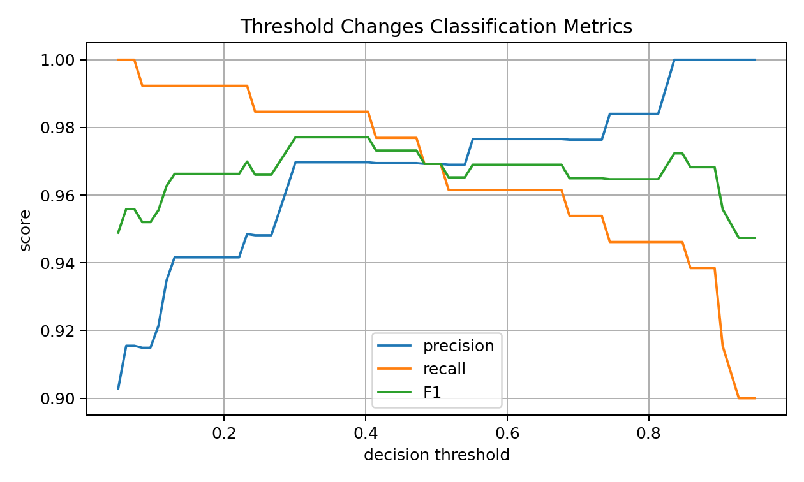

This is extremely important.

The model learns probabilities.

The threshold creates a decision policy.

Do not confuse them.

---

## 19. Confusion Matrix

At a chosen threshold, predictions become class labels.

Then we can count:

```text
TP -> true positive
TN -> true negative
FP -> false positive
FN -> false negative
```

Visual:

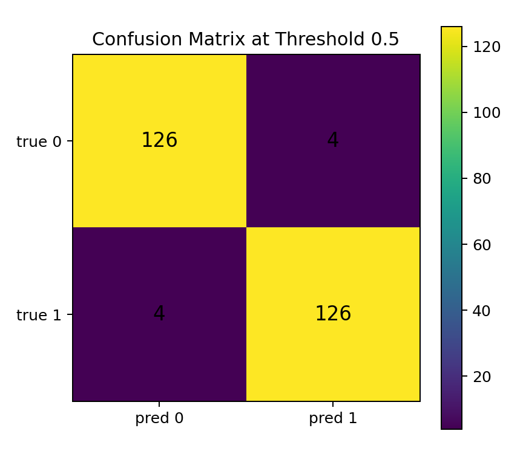

Metrics:

$$
Accuracy=\frac{TP+TN}{TP+TN+FP+FN}
$$

$$
Precision=\frac{TP}{TP+FP}
$$

$$
Recall=\frac{TP}{TP+FN}
$$

$$
F1=
2\cdot
\frac{Precision\cdot Recall}{Precision+Recall}
$$

For Logistic Regression, it is common to evaluate both:

```text
probability quality -> log loss, calibration
classification quality -> precision, recall, F1, AUC
```

---

## 20. Calibration

Because Logistic Regression outputs probabilities, calibration matters.

Calibration asks:

```text
When the model says 0.8 probability, does the event happen about 80% of the time?
```

Visual:

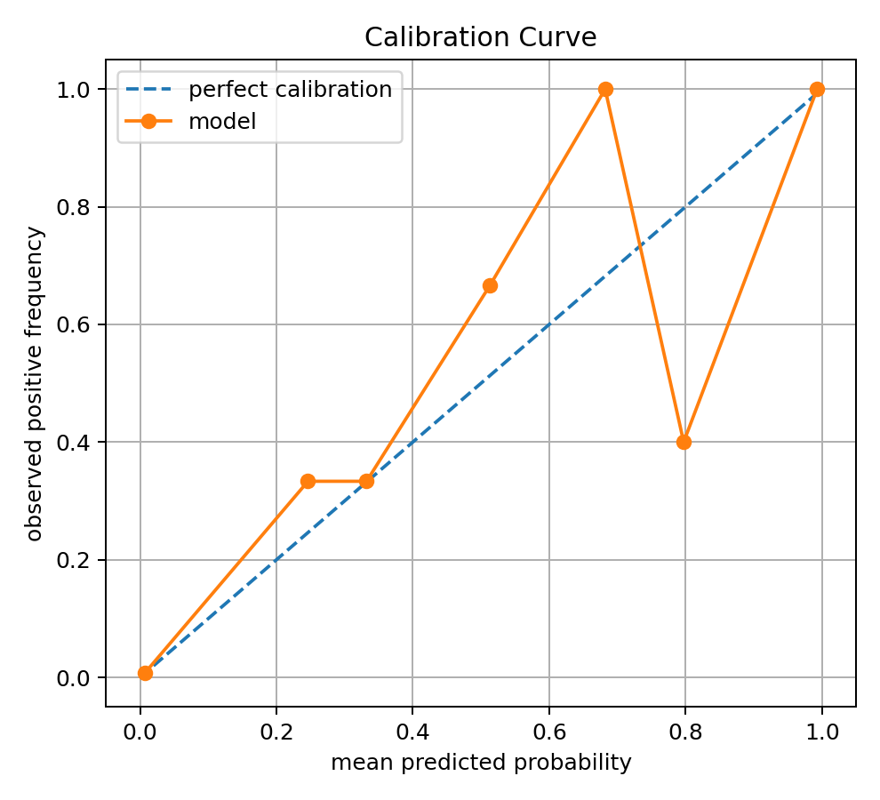

Logistic Regression is often reasonably calibrated when assumptions are not too violated and regularization is appropriate.

But calibration should still be checked when probabilities drive real decisions.

Examples:

```text
medical risk
fraud risk
credit default risk
safety alerts
```

A model can have good accuracy but poor probability calibration.

---

## 21. Regularization

Logistic Regression can overfit, especially with many features.

L2-regularized Logistic Regression minimizes:

$$
J(\beta)
=
\mathcal{L}(\beta)
+
\lambda\|w\|_2^2
$$

Usually we do not regularize the bias term.

L2 shrinks weights toward zero.

Visual:

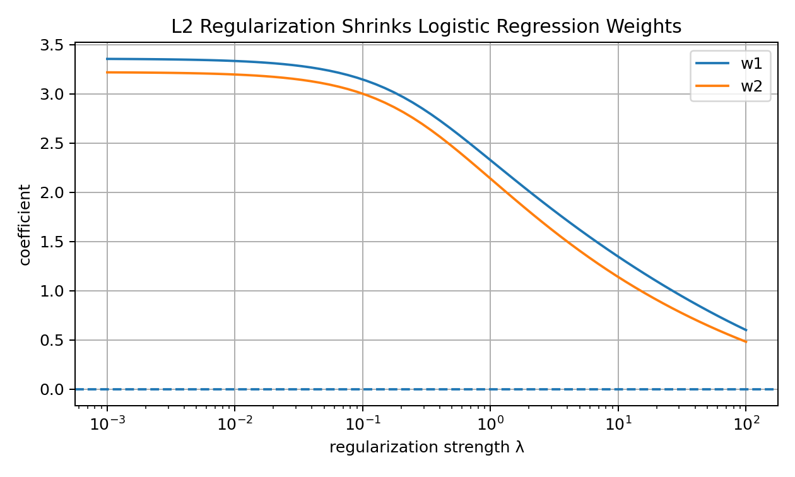

Why regularization helps:

```text
controls complexity
reduces overfitting
handles correlated features better
improves numerical stability
prevents extreme coefficients
```

L1 regularization can make some weights exactly zero, which helps feature selection.

---

## 22. Linearly Separable Data Problem

If the data is perfectly linearly separable, Logistic Regression without regularization can behave strangely.

The model can keep increasing weight magnitudes to make probabilities closer and closer to 0 or 1.

Cross-entropy keeps decreasing, but weights can grow very large.

This is one reason regularization is important.

Regularization says:

```text
fit the data, but do not use unnecessarily huge weights
```

This makes the solution more stable.

---

## 23. Feature Scaling

Feature scaling matters.

If one feature has values around 1 and another around 100000, optimization can become unstable or slow.

Standardization:

$$
z=\frac{x-\mu}{\sigma}
$$

Benefits:

```text
faster optimization
more stable gradients
regularization treats features fairly
coefficients become easier to compare
```

For Logistic Regression, scaling is especially important when using regularization.

In Scikit-learn, a good workflow is:

```text
Pipeline(StandardScaler(), LogisticRegression())
```

This also helps avoid data leakage.

---

## 24. Logistic Regression Workflow

Visual:

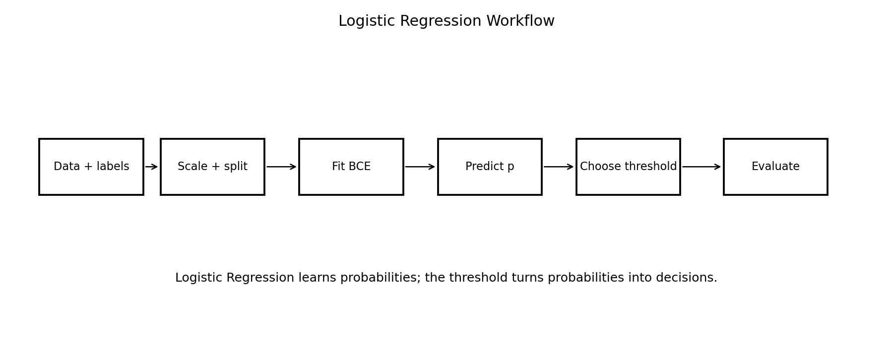

A strong workflow:

```text
1. Understand the classification target.
2. Check class balance.
3. Split train/validation/test.
4. Build a baseline.
5. Scale features using training data only.
6. Train Logistic Regression.
7. Evaluate log loss and classification metrics.
8. Tune threshold based on the problem.
9. Check calibration.
10. Inspect errors.
11. Add regularization if needed.
```

Logistic Regression is simple, but a real workflow around it should be careful.

---

## 25. From-Scratch Implementation: Sigmoid

```python
import numpy as np

def sigmoid(z):
    z = np.clip(z, -50, 50)
    return 1 / (1 + np.exp(-z))
```

The clipping protects against overflow.

---

## 26. From-Scratch Implementation: BCE

```python
def binary_cross_entropy(y_true, p_pred, eps=1e-15):
    p_pred = np.clip(p_pred, eps, 1 - eps)
    return -np.mean(
        y_true * np.log(p_pred)
        + (1 - y_true) * np.log(1 - p_pred)
    )
```

This implements:

$$
-\frac{1}{n}\sum_i[y_i\log p_i+(1-y_i)\log(1-p_i)]
$$

---

## 27. From-Scratch Implementation: Training

```python
def add_bias_column(X):
    return np.column_stack([np.ones(X.shape[0]), X])

def train_logistic_regression_gd(X, y, lr=0.1, steps=3000, lambda_=0.0):
    X_bias = add_bias_column(X)
    beta = np.zeros(X_bias.shape[1])
    losses = []

    for _ in range(steps):
        logits = X_bias @ beta
        probabilities = sigmoid(logits)

        loss = binary_cross_entropy(y, probabilities)
        loss += lambda_ * np.sum(beta[1:] ** 2)
        losses.append(loss)

        gradient = (1 / len(y)) * X_bias.T @ (probabilities - y)

        regularization = np.zeros_like(beta)
        regularization[1:] = 2 * lambda_ * beta[1:]

        beta = beta - lr * (gradient + regularization)

    return beta, np.array(losses)
```

This is the core of Logistic Regression.

---

## 28. From-Scratch Implementation: Prediction

```python
def predict_proba(X, beta):
    X_bias = add_bias_column(X)
    return sigmoid(X_bias @ beta)

def predict_class(X, beta, threshold=0.5):
    probabilities = predict_proba(X, beta)
    return (probabilities >= threshold).astype(int)
```

Notice the separation:

```text
predict_proba -> probability
predict_class -> decision after threshold
```

This separation is good design.

---

## 29. From-Scratch Implementation: Metrics

```python
def classification_metrics(y_true, y_pred):
    tp = np.sum((y_true == 1) & (y_pred == 1))
    tn = np.sum((y_true == 0) & (y_pred == 0))
    fp = np.sum((y_true == 0) & (y_pred == 1))
    fn = np.sum((y_true == 1) & (y_pred == 0))

    accuracy = (tp + tn) / len(y_true)
    precision = tp / (tp + fp) if tp + fp > 0 else 0.0
    recall = tp / (tp + fn) if tp + fn > 0 else 0.0
    f1 = (
        2 * precision * recall / (precision + recall)
        if precision + recall > 0
        else 0.0
    )

    return accuracy, precision, recall, f1
```

These metrics help evaluate the classifier after choosing a threshold.

---

## 30. Scikit-Learn Implementation

In real projects:

```python
from sklearn.pipeline import Pipeline
from sklearn.preprocessing import StandardScaler
from sklearn.linear_model import LogisticRegression
from sklearn.metrics import classification_report, log_loss, confusion_matrix

model = Pipeline([
    ("scaler", StandardScaler()),
    ("classifier", LogisticRegression(C=1.0, penalty="l2"))
])

model.fit(X_train, y_train)

probabilities = model.predict_proba(X_test)[:, 1]
predictions = model.predict(X_test)

print(log_loss(y_test, probabilities))
print(confusion_matrix(y_test, predictions))
print(classification_report(y_test, predictions))
```

Important note:

```text
C is inverse regularization strength in sklearn.
smaller C -> stronger regularization
larger C -> weaker regularization
```

This confuses many beginners.

---

## 31. Common Mistakes

### Mistake 1: Thinking Logistic Regression is regression

It is mainly a classification algorithm.

### Mistake 2: Interpreting coefficients as direct probability changes

Coefficients affect log-odds directly, not probability directly.

### Mistake 3: Forgetting to scale features

Optimization and regularization can behave poorly.

### Mistake 4: Using accuracy alone on imbalanced data

Accuracy can hide failure on the minority class.

### Mistake 5: Blindly using threshold 0.5

Threshold should match the real cost of false positives and false negatives.

### Mistake 6: Ignoring probability calibration

Probability quality matters when scores are used for decisions.

### Mistake 7: Forgetting numerical stability

Sigmoid and log loss need careful implementation.

### Mistake 8: Not using regularization

Without regularization, coefficients can become unstable, especially with separable or high-dimensional data.

---

## 32. Interview-Level Explanation

Short version:

```text
Logistic Regression is a supervised classification algorithm that models the probability of the positive class. It computes a linear score z = wᵀx + b, passes it through the sigmoid function to get a probability, and learns parameters by minimizing binary cross-entropy. Probabilistically, it corresponds to maximum likelihood estimation under a Bernoulli model. The decision boundary at threshold 0.5 is linear because sigmoid(z)=0.5 when z=0.
```

Natural version:

```text
Logistic Regression is like Linear Regression’s classification cousin. It still uses a weighted sum of features, but instead of outputting any real number, it uses sigmoid to turn the score into a probability. Then it learns by making the true labels less surprising under those probabilities.
```

---

## 33. What I Learned From This Lesson

Logistic Regression connects many major ML ideas:

```text
linear score
logit
sigmoid
probability
odds
log-odds
Bernoulli likelihood
binary cross-entropy
gradient descent
decision boundary
thresholding
precision-recall tradeoff
calibration
regularization
```

The central lesson:

```text
Logistic Regression is not just a classifier.
It is a probabilistic model trained by likelihood-based optimization.
```

That is why it is such a powerful foundation.

---

## Mini Exercise

Create a file called `02-logistic-regression-from-first-principles.py` inside the `code` folder.

Write code that:

```text
1. creates a synthetic binary classification dataset
2. splits data into train and test
3. standardizes features using training statistics only
4. implements sigmoid
5. implements binary cross-entropy
6. trains Logistic Regression with gradient descent
7. adds optional L2 regularization
8. predicts probabilities
9. converts probabilities to classes with different thresholds
10. computes accuracy, precision, recall, and F1
11. compares threshold 0.3, 0.5, and 0.7
12. prints a confusion matrix
```

Then answer:

```text
Why is sigmoid needed?
What is a logit?
What are odds and log-odds?
Why does Logistic Regression use binary cross-entropy?
Why is the gradient Xᵀ(p-y)/n?
Why can threshold tuning change precision and recall?
Why is scaling important?
Why is regularization useful?
```

---

## Further Reading and Resources

### Books

- [An Introduction to Statistical Learning](https://www.statlearning.com/)
- [The Elements of Statistical Learning](https://hastie.su.domains/ElemStatLearn/)
- [Pattern Recognition and Machine Learning by Christopher Bishop](https://link.springer.com/book/9780387310732)
- [Deep Learning Book by Goodfellow, Bengio, and Courville](https://www.deeplearningbook.org/)
- [Mathematics for Machine Learning](https://mml-book.github.io/)

### Visual Learning

- [StatQuest: Logistic Regression](https://www.youtube.com/@statquest)
- [StatQuest: Odds and Log Odds](https://www.youtube.com/@statquest)
- [3Blue1Brown: Gradient Descent](https://www.3blue1brown.com/lessons/gradient-descent)

### ML Documentation

- [Scikit-learn Logistic Regression](https://scikit-learn.org/stable/modules/generated/sklearn.linear_model.LogisticRegression.html)
- [Scikit-learn Classification Metrics](https://scikit-learn.org/stable/modules/model_evaluation.html#classification-metrics)
- [Scikit-learn Pipelines](https://scikit-learn.org/stable/modules/compose.html#pipeline)
- [Scikit-learn Calibration](https://scikit-learn.org/stable/modules/calibration.html)

### What to Study Next

The next ML lesson should be:

```text
03 — K-Nearest Neighbors From First Principles
```

Logistic Regression is a parametric probabilistic classifier.

KNN will be very different:

```text
no explicit training
distance-based prediction
local geometry
curse of dimensionality
scaling sensitivity
```

This contrast will make ML culture much clearer.

---

## Final Reflection

Logistic Regression is one of those models that looks small but carries a huge amount of ML wisdom.

It teaches that classification can be probabilistic.

It teaches that a linear score can become a probability.

It teaches that loss functions come from likelihood.

It teaches that thresholds are decisions.

It teaches that evaluation depends on the real-world cost of mistakes.

And it prepares us for neural networks, because many neural classifiers are basically:

```text
linear scores -> probabilities -> cross-entropy -> gradient descent
```

So do not underestimate this model.

It is simple, but it is not shallow.
