# 03 — K-Nearest Neighbors From First Principles

## Why This Lesson Exists

So far, we learned two important parametric models:

```text
Linear Regression
Logistic Regression
```

Both learned parameters:

```text
weights
bias
coefficients
```

Now we study a very different kind of algorithm:

```text
K-Nearest Neighbors
```

KNN is simple, but it teaches a deep Machine Learning idea:

> Similar inputs should have similar outputs.

KNN does not learn a weight vector.

KNN does not fit a line.

KNN does not optimize a loss function during training.

Instead, it stores the training data and waits.

When a new point arrives, KNN asks:

```text
Which training examples are closest to this point?
What labels or values do those neighbors have?
```

Then it predicts using those neighbors.

This makes KNN one of the best algorithms for understanding:

```text
distance
similarity
local learning
feature scaling
curse of dimensionality
bias-variance tradeoff
lazy learning
non-parametric models
classification vs regression
```

The central idea is:

> KNN predicts a new sample by looking at the labels or values of the k most similar training samples.

It feels simple.

But if we study it deeply, it reveals a lot about how ML thinks.

---

## 1. What Problem Does KNN Solve?

KNN can solve both:

```text
classification
regression
```

For classification:

```text
neighbors vote for the class
```

For regression:

```text
neighbors are averaged to predict a number
```

Dataset:

$$
\mathcal{D}=\{(x_i,y_i)\}_{i=1}^{n}
$$

where:

$$
x_i\in\mathbb{R}^d
$$

For classification:

$$
y_i\in\{0,1,\dots,C-1\}
$$

For regression:

$$
y_i\in\mathbb{R}
$$

Given a new query point:

$$
x_q
$$

KNN finds the $k$ training points closest to $x_q$.

These are the nearest neighbors.

Visual:

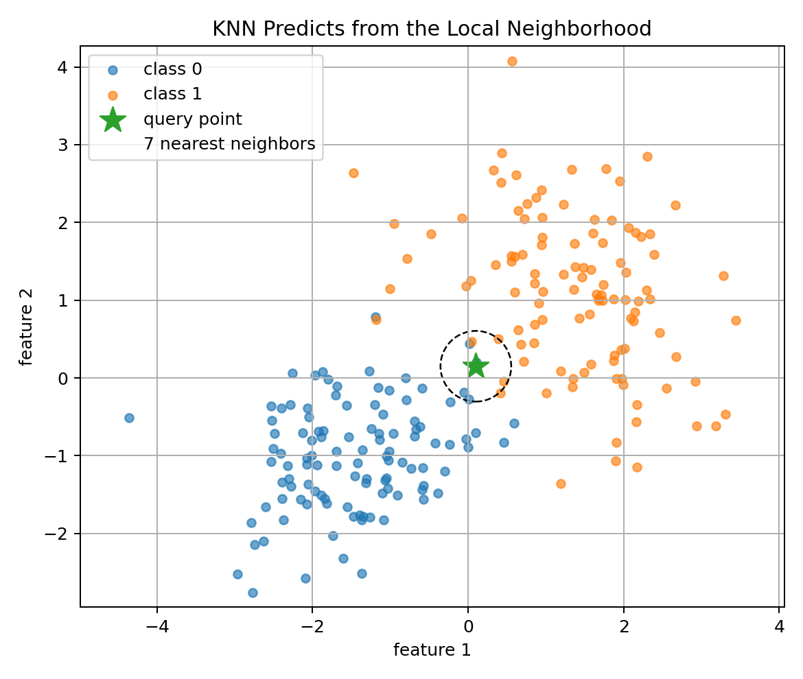

The prediction is based only on this local neighborhood.

---

## 2. KNN Is a Lazy Learner

Many ML algorithms have a clear training phase.

Linear Regression:

```text
learn weights
```

Logistic Regression:

```text
learn weights by minimizing cross-entropy
```

KNN is different.

Training phase:

```text
store the training data
```

Prediction phase:

```text
compute distances from query to training points
sort distances
take k nearest neighbors
vote or average
```

This is why KNN is called a **lazy learning** algorithm.

It delays most computation until prediction time.

This has consequences:

```text
training is very fast
prediction can be slow
memory usage can be high
performance depends heavily on distance quality
```

So KNN is simple, but not always cheap.

---

## 3. KNN Classification

For classification, suppose the $k$ nearest neighbors of $x_q$ have labels:

$$
y_{(1)},y_{(2)},\dots,y_{(k)}
$$

The KNN prediction is the majority vote:

$$
\hat{y}
=
\mathrm{mode}
\{y_{(1)},y_{(2)},\dots,y_{(k)}\}
$$

For binary classification:

```text
if most neighbors are class 1 -> predict 1
if most neighbors are class 0 -> predict 0
```

If $k=5$ and neighbor labels are:

```text
1, 1, 0, 1, 0
```

then prediction is:

```text
class 1
```

because class 1 appears 3 times.

This is simple, but powerful.

The decision boundary can become nonlinear because neighborhoods change across feature space.

---

## 4. KNN Regression

For regression, neighbor labels are continuous values.

The prediction is usually the average:

$$
\hat{y}
=
\frac{1}{k}
\sum_{j=1}^{k}
y_{(j)}
$$

Visual examples:

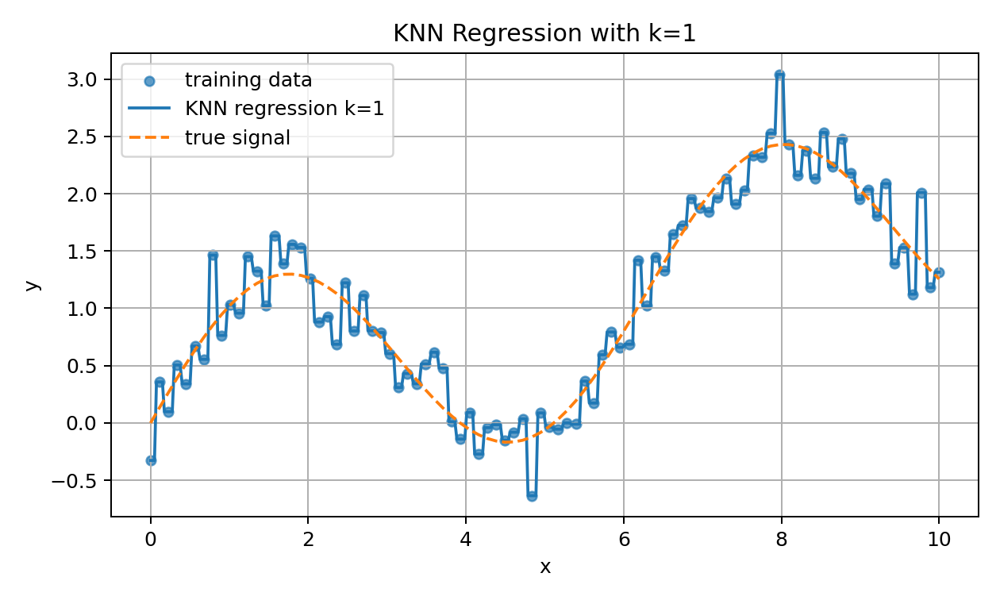

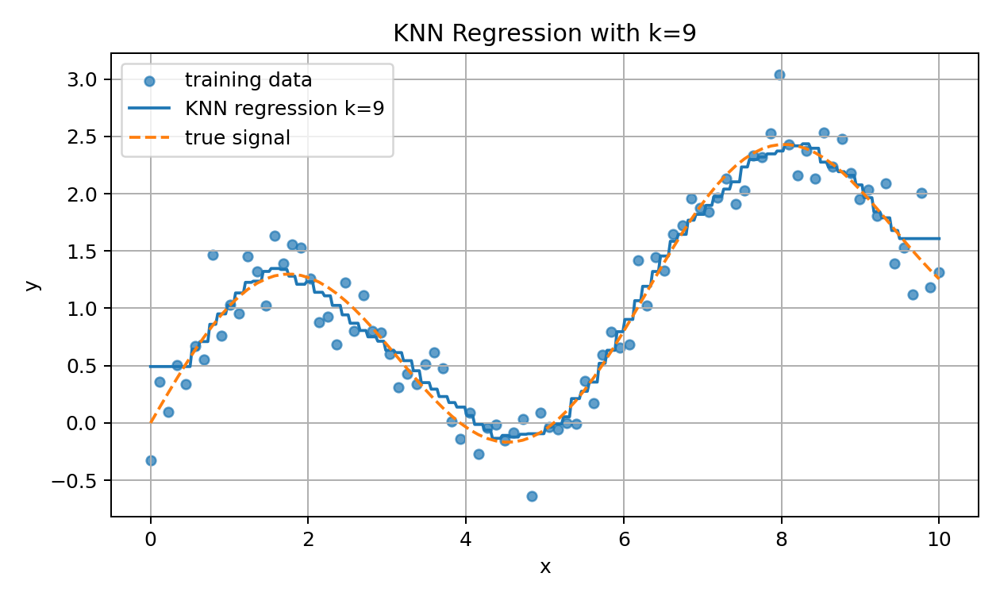

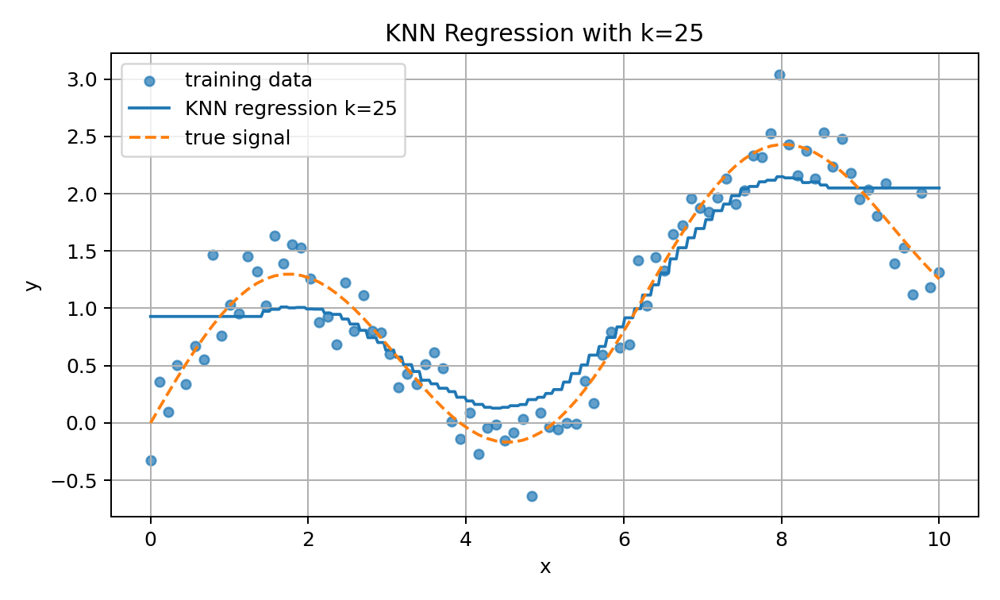

Small $k$ follows local noise closely.

Large $k$ smooths the prediction.

This is the bias-variance tradeoff appearing visually.

---

## 5. Distance Is the Heart of KNN

KNN depends on the meaning of “nearest.”

So distance metric is not a detail.

It is the core of the algorithm.

For two points:

$$
x,y\in\mathbb{R}^d
$$

a distance function measures how different they are.

Visual:

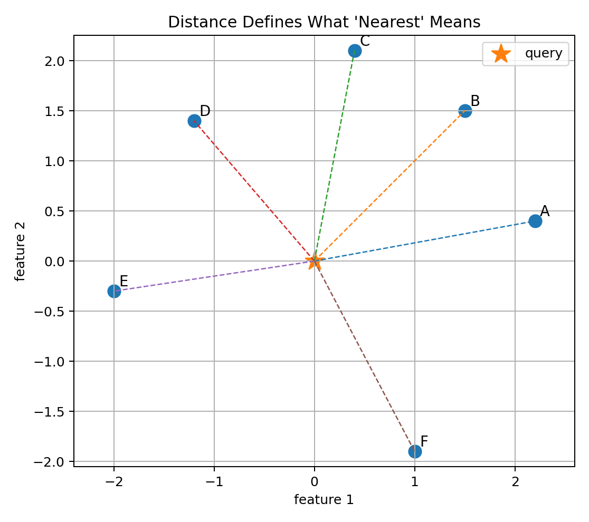

If distance is meaningful, KNN can work well.

If distance is meaningless, KNN fails.

That is why feature engineering and scaling matter so much.

---

## 6. Euclidean Distance

The most common distance is Euclidean distance:

$$
d(x,y)
=
\sqrt{
\sum_{j=1}^{d}
(x_j-y_j)^2
}
$$

This is the ordinary straight-line distance.

In 2D:

$$
d(x,y)
=
\sqrt{
(x_1-y_1)^2
+
(x_2-y_2)^2
}
$$

Euclidean distance works well when:

```text
features are numeric
features are scaled similarly
straight-line geometry is meaningful
dimensions are not too high
```

But it can behave badly if features have different units or scales.

---

## 7. Manhattan Distance

Manhattan distance is:

$$
d(x,y)
=
\sum_{j=1}^{d}
|x_j-y_j|
$$

It is also called L1 distance.

It measures distance like moving through city blocks.

Manhattan distance can be useful when:

```text
absolute feature differences matter
high-dimensional sparse features exist
movement along axes is more natural than diagonal movement
```

Euclidean distance squares differences before summing.

Manhattan distance sums absolute differences.

This changes neighbor relationships.

---

## 8. Minkowski Distance

Minkowski distance generalizes Euclidean and Manhattan:

$$
d_p(x,y)
=
\left(
\sum_{j=1}^{d}
|x_j-y_j|^p
\right)^{1/p}
$$

If:

$$
p=1
$$

then it is Manhattan distance.

If:

$$
p=2
$$

then it is Euclidean distance.

In Scikit-learn, KNN often uses Minkowski distance with:

```text
p = 2
```

by default.

The choice of distance controls the geometry of neighborhoods.

---

## 9. Cosine Similarity Preview

For some data types, angle matters more than magnitude.

Cosine similarity:

$$
\mathrm{cosine}(x,y)
=
\frac{x^Ty}{\|x\|\|y\|}
$$

Cosine distance is often:

$$
1-\mathrm{cosine}(x,y)
$$

This is common in:

```text
text embeddings
document vectors
semantic search
high-dimensional normalized vectors
```

KNN is not tied to Euclidean distance.

It is a framework:

```text
define similarity
find nearest examples
predict from them
```

---

## 10. Feature Scaling Is Critical

Suppose one feature is age:

```text
18 to 80
```

and another feature is income:

```text
0 to 100000
```

Euclidean distance will be dominated by income unless features are scaled.

Visual:

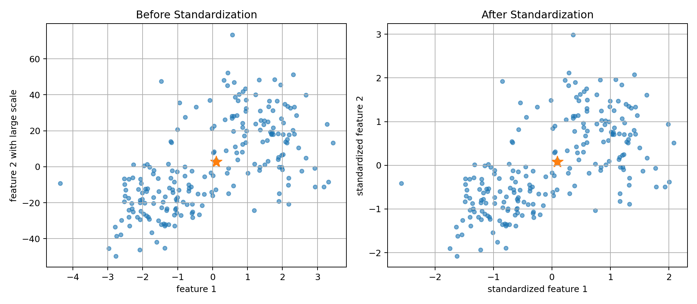

Standardization:

$$
z=\frac{x-\mu}{\sigma}
$$

Min-max scaling:

$$
z=\frac{x-x_{min}}{x_{max}-x_{min}}
$$

For KNN, scaling is not optional in many numeric datasets.

It is often necessary.

Because KNN does not learn weights to compensate for scale.

The distance metric directly sees raw feature values.

---

## 11. K Controls Locality

The hyperparameter $k$ controls how many neighbors vote.

Small $k$:

```text
very local
flexible boundary
low bias
high variance
sensitive to noise
```

Large $k$:

```text
more global
smoother boundary
higher bias
lower variance
less sensitive to noise
```

Visual decision boundaries:

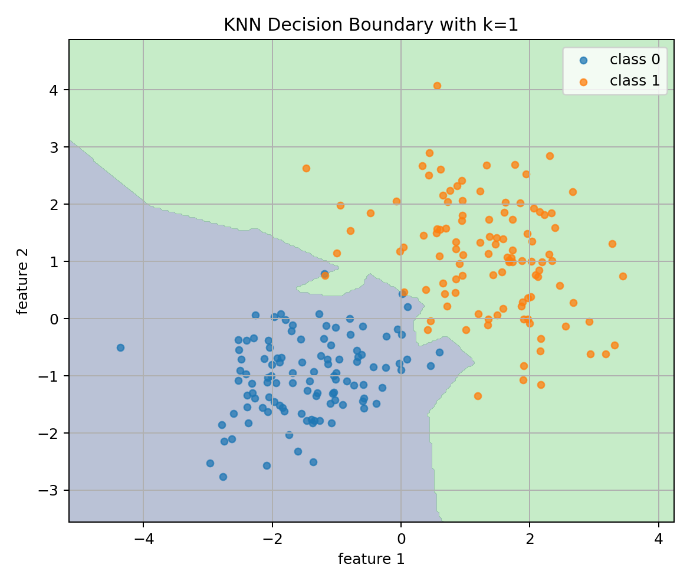

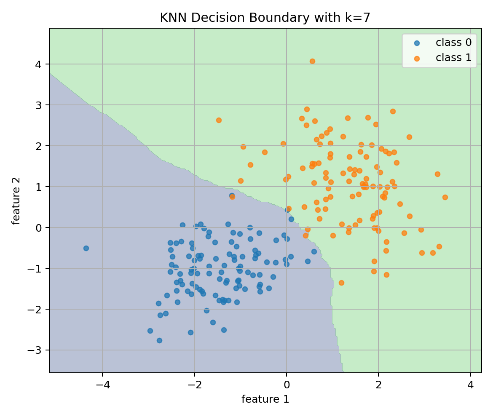

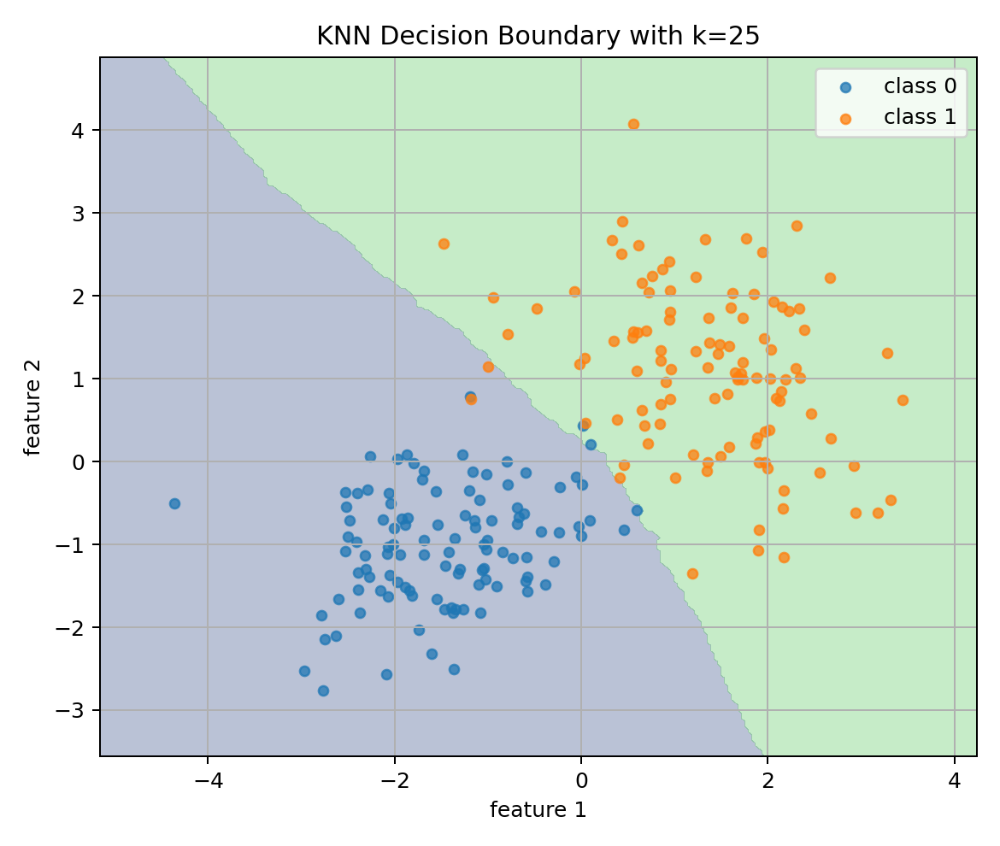

With $k=1$, KNN can create very jagged boundaries.

With larger $k$, boundaries become smoother.

---

## 12. Bias-Variance Tradeoff in KNN

KNN gives a very intuitive example of bias and variance.

Visual:

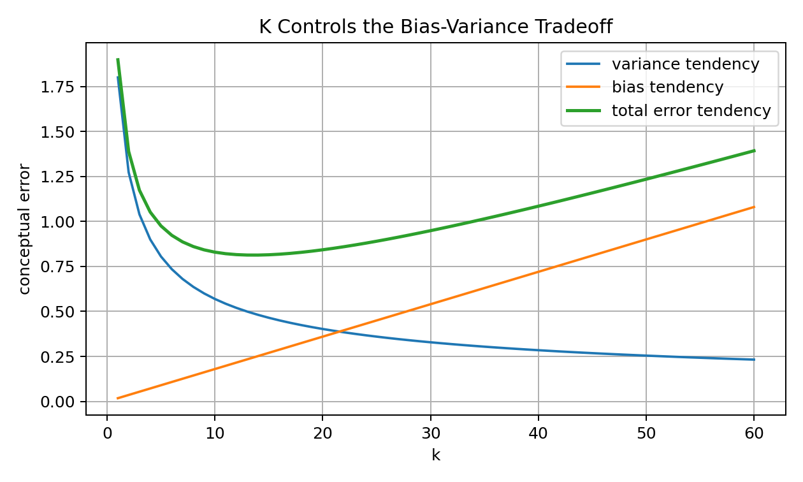

If $k$ is too small:

```text
model reacts strongly to individual noisy points
high variance
overfitting
```

If $k$ is too large:

```text
model ignores local structure
high bias
underfitting
```

The best $k$ is usually found through validation.

Do not pick $k$ randomly.

---

## 13. Choosing k with Validation

We choose $k$ using validation data or cross-validation.

Visual:

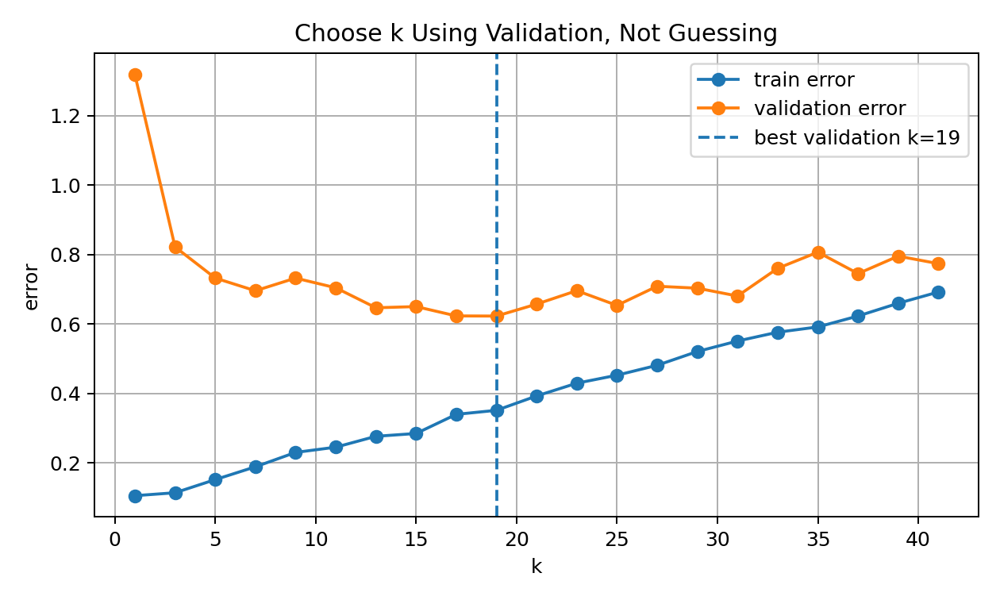

Workflow:

```text
try k = 1, 3, 5, 7, ...
train/store data
evaluate on validation set
choose k with best validation score
test once at the end
```

For classification, odd $k$ is often used in binary classification to reduce ties.

But this is not a universal rule.

The right $k$ depends on:

```text
dataset size
noise level
class overlap
feature quality
dimensionality
metric choice
```

---

## 14. Distance-Weighted KNN

Ordinary KNN gives every neighbor equal vote.

But sometimes closer neighbors should matter more.

Distance-weighted KNN uses weights such as:

$$
w_j=\frac{1}{d(x_q,x_{(j)})+\epsilon}
$$

Then closer neighbors get larger influence.

Visual:

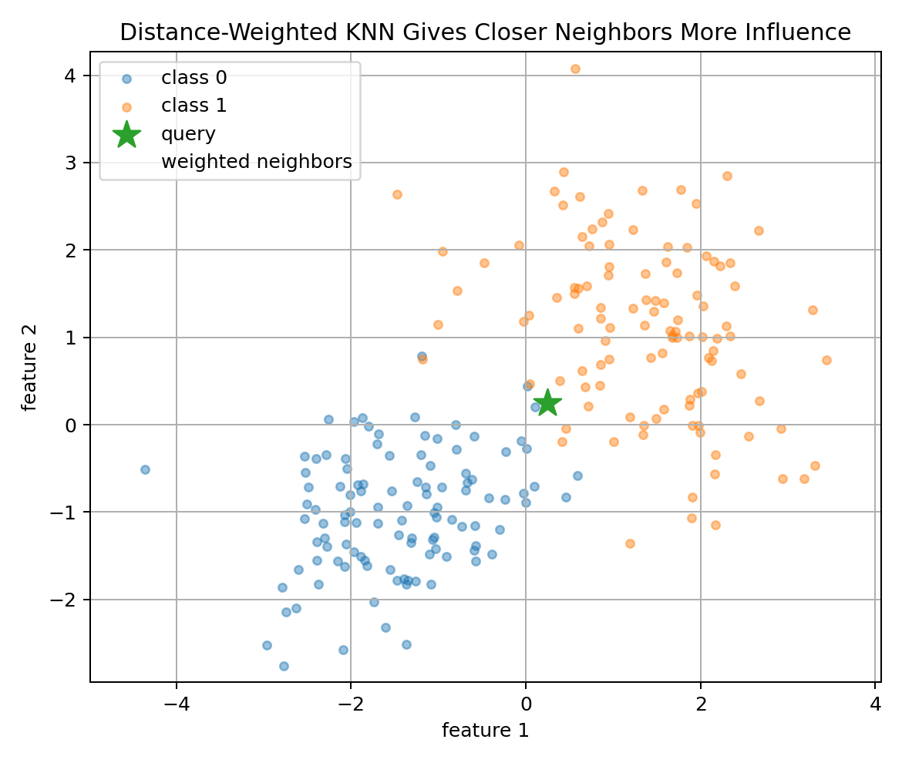

For classification, each class receives weighted votes.

For regression:

$$
\hat{y}
=
\frac{
\sum_{j=1}^{k}w_jy_{(j)}
}{
\sum_{j=1}^{k}w_j
}
$$

Weighted KNN can help when the nearest neighbor is much closer than the others.

---

## 15. KNN Decision Boundary

KNN can create nonlinear decision boundaries even though it has no explicit nonlinear formula.

Why?

Because each region of space is classified according to nearby training examples.

The boundary changes depending on local data geometry.

This makes KNN flexible.

But flexibility comes with risk:

```text
small k -> noisy boundary
large k -> overly smooth boundary
```

KNN is controlled more by data geometry than by learned parameters.

---

## 16. Curse of Dimensionality

KNN often struggles in high dimensions.

Why?

Because distances become less meaningful as dimension grows.

In high-dimensional spaces, points tend to become far from each other, and the nearest and farthest distances can become surprisingly similar.

Visual:

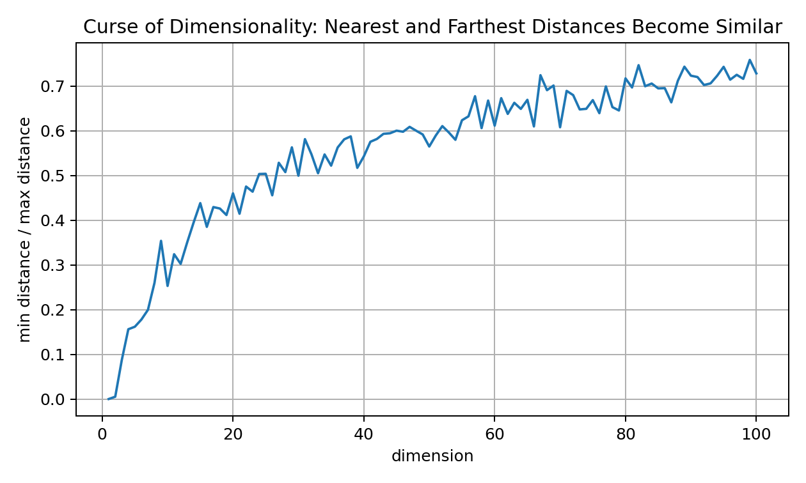

This is called the curse of dimensionality.

Effects:

```text
neighborhoods become less local
distance differences shrink relatively
more data is needed to cover the space
irrelevant features hurt badly
prediction becomes unstable
```

This is one reason feature selection, PCA, embeddings, and representation learning matter.

---

## 17. Computational Complexity

KNN training is cheap:

```text
store X_train and y_train
```

Training complexity:

$$
O(1)
$$

or practically:

$$
O(nd)
$$

for storing data.

Prediction for one query requires distance to all training points:

$$
O(nd)
$$

For $m$ query points:

$$
O(mnd)
$$

This can become expensive for large datasets.

Possible speedups:

```text
KD-tree
Ball tree
approximate nearest neighbors
vector databases
HNSW
FAISS
Annoy
ScaNN
```

But in high dimensions, exact tree-based methods can lose effectiveness.

---

## 18. KNN Is Non-Parametric

A parametric model has a fixed number of parameters.

Linear Regression:

```text
d weights + bias
```

Logistic Regression:

```text
d weights + bias
```

KNN is non-parametric because model complexity grows with data.

It stores the dataset.

More data means more stored examples.

This gives flexibility, but also memory and prediction cost.

Non-parametric does not mean “no assumptions.”

KNN assumes:

```text
nearby points should have similar outputs
```

That is a strong assumption.

---

## 19. KNN and Local Smoothness Assumption

KNN works when the target function is locally smooth.

For classification:

```text
nearby points likely share the same class
```

For regression:

```text
nearby points likely have similar target values
```

If this assumption is false, KNN fails.

Example where KNN may struggle:

```text
features do not represent meaningful similarity
irrelevant dimensions dominate distance
classes overlap heavily
high-dimensional sparse space
unscaled numeric features
```

KNN is only as good as the feature space.

This is a powerful lesson for all ML.

---

## 20. KNN Workflow

Visual:

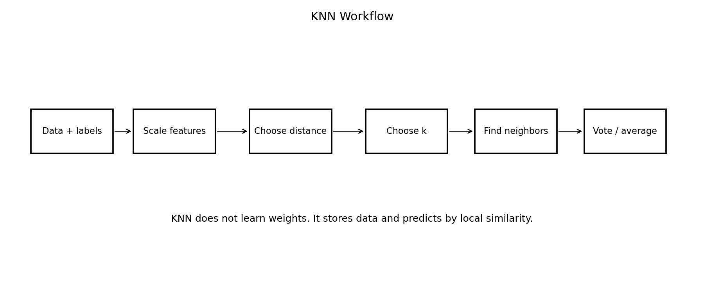

A strong KNN workflow:

```text
1. Understand the target.
2. Split train/validation/test.
3. Scale numeric features.
4. Choose distance metric.
5. Try multiple k values.
6. Evaluate validation performance.
7. Check confusion matrix or regression errors.
8. Inspect nearest neighbors for examples.
9. Test once at the end.
10. Be careful with high dimensions.
```

KNN is easy to run, but not always easy to use well.

---

## 21. From-Scratch Implementation: Distance

```python
import numpy as np

def euclidean_distance(a, b):
    return np.sqrt(np.sum((a - b) ** 2))
```

Vectorized distance from one query to all training points:

```python
def distances_to_query(X_train, x_query):
    diff = X_train - x_query
    return np.sqrt(np.sum(diff ** 2, axis=1))
```

This gives a distance for each training sample.

---

## 22. From-Scratch Implementation: KNN Classification

```python
def knn_predict_one_classification(X_train, y_train, x_query, k=5):
    distances = distances_to_query(X_train, x_query)

    neighbor_indices = np.argsort(distances)[:k]
    neighbor_labels = y_train[neighbor_indices]

    counts = np.bincount(neighbor_labels.astype(int))
    prediction = np.argmax(counts)

    return prediction
```

This is the basic algorithm:

```text
compute distances
sort
take k nearest
majority vote
```

---

## 23. From-Scratch Implementation: KNN Regression

```python
def knn_predict_one_regression(X_train, y_train, x_query, k=5):
    distances = distances_to_query(X_train, x_query)

    neighbor_indices = np.argsort(distances)[:k]
    neighbor_values = y_train[neighbor_indices]

    return np.mean(neighbor_values)
```

For regression, the only change is:

```text
vote -> average
```

That is why KNN naturally supports both classification and regression.

---

## 24. Weighted KNN Implementation

```python
def knn_predict_one_weighted_regression(X_train, y_train, x_query, k=5, eps=1e-8):
    distances = distances_to_query(X_train, x_query)

    neighbor_indices = np.argsort(distances)[:k]
    neighbor_distances = distances[neighbor_indices]
    neighbor_values = y_train[neighbor_indices]

    weights = 1 / (neighbor_distances + eps)

    return np.sum(weights * neighbor_values) / np.sum(weights)
```

This gives closer neighbors more influence.

For classification, we can sum weights per class instead of counting votes.

---

## 25. Scikit-Learn Implementation

Classification:

```python
from sklearn.pipeline import Pipeline
from sklearn.preprocessing import StandardScaler
from sklearn.neighbors import KNeighborsClassifier
from sklearn.metrics import classification_report

model = Pipeline([
    ("scaler", StandardScaler()),
    ("knn", KNeighborsClassifier(n_neighbors=7))
])

model.fit(X_train, y_train)
pred = model.predict(X_test)

print(classification_report(y_test, pred))
```

Regression:

```python
from sklearn.neighbors import KNeighborsRegressor
from sklearn.metrics import mean_absolute_error, mean_squared_error, r2_score

model = Pipeline([
    ("scaler", StandardScaler()),
    ("knn", KNeighborsRegressor(n_neighbors=7))
])

model.fit(X_train, y_train)
pred = model.predict(X_test)
```

Pipeline matters because scaling should be fitted only on training data.

---

## 26. Common Mistakes

### Mistake 1: Not scaling features

KNN is extremely sensitive to feature scale.

### Mistake 2: Choosing k randomly

Use validation or cross-validation.

### Mistake 3: Using too small k

This can overfit noise.

### Mistake 4: Using too large k

This can underfit and ignore local structure.

### Mistake 5: Ignoring irrelevant features

Irrelevant features damage distance quality.

### Mistake 6: Forgetting prediction cost

KNN can be slow at inference time.

### Mistake 7: Using KNN blindly in high dimensions

Distances can become less meaningful.

### Mistake 8: Thinking KNN has no assumptions

KNN assumes local similarity is meaningful.

---

## 27. Interview-Level Explanation

Short explanation:

```text
K-Nearest Neighbors is a supervised, non-parametric, lazy learning algorithm. It stores the training data and predicts a new point based on the k closest training examples according to a distance metric. For classification, it uses majority vote. For regression, it averages neighbor target values. Its performance depends heavily on feature scaling, distance metric, k, and dimensionality.
```

Natural explanation:

```text
KNN is like asking the closest examples for advice. If a new point looks similar to several training points, we assume it should have a similar label or value. It is simple and intuitive, but it can struggle when distance stops being meaningful.
```

---

## 28. What I Learned From This Lesson

KNN teaches important ML culture:

```text
similarity matters
feature space matters
scaling matters
locality matters
hyperparameters matter
high dimensions are dangerous
simple algorithms can still be deep
```

The central lesson:

```text
KNN does not learn a formula. It uses the geometry of the dataset itself as the model.
```

That makes it very different from Linear and Logistic Regression.

---

## Mini Exercise

Create a file called `03-knn-from-first-principles.py` inside the `code` folder.

Write code that:

```text
1. creates a synthetic classification dataset
2. splits data into train and test
3. standardizes features using train statistics only
4. implements Euclidean distance
5. implements KNN classification from scratch
6. implements KNN regression from scratch
7. tests k = 1, 3, 5, 11, 21
8. computes accuracy for classification
9. compares KNN with and without scaling
10. implements distance-weighted KNN
11. explains how k changes underfitting and overfitting
```

Then answer:

```text
Why is KNN called lazy learning?
Why is scaling critical for KNN?
What does k control?
Why can k=1 overfit?
Why can very large k underfit?
What is the curse of dimensionality?
Why is prediction slower than training?
How does weighted KNN differ from ordinary KNN?
```

---

## Further Reading and Resources

### Books

- [An Introduction to Statistical Learning](https://www.statlearning.com/)
- [The Elements of Statistical Learning](https://hastie.su.domains/ElemStatLearn/)
- [Pattern Recognition and Machine Learning by Christopher Bishop](https://link.springer.com/book/9780387310732)
- [Hands-On Machine Learning with Scikit-Learn, Keras, and TensorFlow](https://www.oreilly.com/library/view/hands-on-machine-learning/9781098125967/)
- [Mathematics for Machine Learning](https://mml-book.github.io/)

### Visual Learning

- [StatQuest: K-Nearest Neighbors](https://www.youtube.com/@statquest)
- [3Blue1Brown: Vectors and Linear Algebra](https://www.3blue1brown.com/topics/linear-algebra)

### ML Documentation

- [Scikit-learn KNeighborsClassifier](https://scikit-learn.org/stable/modules/generated/sklearn.neighbors.KNeighborsClassifier.html)
- [Scikit-learn KNeighborsRegressor](https://scikit-learn.org/stable/modules/generated/sklearn.neighbors.KNeighborsRegressor.html)
- [Scikit-learn Nearest Neighbors User Guide](https://scikit-learn.org/stable/modules/neighbors.html)
- [Scikit-learn StandardScaler](https://scikit-learn.org/stable/modules/generated/sklearn.preprocessing.StandardScaler.html)

### What to Study Next

The next ML lesson should be:

```text
04 — Naive Bayes From First Principles
```

KNN used local similarity.

Naive Bayes will use probability and Bayes theorem.

This contrast is important:

```text
KNN -> distance-based
Naive Bayes -> probability-based
Logistic Regression -> discriminative probabilistic linear classifier
```

---

## Final Reflection

KNN is one of the most intuitive algorithms in Machine Learning.

But intuitive does not mean shallow.

It teaches that data representation is everything.

If the feature space is good, neighbors are meaningful.

If the feature space is bad, neighbors are misleading.

That lesson will appear again and again in ML, deep learning, embeddings, retrieval, and RAG.

KNN is simple.

But the idea behind it is everywhere:

```text
find similar things
use them to make a decision
```
