# 07 — Support Vector Machines and Kernel Methods

## Why This Lesson Exists

At this point in the Machine Learning section, I have already seen several different “ways of learning”:

```text
Linear Regression      -> learn a line/hyperplane for continuous prediction
Logistic Regression    -> learn probabilities for classification
KNN                    -> predict from nearby examples
Naive Bayes            -> classify using probability and Bayes theorem
```

Now I want to learn a model that thinks in a very geometric way:

```text
Support Vector Machine
```

The first time I saw SVM, it looked scary because of words like:

```text
margin
support vectors
hinge loss
dual problem
kernel trick
RBF kernel
```

But the main idea is actually very human:

```text
If I want to separate two classes, I should not draw the boundary too close to either class.
I should draw the safest boundary possible.
```

That “safe space” is called the **margin**.

So the heart of SVM is:

> Do not only separate the classes. Separate them with the widest possible margin.

This is why SVM is such a beautiful algorithm. It is not just trying to be correct on the training data. It tries to be correct with confidence.

This lesson will be deep, but I want to keep it understandable and student-friendly. I will build the idea slowly:

```text
decision boundary
margin
support vectors
hard margin
soft margin
hinge loss
C parameter
kernels
RBF kernel
polynomial kernel
SVR
```

The goal is not to memorize SVM formulas.

The goal is to understand what kind of thinking SVM teaches.

---

## 1. The Basic Classification Setup

For binary classification, SVM usually uses labels:

$$
y_i\in\{-1,+1\}
$$

This is slightly different from Logistic Regression, where we often use:

$$
y_i\in\{0,1\}
$$

The input is a feature vector:

$$
x_i\in\mathbb{R}^d
$$

A linear classifier computes a score:

$$
f(x)=w^Tx+b
$$

Then it predicts by the sign of the score:

$$
\hat{y}=\mathrm{sign}(w^Tx+b)
$$

If:

$$
w^Tx+b>0
$$

the model predicts:

$$
+1
$$

If:

$$
w^Tx+b<0
$$

the model predicts:

$$
-1
$$

The decision boundary is where the score is exactly zero:

$$
w^Tx+b=0
$$

In 2D, this boundary is a line.  
In 3D, it is a plane.  
In higher dimensions, it is a hyperplane.

This part is similar to other linear classifiers.

But SVM asks a special question:

```text
Among all possible separating boundaries, which one is the safest?
```

---

## 2. Many Boundaries Can Separate the Same Data

Imagine two classes that are linearly separable.

There may be many lines that separate them correctly.

Some lines pass very close to the data.

Some lines leave more empty space between the classes.

SVM prefers the boundary that leaves the **largest margin**.

Visual:

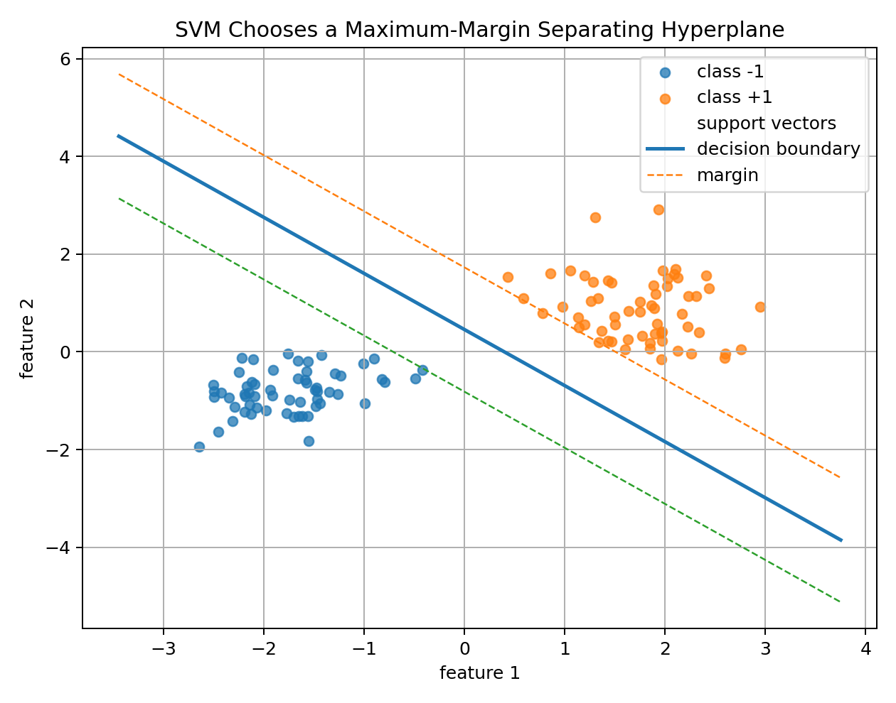

The line in the middle is the decision boundary.

The dashed lines are the margin boundaries.

The circled points are the most important points for the classifier. These are called **support vectors**.

The student-friendly intuition:

```text
If the boundary is far from the nearest points, then small noise or small changes are less likely to flip the prediction.
```

So SVM is trying to be robust.

---

## 3. What Is the Margin?

The margin is the distance from the decision boundary to the nearest training points.

For a linear SVM, we define:

$$
w^Tx+b=0
$$

as the decision boundary.

The two margin boundaries are:

$$
w^Tx+b=1
$$

and:

$$
w^Tx+b=-1
$$

The total margin width is:

$$
\frac{2}{\|w\|}
$$

Visual:

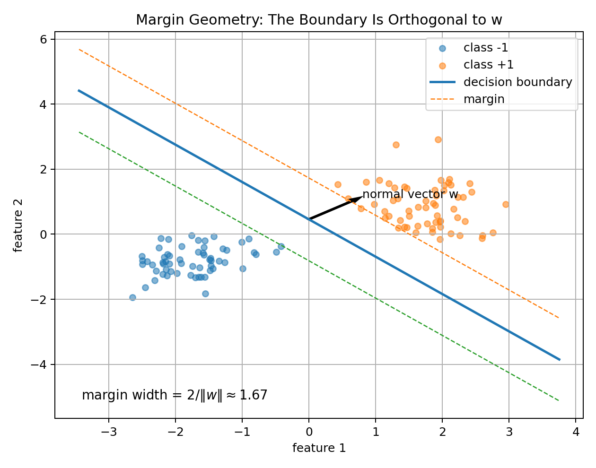

This formula is important:

$$
\text{margin width}=\frac{2}{\|w\|}
$$

If I want a large margin, I need:

$$
\|w\|
$$

to be small.

That is why SVM optimization tries to minimize:

$$
\frac{1}{2}\|w\|^2
$$

This is one of those moments where geometry becomes optimization.

---

## 4. Why the Vector w Matters

The vector $w$ is perpendicular to the decision boundary.

That means $w$ points in the direction where the score changes fastest.

The boundary:

$$
w^Tx+b=0
$$

contains all points whose score is zero.

If I move in the direction of $w$, the score changes.

If I move along the boundary, the score stays the same.

So $w$ defines two things:

```text
1. orientation of the boundary
2. size of the margin
```

A bigger $\|w\|$ means a smaller margin.

A smaller $\|w\|$ means a larger margin.

This is why SVM is deeply geometric.

---

## 5. Functional Margin

For one training point:

$$
(x_i,y_i)
$$

where:

$$
y_i\in\{-1,+1\}
$$

the functional margin is:

$$
y_i(w^Tx_i+b)
$$

This expression is very clever.

If the point is correctly classified, then:

$$
y_i(w^Tx_i+b)>0
$$

If the point is incorrectly classified, then:

$$
y_i(w^Tx_i+b)<0
$$

So the sign tells whether the prediction is correct.

The size tells how confident the model is.

SVM wants:

$$
y_i(w^Tx_i+b)\geq 1
$$

for every point in the hard-margin case.

That means:

```text
correctly classified
and not too close to the boundary
```

---

## 6. Hard-Margin SVM

Hard-margin SVM assumes the data is perfectly linearly separable.

The optimization problem is:

$$
\min_{w,b}
\frac{1}{2}\|w\|^2
$$

subject to:

$$
y_i(w^Tx_i+b)\geq 1
\quad
\text{for all } i
$$

What this means:

```text
minimize ||w||²       -> maximize margin
subject to constraints -> classify all training points correctly outside the margin
```

This is beautiful, but also strict.

Hard-margin SVM says:

```text
No mistakes allowed.
No margin violations allowed.
```

That is not realistic for noisy real-world data.

So we need soft-margin SVM.

---

## 7. Soft-Margin SVM

Real data is messy.

There may be:

```text
noise
outliers
overlapping classes
wrong labels
ambiguous samples
```

If we force perfect separation, the model may overfit or fail.

Soft-margin SVM allows some violations.

It introduces slack variables:

$$
\xi_i\geq 0
$$

The constraint becomes:

$$
y_i(w^Tx_i+b)\geq 1-\xi_i
$$

The objective becomes:

$$
\min_{w,b,\xi}
\frac{1}{2}\|w\|^2
+
C\sum_{i=1}^{n}\xi_i
$$

Visual:

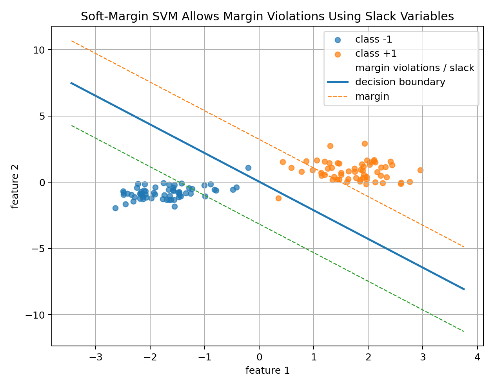

The idea is:

```text
I still want a large margin,
but I will allow some points to violate the margin if necessary.
```

This is much more realistic.

---

## 8. What Does C Mean?

The parameter $C$ controls how much SVM cares about margin violations.

Large $C$ means:

```text
violations are expensive
model tries hard to classify training data correctly
margin may become smaller
overfitting risk increases
```

Small $C$ means:

```text
violations are tolerated
model prefers a wider margin
more regularization
underfitting risk increases
```

Visual:

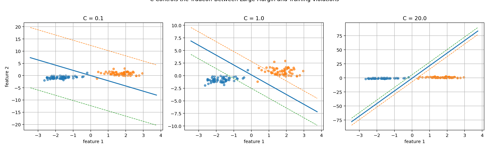

I like to remember it like this:

```text
C = strictness level
```

High $C$:

```text
strict teacher: do not make mistakes
```

Low $C$:

```text
relaxed teacher: better to keep a clean wide boundary
```

This is not mathematically perfect wording, but it helps the intuition.

---

## 9. Hinge Loss

Instead of explicitly writing slack variables, soft-margin SVM can be written with hinge loss.

For one example:

$$
\ell_i=
\max(0,1-y_i(w^Tx_i+b))
$$

Visual:

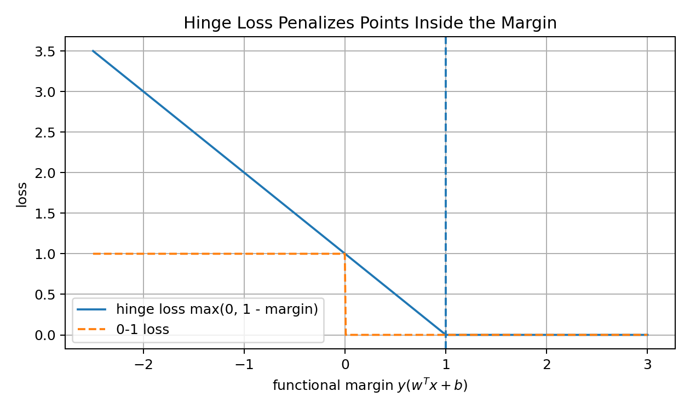

There are three cases.

### Case 1: Correct and outside the margin

If:

$$
y_i(w^Tx_i+b)\geq 1
$$

then:

$$
\ell_i=0
$$

The model is happy.

### Case 2: Correct but inside the margin

If:

$$
0<y_i(w^Tx_i+b)<1
$$

then the point is classified correctly, but it is too close to the boundary.

The model gives it a penalty.

### Case 3: Misclassified

If:

$$
y_i(w^Tx_i+b)<0
$$

then the point is on the wrong side.

The penalty is larger.

So hinge loss does not only ask:

```text
correct or wrong?
```

It asks:

```text
correct with enough margin or not?
```

That is the SVM mindset.

---

## 10. The Soft-Margin Objective with Hinge Loss

The regularized hinge objective is:

$$
J(w,b)
=
\frac{1}{2}\|w\|^2
+
C
\sum_{i=1}^{n}
\max(0,1-y_i(w^Tx_i+b))
$$

Sometimes the hinge part is averaged:

$$
J(w,b)
=
\frac{1}{2}\|w\|^2
+
C
\frac{1}{n}
\sum_{i=1}^{n}
\max(0,1-y_i(w^Tx_i+b))
$$

Both versions express the same idea:

```text
small weights -> large margin
small hinge loss -> few margin violations
```

This is why SVM is a regularized model.

The regularization is built into the margin idea.

---

## 11. Support Vectors

Support vectors are the most important training points.

They are the points closest to the boundary or inside the margin.

In many SVM solutions, support vectors satisfy approximately:

$$
y_i(w^Tx_i+b)\leq 1
$$

Why are they important?

Because they define the boundary.

If a point is far away from the decision boundary, it often does not affect the final SVM boundary.

But support vectors do.

Student intuition:

```text
The whole class may contain many students,
but the final decision boundary is negotiated by the students sitting closest to the border.
```

This is why the algorithm is called:

```text
Support Vector Machine
```

The support vectors support the maximum-margin boundary.

---

## 12. SVM vs Logistic Regression

Both Logistic Regression and Linear SVM use a linear score:

$$
w^Tx+b
$$

But they have different goals.

Logistic Regression:

```text
learn probability P(y|x)
uses sigmoid
uses cross-entropy / log loss
```

SVM:

```text
learn a maximum-margin boundary
uses hinge loss
does not naturally output probability
```

Logistic loss:

$$
\log(1+\exp(-y_i(w^Tx_i+b)))
$$

Hinge loss:

$$
\max(0,1-y_i(w^Tx_i+b))
$$

Logistic Regression keeps caring about points even when they are correctly classified with high confidence, although less and less.

SVM stops caring once the point is correctly classified outside the margin.

That is an important difference.

---

## 13. Training Linear SVM with Subgradient Descent

Hinge loss has a corner at:

$$
y_i(w^Tx_i+b)=1
$$

So it is not differentiable at exactly that point.

But we can still optimize it using subgradients.

Objective:

$$
J(w,b)
=
\frac{1}{2}\|w\|^2
+
C
\frac{1}{n}
\sum_i
\max(0,1-y_i(w^Tx_i+b))
$$

Only points with:

$$
y_i(w^Tx_i+b)<1
$$

contribute hinge-loss gradient.

Let:

$$
V=\{i:y_i(w^Tx_i+b)<1\}
$$

Then a useful subgradient is:

$$
\nabla_w J
=
w
-
\frac{C}{n}
\sum_{i\in V}y_ix_i
$$

and:

$$
\frac{\partial J}{\partial b}
=
-
\frac{C}{n}
\sum_{i\in V}y_i
$$

Visual training curve:

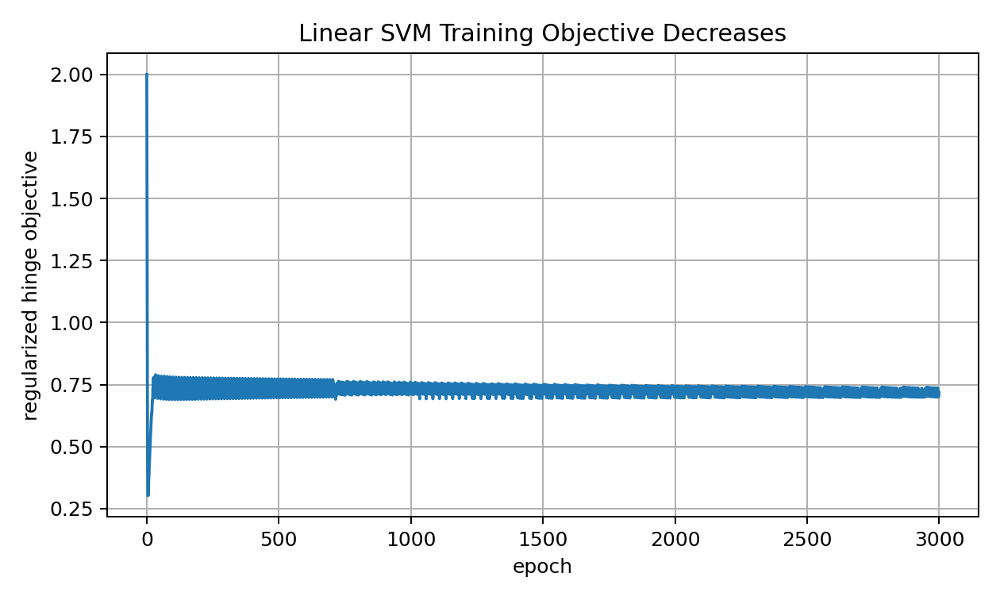

This from-scratch version is not meant to replace professional solvers, but it teaches the learning logic.

---

## 14. Why Linear SVM Is Not Enough

Linear SVM draws a linear boundary in the original feature space.

But many datasets are not linearly separable.

Example:

```text
inner circle vs outer circle
```

No straight line can separate the classes.

But if we transform the features, maybe the data becomes separable.

Example transformation:

$$
z=x_1^2+x_2^2
$$

Visual:

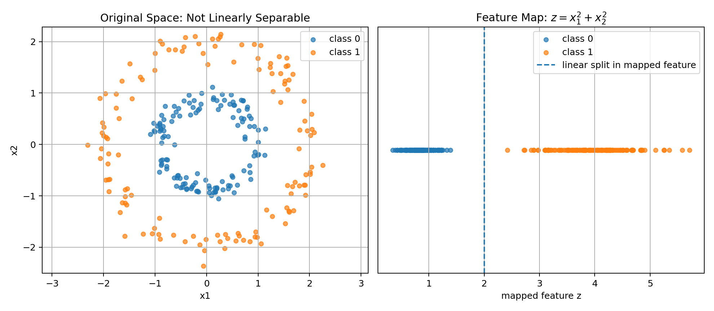

In the original space, the classes are circular.

In the mapped space, a simple threshold can separate them.

This is the motivation for kernels.

---

## 15. Feature Maps

A feature map transforms data into a new space:

$$
\phi(x)
$$

Instead of using:

$$
x
$$

the model uses:

$$
\phi(x)
$$

A linear model in the new feature space is:

$$
f(x)=w^T\phi(x)+b
$$

This can create nonlinear boundaries in the original space.

But explicit feature maps can be expensive.

For example, polynomial features can explode in number when dimension grows.

This is where the kernel trick becomes powerful.

---

## 16. The Kernel Trick

In the dual form of SVM, data appears through dot products:

$$
x_i^Tx_j
$$

If we map data into a feature space, dot products become:

$$
\phi(x_i)^T\phi(x_j)
$$

A kernel function computes this directly:

$$
K(x_i,x_j)=\phi(x_i)^T\phi(x_j)
$$

without explicitly computing $\phi(x)$.

This is the kernel trick.

The simple memory:

```text
kernel = dot product in hidden feature space
```

This lets SVM create nonlinear boundaries while still using maximum-margin logic.

---

## 17. Kernel SVM Decision Function

The kernel SVM decision function looks like:

$$
f(x)
=
\sum_{i=1}^{n}
\alpha_i y_i K(x_i,x)
+
b
$$

But only support vectors have nonzero or important $\alpha_i$.

So practically:

$$
f(x)
=
\sum_{i\in SV}
\alpha_i y_i K(x_i,x)
+
b
$$

Visual:

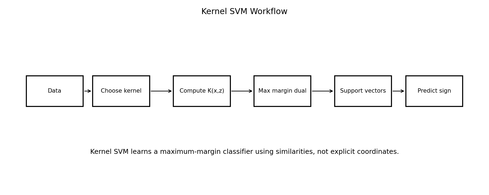

Prediction depends on similarity between the new point and the support vectors.

This connects SVM to a bigger ML idea:

```text
learning can be based on similarity
```

We already saw similarity in KNN.

But SVM uses similarity with a margin-based optimization objective.

---

## 18. Linear Kernel

The simplest kernel is the linear kernel:

$$
K(x,z)=x^Tz
$$

This gives a linear SVM.

Use linear kernel when:

```text
the data is roughly linearly separable
features are high-dimensional
dataset is large
text features are sparse
speed matters
```

Linear SVM can be very strong for text classification.

Sometimes simple linear models are not weak at all.

They are just honest and efficient.

---

## 19. Polynomial Kernel

Polynomial kernel:

$$
K(x,z)=(x^Tz+c)^p
$$

where:

```text
p -> degree
c -> constant term
```

This allows interactions between features.

Visual:

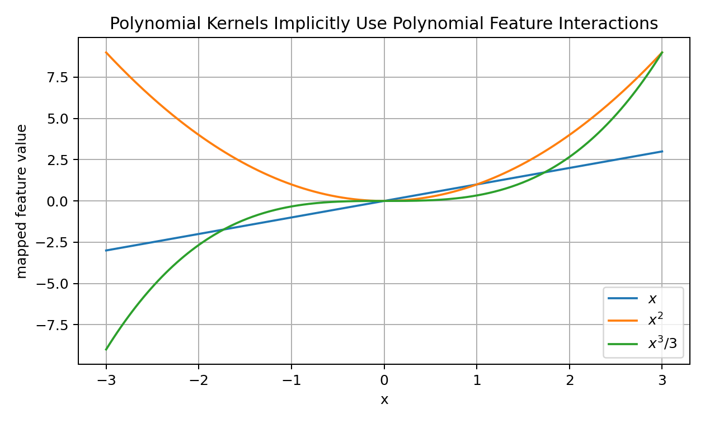

A degree-2 polynomial kernel can represent interactions like:

$$
x_1x_2
$$

and squared terms like:

$$
x_1^2
$$

But high-degree polynomial kernels can overfit.

So polynomial kernels should be used carefully.

---

## 20. RBF Kernel

The RBF kernel is one of the most popular kernels:

$$
K(x,z)=\exp(-\gamma\|x-z\|^2)
$$

Visual:

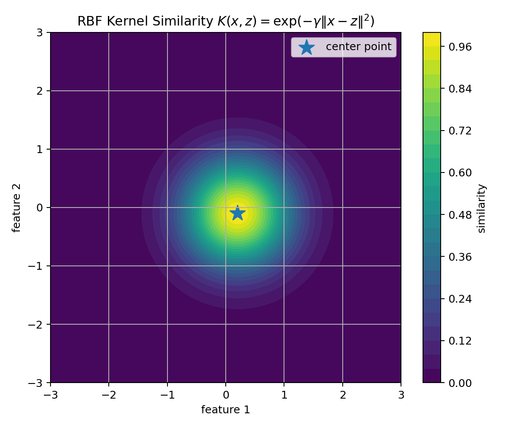

If $x$ and $z$ are close:

$$
K(x,z)\approx 1
$$

If they are far:

$$
K(x,z)\approx 0
$$

So RBF is a local similarity function.

It lets SVM build flexible nonlinear boundaries.

---

## 21. Gamma in RBF Kernel

The parameter $\gamma$ controls how quickly similarity decreases with distance.

Visual:

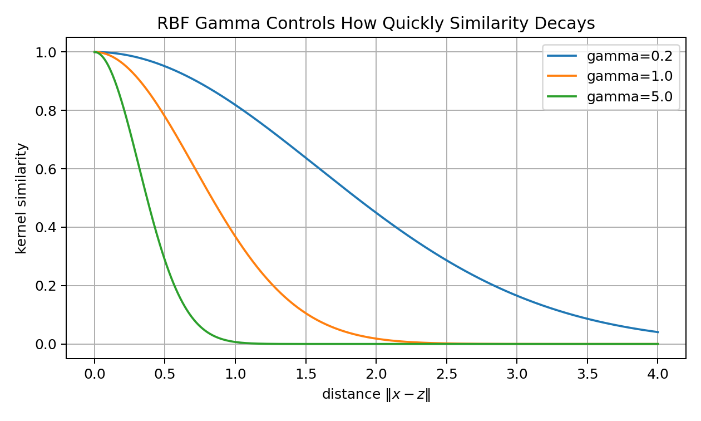

Large $\gamma$:

```text
very local influence
complex boundary
overfitting risk
```

Small $\gamma$:

```text
wide influence
smooth boundary
underfitting risk
```

So for RBF SVM, the two most important hyperparameters are:

```text
C
gamma
```

They should be tuned together.

---

## 22. Kernels and Similarity

A kernel defines similarity.

That means kernel choice is not just a technical detail.

It answers:

```text
What does it mean for two examples to be similar?
```

This idea appears everywhere in modern AI:

```text
KNN
SVM kernels
text embeddings
image embeddings
retrieval systems
vector databases
RAG
metric learning
```

So kernels are not only an SVM topic.

They are part of a larger story about representation and similarity.

---

## 23. Mercer Condition Preview

Not every similarity function is a valid kernel.

A valid kernel should correspond to an inner product in some feature space.

The kernel matrix:

$$
K_{ij}=K(x_i,x_j)
$$

should be positive semidefinite:

$$
a^TKa\geq 0
$$

for all vectors $a$.

This is connected to Mercer's theorem.

For now, I do not need to prove it deeply.

The intuition is enough:

```text
a kernel should behave like a legitimate dot product in some feature space
```

---

## 24. Support Vector Regression

SVM ideas can also be used for regression.

This is called Support Vector Regression, or SVR.

SVR uses an epsilon-insensitive tube.

Visual:

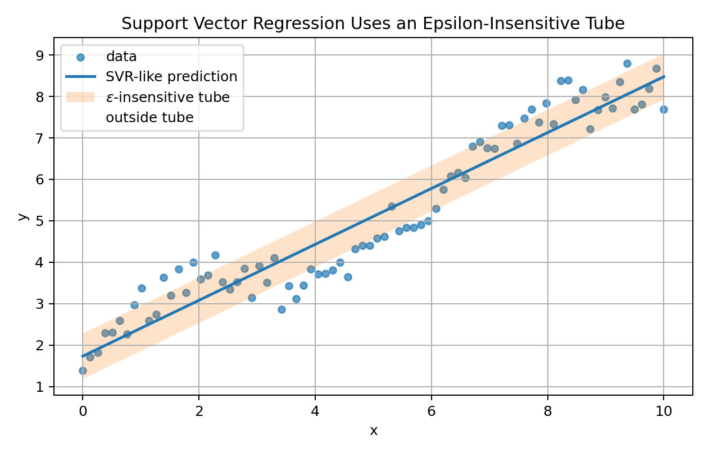

Errors inside the tube are ignored.

Loss:

$$
\ell_\epsilon(y,\hat{y})
=
\max(0,|y-\hat{y}|-\epsilon)
$$

This means:

```text
small errors are acceptable
only errors outside the tube are penalized
```

SVR can also use kernels for nonlinear regression.

---

## 25. Multiclass SVM

SVM is naturally a binary classifier.

For multiple classes, common strategies are:

```text
one-vs-rest
one-vs-one
```

One-vs-rest:

```text
train one classifier per class against all other classes
choose the class with highest score
```

One-vs-one:

```text
train one classifier for each pair of classes
use voting
```

Libraries like Scikit-learn handle this internally.

---

## 26. Feature Scaling Is Critical

SVM is very sensitive to feature scale.

Why?

Because margins, dot products, distances, and kernels all depend on feature values.

If one feature has values around:

```text
1
```

and another has values around:

```text
100000
```

the large feature can dominate.

For SVM, a safe workflow is:

```text
StandardScaler + SVC
```

Scaling is especially important for:

```text
RBF kernels
polynomial kernels
linear SVM with regularization
```

This is one of those practical details that can completely change the result.

---

## 27. Computational Complexity

Kernel SVM can be expensive.

The kernel matrix has size:

$$
n\times n
$$

So memory and computation can become large when the dataset is large.

Practical intuition:

```text
small or medium dataset + nonlinear boundary -> RBF SVM can be strong
large high-dimensional sparse data -> LinearSVC may be better
very large dataset -> consider SGDClassifier, tree ensembles, boosting, or neural models
```

SVM is elegant, but it is not always the most scalable model.

A good ML practitioner knows both the beauty and the limits.

---

## 28. From-Scratch Linear SVM

A simple subgradient implementation:

```python
def train_linear_svm(X, y, C=1.0, lr=0.01, epochs=2000):
    n, d = X.shape
    w = np.zeros(d)
    b = 0.0
    losses = []

    for epoch in range(epochs):
        scores = X @ w + b
        margins = y * scores
        hinge = np.maximum(0, 1 - margins)

        loss = 0.5 * np.dot(w, w) + C * np.mean(hinge)
        losses.append(loss)

        violating = margins < 1

        if np.any(violating):
            grad_w = w - C * np.mean(y[violating, None] * X[violating], axis=0)
            grad_b = -C * np.mean(y[violating])
        else:
            grad_w = w
            grad_b = 0.0

        w = w - lr * grad_w
        b = b - lr * grad_b

    return w, b, np.array(losses)
```

This is not a production-quality SVM solver.

But it shows the heart:

```text
penalize small margins
keep weights small
update using violating points
```

---

## 29. Kernel Functions from Scratch

Linear kernel:

```python
def linear_kernel(X, Z):
    return X @ Z.T
```

Polynomial kernel:

```python
def polynomial_kernel(X, Z, degree=3, coef0=1.0):
    return (X @ Z.T + coef0) ** degree
```

RBF kernel:

```python
def rbf_kernel(X, Z, gamma=1.0):
    X_norm = np.sum(X ** 2, axis=1)[:, None]
    Z_norm = np.sum(Z ** 2, axis=1)[None, :]
    sq_dist = X_norm + Z_norm - 2 * X @ Z.T
    return np.exp(-gamma * sq_dist)
```

These functions compute similarity matrices.

A full kernel SVM solver needs quadratic optimization, but understanding kernel matrices is already a big step.

---

## 30. Scikit-Learn Implementation

Linear SVM:

```python
from sklearn.pipeline import Pipeline
from sklearn.preprocessing import StandardScaler
from sklearn.svm import LinearSVC

model = Pipeline([
    ("scaler", StandardScaler()),
    ("svm", LinearSVC(C=1.0))
])

model.fit(X_train, y_train)
pred = model.predict(X_test)
```

Kernel SVM:

```python
from sklearn.pipeline import Pipeline
from sklearn.preprocessing import StandardScaler
from sklearn.svm import SVC

model = Pipeline([
    ("scaler", StandardScaler()),
    ("svm", SVC(kernel="rbf", C=1.0, gamma="scale"))
])

model.fit(X_train, y_train)
pred = model.predict(X_test)
```

If probabilities are needed:

```python
SVC(probability=True)
```

But remember:

```text
SVM is not naturally probabilistic.
```

This probability option performs extra calibration.

---

## 31. Hyperparameter Tuning

Important hyperparameters:

```text
C
kernel
gamma for RBF
degree for polynomial
coef0 for polynomial
class_weight for imbalance
```

Example grid:

```python
param_grid = {
    "svm__C": [0.1, 1, 10, 100],
    "svm__gamma": ["scale", 0.01, 0.1, 1],
    "svm__kernel": ["rbf"]
}
```

Use validation or cross-validation.

Do not tune on the test set.

The test set is for final honest evaluation.

---

## 32. Common Mistakes

### Mistake 1: Not scaling features

SVM is extremely sensitive to feature scale.

### Mistake 2: Thinking C directly means regularization strength

In SVM:

```text
larger C -> less tolerance for violations
smaller C -> more regularization / wider margin
```

### Mistake 3: Ignoring gamma in RBF SVM

Gamma can completely change the boundary.

### Mistake 4: Using RBF SVM blindly on huge datasets

Kernel SVM can become slow and memory-heavy.

### Mistake 5: Thinking kernels explicitly create features

The kernel trick avoids explicit feature construction.

### Mistake 6: Treating SVM scores as probabilities

SVM decision scores are margins, not probabilities.

### Mistake 7: Overusing high-degree polynomial kernels

They can overfit and become unstable.

### Mistake 8: Forgetting support vectors

The boundary is controlled by the critical points near the margin.

---


## 33. What I Learned From This Lesson

SVM teaches:

```text
maximum margin
support vectors
hard margin
soft margin
slack variables
C parameter
hinge loss
linear separation
kernel trick
RBF kernel
polynomial kernel
gamma
SVR
feature scaling
```

The central lesson:

```text
SVM is geometry plus optimization plus similarity.
```

That is why it is one of the most elegant models in classical Machine Learning.

---

## Mini Exercise

Create a file called `07-support-vector-machines-and-kernel-methods.py` inside the `code` folder.

Write code that:

```text
1. creates a synthetic binary classification dataset
2. scales features using training statistics only
3. implements hinge loss
4. trains a linear SVM using subgradient descent
5. computes predictions using sign(wᵀx+b)
6. computes accuracy, precision, recall, and F1
7. identifies approximate support vectors
8. implements linear, polynomial, and RBF kernel functions
9. creates an RBF kernel matrix
10. compares Linear SVM and RBF SVM with sklearn if available
```

Then answer:

```text
What is the margin?
Why does SVM maximize the margin?
What are support vectors?
What is hinge loss?
What does C control?
Why is feature scaling important?
What is the kernel trick?
What does gamma control in RBF kernels?
Why are SVM scores not automatically probabilities?
```

---

## Further Reading and Resources

### Books

- [The Elements of Statistical Learning](https://hastie.su.domains/ElemStatLearn/)
- [Pattern Recognition and Machine Learning by Christopher Bishop](https://link.springer.com/book/9780387310732)
- [An Introduction to Statistical Learning](https://www.statlearning.com/)
- [Understanding Machine Learning by Shalev-Shwartz and Ben-David](https://www.cs.huji.ac.il/~shais/UnderstandingMachineLearning/)
- [Convex Optimization by Boyd and Vandenberghe](https://web.stanford.edu/~boyd/cvxbook/)

### Visual Learning

- [StatQuest: Support Vector Machines](https://www.youtube.com/@statquest)
- [3Blue1Brown: Linear Algebra](https://www.3blue1brown.com/topics/linear-algebra)

### ML Documentation

- [Scikit-learn SVM User Guide](https://scikit-learn.org/stable/modules/svm.html)
- [Scikit-learn SVC](https://scikit-learn.org/stable/modules/generated/sklearn.svm.SVC.html)
- [Scikit-learn LinearSVC](https://scikit-learn.org/stable/modules/generated/sklearn.svm.LinearSVC.html)
- [Scikit-learn SVR](https://scikit-learn.org/stable/modules/generated/sklearn.svm.SVR.html)


---

## Final Reflection

Support Vector Machines looked scary at first.

But now the core idea is clear:

```text
find a boundary
make it safe
let the closest points define it
use kernels when straight lines are not enough
```

The margin is the safety zone.

Support vectors are the critical examples.

Kernels are the bridge to nonlinear geometry.

This is why SVM is not just another classifier.

It is a lesson in how geometry, optimization, and similarity can become a learning algorithm.
