# 11 — Model Selection, Cross-Validation, and Pipelines

## Why This Lesson Exists

Up to now, I have learned individual models:

```text
Linear Regression
Logistic Regression
KNN
Naive Bayes
SVM
```

But in real Machine Learning, knowing algorithms is not enough.

A very important question appears:

```text
Which model should I trust?
```

And then more questions come:

```text
Which hyperparameters should I choose?
How do I compare models honestly?
How do I avoid data leakage?
Why should I not tune on the test set?
How do pipelines protect me from mistakes?
What does cross-validation actually estimate?
```

This lesson is about the “scientific workflow” of Machine Learning.

It is not just about calling:

```python
GridSearchCV()
```

It is about learning how to think like a careful ML practitioner.

The central idea is:

> Model selection is not the act of picking the model with the prettiest score. It is a controlled experimental process for choosing a model while protecting the honesty of evaluation.

This lesson matters because a bad evaluation protocol can make a weak model look strong.

And that is dangerous.

---

## 1. Model Selection Is Not Just Choosing an Algorithm

When I say “model selection,” I do not only mean:

```text
Linear Regression vs SVM vs Random Forest
```

Model selection also includes choosing:

```text
features
preprocessing
scaling method
imputation method
model family
hyperparameters
threshold
evaluation metric
validation strategy
```

For example, these are all model-selection choices:

```text
KNN with k=3 or k=15?
SVM with linear kernel or RBF kernel?
SVM C=1 or C=100?
RBF gamma=0.01 or gamma=1?
Logistic Regression with L1 or L2 regularization?
Use StandardScaler or not?
Use class_weight="balanced" or not?
Use accuracy or F1 as the main metric?
```

So model selection is bigger than the model itself.

It is about choosing the whole modeling pipeline.

---

## 2. The Main Danger: Fooling Myself

Machine Learning has a very real danger:

```text
I can accidentally overfit my evaluation process.
```

This happens when I try many things and keep checking the test set until something looks good.

At that point, the test set is no longer an honest final exam.

It has become part of the learning process.

This is why ML needs discipline.

A good workflow separates:

```text
training
validation
testing
```

Visual:

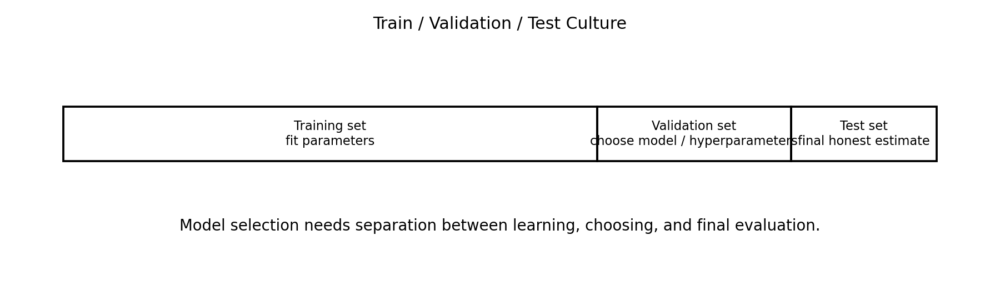

The core idea:

```text
train set      -> fit model parameters
validation set -> choose model and hyperparameters
test set       -> final honest estimate
```

The test set should be touched as little as possible.

---

## 3. Train, Validation, and Test Sets

### Training set

The training set is used to fit parameters.

Examples:

```text
linear regression coefficients
logistic regression weights
SVM boundary
Naive Bayes means and variances
KNN stored examples
```

### Validation set

The validation set is used to choose among options.

Examples:

```text
choose k in KNN
choose C and gamma in SVM
choose alpha in Ridge
choose tree depth
choose model family
choose classification threshold
```

### Test set

The test set is used after model selection is finished.

It estimates how the final model may perform on unseen data.

Student-friendly memory:

```text
training set = study material
validation set = practice exam
test set = final exam
```

If I keep looking at the final exam while preparing, it is not a final exam anymore.

---

## 4. What Are Hyperparameters?

Parameters are learned from data.

Hyperparameters are chosen before or around training.

Examples of parameters:

```text
Linear Regression weights
Logistic Regression coefficients
SVM support vector coefficients
Naive Bayes class means
```

Examples of hyperparameters:

```text
KNN k
SVM C
SVM gamma
Ridge alpha
tree max_depth
number of estimators
learning rate
regularization strength
```

Parameters are fitted.

Hyperparameters are selected.

Model selection is often hyperparameter selection.

---

## 5. Why Training Score Is Not Enough

A model can perform very well on training data and still fail on unseen data.

This is overfitting.

Example:

```text
KNN with k=1 can memorize training data.
A deep tree can memorize training examples.
A high-degree polynomial can fit noise.
```

Training score answers:

```text
How well did the model fit what it already saw?
```

Validation score answers:

```text
How well does this modeling choice work on data not used for fitting?
```

That is why validation is essential.

---

## 6. Validation Curves

A validation curve shows how performance changes as a hyperparameter changes.

Visual:

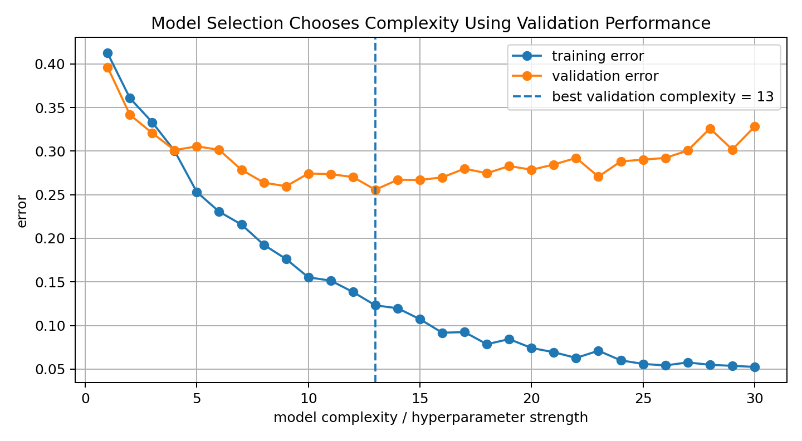

This kind of curve often shows:

```text
low complexity  -> underfitting
medium complexity -> best generalization
high complexity -> overfitting
```

The goal is not to make training error as low as possible.

The goal is to minimize validation error or maximize validation score.

This is one of the hardest mindset shifts in ML.

---

## 7. Cross-Validation

A single train-validation split can be noisy.

Maybe the validation set was easy.

Maybe it was hard.

Maybe the split was unlucky.

Cross-validation gives a more stable estimate.

In k-fold cross-validation:

```text
split data into k folds
train on k-1 folds
validate on the remaining fold
repeat k times
average the scores
```

Visual:

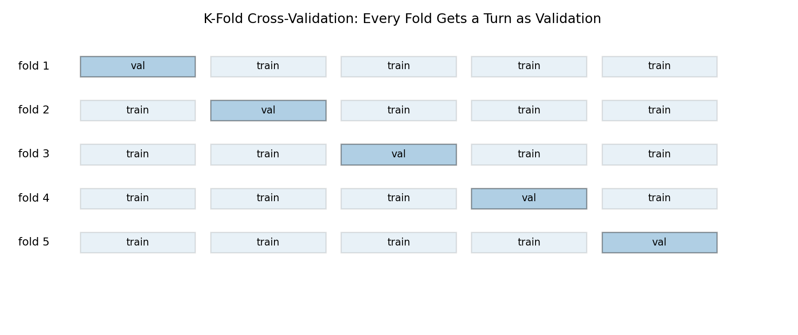

If:

$$
s_1,s_2,\dots,s_k
$$

are validation scores, then the CV estimate is:

$$
\bar{s}
=
\frac{1}{k}
\sum_{i=1}^{k}s_i
$$

The variability is also useful:

$$
\mathrm{std}(s_1,\dots,s_k)
$$

A model with high average score but unstable folds may be less trustworthy.

---

## 8. What Cross-Validation Estimates

Cross-validation estimates expected generalization performance under a given training procedure.

But it is still an estimate.

It depends on:

```text
dataset size
fold construction
metric
randomness
data distribution
leakage control
```

CV does not magically prove that a model will work forever.

It gives a better estimate than one lucky split.

Student-friendly version:

```text
Cross-validation lets every part of the dataset take a turn being the validation set.
```

This is especially useful when the dataset is not large.

---

## 9. Stratified Cross-Validation

For classification, especially imbalanced classification, random folds can have unstable class ratios.

Example:

```text
dataset has 10% positive class
one fold accidentally has 2% positives
another has 21% positives
```

That makes evaluation noisy and unfair.

Stratified cross-validation tries to preserve class ratios in every fold.

Visual:

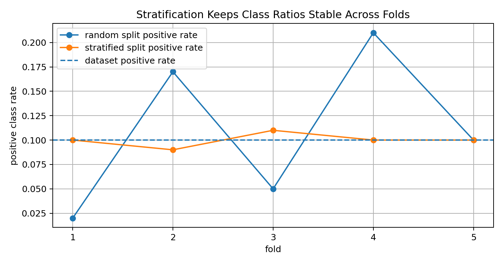

Use stratification when:

```text
classification problem
classes are imbalanced
minority class matters
```

In Scikit-learn:

```python
StratifiedKFold()
```

is usually better than plain `KFold()` for classification.

---

## 10. Time Series Cross-Validation

Time series data needs special care.

Wrong approach:

```text
randomly shuffle time points
train on future
validate on past
```

This leaks future information into the past.

Correct idea:

```text
train on past
validate on future
```

Visual:

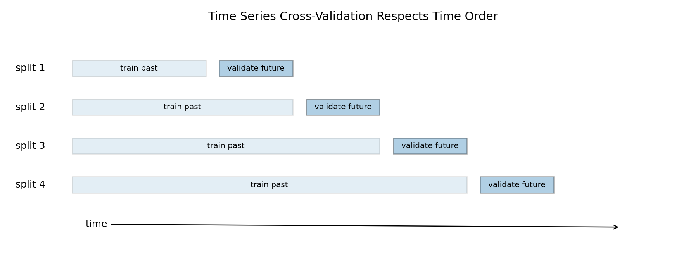

For time series, the validation strategy must respect time order.

Common methods:

```text
holdout future period
expanding window validation
rolling window validation
walk-forward validation
```

The important principle:

```text
future data must not help train a model that is supposed to predict the future
```

---

## 11. Data Leakage

Data leakage happens when information from validation or test data sneaks into training.

This can make results look much better than they really are.

Common leakage examples:

```text
scaling before train-test split
PCA before split
feature selection on full dataset
target encoding before split
using future information
duplicates across train and test
preprocessing fitted on full data
```

Visual:

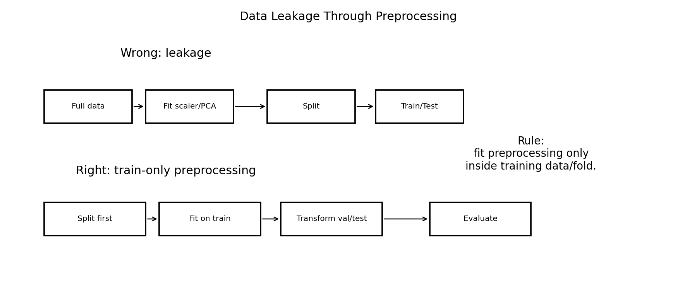

The rule:

```text
Fit preprocessing only on training data.
Apply the fitted preprocessing to validation/test data.
```

This is one of the most important rules in applied ML.

---

## 12. Why Pipelines Matter

A pipeline chains preprocessing and modeling into one object.

Visual:

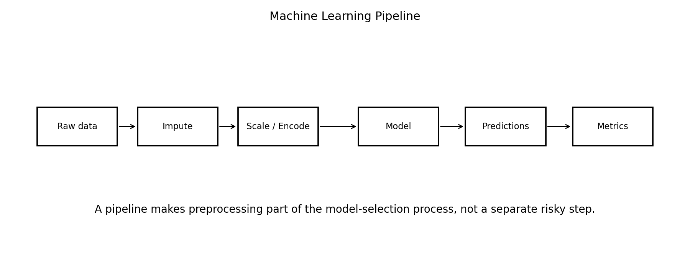

Example pipeline:

```text
imputer -> scaler -> model
```

Why it matters:

```text
preprocessing is learned only from training folds
cross-validation becomes safer
code becomes cleaner
deployment becomes easier
leakage risk decreases
```

Without pipelines, it is easy to accidentally do:

```python
scaler.fit_transform(X_full)
```

before splitting.

That leaks information.

With pipelines, Scikit-learn fits preprocessing inside each training fold.

This is why pipelines are not just convenient.

They are protective.

---

## 13. Pipeline as a Model

A very important mindset:

```text
The model is not only the estimator.
The model is the entire pipeline.
```

For example:

```text
StandardScaler + SVM
```

is a different model from:

```text
SVM without scaling
```

And:

```text
Imputer + OneHotEncoder + LogisticRegression
```

is one full model.

When comparing models, compare full pipelines.

Do not compare raw estimators while doing preprocessing manually outside the evaluation protocol.

---

## 14. Grid Search

Grid search tries all combinations from a predefined grid.

Example:

```python
C_values = [0.1, 1, 10]
gamma_values = [0.01, 0.1, 1]
```

Grid search evaluates:

```text
C=0.1, gamma=0.01
C=0.1, gamma=0.1
C=0.1, gamma=1
C=1, gamma=0.01
...
```

Visual:

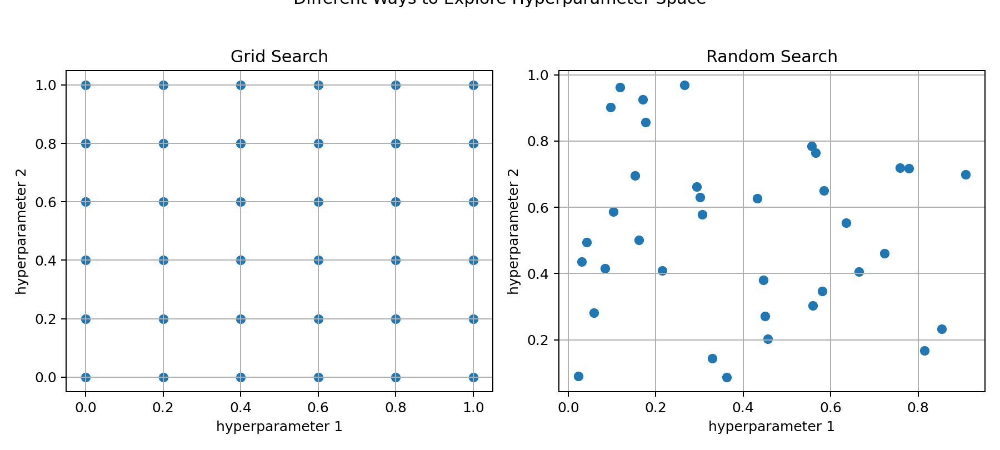

Grid search is simple and systematic.

But it can become expensive when many hyperparameters exist.

If I have:

```text
5 values for hyperparameter A
5 values for B
5 values for C
```

then total combinations:

$$
5^3=125
$$

With 5-fold CV:

$$
125\times 5=625
$$

model fits.

That can be expensive.

---

## 15. Random Search

Random search samples random hyperparameter combinations.

It can be surprisingly effective.

Why?

Because not all hyperparameters matter equally.

If only one hyperparameter is very important, grid search may waste many trials on less important dimensions.

Random search explores more values in each dimension.

Student intuition:

```text
Grid search is organized.
Random search is exploratory.
```

Both can be useful.

For larger search spaces, random search is often a strong baseline.

---

## 16. Bayesian Optimization Preview

Bayesian optimization is a smarter hyperparameter search strategy.

It tries to learn which regions of the hyperparameter space are promising.

It balances:

```text
exploration -> try uncertain regions
exploitation -> try regions likely to be good
```

Tools can include:

```text
Optuna
Hyperopt
scikit-optimize
Ray Tune
Weights & Biases sweeps
```

We do not need to implement it here.

But it is useful to know the idea.

Grid/random search are basic.

Bayesian optimization is more adaptive.

---

## 17. Nested Cross-Validation

Nested cross-validation separates hyperparameter tuning from final performance estimation.

Why is this needed?

If I use cross-validation to both tune and report performance, the reported score can be optimistic.

Nested CV has two loops:

```text
outer loop -> estimates generalization
inner loop -> tunes hyperparameters
```

Visual:

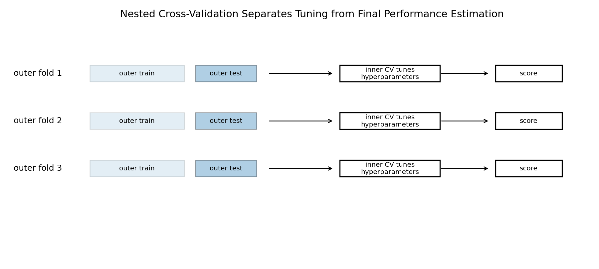

This is more expensive, but more honest.

Use nested CV when:

```text
dataset is small
model comparison must be rigorous
research-level evaluation is needed
```

For many practical projects, a train/validation/test split or CV plus final test set is enough.

But for careful model comparison, nested CV is important.

---

## 18. Model Comparison Needs Uncertainty

Suppose model A gets:

```text
0.842 F1
```

and model B gets:

```text
0.846 F1
```

Is B really better?

Maybe.

Maybe not.

The difference may be within random variation.

Visual:

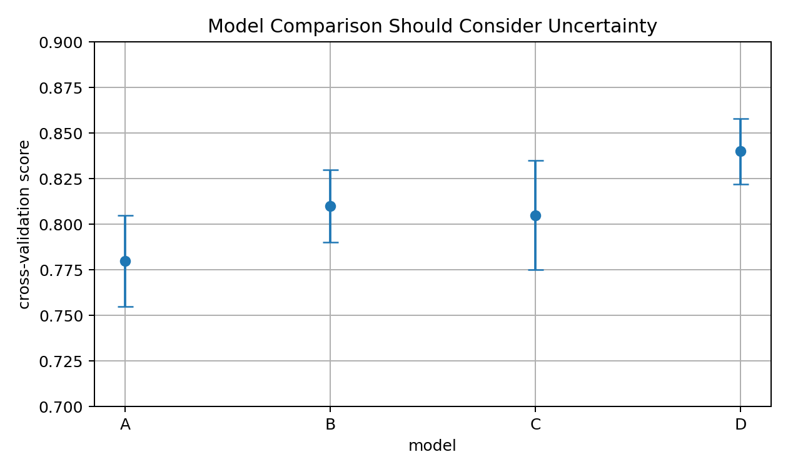

When comparing models, think about:

```text
mean CV score
standard deviation
confidence intervals
dataset size
practical importance
error patterns
training cost
interpretability
deployment constraints
```

A tiny score improvement may not matter if the model is much slower or less stable.

---

## 19. Repeated Test-Set Checking

If I repeatedly check the test set after every modeling attempt, I can overfit the test set.

Visual:

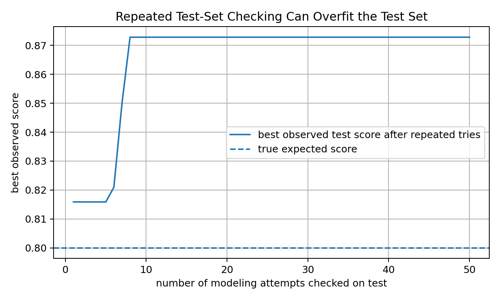

This is subtle.

Even if I never train directly on the test set, I can still adapt to it by repeatedly choosing models based on test performance.

The test set becomes part of my decision process.

Rule:

```text
Use validation/CV for choosing.
Use test once for final reporting.
```

This is one of the strongest habits to build early.

---

## 20. Choosing the Right Metric

Model selection depends on the metric.

The “best” model changes depending on what I optimize.

Examples:

```text
balanced classification -> accuracy may be okay
imbalanced classification -> F1, recall, precision, PR-AUC
probability quality -> log loss, Brier score, calibration
regression with outliers -> MAE
regression with large-error penalty -> RMSE
ranking -> AUC, precision@k
```

If I choose the wrong metric, I may choose the wrong model.

Metric choice is not only technical.

It reflects the real cost of mistakes.

---

## 21. Threshold Selection Is Model Selection Too

For classification models that output probabilities or scores, threshold selection matters.

Example:

```text
threshold = 0.5
threshold = 0.3
threshold = 0.8
```

Different thresholds produce different:

```text
precision
recall
F1
false positive rate
false negative rate
```

Threshold should be selected on validation data.

Not on the test set.

This is another common mistake.

A model includes:

```text
trained estimator + chosen threshold
```

So threshold tuning belongs to model selection.

---

## 22. Full Model Selection Workflow

Visual:

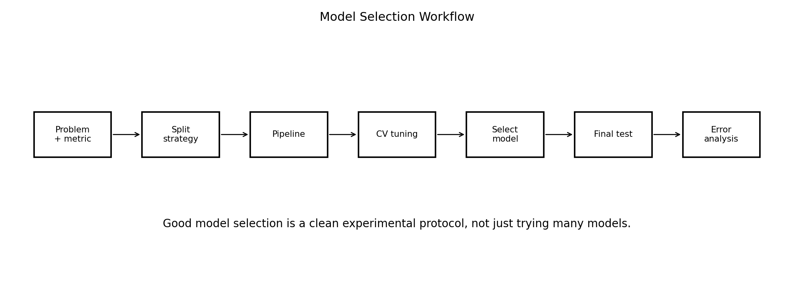

A strong workflow:

```text
1. Define the problem.
2. Choose the main metric.
3. Choose split strategy.
4. Build baseline.
5. Build preprocessing + model pipeline.
6. Use validation or cross-validation.
7. Tune hyperparameters.
8. Select final model.
9. Evaluate once on test set.
10. Perform error analysis.
11. Report honestly.
```

This is the difference between:

```text
I trained a model.
```

and:

```text
I ran a controlled ML experiment.
```

---

## 23. From-Scratch K-Fold Cross-Validation

A simple K-fold splitter:

```python
import numpy as np

def kfold_indices(n_samples, k=5, seed=42):
    rng = np.random.default_rng(seed)
    indices = rng.permutation(n_samples)
    folds = np.array_split(indices, k)

    for i in range(k):
        val_idx = folds[i]
        train_idx = np.concatenate([folds[j] for j in range(k) if j != i])
        yield train_idx, val_idx
```

This gives train/validation indices for each fold.

The model should be fitted separately in each fold.

---

## 24. From-Scratch Cross-Validation Function

A simple cross-validation loop:

```python
def cross_validate(model_factory, X, y, k=5):
    scores = []

    for train_idx, val_idx in kfold_indices(len(y), k=k):
        model = model_factory()

        model.fit(X[train_idx], y[train_idx])
        pred = model.predict(X[val_idx])

        score = np.mean(pred == y[val_idx])
        scores.append(score)

    return np.array(scores)
```

Important:

```text
model_factory creates a fresh new model for every fold
```

Do not reuse the same fitted model across folds.

That would contaminate the evaluation.

---

## 25. Scikit-Learn Pipeline Example

A good Scikit-learn pipeline:

```python
from sklearn.pipeline import Pipeline
from sklearn.preprocessing import StandardScaler
from sklearn.svm import SVC

model = Pipeline([
    ("scaler", StandardScaler()),
    ("svm", SVC())
])
```

Now `scaler` and `svm` are connected.

During cross-validation:

```text
scaler is fitted only on the training fold
validation fold is transformed using training-fold scaler
SVM is fitted only on training fold
score is computed on validation fold
```

This is exactly what we want.

---

## 26. GridSearchCV Example

```python
from sklearn.model_selection import GridSearchCV, StratifiedKFold

cv = StratifiedKFold(
    n_splits=5,
    shuffle=True,
    random_state=42
)

param_grid = {
    "svm__C": [0.1, 1, 10],
    "svm__gamma": ["scale", 0.1, 1],
    "svm__kernel": ["rbf"]
}

search = GridSearchCV(
    estimator=model,
    param_grid=param_grid,
    scoring="f1",
    cv=cv
)

search.fit(X_train, y_train)

print(search.best_params_)
print(search.best_score_)
```

The parameter names include the pipeline step name:

```text
svm__C
svm__gamma
svm__kernel
```

The double underscore connects the pipeline step and parameter.

---

## 27. RandomizedSearchCV Example

```python
from sklearn.model_selection import RandomizedSearchCV
from scipy.stats import loguniform

param_dist = {
    "svm__C": loguniform(1e-2, 1e2),
    "svm__gamma": loguniform(1e-3, 1e1)
}

search = RandomizedSearchCV(
    estimator=model,
    param_distributions=param_dist,
    n_iter=30,
    scoring="f1",
    cv=cv,
    random_state=42
)
```

Randomized search is useful when the search space is large.

It does not try every combination.

It samples.

---

## 28. Common Mistakes

### Mistake 1: Scaling before splitting

This leaks validation/test information into training.

### Mistake 2: Tuning on the test set

The test set stops being honest.

### Mistake 3: Reporting only the best CV fold

Report mean and variability, not only the lucky fold.

### Mistake 4: Comparing models with different preprocessing fairness

Compare full pipelines, not isolated estimators.

### Mistake 5: Forgetting stratification

For classification, especially imbalanced data, stratification matters.

### Mistake 6: Using random CV for time series

Time order must be respected.

### Mistake 7: Ignoring metric choice

The selected model depends on the metric.

### Mistake 8: Thinking GridSearchCV solves everything

It only searches what I define. Bad search space gives bad selection.

---

## 29. What I Learned From This Lesson

This lesson taught me that strong ML is not only about algorithms.

It is about experimental discipline.

Key ideas:

```text
train / validation / test
hyperparameters
cross-validation
stratified CV
time-series CV
data leakage
pipelines
grid search
random search
nested CV
metric choice
threshold tuning
model comparison uncertainty
test-set honesty
```

The central lesson:

```text
A model is only as trustworthy as the evaluation protocol used to choose it.
```

---

## Mini Exercise

Create a file called `11-model-selection-cross-validation-pipelines.py` inside the `code` folder.

Write code that:

```text
1. creates a synthetic classification dataset
2. splits data into train and test
3. builds a baseline model
4. implements simple K-fold CV from scratch
5. compares at least two hyperparameter values
6. builds a Scikit-learn Pipeline
7. uses GridSearchCV or RandomizedSearchCV
8. reports best parameters and CV score
9. evaluates final model once on test set
10. explains where leakage could happen
```

Then answer:

```text
Why is training score not enough?
What is the difference between validation and test?
Why should preprocessing be inside a pipeline?
What does cross-validation estimate?
Why is stratification useful?
Why should time series not be randomly shuffled?
What is nested cross-validation?
Why can repeated test-set checking be dangerous?
```

---

## Further Reading and Resources

### Books

- [An Introduction to Statistical Learning](https://www.statlearning.com/)
- [The Elements of Statistical Learning](https://hastie.su.domains/ElemStatLearn/)
- [Hands-On Machine Learning with Scikit-Learn, Keras, and TensorFlow](https://www.oreilly.com/library/view/hands-on-machine-learning/9781098125967/)
- [Mathematics for Machine Learning](https://mml-book.github.io/)

### Documentation

- [Scikit-learn Cross-Validation](https://scikit-learn.org/stable/modules/cross_validation.html)
- [Scikit-learn Pipeline](https://scikit-learn.org/stable/modules/compose.html#pipeline)
- [Scikit-learn GridSearchCV](https://scikit-learn.org/stable/modules/generated/sklearn.model_selection.GridSearchCV.html)
- [Scikit-learn RandomizedSearchCV](https://scikit-learn.org/stable/modules/generated/sklearn.model_selection.RandomizedSearchCV.html)
- [Scikit-learn Model Evaluation](https://scikit-learn.org/stable/modules/model_evaluation.html)

---

## Final Reflection

This lesson is not flashy like kernels or neural networks.

But it is one of the most important lessons in Machine Learning.

Because many ML mistakes do not happen inside the algorithm.

They happen around the algorithm:

```text
bad split
wrong metric
leakage
test-set overuse
unfair comparison
manual preprocessing outside CV
```

Model selection teaches me to be honest.

Cross-validation teaches me to be less dependent on one lucky split.

Pipelines teach me to make the workflow safe and repeatable.

This is how model training becomes real experimentation.
